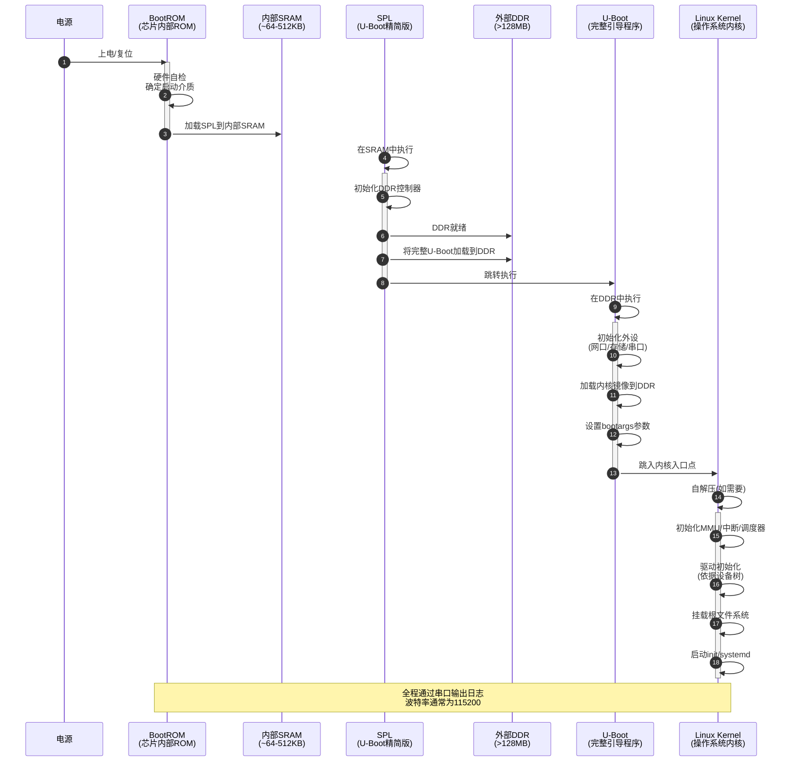

# 3.1.1 启动链的四个阶段

> 所属章节：第3章 嵌入式Linux启动流程 > 3.1 启动链全景
> 
> 难度：[B→I] | 预计阅读时间：15分钟

## <span class="blue">  本节导读

本节将带领你看清一颗ARM芯片从上电到Linux系统运行的完整"接力赛"路线。<br>学完本节，你将能说出BootROM、SPL、U-Boot、内核四个阶段各自的任务，并在串口日志中准确辨认"现在跑到哪一棒了"。

---

## <span class="blue">  启动链的四个阶段 [B]

想象一场4×100米接力赛：每一棒选手都必须在接棒时拿到前一棒的"交接棒"，跑完自己的赛段，再交给下一棒。嵌入式Linux的启动过程，正是这样一场精密的接力赛。

### 第一阶段：BootROM —— 发令枪响后的起跑 [B]

**BootROM**是固化在芯片内部的只读程序（通常几KB到几十KB），它是整场比赛的"发令员"。按下电源键，CPU取的第一条指令就来自BootROM，这是芯片出厂时烧录好的"基因"。

BootROM只做两件事：

1. **最基本的硬件自检**：确认CPU能取指令、寄存器可读写
2. **找到并加载SPL**：从SPI Flash、eMMC、SD卡或NAND等介质中，把SPL加载到内部SRAM

> 🔴 **危险**：BootROM是只读的，一旦芯片出厂就无法修改。这意味着启动介质的引脚配置必须在硬件设计阶段就正确对接，否则BootROM"找不到"SPL，系统将永久变砖（除非回炉重焊）。

### 第二阶段：SPL —— 在狭窄空间里的百米冲刺 [B]

**SPL**（Secondary Program Loader）是U-Boot的"精简版分身"。<br>芯片内部SRAM通常只有几十KB到几百KB，放不下完整的U-Boot，而外部DDR又还没初始化、无法使用, SPL就是为了解决这个尴尬而生。

SPL的任务：

1. **初始化基本的时钟和电源**
2. **（常见）初始化调试串口**：很多芯片的BootROM不配置串口，SPL必须尽早设置UART，后续的`U-Boot SPL`等日志才能输出
3. **初始化DDR内存控制器**：让外部内存"通电可用"
4. **把完整U-Boot加载到DDR**
5. **跳转到U-Boot入口**

> 💡 **提示**：以AM335x为例，SPL最大只能64KB。开发者常常需要裁剪功能，才能在小空间里塞下DDR初始化代码。

### 第三阶段：U-Boot —— 场地布置总指挥 [B]

**U-Boot**是启动链中最"风光"的阶段, 它运行在充裕的DDR中，拥有完整驱动能力，是内核运行前的最后一道关卡。

U-Boot的核心任务：

1. **初始化所有外设**：网口、串口、存储、显示屏等
2. . **提供交互式命令行**：按任意键可打断自动启动，进入命令行调试
3. **加载内核镜像**：从eMMC/SD卡/网络中读取`zImage`或`Image`
4. **准备启动参数**：设置`bootargs`和`bootcmd`
5. **跳入内核**：把CPU控制权交给Linux内核

> ⚠️ **陷阱**：初学者常在U-Boot命令行输入`saveenv`时遇到"无法保存"。<br>环境变量需要持久化存储（如eMMC分区或SPI Flash），分区表配置不正确时`saveenv`会默默失败。检查方法：执行`env print`后重启，看变量是否还在。

### 第四阶段：Kernel —— 正式比赛开始 [B]

**Kernel**（Linux内核）接过接力棒后，正式启动操作系统。

内核阶段的关键动作：

1. **自解压**（如为压缩镜像）：把`zImage`解压
2. **架构相关初始化**：设置页表、打开MMU、初始化中断控制器
3. **驱动初始化**：按设备树逐一初始化硬件，屏幕会刷屏输出
4. **挂载根文件系统**：找到`/`分区并挂载
5. **启动第一个用户态进程**（`/sbin/init`或`systemd`），Linux世界正式打开

### 启动链时序图

下面这张图展示了四个阶段的时间线和交接关系：



### 关键检查点：上电调试路线图

当你拿到一块新板子，上电后屏幕/串口一片漆黑时，按下面的 checklist 一步步定位问题：

| 检查点 | 期望现象 | 如果没有 | 排查方向 |
|--------|----------|----------|----------|
| 上电 | 电源LED亮 | 无反应 | 检查电源适配器、板载保险丝 |
| BootROM | 串口输出第一行字符 | 完全无输出 | 检查串口线序、波特率、RX/TX是否接反 |
| SPL | 出现`U-Boot SPL`字样 | 卡在第一行或乱码 | 启动介质不可读、SPL镜像损坏、DDR初始化失败 |
| U-Boot | 出现U-Boot版本号和命令行提示 | 卡在SPL后无输出 | U-Boot镜像损坏、DDR不稳定、eMMC/SD读取失败 |
| Kernel | 出现`Linux version`日志 | 卡在U-Boot命令行 | bootcmd配置错误、内核镜像不存在、bootargs参数错误 |

### 代码示例：一段真实的串口启动日志

下面的日志来自一块i.MX6ULL开发板（从eMMC启动），注意各阶段的标志性输出：

```text
# --- 阶段1：BootROM（无显式输出）---

U-Boot SPL 2021.04 (Jan 15 2024 - 09:23:17)
Trying to boot from MMC1           <-- SPL开始执行，尝试从eMMC加载

# --- 阶段2：SPL将U-Boot加载到DDR ---

U-Boot 2021.04 (Jan 15 2024 - 09:23:17 +0800)    <-- U-Boot开始运行

CPU:   Freescale i.MX6ULL rev1.1 792 MHz
Model: i.MX6 ULL 14x14 EVK Board
DRAM:  512 MiB                                   <-- U-Boot确认DDR容量
MMC:   FSL_SDHC: 0, FSL_SDHC: 1
Loading Environment from MMC... OK
Net:   FEC0
Hit any key to stop autoboot:  3                <-- 3秒倒计时，可打断

# --- 阶段3：U-Boot加载内核 ---

switch to partitions #0, OK
mmc1(part 0) is current device
4983400 bytes read in 276 ms (17.2 MiB/s)        <-- 成功读取zImage
## Flattened Device Tree blob at 83000000
   Booting using the fdt blob at 0x83000000
   Loading Device Tree to 8fdf3000, end 8fdff34b ... OK
Starting kernel ...                               <-- 即将跳入内核

# --- 阶段4：内核接管，开始初始化 ---

[    0.000000] Booting Linux on physical CPU 0x0
[    0.000000] Linux version 5.10.17 (builder@ubuntu) (arm-linux-gnueabihf-gcc...)
[    0.000000] OF: fdt: Machine model: i.MX6 ULL 14x14 EVK Board
...
[    2.341234] VFS: Mounted root (ext4 filesystem) readonly on device 179:2.
[    2.371234] Run /sbin/init as init process        <-- 第一个用户态进程启动
```

> 💡 **提示**：上述日志中`[    0.000000]`是内核时间戳（单位秒）。如果时间戳间隔突然变大（如从`[ 0.5]`跳到`[ 5.2]`），说明某个驱动初始化耗时异常，这是定位启动慢问题的关键线索。

---

## <span class="blue">  在日志中识别各阶段的边界 [I] 

启动日志像一条连续流淌的河，实际上它有明确的"分水岭"。学会辨认这些边界，是调试启动问题的基本功。

### 四大标志性输出

| 阶段 | 开始标志 | 结束标志 | 内存运行位置 |
|------|----------|----------|--------------|
| BootROM | 无显式输出（上电即开始） | `U-Boot SPL`字样出现 | 芯片内部ROM |
| SPL | `U-Boot SPL 版本号` | `U-Boot 版本号`（大写U-Boot） | 内部SRAM |
| U-Boot | `U-Boot 版本号`（带编译时间） | `Starting kernel ...` | 外部DDR |
| Kernel | `[ 0.000000] Booting Linux` | `Run /xxx/init as init process` | 外部DDR |

### 实战：用grep快速定位阶段

当你调试一台启动卡死的设备时，可用串口日志做快速筛选：

```bash
# 保存串口日志
$ cat /dev/ttyUSB0 > boot.log

# 阶段边界快速定位
$ grep -n "U-Boot SPL" boot.log       # SPL起点
$ grep -n "U-Boot 20" boot.log        # U-Boot起点
$ grep -n "Starting kernel" boot.log  # Kernel起点
$ grep -n "Run.*init" boot.log        # 用户态起点

# 若两个标志之间无输出，说明阶段交接处卡死
# 例：有"U-Boot SPL"但无"U-Boot 20" → SPL加载U-Boot失败
```

> ⚠️ **陷阱**：不同芯片厂商的SPL输出格式差异很大。NXP i.MX系列输出`U-Boot SPL`，TI AM335x输出`spl`，Allwinner芯片则输出`SPL:`。<br>更棘手的是，有些厂商的BootROM完全不输出任何字符，直到SPL运行后才有可见日志——这会让初学者误以为"上电无反应"。

> 💡 **提示**：调试U-Boot时建议开启DEBUG输出。在`include/configs/xxx.h`中定义`#define DEBUG`，重新编译后U-Boot会打印每个驱动初始化的详细步骤，帮你精确定位卡死位置。

---

## 本节总结

| 概念 | 核心作用 | 标志性输出 | 常见故障点 |
|------|----------|------------|------------|
| BootROM | 芯片基因，加载SPL | 无输出或厂商Logo | 启动介质引脚配置错误 |
| SPL | 初始化DDR，加载U-Boot | `U-Boot SPL` | DDR训练失败、镜像过大 |
| U-Boot | 初始化外设，加载内核 | `U-Boot 版本号` | 环境变量丢失、bootcmd错误 |
| Kernel | 初始化系统，启动用户态 | `Booting Linux` | 设备树不匹配、根文件系统无法挂载 |

启动链的本质是一场**信息接力**：每一阶段都依赖前一阶段准备好的硬件环境和内存数据。理解这条链，你就掌握了嵌入式Linux调试的"地图"。

## 下一步

下一节（3.1.2），我们将聚焦第一阶段——深入芯片手册，看看BootROM到底如何"找到"SPL，以及启动介质的选择如何影响上电行为。

---

