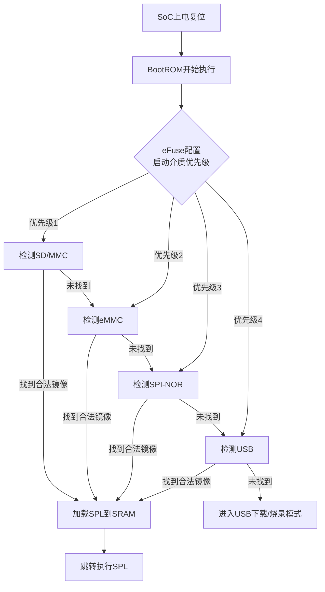
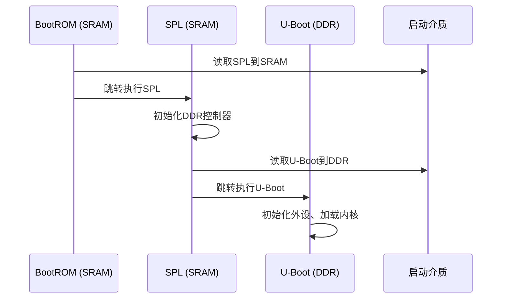

# 3.1.2 BootROM的内部机制

> 所属章节：第3章 启动流程 > 3.1 上电的那一刻
> 难度：[B→I] | 预计阅读时间：20分钟

## 本节导读

本节带你"解剖"BootROM——这颗藏在芯片内部的"第一行代码"究竟在哪里？上电后它怎样决定从哪个设备读取启动程序？以及为什么一块小小的SRAM会催生SPL这个关键角色。学完本节，你将能看懂任何ARM SoC的启动手册中关于BootROM的章节。

---

## 知识点1：BootROM存储位置 [B] ~600字

### 芯片内部ROM

BootROM（有时也叫ROM Code或BROM）是一块固化在SoC芯片**内部**的只读存储器。它不是在开发板上插的SD卡，也不是焊在板子上的eMMC芯片，而是直接在处理器硅片里蚀刻出来的电路。你可以把它理解为芯片出厂时就"写死"的一段程序，用户无法修改、无法擦除。

这块ROM的典型容量非常小——通常只有**32KB到128KB**。为什么这么小？原因有三：

1. **成本**：ROM占用的是昂贵的芯片面积，越大越烧钱。
2. **够用即可**：BootROM的职责只是"找到外部启动介质，把第一级程序加载进来"，不需要做复杂的事。
3. **安全边界**：ROM越小，审计和安全验证越容易。

🔴 **危险**：BootROM是只读的，如果你的板子启动异常，**永远不要把锅甩给BootROM损坏**。它几乎不可能坏，问题一定在外部启动介质或配置上。

### eFuse配置：启动行为的"开关"

虽然BootROM本身只读，但芯片厂商预留了一个可一次性编程的存储区——**eFuse（电子熔丝）**。eFuse也是芯片内部的，但它可以由厂商或用户在特定条件下烧写，烧写后不可撤销（像真正的保险丝一样"熔断"）。

eFuse中存储的关键配置包括：

| eFuse配置项 | 作用 | 常见默认值 |
|------------|------|-----------|
| 启动介质优先级 | 决定BootROM先查SD卡还是先查eMMC | 依厂商而异 |
| 安全启动使能 | 是否验证后续镜像的数字签名 | 通常关闭（0） |
| 调试端口禁用 | 是否关闭JTAG等调试接口 | 通常开放 |
| USB下载模式 | 是否允许通过USB强制刷机 | 通常允许 |

💡 **提示**：eFuse位的烧写是不可逆的。某些安全启动相关的eFuse一旦烧写，后续只能运行签名固件，**搞错一次可能变砖**。初学者在没有充分理解前，切勿随意烧写eFuse。

### 启动介质检测顺序

BootROM上电后的第一件事，就是按照预定顺序去"试探"各种外部存储设备，看哪个上面有合法的启动程序。这个顺序一部分写死在BootROM代码里，另一部分可以由eFuse或外部引脚（如BOOT引脚）调整。

[图1：SoC芯片内部结构示意，突出BootROM和eFuse在芯片中的位置]

---

## 知识点2：启动介质检测顺序 [I] ~800字

### 通用检测逻辑

BootROM的检测逻辑本质上就是一个"轮询"过程——按优先级逐个检查启动介质，第一个找到合法启动镜像的设备即为本次启动的赢家。



[图2：BootROM启动介质检测流程图]

### 什么是"合法"的启动镜像？

BootROM判断一个介质上是否有合法启动程序，通常检查以下几个特征：

1. **特定偏移位置的签名或魔数（Magic Number）**：比如SD卡第64扇区（偏移0x8000）处是否有"RK"字样（Rockchip）或"sunxi"字样（Allwinner）。
2. **ID Block的有效性**：某些厂商要求一个固定的数据结构来描述镜像的位置和大小。
3. **校验和或签名**：如果启用了安全启动，还需要RSA/ECC签名验证。

### 各厂商检测顺序对比

不同厂商的SoC在启动介质检测顺序上有显著差异。以下是主流厂商的对比：

| 厂商/系列 | 检测顺序 | 可配置方式 | 典型应用场景 |
|-----------|---------|-----------|-------------|
| **Rockchip RK3xxx** | SD→eMMC→SPI-NOR→USB | BOOT_MODE引脚 + eFuse | 电视盒子、开发板 |
| **Allwinner H3/H5/H6** | SD→NAND/NOR Flash→eMMC | 通过SD卡引脚拉高/拉低检测 | 低成本OTT盒子 |
| **NXP i.MX6/7/8** | eMMC→SD→SPI-NOR→USB | BOOT_CFG引脚组（多位） | 工业控制、车载 |
| **Amlogic S905x** | SPI-NOR→eMMC→SD→USB | 默认顺序固定，eFuse可调 | 智能电视 |
| **Broadcom BCM** | SPI-NOR→SD→USB | 引脚配置 | 树莓派系列 |

💡 **提示**：**NXP i.MX系列的BOOT_CFG引脚是最灵活的**——用6-10个GPIO引脚的不同上下拉组合，可以配置十几种启动顺序，是工业场景的首选方案。

⚠️ **陷阱**：Allwinner的部分芯片在检测SD卡时，只要SD卡槽有卡插入（即使里面没有合法镜像），就会**优先尝试从SD启动**，导致eMMC上的系统无法启动。很多初学者把坏了镜像的SD卡插在板子上，结果板子"变砖"，其实是BootROM一直在重试读那张坏卡。

### 实际案例分析

以Rockchip RK3566为例，BootROM的检测顺序可以通过开发板上的**BOOT键**和**MASKROM键**组合来改变：

| 按键状态 | BootROM行为 |
|---------|------------|
| 不按任何键 | 正常启动顺序：SD→eMMC→SPI-NOR |
| 按住MASKROM键上电 | 强制进入MaskROM模式，等待USB连接刷机 |
| eMMC无镜像 + 无SD卡 | 自动回退到SPI-NOR或进入USB下载模式 |

### 代码示例：读取Rockchip启动头

在Linux下，你可以用`dd`命令读取启动介质的前几个KB，查看BootROM识别的签名：

```bash
# 读取SD卡前8KB，查找Rockchip签名（通常在0x8000偏移处）
sudo dd if=/dev/sdX of=/tmp/rk_header.bin bs=1K count=8

# 用hexdump查看第0x8000字节附近（即第32个1K块的末尾）
hexdump -C /tmp/rk_header.bin | grep -E "RK|BROM"

# 输出示例：
# 00000000  52 4b 23 4e 56 52 08 00  ...  <-- "RK#NVR" 是Rockchip NVRC开始的标记
```

💡 **提示**：对于Rockchip芯片，`0x8000`（32KB）偏移处是固定的IDB（ID Block）位置。如果这里没数据，BootROM会直接跳过这个介质。

---

## 知识点3：SPL加载地址与约束 [I] ~600字

### 为什么BootROM不直接加载U-Boot？

这是一个非常关键的问题。BootROM的终极目标是把操作系统 bootloader（通常是U-Boot）加载到内存并执行。但中间隔着一个巨大的障碍——**SoC内部的SRAM太小了**。

以几款常见SoC为例：

| SoC型号 | 内部SRAM大小 | U-Boot最小体积 | 能直接装下吗？ |
|---------|------------|--------------|---------------|
| Allwinner H3 | 64KB | ~300KB | ❌ 不能 |
| Rockchip RK3566 | 128KB | ~400KB | ❌ 不能 |
| NXP i.MX6ULL | 128KB | ~350KB | ❌ 不能 |
| Amlogic S905X | 128KB | ~500KB | ❌ 不能 |

⚠️ **陷阱**：这里的SRAM（Static RAM）是芯片**内部**的高速小容量内存，不是板子上焊的DDR内存。DDR在上电后需要初始化才能使用，而初始化DDR的代码本身又需要地方运行——这就是"先有鸡还是先有蛋"的问题。

### SPL的诞生：两步加载策略

既然U-Boot太大装不进SRAM，BootROM就先加载一个**极小的一级程序**——SPL（Secondary Program Loader），典型体积只有8KB-60KB。SPL的职责很简单：

1. 初始化DDR内存（这是关键一步，因为BootROM跑在SRAM里，没有能力初始化外部DDR）。
2. 从启动介质把真正的U-Boot读取到DDR中。
3. 跳转到DDR中的U-Boot执行。



[图3：两级启动时序图——从BootROM到SPL再到U-Boot]

### SPL的加载地址约束

BootROM把SPL加载到SRAM的哪个地址，是**芯片设计时固定死**的，开发者不能改。以下是常见平台的SPL加载地址：

| SoC平台 | BootROM加载SPL到 | SPL最大体积 | 备注 |
|--------|-----------------|------------|------|
| Rockchip RK3566 | SRAM `0xFFFE0000` | ~64KB | 末尾区域 |
| Allwinner H3 | SRAM `0x00000000` | ~32KB | 起始区域 |
| NXP i.MX6ULL | OCRAM `0x00907000` | ~64KB | 包含IVT头 |
| Amlogic S905X | SRAM `0xFFFF0000` | ~48KB | 末尾区域 |

💡 **提示**：上表中地址"末尾区域"（如`0xFFFF0000`）意味着SRAM的高端地址。之所以放在末尾，是因为低端地址可能预留给BootROM自己的工作区和栈空间。

⚠️ **陷阱**：如果编译出的SPL体积超过了上表中的最大值，BootROM加载后会溢出到保留区域，导致**启动直接崩溃**。控制SPL体积是嵌入式开发的关键技能，通常需要关闭不必要的驱动和功能。

### 代码示例：编译U-Boot时的SPL体积检查

在U-Boot源码目录下编译后，检查SPL体积是否在允许范围内：

```bash
# 编译U-Boot（会自动编译SPL）
make CROSS_COMPILE=aarch64-linux-gnu- rk3566_defconfig
make CROSS_COMPILE=aarch64-linux-gnu- -j$(nproc)

# 查看SPL体积
ls -lh spl/u-boot-spl.bin
# 输出示例：-rw-r--r-- 1 user user 45K spl/u-boot-spl.bin

# 与SRAM限制对比（以RK3566的64KB为例）
SPL_SIZE=$(stat -c%s spl/u-boot-spl.bin)
MAX_SIZE=$((64 * 1024))
if [ $SPL_SIZE -gt $MAX_SIZE ]; then
    echo "ERROR: SPL too large ($SPL_SIZE > $MAX_SIZE)"
else
    echo "OK: SPL size $SPL_SIZE bytes (max $MAX_SIZE)"
fi
```

🔴 **危险**：某些芯片（如NXP i.MX系列）要求SPL镜像前必须附加一个**IVT（Image Vector Table）**头，这个头本身占用几个KB。这意味着实际可用的代码空间比SRAM总容量还要少。**编译前务必查阅芯片Reference Manual的Boot章节**。

---

## 本节总结

| 概念 | 核心要点 | 关键操作 |
|------|---------|---------|
| BootROM | 芯片内部只读存储器，32-128KB，负责启动第一步 | 无法修改，无需升级 |
| eFuse | 一次性可编程配置区，控制启动行为 | 谨慎烧写，不可逆 |
| 启动介质检测 | 按固定顺序轮询SD/eMMC/SPI-NOR/USB | 查阅具体SoC的检测顺序表 |
| SPL | 小型二级加载器，解决SRAM太小的问题 | 控制体积在SRAM限制内 |
| SRAM约束 | 64-128KB，远小于U-Boot体积 | 编译后检查SPL.bin大小 |

💡 **提示**：遇到板子"不启动"时，按这个顺序排查：①启动介质是否插对/焊好 → ②介质上是否有合法镜像 → ③BootROM能否识别签名 → ④SPL是否超出SRAM限制 → ⑤DDR是否初始化成功。

## 下一步

你已经理解了BootROM"干什么"以及"受什么约束"。接下来在`3.1.3 SPL的加载与执行`中，我们将深入SPL的内部——它究竟如何初始化DDR？如何把U-Boot搬移过去？以及那些让初学者抓狂的"SPL崩溃在DRAM init"错误该如何排查。

---

## 配套资源

### 表格清单
- 表1：eFuse配置项说明表
- 表2：主流SoC启动介质检测顺序对比表
- 表3：常见SoC内部SRAM容量与SPL体积约束表
- 表4：本节总结综合表

### 图示清单
- 图1：SoC芯片内部结构示意（BootROM与eFuse位置）[配图说明]
- 图2：BootROM启动介质检测流程图 [mermaid流程图]
- 图3：两级启动时序图（BootROM→SPL→U-Boot）[mermaid时序图]

### 代码清单
- 代码1：用`dd`+`hexdump`读取Rockchip启动头签名
- 代码2：编译后检查SPL体积的shell脚本片段
