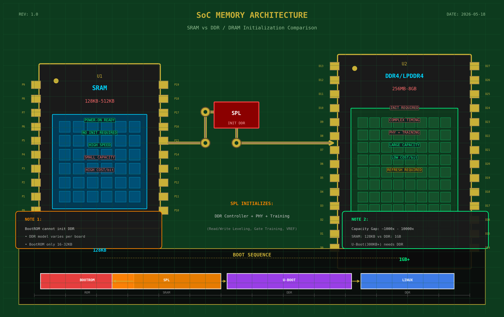
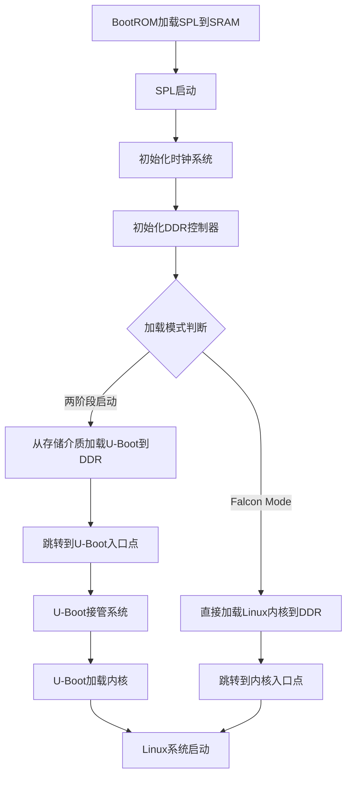

# 3.1.3 为什么需要SPL

> 所属章节：第3章 U-Boot启动流程 > 3.1 启动阶段概述
> 
> 难度：[B→E] | 预计阅读时间：30分钟

## 本节导读

本节解答一个嵌入式Linux初学者的经典困惑：既然芯片里有BootROM，为什么还要多一个SPL？<br>学完本节，你将理解SRAM与DRAM的物理差异、SPL的具体职责，以及它如何像一座"桥梁"把系统从芯片内部的狭小空间送进内存的广阔天地。

---

## <span class="blue"> SRAM与DRAM的大小鸿沟 [B] 

### 从一个生活类比开始

想象你要搬家：

- **SRAM（静态随机存取存储器）** 就像你口袋里的小钱包, 容量很小（几十KB到几百KB），但伸手就能拿到，速度极快。
- **DRAM（动态随机存取存储器，也就是DDR）** 就像仓库里的集装箱, 容量巨大（几百MB到几GB），但仓库大门需要钥匙才能打开，而且里面需要通电维持货架秩序。

嵌入式芯片刚上电时，CPU只能直接访问SRAM，因为SRAM是"即插即用"的：通电就能读写，无需任何配置。而DRAM则复杂得多，必须经历一系列初始化操作才能使用。

### 为什么BootROM不能直接初始化DDR？

既然BootROM是芯片厂商固化在内部的程序，为什么不干脆让它把DDR一起初始化了呢？这里有几个关键原因：

| 对比项 | SRAM | DRAM（DDR） |
|--------|------|------------|
| 容量 | 几十KB~几百KB | 256MB~8GB |
| 是否需要初始化 | ❌ 不需要，上电即用 | ✅ 需要复杂的初始化序列 |
| 初始化复杂度 | 无 | 需要配置时钟、PHY、时序参数 |
| 板级差异 | 芯片固定，完全一致 | 不同板子用的DDR型号不同 |
| 由谁初始化 | 无需初始化 | 需要Bootloader完成 |

> 🔴 **核心矛盾**：DDR芯片的型号、容量、时序参数因板子而异。芯片厂商在流片时不可能预知你会外接哪颗DDR芯片，因此初始化DDR的工作必须交给**板级相关的软件**, 也就是SPL。

### 初始化DDR究竟有多复杂？

以一颗常见的LPDDR4芯片为例，初始化流程包括：

1. 使能DDR控制器时钟
2. 配置DDR PHY（物理层接口）的寄存器
3. 发送JEDEC标准规定的初始化序列（RESET → CKE拉高 → MR配置）
4. 执行训练（Training）过程：Read/Write Leveling、Gate Training、VREF校准
5. 最后进行读写测试确认稳定性

这一系列操作涉及上百个寄存器配置，而且必须严格按照时序执行。BootROM的代码大小通常只有16KB~32KB，既要支持多种启动介质（SD/eMMC/SPI-NOR/USB），又要适配千变万化的DDR型号，根本放不下也做不到。

### 代码示例：查看SRAM和DDR的大小（U-Boot shell）

```bash
# 进入U-Boot命令行后，查看内存映射
=> bdinfo
...                                      # 省略部分输出
DRAM bank   = 0x00000000                 # DDR起始地址
-> start    = 0x80000000                 # 物理地址0x8000_0000
-> size     = 0x40000000                 # 1GB DDR
...                                      # 继续输出

# 查看U-Boot自身加载位置
=> echo $loadaddr
0x80800000                               # U-Boot通常加载到DDR 8MB偏移处
```

> ⚠️ **陷阱**：很多初学者以为DDR和SRAM一样"上电就能用"。实际上，如果你用JTAG调试器查看刚上电时的0x80000000地址（DDR区域），读出来的全是乱码或总线错误, 因为DDR控制器还没初始化。

> 💡 **提示**：SRAM的容量小到连一个完整的U-Boot镜像都放不下（典型U-Boot约300KB~1MB）。这就是为什么必须先把DDR初始化好，然后把U-Boot加载进DDR运行。



---

## <span class="blue"> SPL的职责清单 [I] 

### SPL是什么？

**SPL = Secondary Program Loader（二级程序加载器）**。名字有点绕，简单说：

- BootROM是第一级，它把SPL从存储介质（SD/eMMC/SPI Flash）加载到SRAM
- SPL是第二级，它负责初始化板级硬件，然后把真正的U-Boot加载到DDR

SPL的存在，本质上是为了解决一个**鸡生蛋问题**：没有初始化好的DDR，U-Boot进不了内存；但没有U-Boot，又没人来初始化DDR。SPL就是那个"身兼两职"的过渡角色。

### SPL的四项核心职责



[图2：SPL执行流程图, 展示从BootROM到Linux的完整启动链路]

#### 职责1：初始化时钟系统

CPU、DDR控制器、外设总线都需要正确的工作频率。上电后芯片通常以低频保守模式运行，SPL需要根据板级设计配置PLL（锁相环），把各条时钟树调到目标频率。

```c
/* 典型SPL时钟初始化伪代码 */
void spl_clock_init(void)
{
    /* 1. 配置主PLL，从24MHz晶振倍频到1.2GHz */
    pll_configure(ARM_PLL, 24 * 1000 * 1000, 1200 * 1000 * 1000);
    
    /* 2. 配置DDR PLL，产生400MHz时钟 */
    pll_configure(DDR_PLL, 24 * 1000 * 1000, 400 * 1000 * 1000);
    
    /* 3. 设置各总线分频比 AHB:APB */
    clock_set_divider(AHB_DIV, 2);   /* 1.2GHz / 2 = 600MHz */
    clock_set_divider(APB_DIV, 4);   /* 600MHz / 4 = 150MHz */
}
```

> 🔴 **危险**：如果时钟配错了（比如把DDR时钟设得太高），系统会在SPL阶段就死机，连串口打印都没有。调试这类问题需要用示波器测量时钟引脚，或退回保守配置逐步试探。

#### 职责2：初始化DDR控制器

这是SPL的**核心使命**。SPL中集成了芯片厂商提供的DDR初始化库（通常闭源或以.BLOB形式提供），根据板级设备树（DTB）中的DDR参数完成初始化。

```bash
# 编译U-Boot时，SPL会自动包含DDR初始化代码
$ make menuconfig
# 找到选项：Device Drivers -> RAM -> DDR SRAM
# 选择与你芯片匹配的DDR控制器驱动

# 板级设备树中定义DDR参数（arch/arm/dts/your-board.dts）
/ {
    memory@80000000 {
        device_type = "memory";
        reg = <0x80000000 0x40000000>;  /* 起始地址 + 1GB大小 */
    };
};
```

> 💡 **提示**：现代U-Boot采用"SPL OF（设备树）"架构，同一份DDR参数描述既用于SPL初始化，也用于后续Linux内核识别内存布局，避免了重复配置。

#### 职责3：从存储介质加载U-Boot到DDR

DDR可用后，SPL就要把"交接棒"传给真正的U-Boot。它需要：

1. 初始化存储介质控制器（MMC/SPI/SDHCI等）
2. 从固定偏移位置读取U-Boot镜像
3. 写入DDR的指定地址（通常靠近DDR起始地址的某处）

```bash
# U-Boot镜像在存储介质上的典型布局（以eMMC为例）
# 偏移0x00000: 分区表/GPT
# 偏移0x04000: SPL镜像（约几十KB）
# 偏移0x08000: U-Boot镜像（u-boot.bin，几百KB）
# 偏移0x40000: 环境变量区

# 烧录命令示例
$ dd if=u-boot-spl.bin of=/dev/sdX bs=512 seek=2   # SPL到1KB偏移
$ dd if=u-boot.bin     of=/dev/sdX bs=512 seek=8   # U-Boot到4KB偏移
```

> ⚠️ **陷阱**：烧录U-Boot时最容易犯的错误是**偏移量算错**。SPL和U-Boot在存储介质上的位置必须和SPL代码中的加载逻辑严格对应。如果SPL去0x8000偏移读U-Boot，但你烧录到了0x4000，SPL会加载错误数据，跳转后即刻崩溃。

#### 职责4：跳转到U-Boot入口点

加载完成后，SPL做最后的清理工作：关闭自己用过的临时资源，设置好寄存器状态，然后一条跳转指令把CPU控制权交给U-Boot。

```c
/* SPL的最后一条"生命线" */
void spl_jump_to_uboot(void)
{
    /* 获取U-Boot入口地址（通常从镜像头部解析） */
    void (*uboot_entry)(void) = (void *)load_addr;
    
    /* 刷新缓存，确保DDR写入完成 */
    flush_dcache_all();
    
    /* 跳转！从此SPL不复存在，U-Boot接管 */
    uboot_entry();
    
    /* 理论上不会执行到这里 */
    hang();
}
```

### SPL职责清单汇总表

| 职责 | 操作内容 | 关键寄存器/接口 | 失败现象 |
|------|----------|-----------------|----------|
| 时钟初始化 | 配置PLL、分频器 | CCM（时钟控制模块） | 串口乱码、DDR不稳定 |
| DDR初始化 | 发送JEDEC序列、Training | DDR控制器、DDR PHY | 系统死机、无输出 |
| 加载U-Boot | 读存储介质→写DDR | SDHCI/SPI/MMC控制器 | 跳转后崩溃、CRC错误 |
| 跳转执行 | 清理现场、跳入口点 | PC寄存器 | 偶尔能启动但不稳定 |

> 💡 **提示**：U-Boot编译会同时生成两个文件：`u-boot-spl.bin`（给SRAM用）和`u-boot.bin`（给DDR用）。烧录时千万别把两者搞混，否则系统必然无法启动。

---

## <span class="blue"> SPL的两种模式 [E]

### 传统两阶段启动

我们上面讲的全是**两阶段启动**（Two-Stage Boot）：BootROM → SPL → U-Boot → Linux内核。这是最稳妥、最通用的方式。U-Boot作为一个功能完善的引导程序，能提供命令行调试、网络下载、多种启动介质支持、环境变量管理等丰富功能。

但问题是：这条链路太长了。每多一个环节，就多一份时间和代码体积的开销。

### Falcon Mode：SPL直接加载内核

**Falcon Mode（猎鹰模式）** 是U-Boot提供的一种加速启动机制。它的核心思想是：既然SPL已经能把U-Boot加载进DDR，为什么不能直接加载Linux内核？跳过U-Boot这个阶段，启动速度可以显著提升。

在两阶段启动中，时间开销分布大致如下：

- SPL初始化硬件：~100-300ms
- U-Boot自身运行（环境变量解析、命令行超时）：~500-2000ms
- U-Boot加载内核：~100-500ms

Falcon Mode可以直接把U-Boot阶段的数百毫秒甚至数秒省掉，对需要快速启动的场景（如车载系统、工业控制、医疗设备）极具吸引力。

### 两阶段 vs Falcon Mode 对比

| 对比维度 | 两阶段启动（SPL→U-Boot→Kernel） | Falcon Mode（SPL→Kernel） |
|----------|-------------------------------|--------------------------|
| 启动时间 | 较慢（多一个U-Boot阶段） | 更快（跳过U-Boot） |
| 灵活性 | 高（U-Boot命令行可交互调试） | 低（无交互能力） |
| 启动源支持 | 多（网络/USB/SD/eMMC/NAND均可） | 少（通常仅支持SD/eMMC/SPI） |
| 环境变量 | 支持（可动态修改启动参数） | 不支持或预烧录 |
| 故障诊断 | 容易（U-Boot串口输出详细） | 困难（SPL阶段输出有限） |
| 适用场景 | 开发调试、通用产品 | 量产产品、极速启动需求 |
| 配置复杂度 | 低（U-Boot自动处理） | 高（需手动准备内核参数） |

### Falcon Mode的工作流程

启用Falcon Mode需要提前把Linux内核和设备树准备好，并将启动参数（bootargs）固化在存储介质中：

```bash
# 1. 在U-Boot命令行中准备Falcon Mode（首次需要U-Boot参与）
=> spl export fdt 0x80800000  # 从地址0x80800000导出启动参数
=> mmc write 0x80800000 0x800 0x100  # 把参数写入mmc固定位置

# 2. 之后启动时，SPL直接从该位置读取参数并加载内核
# 无需U-Boot介入

# 3. 编译时启用Falcon Mode支持
$ make menuconfig
# 选择：[*] Enable Falcon Mode
```

🔴 **危险**：Falcon Mode虽然快，但**不适合开发阶段**。一旦内核启动参数配错（比如rootfs路径写错），你连U-Boot命令行都进不了，只能重新烧录整个存储介质来修复。建议在开发稳定后、量产前再启用。

⚠️ **陷阱**：不是所有芯片的SPL都支持Falcon Mode。它要求SPL具备加载扁平化设备树（DTB）和传递bootargs的能力，部分老旧平台的SPL代码过于精简，不具备这些功能。

💡 **提示**：有些团队采用**混合策略**, 量产固件用Falcon Mode追求启动速度，但保留一个"调试按键"：上电时按住某个GPIO，就回退到两阶段启动进入U-Boot命令行。这是兼顾速度与可维护性的最佳实践。

---

## <span class="blue"> 本节总结

| 概念 | 核心要点 | 关键操作 |
|------|----------|----------|
| SRAM vs DDR | SRAM上电即用但容量极小；DDR容量大但必须初始化 | 用`bdinfo`查看内存布局 |
| SPL存在的理由 | BootROM无法适配千变万化的DDR型号 | 编译生成`u-boot-spl.bin` |
| SPL四大职责 | 时钟→DDR→加载U-Boot→跳转 | 核对烧录偏移量 |
| 两阶段启动 | 通用、灵活、适合开发和调试 | 默认模式，无需额外配置 |
| Falcon Mode | SPL直接加载内核，启动更快 | 用`spl export`准备启动参数 |

一句话记忆：**SPL是BootROM和U-Boot之间的"垫脚石"，没有它，完整的Bootloader永远走不进DDR的大门。**

## <span class="blue"> 下一步

理解了SPL的职责后，下一节我们将深入BootROM的内部机制, 看看芯片上电后的第一条指令在哪里、BootROM如何找到SPL、以及如果SPL烧录错误系统会有怎样的表现。这将是排查"系统完全无输出"故障的关键知识。

---
