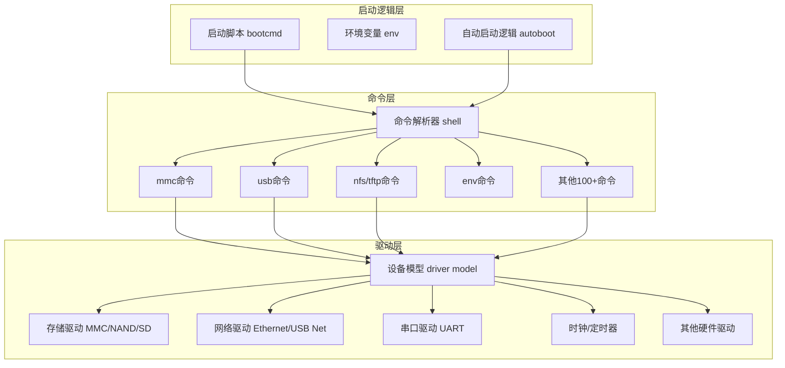

# 3.2.1 U-Boot的起源与架构

> 所属章节：第3章 嵌入式Bootloader > 3.2 U-Boot基础
> 
> 难度：[B→B] | 预计阅读时间：25分钟

## 本节导读

本节讲述U-Boot从何而来、内部如何组织，以及源码目录各自的职责。<br>学完本节，你能看懂U-Boot源码顶层目录，理解它的模块化设计思路，为后续编译和移植打下基础。

---

## <span class="blue"> U-Boot历史: 从PPCBOOT到通用引导器 [B] 

### 起源：PowerPC时代的PPCBOOT

U-Boot的故事要从1990年代末说起。当时嵌入式领域刚刚兴起，PowerPC处理器在通信设备中占据主流地位。工程师**Wolfgang Denk**（德国DENX软件工程公司创始人）在维护一个叫 **PPCBOOT** 的项目。顾名思义，它只能支持 **PowerPC** 架构。

当时市面上的Bootloader数量众多，但每种都"各自为政"：

- PowerPC用PPCBOOT
- ARM用ARMBoot
- x86用LinuxBIOS
- MIPS用YAMON

不同架构的开发者互相无法借鉴代码，维护成本极高。

### 为什么叫"Universal Bootloader"

2000年前后，Wolfgang Denk做了一个大胆的决定：把PPCBOOT重构为**跨架构**的通用引导器，并改名为 **U-Boot**（Universal Bootloader的缩写）。

"Universal"体现在三个层面：

1. **CPU通用**：支持ARM、x86、MIPS、RISC-V、PowerPC、AVR32等主流架构
2. **板级通用**：同一CPU架构下，通过板级配置文件适配数百种开发板
3. **设备通用**：内置丰富的驱动，支持NAND/NOR Flash、SD/eMMC、USB、Ethernet、SPI等多种启动介质

### U-Boot SPL的诞生

随着SoC越来越复杂，一个问题浮现了：片内SRAM通常很小（几十KB到几百KB），而完整的U-Boot体积往往超过512KB，无法直接运行。

于是社区引入了 **U-Boot SPL**（Secondary Program Loader，第二级程序加载器）的概念：

```
上电 → ROM Boot（芯片固化）→ SPL（初始化DDR）→ 加载完整U-Boot → 启动Linux
```

SPL只做最小的事情：初始化内存控制器，然后把完整的U-Boot从Flash加载到DDR中运行。这样，SRAM小的问题迎刃而解。

### 与Linux Kernel的渊源

💡 **提示**：U-Boot的代码风格、目录组织、Kconfig配置系统都深受Linux Kernel影响。如果你看过Linux源码，U-Boot的目录结构会让你感到熟悉。

⚠️ **陷阱**：初学者常把U-Boot和BIOS/UEFI混为一谈。U-Boot只负责**加载操作系统并跳转**，不像UEFI那样提供完整的运行时服务。

### 操作步骤：查看当前U-Boot版本

如果你手头已有嵌入式设备，可以进入U-Boot命令行，输入以下命令查看版本信息：

```bash
U-Boot> version
```

输出示例：
```
U-Boot 2023.04 (Apr 03 2023 - 12:00:00 +0800)

arm-linux-gnueabihf-gcc (GCC) 12.2.0
GNU ld (GNU Binutils for Debian) 2.40
```

第一条信息就是U-Boot的版本号和编译时间。社区每年发布4个主线版本（1月/4月/7月/10月），版本号格式为`YYYY.MM`。

---

## <span class="blue"> U-Boot模块化架构：三层设计 [B] 

U-Boot能支持数百种开发板而不变成" spaghetti代码 "，核心秘诀是它的**分层模块化架构**。我们可以把U-Boot看作一个微型的操作系统，自下而上分为三层。

### 架构总览

[图1：U-Boot三层架构图]



### 第一层：驱动层（Hardware Abstraction Layer）

驱动层负责和硬件直接打交道，是U-Boot的最底层。

早期的U-Boot驱动是"扁平化"的。每个驱动各自为战，代码重复严重。从2014年的v2014.10版本开始，U-Boot引入了 **Driver Model（DM，设备模型）**，模仿Linux的device/driver/bus匹配机制：

- **device**：描述一个硬件设备（通过设备树或板级文件定义）
- **driver**：实现该设备的操作方法（probe/remove/read/write等）
- **uclass**：按功能归类设备（如所有MMC控制器属于`uclass_mmc`）

这种设计的最大好处是**同一驱动可以在不同板子之间复用**。例如`drivers/mmc/mmc.c`里的MMC核心驱动，一旦被Rockchip平台的`dw_mmc`驱动适配，就能支持所有使用DesignWare MMC控制器的SoC。

### 第二层：命令层（Command Layer）

命令层是用户与U-Boot交互的窗口。U-Boot启动后会进入一个简易的shell，等待用户输入命令或执行预设的启动脚本。

命令层的设计非常简洁：

- 每个命令是一个独立的C文件，通常放在`cmd/`目录下
- 命令通过`U_BOOT_CMD`宏注册到命令表中
- 命令解析器根据用户输入查找并调用对应的处理函数

例如，`mmc info`命令的背后是`cmd/mmc.c`里的`do_mmcinfo()`函数，该函数再调用驱动层的`mmc_get_dev()`获取设备信息。

> 💡 **提示**：U-Boot的命令是可以**裁剪**的。通过`CONFIG_CMD_*`选项，你可以只编译需要的命令，减小镜像体积。例如不需要网络功能时，禁用`CONFIG_CMD_NET`可以节省几十KB。

### 第三层：启动逻辑层（Boot Logic Layer）

启动逻辑层决定U-Boot"要做什么"。它不关心串口怎么初始化，也不关心SD卡怎么读写，只关注一个流程：

```
从哪启动 → 加载什么 → 传给内核什么参数 → 跳转到内核
```

核心概念有三个：

1. **环境变量（Environment）**：键值对存储，可保存在Flash或SD卡中。重要的变量包括`bootcmd`（启动命令）、`bootargs`（传递给Linux内核的命令行参数）、`bootdelay`（自动启动前等待秒数）。

2. **bootcmd脚本**：U-Boot上电后，倒计时结束自动执行`bootcmd`里的命令序列。典型内容如下：

```bash
# 典型的bootcmd内容（在U-Boot命令行用 printenv bootcmd 查看）
run findfdt; mmc dev 0; fatload mmc 0:1 ${kernel_addr_r} zImage; fatload mmc 0:1 ${fdt_addr_r} ${fdtfile}; bootz ${kernel_addr_r} - ${fdt_addr_r}
```

这段脚本的意思是：找到设备树文件→切换MMC设备0→从FAT分区加载zImage→加载设备树→启动内核。

3. **autoboot机制**：如果用户在`bootdelay`秒内按下任意键，U-Boot进入交互模式；否则自动执行`bootcmd`。

⚠️ **陷阱**：修改`bootcmd`前务必先用`printenv`备份原始值。错误的`bootcmd`会导致板子"变砖"（不断重启或无法进入U-Boot命令行）。

🔴 **危险**：在生产环境中，建议锁定环境变量或启用`CONFIG_AUTOBOOT_KEYED`要求输入特定字符串才能中断启动，防止恶意注入。

---

## <span class="blue"> 源码目录组织：看懂U-Boot的地图 [B] 

拿到一份U-Boot源码，顶层目录有约30个文件夹。初学者往往不知从何看起。下面把核心目录按功能归类，帮助你建立"源码地图"。

### 核心目录功能表

| 目录名 | 作用 | 典型文件/子目录 | 修改频率 |
|--------|------|-----------------|---------|
| `arch/` | CPU架构相关代码 | `arch/arm/`, `arch/x86/`, `arch/riscv/` | 低（移植新SoC时才碰） |
| `board/` | 开发板板级支持 | `board/ti/am335x/`, `board/rockchip/` | 中（换板子时必看） |
| `cmd/` | 所有U-Boot命令的实现 | `cmd/mmc.c`, `cmd/usb.c`, `cmd/net.c` | 低（一般不动） |
| `common/` | 通用框架代码 | 环境变量、启动流程、控制台、FAT/EXT文件系统 | 低 |
| `configs/` | 板级默认配置文件 | `mx6ull_14x14_evk_defconfig`, `rpi_4_defconfig` | 高（编译前必选） |
| `drivers/` | 设备驱动程序 | `drivers/mmc/`, `drivers/net/`, `drivers/serial/` | 中（调试驱动时看） |
| `dts/` | 设备树源文件 | `dts/arm/`, `dts/riscv/` | 高（适配硬件常改） |
| `include/` | 头文件 | 公共头、configs目录下的板级配置头 | 中 |
| `tools/` | 编译辅助工具 | `mkimage`（生成启动镜像的工具） | 低 |
| `lib/` | 通用库函数 | CRC校验、字符串处理、压缩算法 | 低 |

> 💡 **提示**：初学者不必一次性读懂所有目录。建议按这个顺序入手：`configs/` → `board/` → `dts/` → `arch/` → `drivers/`。先知道"选哪个配置"，再看"板子怎么定义"，最后才深入驱动。

### 目录间的协作关系

[图2：U-Boot目录协作关系]

当U-Boot启动时，代码的执行路径大致如下：

```
arch/arm/cpu/armv7/start.S      ← 汇编入口，第一条指令
        ↓
arch/arm/lib/crt0.S            ← C运行时初始化
        ↓
board/<vendor>/<board>/board.c  ← 板级初始化（GPIO、电源等）
        ↓
common/board_f.c / board_r.c   ← 通用启动框架（before/after relocate）
        ↓
drivers/xxx/                    ← 各设备初始化（按设备模型扫描）
        ↓
common/main.c                   ← 进入命令循环或执行bootcmd
```

### 快速定位代码的技巧

如果你想知道某个功能在哪里实现的，可以使用`grep`搜索：

```bash
# 在U-Boot源码根目录执行
# 1. 查找某个命令的实现位置
grep -r "U_BOOT_CMD.*mmc " cmd/

# 2. 查找某个配置项在哪里被使用
grep -r "CONFIG_CMD_MMC" --include="*.c" --include="*.h" .

# 3. 查找某块开发板的板级文件
grep -r "my_board_name" board/ configs/ arch/ --include="*.c" --include="*.h" --include="*defconfig"
```

> ⚠️ **陷阱**：U-Boot的配置系统有两层: `configs/`下的**defconfig文件**（给Kconfig用）和`include/configs/`下的**头文件**（传统板级宏定义）。新版本U-Boot正在把配置迁移到Kconfig，但老代码中两者并存，搜索时要同时查`.config`和`.h`。

### 配置文件的选择

编译U-Boot的第一步是选择正确的defconfig：

```bash
# 以i.MX6ULL为例
make mx6ull_14x14_evk_defconfig
```

这个命令会读取`configs/mx6ull_14x14_evk_defconfig`，生成`.config`文件，决定哪些模块被编译进U-Boot。

> 🔴 **危险**：不要直接编辑`.config`文件！它是自动生成的，下次运行`make menuconfig`或切换defconfig时会被覆盖。正确做法是修改对应的defconfig文件或使用`make menuconfig`保存。

---

## <span class="blue"> 本节总结

| 概念 | 要点 | 关键操作 |
|------|------|----------|
| U-Boot起源 | PPCBOOT重构而来，2000年发布；Universal意为跨CPU、跨板、跨设备 | `version`命令查看版本 |
| U-Boot SPL | 解决SRAM太小的问题，先初始化DDR再加载完整U-Boot | 了解启动流程：ROM→SPL→U-Boot→Linux |
| 三层架构 | 驱动层（硬件抽象）→ 命令层（用户交互）→ 启动逻辑层（boot流程） | 理解各层职责，不混淆 |
| 驱动模型DM | 模仿Linux的device/driver/uclass匹配机制，提高复用性 | 阅读`drivers/`下的驱动代码 |
| 源码目录 | `arch/`架构、`board/`板级、`cmd/`命令、`drivers/`驱动、`dts/`设备树 | `grep`搜索定位代码 |
| 配置系统 | `configs/`存放defconfig；编译前先用`make xxx_defconfig` | 不要手动编辑`.config` |

---


