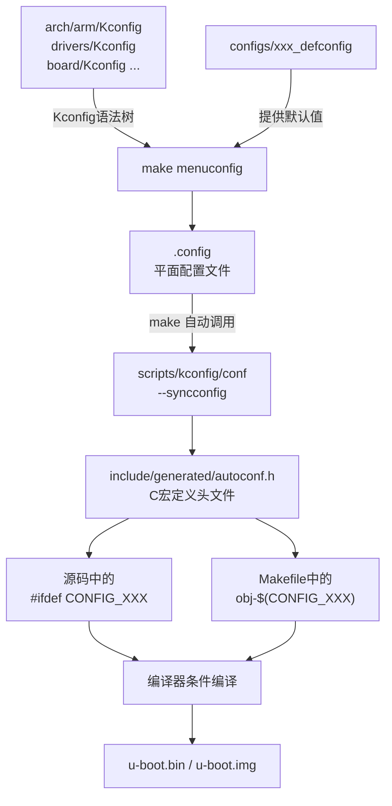

# 3.2.2 U-Boot的配置系统

> 所属章节：第3章 U-Boot引导加载程序 > 3.2 U-Boot编译与配置
> 
> 难度：[B→I] | 预计阅读时间：30分钟

## 本节导读

本节教你使用U-Boot的Kconfig配置系统：从交互式菜单选择板卡型号、串口和启动介质，理解`defconfig`默认配置的工作机制，并弄清`.config`文件如何变成源码里可用的`CONFIG_`宏。<BR>学完本节，你能够独立完成一块新开发板的U-Boot功能裁剪与配置。

---

## <span class="blue"> Kconfig菜单配置 [I] 

U-Boot的配置系统直接继承自Linux内核，采用**Kconfig**框架。通俗地说，Kconfig是一套"问卷调查"：它把成千上万行源码里的条件编译选项，组织成多级菜单，让你用方向键和空格键就能决定"要这个、不要那个"。最终你的所有选择被写入一个`.config`文件，编译系统根据这个文件决定哪些代码参与编译。

### 启动menuconfig

在U-Boot源码根目录执行：

```bash
# 先选择默认配置（以RK3568为例）
$ make evb-rk3568_defconfig

# 进入图形化菜单配置
$ make menuconfig
```


如果终端窗口太小，你会看到提示要求至少19行×80列。把终端窗口拉大后重新执行即可。

### 界面导航操作

menuconfig的操作键与Linux内核完全一致：

| 按键 | 功能 | 使用场景 |
|------|------|----------|
| ↑ / ↓ | 移动光标 | 在菜单项之间上下选择 |
| Enter | 进入子菜单或确认 | 展开某个配置分类 |
| Y / N / M | 选择状态 | Y=编译进本体，N=不编译，M=编译成模块 |
| Space | 循环切换 Y/N/M | 快速开关某个选项 |
| ? 或 h | 查看帮助 | 了解某个选项的具体含义 |
| / | 全局搜索 | 按关键词搜索配置项 |
| Q | 退出并提示保存 | 配置完成后退出 |

> 💡 **提示**：按`/`键搜索是最高效的找人方法。例如想开`USB`支持，直接按`/`输入`CONFIG_USB`，光标会自动跳转到匹配项并显示它位于哪一级菜单。

### 关键配置项速查

对嵌入式工程师而言，U-Boot菜单里需要重点关注的配置项集中在**架构/板卡选择**、**串口控制台**、**启动介质**和**外设驱动**四大类。<BR>下表列出最常改动的条目：

| 配置项（菜单路径） | 对应CONFIG宏 | 作用说明 | 典型选择 |
|-------------------|-------------|---------|---------|
| ARM architecture → Target select | `CONFIG_ARCH_ROCKCHIP` | 选择SoC架构/厂商 | 按实际芯片选 |
| ARM architecture → Rockchip boards → Board | `CONFIG_TARGET_EVB_RK3568` | 选择具体开发板型号 | 按板子选 |
| General setup → Cross-compiler tool prefix | `CONFIG_CROSS_COMPILE` | 指定交叉编译器前缀 | `aarch64-linux-gnu-` |
| Console → Console UART number | `CONFIG_CONS_INDEX` | 指定调试串口号 | `0`或`1` |
| Console → Baudrate | `CONFIG_BAUDRATE` | 串口波特率 | 通常`1500000` |
| Boot media → MMC/SD card support | `CONFIG_MMC` | 启用SD/eMMC启动 | Y |
| Boot media → SPI Flash support | `CONFIG_SPI_FLASH` | 启用SPI NOR启动 | 按需 |
| Boot media → MTD / NAND support | `CONFIG_NAND` | 启用NAND启动 | 按需 |
| Network → Ethernet support | `CONFIG_NET` / `CONFIG_ETH_DESIGNWARE` | 启用网口及TFTP下载 | Y |
| Device Drivers → USB support | `CONFIG_USB` / `CONFIG_USB_EHCI_HCD` | 启用USB Host | 按需 |
| Device Drivers → DFU / USB Mass Storage | `CONFIG_USB_FUNCTION_DFU` | 启用USB烧录功能 | 调试时常开 |

> ⚠️ **陷阱**：**Board型号选错是最常见的配置错误**。<BR>U-Boot里板级配置不仅决定了DDR初始化参数，还决定了GPIO复用、电源域设置等硬件细节。如果选了错误的board，U-Boot可能完全无法启动，串口无任何输出。当你看到"完全没打印"时，首先检查`CONFIG_TARGET_xxx`是否正确。

### 操作步骤：完整配置流程

以RK3568 EVB板为例，演示从零开始的配置过程：

```bash
# 步骤1：进入U-Boot源码目录
$ cd u-boot

# 步骤2：加载该板卡的默认配置
$ make evb-rk3568_defconfig
  # 输出：#
  # configuration written to .config
  #

# 步骤3：进入菜单（会占用终端全屏）
$ make menuconfig
```

在菜单中依次操作：

1. 用↓键移动到 **"ARM architecture"**，按Enter进入；
2. 确认 **"Target select"** 下已勾选你的SoC（如`Rockchip RK3568`）；
3. 返回顶层，进入 **"General setup"**，把交叉编译器前缀改为你的工具链；
4. 返回顶层，进入 **"Console"**，确认串口号和波特率与硬件一致；
5. 返回顶层，进入 **"Device Drivers" → "USB support"**，勾选需要的控制器；
6. 按Q退出，提示 **"Do you wish to save your new configuration?"** 时选 **Yes**。

```bash
# 步骤4：验证配置已保存
$ head -20 .config
# Automatically generated file; DO NOT EDIT.
# U-Boot 2024.01 Configuration
#
CONFIG_ARM=y
CONFIG_ARCH_ROCKCHIP=y
CONFIG_SYS_TEXT_BASE=0x00a00000
...
```

> 🔴 **危险**：`make menuconfig`依赖终端的`ncurses`库。<BR>如果在Windows WSL或某些精简SSH客户端里出现界面乱码（边框变成字母`qqqq`或`xxxx`），请设置`export TERM=xterm-256color`后再试。如果仍然不行，改用`make nconfig`（基于ncurses的新界面）或`make xconfig`（需要Qt图形界面）。

💡 **提示**：配置项名前括号有三种形态：

- `[*]` 或 `<*>` — 已启用（Y）
- `[ ]` 或 `< >` — 未启用（N）
- `<M>` — 编译成模块（M，U-Boot中极少使用）

方括号`[]`表示该项只能Y/N；尖括号`<>`表示可以Y/N/M。

---

## <span class="blue"> defconfig文件 [I]

`make menuconfig`适合**增量修改**，但你不会希望每次拿到新源码都从零开始手动点几百个选项。U-Boot把常见开发板的"出厂推荐配置"预制成`defconfig`文件，放在`configs/`目录下。

### configs目录结构

```bash
# 查看configs目录（节选）
$ ls configs/ | head -20
am335x_evm_defconfig
am335x_boneblack_defconfig
cubieboard_defconfig
imx6ull_14x14_evk_defconfig
mx6sabresd_defconfig
odroid-xu3_defconfig
rpi_3_defconfig
evb-rk3568_defconfig
evb-rk3588_defconfig
...
```

文件命名规则通常是：`[板子名/芯片名]_[变体]_defconfig`。例如：

- `evb-rk3568_defconfig` → 瑞芯微RK3568官方评估板
- `rpi_3_defconfig` → 树莓派3
- `imx6ull_14x14_evk_defconfig` → NXP i.MX6ULL评估板

### defconfig加载原理

当你执行`make xxx_defconfig`时，U-Boot的构建系统做了三件事：

1. 找到`configs/xxx_defconfig`文件；
2. 把它与`Kconfig`树中所有选项的默认值合并；
3. 输出一个完整的`.config`文件。

```bash
# 查看某个defconfig的内容（它是精简版，只列出与默认值不同的项）
$ cat configs/evb-rk3568_defconfig
CONFIG_ARM=y
CONFIG_ARCH_ROCKCHIP=y
CONFIG_SYS_TEXT_BASE=0x00a0000
CONFIG_NR_DRAM_BANKS=1
CONFIG_TARGET_EVB_RK3568=y
CONFIG_DEBUG_UART=y
CONFIG_DEFAULT_DEVICE_TREE="rk3568-evb"
CONFIG_SYS_LOAD_ADDR=0xc00800
# 网络功能
CONFIG_PHY_REALTEK=y
CONFIG_GMAC_ROCKCHIP=y
# MMC支持
CONFIG_MMC_DW=y
CONFIG_MMC_DW_ROCKCHIP=y
```

> 💡 **提示**：`defconfig`文件里**只有差异项**。如果一个选项与Kconfig默认值相同，就不需要写出来。这使得defconfig文件非常紧凑，通常只有几十到两百行，而展开后的`.config`可能有上千行。

### 操作步骤：基于defconfig做定制

实际工作中，推荐的配置流程是"先加载默认，再微调"：

```bash
# 步骤1：加载板卡默认配置
$ make evb-rk3568_defconfig

# 步骤2：进入菜单做个性化修改
$ make menuconfig
# （按需开关USB、NET、DFU等功能）

# 步骤3：保存后生成差分defconfig（方便提交到仓库或备份）
$ make savedefconfig
# 会在当前目录生成 defconfig 文件，它就是你与默认配置的差异

# 步骤4：把它保存为新的板卡配置
$ cp defconfig configs/myboard-rk3568_defconfig
```

⚠️ **陷阱**：直接手动编辑`.config`文件是**极其不推荐**的。<br>`.config`有严格的依赖关系，如果某个父选项未开启，子选项即使写进`.config`也会被Kconfig重新生成时删掉。正确的做法始终是通过`menuconfig`操作，让Kconfig自动处理依赖。

🔴 **危险**：不要混淆`make xxx_defconfig`和`make xxx_config`。<br>后者是老版本U-Boot的遗留命名，在新版源码中已经不存在，执行会报错`No rule to make target`。如果你看到旧教程写`make smdk2410_config`，请改用`make smdk2410_defconfig`。

---

## <span class="blue"> .config与autoconf.h [I] 

前面两节都在说"配置"，但配置最终要变成源码里的条件编译，C代码才能真正读到这些开关。这一节讲清楚`.config`文件如何进入编译器视野。

### 从Kconfig到.config

`make menuconfig`（或`make xxx_defconfig`）的最终产物是源码根目录下的`.config`文件。这是一个纯文本的键值对文件，每一行代表一个配置选项：

```bash
# .config 文件片段
CONFIG_ARM=y
CONFIG_ARCH_ROCKCHIP=y
CONFIG_MMC=y
# CONFIG_NAND is not set
CONFIG_USB=y
CONFIG_NET=y
CONFIG_BAUDRATE=1500000
```

- `CONFIG_XXX=y` 表示启用，对应`#define CONFIG_XXX 1`
- `# CONFIG_XXX is not set` 表示未启用
- `CONFIG_XXX=值` 表示带数值或字符串的选项

### 从.config到autoconf.h

在编译U-Boot时，构建系统会先调用`scripts/kconfig/conf`工具，把`.config`转换为C头文件`include/autoconf.h`。<BR>这是自动完成的，你不需要手动干预：

```bash
# 这个命令在make过程中自动执行
$ scripts/kconfig/conf --syncconfig Kconfig
```

生成的`autoconf.h`位于`include/`目录（实际路径可能是`include/generated/autoconf.h`），内容如下：

```c
/* include/generated/autoconf.h（自动生成，切勿手动编辑） */
#define CONFIG_ARM 1
#define CONFIG_ARCH_ROCKCHIP 1
#define CONFIG_MMC 1
/* #undef CONFIG_NAND */
#define CONFIG_USB 1
#define CONFIG_NET 1
#define CONFIG_BAUDRATE 1500000
```

### autoconf.h在源码中的使用

U-Boot源码里随处可见`#ifdef CONFIG_XXX`的条件编译：

```c
/* common/usb.c 片段 */
#ifdef CONFIG_USB
    /* 只有当make menuconfig里勾选了USB support，这段代码才会被编译 */
    usb_init();
#endif

/* drivers/mmc/mmc.c 片段 */
#if defined(CONFIG_MMC_DW) && defined(CONFIG_ARCH_ROCKCHIP)
    /* Rockchip专用的DW MMC控制器初始化 */
    dw_mmc_init();
#endif
```

```bash
# 你也可以在C源码外使用CONFIG宏：例如Makefile中
# drivers/mmc/Makefile:
obj-$(CONFIG_MMC_DW) += dwc_mmc.o
# 只有当CONFIG_MMC_DW=y时，dwc_mmc.o才会被链接进u-boot.bin
```

> 💡 **提示**：如果你想确认某个`CONFIG_`宏最终是否生效，最快的办法不是看`.config`，而是直接查看编译生成的`autoconf.h`：

```bash
$ grep CONFIG_USB include/generated/autoconf.h
#define CONFIG_USB 1
```

如果`grep`没有输出，说明该宏未定义，对应源码块会被编译器跳过。

⚠️ **陷阱**：修改`.config`后必须**重新执行make**。<BR>`autoconf.h`是在make的早期阶段生成的，如果你在make中途改`.config`，已编译的`.o`文件不会感知到这个变化。保险的做法是改完配置后执行`make clean && make`，或者至少`touch include/autoconf.h`触发重建。

---

## Kconfig配置生成流程

下面的流程图展示了从U-Boot源码中的Kconfig文件，到最终编译进u-boot.bin的完整数据流：



[图2：Kconfig配置生成流程图，展示从Kconfig源文件到最终二进制映像的完整链路]

---

## <span class="blue"> 本节总结

| 概念 | 要点 | 操作 |
|------|------|------|
| Kconfig | U-Boot的配置框架，继承自Linux内核 | `make menuconfig`进入交互菜单 |
| menuconfig | 基于ncurses的文本界面，用方向键/空格配置 | ↑↓移动，Enter进子菜单，Y/N开关，/搜索 |
| defconfig | 板卡默认精简配置，位于`configs/`目录 | `make xxx_defconfig`加载 |
| savedefconfig | 将当前`.config`导出为差异defconfig | `make savedefconfig`生成精简配置 |
| .config | 完整配置平面文件，由Kconfig生成 | 自动产生，勿手动编辑 |
| autoconf.h | C语言宏定义头文件，由`.config`转换 | `include/generated/autoconf.h`，make自动生成 |
| CONFIG_宏 | 源码和Makefile中用于条件编译 | `#ifdef CONFIG_XXX`或`obj-$(CONFIG_XXX)` |

---

## <span class="blue"> 下一步

3.2.3节将讲解U-Boot的编译过程。 执行`make`后，源码如何经过交叉编译器变成`u-boot.bin`、`u-boot.img`和`u-boot-spl.bin`这几个关键产物，以及这些二进制文件各自应该烧写到开发板的哪个地址。

---
