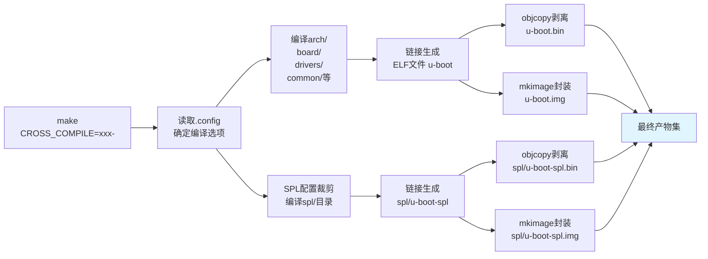

# 3.2.3 U-Boot的编译系统

> 所属章节：第3章 U-Boot引导加载程序 > 3.2 U-Boot编译与配置
> 难度：[I→I] | 预计阅读时间：25分钟

## 本节导读

上一节你已经用`make menuconfig`完成了配置。本节带你执行真正的编译——理解`make`命令背后Makefile的目标体系，认清编译生成的各种二进制文件（`u-boot.bin`、`u-boot.img`、`u-boot-spl.bin`等）各自有什么用、该往板子的哪里烧，以及怎样告诉U-Boot使用正确的交叉编译器。学完本节，你能独立完成从源码到可烧录镜像的完整编译流程。

---

## 知识点1：Makefile入口与编译目标 [I] ~800字

U-Boot源码根目录下的**顶层Makefile**是整个编译过程的总指挥，它有近3000行（因版本而异），但你不需要读懂每一行。关键是知道：该敲什么命令，以及编译完成后去哪里找产物。

### 默认目标：all

如果你只是输入`make`而不指定目标，Makefile的默认目标`all`会被执行。`all`是一个"打包指令"，它会依次触发多个子目标，最终产出完整的U-Boot镜像套件。在大多数现代U-Boot版本中，`all`等价于构建`u-boot.bin`、`u-boot.img`（如配置开启）以及SPL相关镜像。

```bash
# 最简洁的编译命令（在U-Boot源码根目录，且已完成 defconfig）
$ make

# 等价于显式指定默认目标
$ make all
```

[图1：终端编译过程截图，显示从C文件编译到最终链接生成u-boot.bin的滚动输出]

### 常用编译目标速查

U-Boot Makefile预定义了几十个目标，覆盖了编译、打包、烧录辅助、清理等不同阶段。下表列出嵌入式工程师最常用的一批：

| 目标名称 | 说明 | 典型输出文件 | 适用场景 |
|---------|------|------------|---------|
| `all` | 默认目标，编译完整U-Boot及SPL | `u-boot.bin`、`u-boot.img`、`u-boot-spl.bin` | 日常编译首选 |
| `u-boot.bin` | 纯二进制格式的U-Boot镜像 | `u-boot.bin` | 直接烧录到Flash/SD卡裸区 |
| `u-boot.img` | 带启动头（mkimage封装）的镜像 | `u-boot.img` | 需要头校验的BootROM加载场景 |
| `u-boot-spl.bin` | SPL阶段的纯二进制镜像 | `spl/u-boot-spl.bin` | 烧写到SPL启动分区 |
| `u-boot-spl.img` | 带启动头的SPL镜像 | `spl/u-boot-spl.img` | ROM要求带头的SoC（如部分Rockchip） |
| `u-boot-dtb.img` | 附带设备树的完整镜像 | `u-boot-dtb.img` | 需要设备树随U-Boot一同加载 |
| `tools` | 仅编译辅助工具（如mkimage） | `tools/mkimage` | 需要在宿主机上运行U-Boot工具 |
| `clean` | 删除编译产物，保留配置 | `.config`保留 | 重新编译前清理 |
| `mrproper` | 彻底清理，包括配置 | `.config`也删除 | 切换板卡或从头开始 |
| `distclean` | 超彻底清理，连备份文件也删 | 源码回到"出厂状态" | 发布源码前或遇到诡异编译错误 |
| `menuconfig` | 进入Kconfig配置菜单 | 更新`.config` | 功能裁剪与配置 |
| `savedefconfig` | 导出差异配置 | 生成`defconfig`文件 | 保存当前配置为新的默认配置 |

💡 **提示**：目标名称中的`.bin`表示**裸二进制**（raw binary），即去掉ELF头、段表等元数据后的纯机器码；`.img`表示经过`mkimage`工具封装，可能附加了CRC校验、加载地址、入口地址等元信息的**启动镜像**。

### 查看所有可用目标

如果你不确定某个U-Boot版本支持哪些目标，Makefile提供了一个自文档化功能：

```bash
# 查看编译帮助（列出所有主要目标及说明）
$ make help

# 典型输出节选：
# U-Boot build targets:
#   all             - Build all necessary images
#   u-boot.bin      - Raw binary image
#   u-boot.img      - Image with mkimage header
#   u-boot-spl.bin  - SPL binary
#   u-boot-spl.img  - SPL image with header
#   clean           - Remove most generated files
#   mrproper        - Remove all generated files + config
#   distclean       - Remove all generated files + editor backups
```

### 完整编译操作步骤

以RK3568平台为例，演示从配置到产物的标准流程：

```bash
# 步骤1：确认已在U-Boot源码根目录，且配置已完成
$ ls .config
.config

# 步骤2：执行编译（使用-j$(nproc)利用多核加速）
$ make -j$(nproc)

# 步骤3：查看编译产物
$ ls -lh u-boot.bin u-boot.img u-boot-spl.bin 2>/dev/null || ls -lh u-boot*
-rw-r--r-- 1 user user 640K u-boot.bin
-rw-r--r-- 1 user user 768K u-boot.img
-rw-r--r-- 1 user user 128K spl/u-boot-spl.bin
```

⚠️ **陷阱**：`make`和`make all`虽然通常等价，但在某些板级配置下，`all`会额外构建`u-boot-dtb.img`或打包`itb`文件（Flattened Image Tree），而单独`make u-boot.bin`不会。如果你发现产物比预期少，检查是否该用`make all`而非单目标。

🔴 **危险**：编译U-Boot会占用大量磁盘空间。一次完整编译产生的`.o`文件、依赖文件`.d`、自动生成的头文件等加起来可能达到**数GB**。确保你的源码目录所在分区有至少5GB空闲空间，否则编译中途会因磁盘满而失败，且错误提示往往不直观（看起来像"无法写入临时文件"或"gcc internal error"）。

---

## 知识点2：编译输出文件解读 [I] ~800字

编译完成后，U-Boot源码目录下会出现多个二进制文件，初学者最困惑的问题是："这些文件长得差不多，到底该用哪个烧进板子？"本节逐一拆解。

### u-boot.bin：最原始的"裸二进制"

`u-boot.bin`是U-Boot ELF文件（`u-boot`）经过`objcopy`剥离后的纯机器码。它不包含任何ELF头、段表或调试信息，就是CPU可以直接取指执行的一串字节。

```bash
# 查看u-boot.bin的文件类型
$ file u-boot.bin
u-boot.bin: data

# 查看大小
$ ls -lh u-boot.bin
-rw-r--r-- 640K u-boot.bin
```

`file`命令显示"data"，正说明它是裸二进制——没有任何文件格式标识头。很多SoC的BootROM或SPL在加载下一阶段程序时，要求的就是这种"纯粹"的二进制流。

### u-boot.img：带"启动头"的封装镜像

`u-boot.img`是在`u-boot.bin`前面附加了一个由`mkimage`工具生成的**启动头**（boot header）。这个头里通常包含：
- **幻数（Magic Number）**：BootROM用来识别"这是一个可启动镜像"
- **加载地址（Load Address）**：镜像应该被拷贝到DDR的哪个地址
- **入口地址（Entry Point）**：第一条指令的地址
- **CRC校验**：验证镜像传输过程中是否损坏

[图2：u-boot.img文件结构示意图，展示Header + u-boot.bin的拼接关系]

```bash
# u-boot.img的大小总是略大于u-boot.bin
$ ls -lh u-boot.bin u-boot.img
-rw-r--r-- 640K u-boot.bin
-rw-r--r-- 768K u-boot.img

# 用mkimage查看镜像头信息（部分版本支持）
$ tools/mkimage -l u-boot.img
Image Type:   U-Boot Image
Image Name:   "U-Boot"
Data Size:    655360 Bytes = 640.00 KiB
Load Address: 0x00a00000
Entry Point:  0x00a00000
```

### u-boot.bin vs u-boot.img 对比

| 对比维度 | u-boot.bin | u-boot.img |
|---------|-----------|-----------|
| 本质 | 裸机器码，无头信息 | 裸机器码 + 启动头封装 |
| 大小 | 较小（纯代码+数据） | 较大（代码+数据+头部） |
| 适用SoC | BootROM自己拼接头部的芯片（如部分NXP i.MX） | 要求外部镜像自带头部的芯片（如部分Rockchip、TI AM335x） |
| 典型烧录位置 | SD卡偏移32KB/64KB处、NOR Flash | eMMC boot分区、SD卡特殊偏移 |
| 是否需要mkimage | 否 | 是（编译时自动调用） |
| 可人工识别 | `file`显示"data" | `file`可能显示"data"，但前几个字节有规律 |

💡 **提示**：你的开发板到底需要`u-boot.bin`还是`u-boot.img`，取决于SoC的BootROM设计。查阅芯片参考手册（Reference Manual）中"Boot ROM"或"Image Format"章节，或参考官方烧录文档。一个简单判断法：如果板子厂商提供的烧录工具在"U-Boot"位置要求选`.img`文件，那就是`u-boot.img`。

### u-boot-spl.bin：内存初始化"先行部队"

对于需要SPL的SoC，编译还会产出`spl/`目录下的镜像。SPL的本职工作已经在3.1.3节讲过，这里只关注产物：

- `spl/u-boot-spl.bin`：SPL裸二进制，通常几十KB到两百KB
- `spl/u-boot-spl.img`：带头的SPL镜像（部分平台需要）

```bash
# 查看SPL产物
$ ls -lh spl/
-rw-r--r-- 92K spl/u-boot-spl.bin
-rw-r--r-- 100K spl/u-boot-spl.img
-rw-r--r-- 150K spl/u-boot-spl.dtb
```

SPL体积小的原因是Kconfig里为SPL单独维护了一套裁剪配置。`make menuconfig`里带`SPL_`前缀的选项（如`CONFIG_SPL_MMC_SUPPORT`）决定了SPL里包含哪些驱动。

### 输出文件存放位置总览

```
u-boot/                         ← 源码根目录
├── u-boot                      ← ELF格式可执行文件（带符号表，用于调试）
├── u-boot.bin                  ← 裸二进制完整U-Boot
├── u-boot.img                  ← 带头封装完整U-Boot（若平台配置生成）
├── u-boot.dtb                  ← U-Boot使用的设备树二进制
├── u-boot-dtb.img              ← 附带设备树的封装镜像
├── spl/
│   ├── u-boot-spl.bin          ← SPL裸二进制
│   └── u-boot-spl.img          ← SPL带头镜像（按需）
└── tools/
    └── mkimage                 ← 生成.img的打包工具
```

⚠️ **陷阱**：不要把`u-boot`（ELF文件）当成烧录文件直接写到Flash里。这个文件包含ELF头和大量调试符号，体积比`u-boot.bin`大得多，BootROM根本不认识这种格式。烧录时认准`.bin`或`.img`后缀。

---

## 知识点3：交叉编译器指定 [I] ~600字

U-Boot是运行在ARM/RISC-V等嵌入式CPU上的程序，不能在x86宿主机上直接编译。你需要用**交叉编译器**——一套运行在x86上、但产出ARM机器码的gcc工具链。

### 核心变量：CROSS_COMPILE

U-Boot Makefile通过`CROSS_COMPILE`变量来定位交叉编译器。这个变量的值是工具链前缀，Makefile会在后面自动拼接`gcc`、`ld`、`objcopy`等后缀：

| CROSS_COMPILE值 | 实际调用的编译器 |
|-----------------|----------------|
| `arm-linux-gnueabihf-` | `arm-linux-gnueabihf-gcc`、`arm-linux-gnueabihf-ld` |
| `aarch64-linux-gnu-` | `aarch64-linux-gnu-gcc`、`aarch64-linux-gnu-ld` |
| `riscv64-unknown-elf-` | `riscv64-unknown-elf-gcc`、`riscv64-unknown-elf-ld` |

### 三种指定方式

U-Boot支持三种方式传入`CROSS_COMPILE`，优先级从高到低：

**方式一：make命令行参数（最常用，推荐）**

```bash
# ARM 32位（如Cortex-A7/A9）
$ make CROSS_COMPILE=arm-linux-gnueabihf-

# ARM 64位（如Cortex-A53/A55/A72，RK3568/RK3588等）
$ make CROSS_COMPILE=aarch64-linux-gnu-

# RISC-V 64位
$ make CROSS_COMPILE=riscv64-unknown-elf-
```

**方式二：环境变量**

```bash
# 先导出环境变量
$ export CROSS_COMPILE=aarch64-linux-gnu-

# 后续make不需要再写前缀
$ make
$ make u-boot-spl.bin
```

**方式三：通过Kconfig固化在配置里**

在`make menuconfig` → `General setup` → `Cross-compiler tool prefix`里填入前缀，保存后`.config`里会写入：

```bash
$ grep CROSS_COMPILE .config
CONFIG_CROSS_COMPILE="aarch64-linux-gnu-"
```

这种方式的好处是配置与工具链绑定，换人编译时不会用错；缺点是切换工具链版本时需要重新进menuconfig修改。

### 验证交叉编译器是否生效

编译开始后，Make会打印第一条编译命令。你可以从中确认用的确实是交叉编译器，而不是宿主机的x86 gcc：

```bash
$ make CROSS_COMPILE=aarch64-linux-gnu-

# 正确编译时，你应该看到类似这样的输出：
#   aarch64-linux-gnu-gcc ... -c arch/arm/cpu/armv8/start.S
#   aarch64-linux-gnu-ld ... -o u-boot
#   aarch64-linux-gnu-objcopy ... -O binary u-boot u-boot.bin
```

如果看到`cc`、`gcc`、`x86_64-linux-gnu-gcc`，说明`CROSS_COMPILE`没有传进去，产物将是x86格式的ELF，烧到板子上完全无法运行。

💡 **提示**：编译U-Boot时推荐用**硬件浮点**工具链（如`arm-linux-gnueabihf-`中的`hf`表示hard-float）。某些SoC的U-Boot在启动阶段需要操作FPU寄存器做初始化校验，软浮点工具链编译的U-Boot可能导致启动异常。

⚠️ **陷阱**：`CROSS_COMPILE`变量末尾的**连字符不能漏**。正确写法是`aarch64-linux-gnu-`（带末尾`-`），不是`aarch64-linux-gnu`。漏写连字符会导致Makefile拼接成`aarch64-linux-gnugcc`，找不到命令。错误提示通常是`aarch64-linux-gnugcc: command not found`。

⚠️ **陷阱**：交叉编译器版本与U-Boot版本之间存在**兼容性约束**。U-Boot v2023.x之后的版本普遍要求GCC 10及以上。如果你用GCC 7编译新版U-Boot，可能遇到`-Werror`相关的编译失败（把警告当错误处理）。升级工具链或添加`KCFLAGS=-Wno-error`可绕过，但推荐升级工具链。

---

## U-Boot编译流程全景

下面的流程图展示了从执行`make`到产出各类镜像的完整编译链路：



[图3：U-Boot编译流程图，展示从make命令到u-boot.bin/u-boot.img/u-boot-spl.bin等最终产物的完整链路]

---

## 本节总结

| 概念 | 要点 | 操作 |
|------|------|------|
| `make all` | 默认目标，编译完整产物集 | `make -j$(nproc)`利用多核加速 |
| `u-boot.bin` | 裸二进制，无头部信息 | 适用于BootROM自带头拼接逻辑的SoC |
| `u-boot.img` | 经mkimage封装，带头信息 | 适用于要求外部镜像自带头的SoC |
| `u-boot-spl.bin` | SPL阶段的裸二进制 | 烧写到SPL启动分区，负责初始化DDR |
| `CROSS_COMPILE` | 交叉编译器前缀变量 | `make CROSS_COMPILE=aarch64-linux-gnu-` |
| `.config`固化 | 通过menuconfig绑定工具链 | `General setup` → `Cross-compiler tool prefix` |
| `make help` | 自文档化目标列表 | 不确定可用目标时先执行查看 |
| `clean/mrproper/distclean` | 三级清理，力度递增 | 切换板卡或遇到编译异常时使用 |

---

## 下一步

3.2.4节将讲解U-Boot的烧录与验证——把本节编译出的`u-boot.bin`或`u-boot.img`真正写到开发板的存储介质（SD卡、eMMC或SPI Flash）中，然后通过串口观察U-Boot是否正常启动并进入命令行交互界面。

---

## 配套资源

### 表格清单
- 表1：U-Boot常用编译目标速查表（目标名称/说明/输出文件/适用场景）
- 表2：`u-boot.bin` vs `u-boot.img` 对比表（本质/大小/适用SoC/烧录位置/是否需要mkimage/可人工识别）
- 表3：本节核心概念总结表（概念/要点/操作）

### 图示清单
- 图1：终端编译过程截图（显示从C文件编译到最终链接生成u-boot.bin的滚动输出）
- 图2：u-boot.img文件结构示意图（展示Header + u-boot.bin的拼接关系）
- 图3：U-Boot编译流程图 [mermaid图] — 从make命令到各类最终产物的完整编译链路

### 代码清单
- 代码1：`make` / `make all` — 默认编译命令
- 代码2：`make help` — 查看所有可用编译目标
- 代码3：`make -j$(nproc)` 后 `ls -lh u-boot*` — 完整编译及查看产物
- 代码4：`tools/mkimage -l u-boot.img` — 查看镜像头信息
- 代码5：`ls -lh spl/` — 查看SPL编译产物
- 代码6：`make CROSS_COMPILE=aarch64-linux-gnu-` — 交叉编译命令
- 代码7：`grep CROSS_COMPILE .config` — 验证配置中固化的交叉编译器前缀
