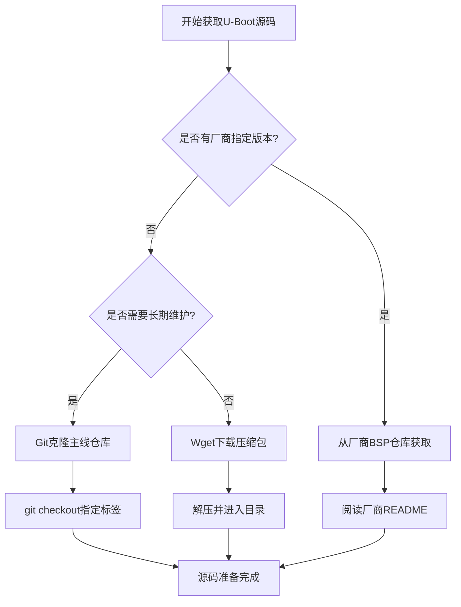

# 3.3.1 获取与配置U-Boot源码

> 所属章节：第3章 U-Boot引导程序 > 3.3 编译U-Boot
> 难度：[B→I] | 预计阅读时间：25分钟

## 本节导读

本节带你完成U-Boot源码的获取和编译前配置——就像做菜前要"买菜"和"备料"一样。学完本节，你能独立完成从仓库拉取源码到生成编译配置文件的全过程，为后续的实际编译做好准备。

---

## 知识点1：源码获取方式 [B] ~800字

### 1.1 为什么要区分"官方源码"和"厂商源码"

U-Boot的源码有两种主要来源，初学者经常被搞糊涂：

| 来源类型 | 仓库地址 | 特点 | 适用场景 |
|---------|---------|------|---------|
| **官方主线** | `github.com/u-boot/u-boot` | 最新功能、支持广、更新快 | 学习、主流评估板 |
| **厂商BSP** | 各芯片厂商私有仓库 | 针对自家芯片深度优化 | 量产产品、特定硬件 |

💡 **一个形象的比喻**：官方主线U-Boot就像"通用教材"，覆盖了大多数常见开发板；而厂商BSP就像"厂家说明书"，里面写满了只有他们自家芯片才懂的"暗语"（特殊的DDR初始化、电源管理、 proprietary 驱动等）。

对于初学者，**强烈建议先用官方主线源码练习**。等熟悉了U-Boot的基本结构，再切换到厂商BSP也不迟。

### 1.2 版本选择：主线LTS vs 最新版

U-Boot的版本号格式是 `vYYYY.MM`，例如 `v2023.07` 表示2023年7月发布的版本。版本选择策略：

- **稳定学习**：选择带有 `-LTS` 后缀的长期支持版本（如 `v2023.07-LTS`），Bug少、文档多
- **尝鲜体验**：选择最新主线版本，但可能遇到未知的编译问题
- **量产项目**：听从芯片厂商的建议，通常他们会锁定某一个经过验证的版本

### 1.3 获取源码的两种实操方式

#### 方式一：Git克隆（推荐，可后续更新）

```bash
# 进入你的工作目录
cd ~/embedded-linux/workspace

# 克隆官方U-Boot仓库（大约300MB，视网络情况1-5分钟）
git clone https://github.com/u-boot/u-boot.git

# 进入目录
cd u-boot

# 查看所有可用的版本标签
git tag -l "v2023*" | tail -n 10

# 切换到稳定的LTS版本（以v2023.07-LTS为例）
git checkout v2023.07-LTS

# 确认当前版本
git describe --tags
# 输出：v2023.07-LTS
```

#### 方式二：Wget下载压缩包（轻量，一次性使用）

```bash
# 创建并进入工作目录
mkdir -p ~/embedded-linux/workspace && cd ~/embedded-linux/workspace

# 下载指定版本的源码压缩包（约20MB）
wget https://github.com/u-boot/u-boot/archive/refs/tags/v2023.07-LTS.tar.gz

# 解压
tar -xzf v2023.07-LTS.tar.gz

# 进入源码目录
cd u-boot-2023.07-LTS
```

### 源码获取决策流程



⚠️ **陷阱：直接下载主线zip而非指定标签**

如果你用GitHub网页上的 "Code → Download ZIP" 按钮下载，得到的永远是**最新开发分支**，可能存在未修复的Bug。生产环境或学习时，务必使用 `git checkout` 切换到稳定标签。

💡 **提示：网络慢的替代方案**

如果GitHub访问缓慢，可以使用国内镜像（如 `git clone https://mirror.ghproxy.com/https://github.com/u-boot/u-boot.git`），或者通过 `wget` 下载压缩包后断点续传。

---

## 知识点2：配置编译环境 [I] ~1,000字

获取源码只是第一步，接下来要让U-Boot"认识"你的开发板——这需要找到正确的默认配置文件（defconfig），并在此基础上进行个性化微调。

### 2.1 找到属于你的defconfig

defconfig 是 "default config" 的缩写，可以理解为"开发板出厂默认配置"。每个支持的开发板都有一个对应的 defconfig 文件，存放在 `configs/` 目录下。

```bash
# 列出所有可用的defconfig（可能有上千个！）
ls configs/ | head -n 20

# 用关键词过滤你的开发板（以树莓派为例）
ls configs/ | grep -i raspberry
# 输出示例：rpi_4_defconfig  rpi_arm64_defconfig

# 用关键词过滤全志芯片（如OrangePi）
ls configs/ | grep -i orangepi
# 输出示例：orangepi_zero_defconfig  orangepi_pc_plus_defconfig

# 用关键词过滤NXP i.MX系列
grep -l "imx" configs/*.defconfig configs/*_defconfig 2>/dev/null | head -n 10
```

### 2.2 常见开发板defconfig速查表

| 开发板/芯片平台 | defconfig文件名 | 架构 | 适用说明 |
|---------------|----------------|------|---------|
| 树莓派 4 (64位) | `rpi_4_defconfig` | ARM64 | Raspberry Pi 4B，支持HDMI输出 |
| 树莓派 4 (32位) | `rpi_4_32b_defconfig` | ARM | 兼容旧版32位系统 |
| 全志 H3 (OrangePi Zero) | `orangepi_zero_defconfig` | ARM | 入门级，百兆网口 |
| 全志 H6 (OrangePi 3) | `orangepi_3_defconfig` | ARM64 | 支持4K视频输出 |
| NXP i.MX6ULL (正点原子) | `mx6ull_14x14_evk_defconfig` | ARM | 工业控制常用 |
| NXP i.MX8MQ | `imx8mq_evk_defconfig` | ARM64 | 高性能多媒体 |
| 三星 Exynos5422 | `odroid_xu4_defconfig` | ARM | Odroid XU4开发板 |
| QEMU ARM64仿真 | `qemu_arm64_defconfig` | ARM64 | 无硬件时可仿真练习 |
| QEMU RISC-V | `qemu-riscv64_spl_defconfig` | RISC-V | RISC-V架构仿真 |
| TI AM335x (BeagleBone) | `am335x_evm_defconfig` | ARM | 经典嵌入式学习板 |

💡 **找不到defconfig怎么办？**

如果你的开发板不在上表中，先在configs目录搜索芯片型号的关键词。如果还是没有，说明你的板子可能太新或太小众——这时需要：
1. 查阅厂商提供的BSP文档
2. 找一个最接近的defconfig作为基础，手动修改
3. 或者直接在厂商BSP中查找（通常放在 `configs/` 或 `board/<vendor>/` 下）

### 2.3 应用默认配置：make xxx_defconfig

找到了defconfig文件名后，只需一条命令即可应用：

```bash
# 假设你的开发板是树莓派4
cd ~/embedded-linux/workspace/u-boot

# 先清理之前可能存在的配置（好习惯）
make mrproper

# 应用默认配置
make rpi_4_defconfig

# 看到以下输出即成功：
#  HOSTCC  scripts/basic/fixdep
#  HOSTCC  scripts/kconfig/conf.o
#  ...
#  configuration written to .config
```

🔴 **危险：忘记先清理旧配置**

如果你之前编译过其他板子的U-Boot，目录中可能残留 `.config` 文件。直接运行 `make xxx_defconfig` 虽然会覆盖，但为了彻底避免"幽灵配置"问题，**每次切换开发板前都执行 `make mrproper` 清理**。

### 2.4 可视化微调：make menuconfig

defconfig提供了"保底能用"的配置，但你可能需要微调——比如启用串口调试输出、修改启动延迟时间、开启或关闭某个驱动。

```bash
# 启动图形化的配置菜单（需要ncurses库支持）
make menuconfig
```

[图1：make menuconfig界面截图，显示菜单结构]

`menuconfig` 的操作方式与Linux内核的配置界面几乎一模一样：
- ↑/↓ 方向键：移动光标
- Enter：进入子菜单或选中条目
- Space 或 Y/M/N：切换选项（Y=编译进固件, M=编译为模块, N=不编译）
- /：搜索功能（最常用！输入关键词如"bootdelay"快速定位）
- 左右方向键 + Enter：选择底部按钮（Select/Exit/Help/Save）

**两个新手最常修改的选项**：

| 配置路径 | 配置项名称 | 作用 | 默认值 |
|---------|-----------|------|--------|
| `→ Boot options →` | `bootdelay` | U-Boot启动前等待用户打断的秒数 | 2秒 |
| `→ Console →` | `console` | 指定内核启动后的控制台设备 | 视板子而定 |

搜索 `bootdelay` 的演示：
1. 在 `menuconfig` 中按 `/` 键
2. 输入 `bootdelay`，回车
3. 系统列出所有匹配项，按数字键跳转
4. 修改为 `5` 或 `10`（留更多时间给初学者按任意键进入U-Boot命令行）

💡 **menuconfig修改后的配置保存在哪里？**

所有修改最终保存到源码根目录的 `.config` 文件中。如果你想备份这份配置，可以执行：

```bash
# 将当前配置保存为新的defconfig文件（方便下次直接使用）
make savedefconfig
# 输出文件为 defconfig，你可以重命名后放在 configs/ 目录下
```

⚠️ **陷阱：menuconfig乱改后编译失败**

初学者容易在menuconfig里"探索性勾选"很多不熟悉的选项，结果编译报错。**建议**：
1. 第一次只修改你明确知道用途的选项（如 bootdelay）
2. 每次只改一两项，改完立即尝试编译验证
3. 记录改了什么，方便回滚

---

## 本节总结

| 步骤 | 操作命令 | 产出文件 | 注意事项 |
|------|---------|---------|---------|
| 1. 获取源码 | `git clone` / `wget` | `u-boot/` 目录 | 务必切换到稳定标签 |
| 2. 查找defconfig | `ls configs/ \| grep xxx` | 确认配置文件名 | 优先用厂商推荐的defconfig |
| 3. 清理环境 | `make mrproper` | 干净的源码树 | 切换开发板前必做 |
| 4. 应用配置 | `make xxx_defconfig` | `.config` | 观察输出确认成功 |
| 5. 微调配置 | `make menuconfig` | 更新后的 `.config` | 善用 `/` 搜索功能 |
| 6. 备份配置 | `make savedefconfig` | `defconfig` | 方便复用或分享 |

---

## 下一步

现在你的U-Boot源码已经配置完毕，`.config` 文件已经生成。下一节 `3.3.2 编译与烧录U-Boot` 将带你执行真正的编译命令，把源码变成可以烧录到开发板的二进制固件。

---

## 配套资源

### 表格清单
- 表1：官方主线与厂商BSP源码对比表
- 表2：常见开发板defconfig速查表
- 表3：menuconfig常用修改项速查表
- 表4：本节操作步骤总结表

### 图示清单
- 图1：U-Boot源码获取决策流程 [mermaid流程图]
- 图2：make menuconfig配置界面截图 [配图说明]

### 代码清单
- 代码1：Git克隆并切换到指定标签
- 代码2：Wget下载解压源码压缩包
- 代码3：查找并应用defconfig
- 代码4：make menuconfig操作演示及配置保存
