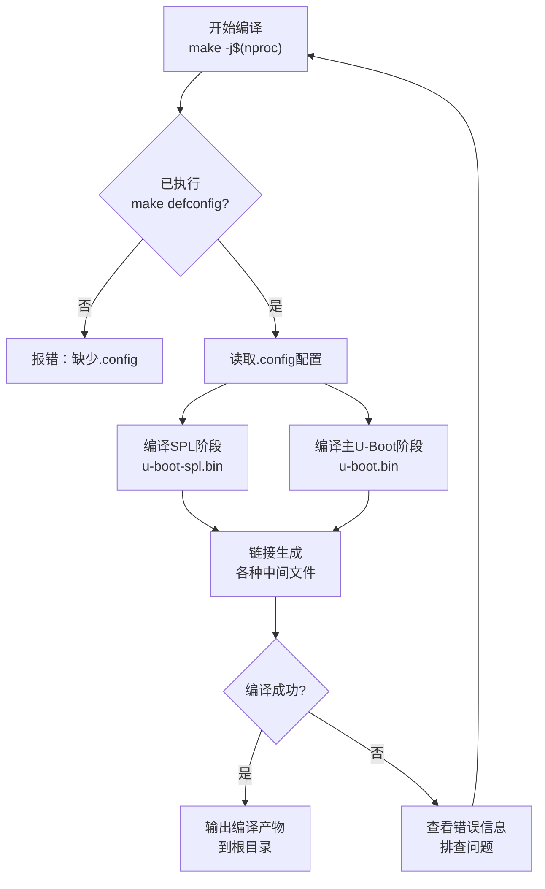
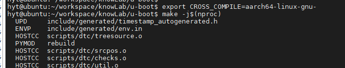
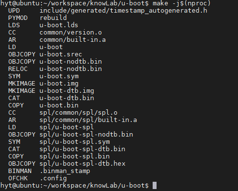
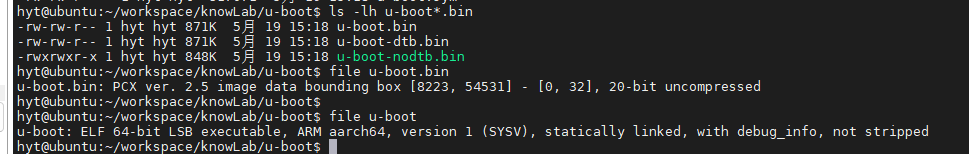
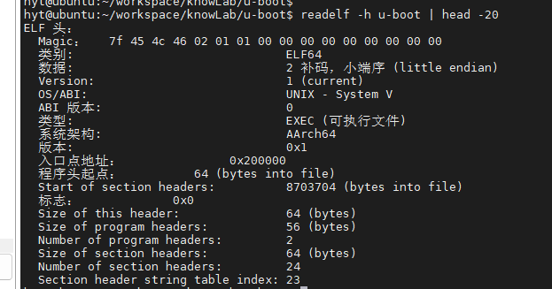
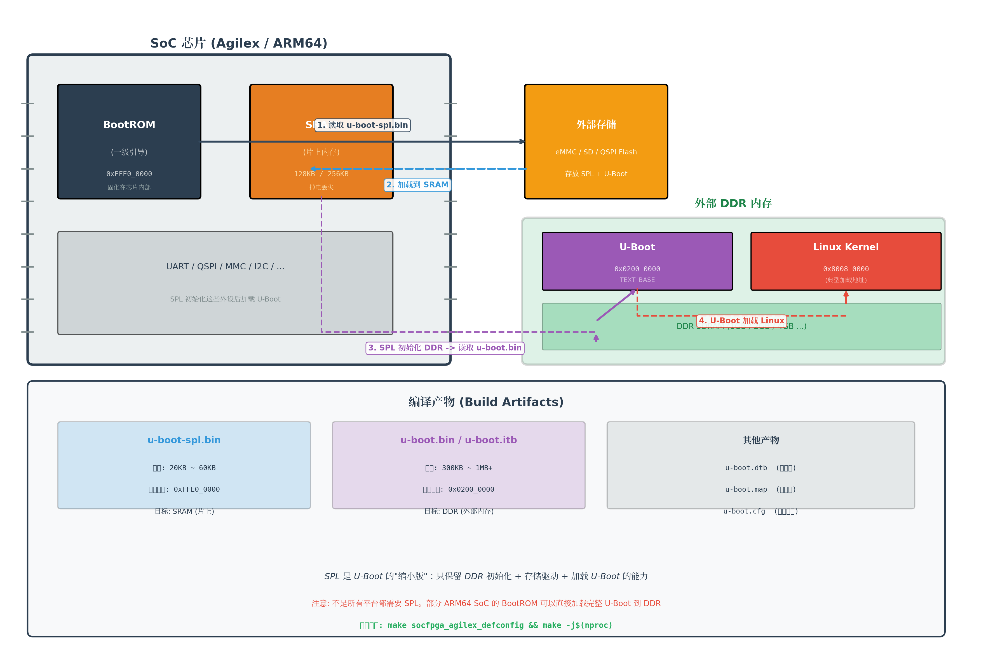

# 3.3.2 编译U-Boot

> 所属章节：第3章 嵌入式Linux开发环境搭建 > 3.3 U-Boot移植与编译
> 
> 难度：[B] | 预计阅读时间：25分钟

## 本节导读

本节将带领读者实际执行U-Boot的编译过程，学会使用并行编译命令、读懂编译输出信息、验证编译产物的正确性，并理解SPL（Secondary Program Loader）的作用。<BR>学完后，你将能够独立编译出适用于目标平台的U-Boot固件。

---

## <span class="blue"> 编译命令与过程 [B] 

在上一节中，我们已经配置好了U-Boot的板级配置文件（`make xxx_defconfig`）。现在，我们正式进入编译阶段。

### U-Boot编译的基本原理

U-Boot使用GNU Make作为构建系统。编译时，Make会读取目录下的`Makefile`、`Kbuild`和`.config`文件，根据配置决定：

- 编译哪些源文件
- 使用哪个交叉编译器
- 生成哪些目标产物

简单来说，执行`make`后，编译器会把C语言和汇编代码翻译成机器码，链接器把所有机器码拼成一个完整的可执行文件, 最终就是我们烧录到开发板上的U-Boot固件。

### 编译过程图

下面的流程图展示了一次完整的U-Boot编译过程：



[图1：U-Boot编译过程流程图]

### 操作步骤

**第一步：确认配置已完成**

在编译之前，先检查上一步的配置是否生效：

```bash
# 查看当前目录下是否存在.config文件
ls -la .config
```

如果看到`.config`文件，说明配置已就绪。

**第二步：执行并行编译**

```bash
# 使用所有CPU核心并行编译，大幅缩短编译时间
make -j$(nproc)
```

`$(nproc)`是一个Shell命令，它会返回你电脑CPU的逻辑核心数。例如，4核CPU会执行`make -j4`，8核CPU会执行`make -j8`。

> 💡 **提示**：在Docker容器或某些虚拟机中，`nproc`可能返回的是宿主机的核心数。如果你想手动指定，可以直接写数字，比如`make -j4`。

**第三步：观察编译输出**

编译开始后，终端会滚动输出大量信息。我们来逐段解读典型的输出：

```
  HOSTCC  tools/mkenvimage.o
  HOSTCC  tools/fit_image.o
  CC      arch/arm/cpu/armv7/start.o
  CC      arch/arm/cpu/armv7/cpu.o
  ...
  LD      u-boot
  OBJCOPY u-boot.srec
  OBJCOPY u-boot.bin
  OBJCOPY u-boot-nodtb.bin
  CAT     u-boot-dtb.bin
```

输出中的前缀含义如下表：

| 前缀 | 全称 | 含义 |
|------|------|------|
| `HOSTCC` | Host C Compiler | 用主机GCC编译工具（如制作镜像的工具） |
| `CC` | C Compiler | 用交叉编译器编译U-Boot源码 |
| `LD` | Linker | 链接器，把多个目标文件合成一个可执行文件 |
| `OBJCOPY` | Object Copy | 格式转换，把ELF文件转成纯二进制文件 |
| `CAT` | Concatenate | 文件拼接，如把设备树二进制拼接到固件中 |

编译后期，你会看到类似这样的关键输出：

```
  Image Type:   ARM U-Boot Firmware with Legacy Image header
  Data Size:    524288 bytes = 512.00 KiB
  Load Address: 80008000
  Entry Point:  80008000
```

这几行信息告诉我们：U-Boot固件大小约512KB，加载地址和入口地址都是`0x80008000`。

### 常见编译错误

> ⚠️ **错误1："No rule to make target"**

**现象**：
```
make: *** No rule to make target 'xxx_defconfig'.  Stop.
```

**原因**：你在错误的目录下执行了make命令，或者U-Boot源码没有正确解压。

**解决**：确认当前目录是U-Boot源码根目录（包含`Makefile`和`configs/`文件夹）。

> ⚠️ **错误2："compiler not found"或"arm-linux-gnueabihf-gcc: command not found"**

**现象**：编译一开始报错，提示找不到交叉编译器。

**解决**：检查交叉编译器是否已安装，并且`PATH`环境变量是否包含其路径。验证方法：

```bash
which arm-linux-gnueabihf-gcc
# 或
arm-linux-gnueabihf-gcc --version
```

💡 **提示**：有些U-Boot版本需要在编译前设置`CROSS_COMPILE`环境变量：

```bash
export CROSS_COMPILE=aarch64-linux-gnu-
make -j$(nproc)
```




> ⚠️ **错误3：编译到一半卡住不动**

**现象**：终端长时间没有新输出，CPU占用却很高。

**原因**：通常是并行编译时内存不足，导致系统频繁换页。

**解决**：减少并行任务数，比如`make -j2`甚至`make -j1`（单线程编译）。

🔴 **危险**：编译失败的残留文件可能导致后续编译问题！

如果你修改了配置或源码后重新编译，建议先清理：

```bash
# 清理编译产物，保留配置
make clean

# 彻底清理（包括配置）
make distclean
```

### 代码示例：完整编译脚本

把下面的命令保存为`build_uboot.sh`，以后一键编译：

```bash
#!/bin/bash
set -e  # 遇到错误立即退出

# 设置交叉编译器前缀
export CROSS_COMPILE=arm-linux-gnueabihf-
export ARCH=arm

# 清理旧编译产物
make clean

# 加载板级配置（以am335x为例，请替换为你的平台）
make am335x_evm_defconfig

# 并行编译
make -j$(nproc)

echo "========================================"
echo "U-Boot编译完成！"
echo "========================================"

# 列出生成的固件
ls -lh u-boot.bin u-boot-spl.bin 2>/dev/null || echo "请检查编译产物"
```

---

## <span class="blue"> 编译产物检查 [B]

编译完成后，U-Boot源码根目录会生成多个文件。我们需要确认这些产物的正确性，确保它们是为目标平台编译的。

### 编译产物清单

| 文件名 | 类型 | 大小（典型值） | 用途 | 是否需要烧录 |
|--------|------|---------------|------|------------|
| `u-boot.bin` | 纯二进制固件 | 400KB ~ 800KB | 主U-Boot固件 | ✅ 必须 |
| `u-boot` | ELF可执行文件 | 1MB+ | 调试用途 | ❌ 不烧录 |
| `u-boot.srec` | Motorola S-Record | 与bin相近 | 某些烧录器使用 | 视情况 |
| `u-boot.img` | 带头的镜像 | 与bin相近 | 有些BootROM需要 | 视平台 |
| `u-boot-spl.bin` | SPL纯二进制 | 20KB ~ 60KB | 第一阶段加载器 | ✅ 通常需要 |
| `MLO` | 重命名后的SPL | 同SPL | TI平台专用 | TI平台需要 |

[表1：U-Boot编译产物清单]

### 检查文件大小

编译完成后，首先确认固件大小是否在合理范围内：

```bash
# 查看所有编译产物的大小
ls -lh u-boot*.bin
```

典型的输出：

```
-rwxr-xr-x 1 user user  45K Jan 15 10:20 u-boot-spl.bin
-rwxr-xr-x 1 user user 512K Jan 15 10:20 u-boot.bin
```

⚠️ **陷阱**：如果`u-boot.bin`只有几百字节，说明链接阶段出错，生成了空文件。如果超过2MB，可能包含了调试信息，或者配置有误导致编译了不该包含的驱动。

### 确认目标架构

使用`file`命令快速确认编译产物的架构信息：

```bash
file u-boot.bin
```

期望输出（以ARM为例）：

```
u-boot.bin: data
```

`u-boot.bin`是纯二进制文件，所以`file`只显示`data`。但我们可以检查ELF格式的`u-boot`文件：

```bash
file u-boot
```

期望输出：

```
u-boot: ELF 32-bit LSB executable, ARM, EABI5 version 1 (SYSV), statically linked, not stripped
```

这明确告诉我们：这是**32位ARM架构**的ELF可执行文件。




### 使用readelf确认目标平台

`readelf`是分析ELF文件的专业工具。执行以下命令查看头部信息：

```bash
readelf -h u-boot | head -20
```

关键输出字段解析：

```
ELF Header:
  Magic:   7f 45 4c 46 01 01 01 00 00 00 00 00 00 00 00 00
  Class:                             ELF32
  Data:                              2's complement, little endian
  Version:                           1 (current)
  OS/ABI:                            UNIX - System V
  Machine:                           ARM
  Entry point address:               0x80008000
```

重点关注：

- `Class: ELF32` — 32位系统
- `Machine: ARM` — ARM架构
- `Entry point address` — U-Boot启动入口地址

> 💡 **提示**：`Entry point address`应该与你的目标平台Datasheet中描述的加载地址一致。如果不一致，说明板级配置可能有误，需要检查`.config`中的`CONFIG_SYS_TEXT_BASE`。



### 检查入口地址是否正确的代码示例

```bash
# 一次性提取关键信息
echo "=== U-Boot ELF信息 ==="
readelf -h u-boot | grep -E "Machine|Entry|Class"

echo ""
echo "=== 固件大小检查 ==="
ls -lh u-boot.bin u-boot-spl.bin

echo ""
echo "=== 架构确认 ==="
file u-boot
```

---

## <span class="blue"> SPL编译产物 [B] 

### 什么是SPL？

SPL全称**Secondary Program Loader**（二级程序加载器）。<br>要理解它的作用，我们先回顾一下嵌入式系统的启动流程：

1. 上电后，芯片内部的**BootROM**（一级引导程序，固化在芯片里）最先运行
2. BootROM需要从外部存储器（SD卡、eMMC、NAND Flash等）加载一个程序到内存
3. 但BootROM能力有限，通常只能加载很小的程序, 这就是**SPL**
4. SPL运行后，初始化DDR内存等外设，然后再加载完整的**U-Boot**
5. 最后，完整U-Boot加载Linux内核

你可以把SPL理解为"U-Boot的缩小版"，它的唯一任务就是：做好基本初始化，然后把真正的U-Boot请上台。

### SPL编译产物的位置

SPL是在同一个`make`命令中和主U-Boot一起编译的。编译完成后，你会在源码根目录看到：

```bash
ls -lh u-boot-spl.bin
```

SPL的典型大小为20KB到60KB。为什么这么小？

- BootROM通常只有很小的SRAM可供使用（如128KB），SPL必须能装进去
- SPL只包含最核心的代码：初始化DDR、初始化存储接口、加载U-Boot
- 没有命令行、没有网络协议栈、没有复杂驱动

### 验证SPL产物

和主U-Boot一样，我们可以用`file`和`readelf`检查SPL（如果有对应的ELF文件）：

```bash
# 检查SPL大小
ls -lh u-boot-spl.bin

# 有些平台会生成SPL的ELF文件
file u-boot-spl 2>/dev/null || echo "本配置未生成u-boot-spl ELF文件"
```

> ⚠️ **陷阱**：在某些平台上（如TI的AM335x），SPL文件不叫`u-boot-spl.bin`，而是叫`MLO`。这是历史原因, TI的BootROM只认名为`MLO`的文件。编译完成后需要手动复制：

```bash
# TI AM335x平台示例
cp u-boot-spl.bin MLO
```

### SPL与主U-Boot的关系图



上图展示了启动链的关系：BootROM → SPL → U-Boot → Linux。<BR>SPL是连接芯片BootROM和完整U-Boot之间的桥梁。没有SPL，BootROM就无法把完整的U-Boot加载到DDR内存中运行。

> 💡 **提示**：不是所有平台都需要SPL。一些资源充足的芯片（如部分ARM64平台），BootROM可以直接加载完整U-Boot，这类平台编译时不会生成`u-boot-spl.bin`。

---

## 本节总结

| 概念 | 要点 | 操作 |
|------|------|------|
| 并行编译 | 用`make -j$(nproc)`加速 | `make -j$(nproc)` |
| 编译输出前缀 | `CC`=编译、`LD`=链接、`OBJCOPY`=格式转换 | 读懂终端输出 |
| 编译清理 | 重新编译前先clean | `make clean` |
| 主固件 | `u-boot.bin`，纯二进制 | `ls -lh u-boot.bin` |
| 架构验证 | 确认是ARM/ARM64等目标架构 | `file u-boot` |
| ELF头信息 | 确认入口地址和平台匹配 | `readelf -h u-boot` |
| SPL | 小体积引导程序，由BootROM加载 | `ls -lh u-boot-spl.bin` |
| TI平台 | SPL需重命名为MLO | `cp u-boot-spl.bin MLO` |

## 下一步

编译完成后，我们得到了`u-boot.bin`和`u-boot-spl.bin`这两个关键固件。<BR>在下一节**3.3.3 烧录U-Boot到开发板**中，我们将学习如何把这些固件写入SD卡或eMMC，让开发板真正运行我们编译的U-Boot。

---

