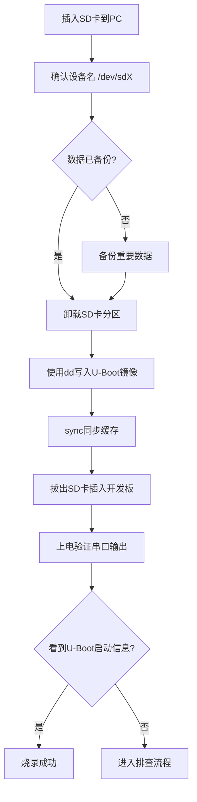

# 3.3.3 烧录U-Boot到开发板

> 所属章节：第3章 嵌入式开发环境搭建 > 3.3 U-Boot编译与烧录
> 难度：[B→I] | 预计阅读时间：30分钟

## 本节导读

上一节我们编译出了U-Boot镜像文件，但编译完成只是"纸上谈兵"——只有把镜像真正写入开发板的存储介质，开发板才能启动运行。本节介绍三种主流烧录方式（SD卡、USB、串口），手把手教你把U-Boot"装"进硬件，并掌握烧录失败时的排查思路。

---

## 知识点1：烧录方法选择 [B] ~1,000字

烧录（Flashing）的本质，就是把编译好的二进制镜像文件写入开发板上的非易失性存储器（如SD卡、eMMC、SPI Flash）。不同开发板提供的硬件接口不同，因此烧录方式也有差异。以下是嵌入式开发中最常用的三种方法。

### 方法一：SD卡烧录（dd命令）[B]

这是最常见、最通用的方法，适用于绝大多数带SD卡槽的开发板（如树莓派、全志H3/H5、瑞芯微RK系列）。

**原理**：U-Boot通常需要放在SD卡的特定偏移位置（例如第1024扇区，即512KB偏移处），CPU上电时BootROM会从该位置读取并执行U-Boot。`dd`命令可以把镜像直接写入SD卡的指定扇区。

**适用场景**：
- 开发板有SD卡槽
- 你需要频繁更新U-Boot进行调试
- 没有专用USB烧录线或串口转接线

**优点**：操作简单，一张SD卡反复擦写，无需额外硬件。

### 方法二：USB烧录（厂商工具）[B]

许多芯片厂商提供了专用的USB烧录工具，通过USB-OTG接口直接对板载eMMC或NAND Flash进行烧录。

**常用工具**：

| 芯片厂商 | 工具名称 | 适用平台 | 烧录目标 |
|---------|---------|---------|---------|
| 瑞芯微（Rockchip） | `rkdeveloptool` / `upgrade_tool` | RK3399, RK3566, RK3588 | eMMC, SPI NOR |
| 全志（Allwinner） | `sunxi-fel` | H3, H5, H6, A64 | SRAM, DDR, eMMC |
| 三星（Samsung） | `odin` | Exynos系列 | eMMC |
| NXP | `uuu` (Universal Update Utility) | i.MX6/7/8 | eMMC, SD, SPI |

**原理**：开发板进入"烧录模式"（通常短接特定引脚或按住按键上电），BootROM通过USB-OTG与PC通信，厂商工具将镜像写入内部存储。

**适用场景**：开发板没有SD卡槽、需要将U-Boot写入eMMC作为主存储、量产批量烧录。

### 方法三：串口烧录（xmodem/ymodem）[B]

这是最"原始"但也最可靠的方法，只需要一根USB转串口线。

**原理**：U-Boot本身提供了`loadb`/`loads`命令（或专门的串口烧录程序），通过xmodem/ymodem协议从串口接收数据并写入Flash。

**适用场景**：
- 没有其他烧录手段的老旧开发板
- U-Boot已经能运行，需要更新自身或其他分区
- 远程调试时只有串口可用

**缺点**：速度极慢（115200波特率下传输1MB约需2分钟），不适合烧录大镜像。

### 三种方法对比

| 对比项 | SD卡烧录 (dd) | USB烧录 (厂商工具) | 串口烧录 (xmodem) |
|--------|---------------|-------------------|-------------------|
| 所需硬件 | SD卡 + 读卡器 | USB线（OTG） | USB转串口线 |
| 操作复杂度 | ⭐⭐ 简单 | ⭐⭐⭐ 中等 | ⭐⭐⭐⭐ 较复杂 |
| 烧录速度 | 快（~10MB/s） | 快（~20MB/s） | 极慢（~1KB/s） |
| 是否需要进烧录模式 | 否 | 是（短接引脚/按键） | 否（需已有引导程序） |
| 反复调试便利性 | ⭐⭐⭐⭐⭐ 插拔SD卡即可 | ⭐⭐⭐ 需重新进模式 | ⭐⭐ 每次都要传 |
| 适用存储介质 | SD卡 | eMMC / NAND / SPI | 任意（已有程序支持即可） |
| 初学者推荐度 | ⭐⭐⭐⭐⭐ 首选 | ⭐⭐⭐⭐ 次选 | ⭐⭐ 备用方案 |

💡 **提示**：如果你是第一次烧录U-Boot，强烈建议从**SD卡烧录**开始。它最直观、最不容易出错，且可以随时把SD卡插回电脑修改。

---

## 知识点2：SD卡烧录详细步骤 [B] ~1,000字

本节以全志H3开发板（如Orange Pi Zero）为例，演示SD卡烧录U-Boot的完整流程。其他平台（树莓派、RK3399等）的原理相同，仅偏移地址和镜像文件名有差异。

### 烧录流程总览



[图1：SD卡烧录U-Boot完整流程图]

---

### 步骤一：确认SD卡设备名

🔴 **危险**：`dd`命令用错设备会毁掉你的PC硬盘！务必确认设备名正确！

插入SD卡前，先查看当前磁盘设备：

```bash
# 查看现有块设备
lsblk
```

记录输出中的设备列表。然后插入SD卡，再次执行：

```bash
lsblk
```

新增的设备就是你的SD卡。假设新增的是 `/dev/sdb`（带分区 `/dev/sdb1`）。

⚠️ **陷阱**：/dev/sda 通常是系统硬盘，千万不要对 /dev/sda 执行 dd！

💡 **提示**：用 `dmesg | tail -20` 查看内核日志，可以找到类似 `"sdb: 7.40 GiB"` 的确认信息。

---

### 步骤二：卸载SD卡分区

Linux会自动挂载SD卡分区，烧录前必须先卸载，否则可能写入冲突导致数据损坏：

```bash
# 卸载所有SD卡分区（假设SD卡是/dev/sdb）
sudo umount /dev/sdb1 2>/dev/null
sudo umount /dev/sdb2 2>/dev/null
```

---

### 步骤三：使用dd命令写入U-Boot

U-Boot镜像有两种常见形式：

1. **u-boot-sunxi-with-spl.bin**（全志平台）：包含SPL + 完整U-Boot，直接写入偏移8KB处
2. **u-boot.bin**（RK/树莓派等平台）：可能需配合单独的idbloader/trust等镜像，按平台文档要求写入

以全志H3为例，写入命令如下：

```bash
# 假设U-Boot镜像在当前目录，SD卡为 /dev/sdb
# 写入偏移 8KB（即第16个扇区，每个扇区512字节）
sudo dd if=u-boot-sunxi-with-spl.bin of=/dev/sdb bs=1024 seek=8 conv=fsync
```

参数说明：

| 参数 | 含义 | 说明 |
|------|------|------|
| `if=` | input file | 源文件：编译好的U-Boot镜像 |
| `of=` | output file | 目标设备：**务必确认正确** |
| `bs=1024` | block size | 每次读写1KB，提高效率 |
| `seek=8` | 跳过8个block | 从8KB偏移处开始写入（全志H3要求） |
| `conv=fsync` | 同步刷新 | 写完后强制同步到设备，确保数据落盘 |

写入完成后，执行同步命令：

```bash
sync
```

💡 **提示**：`conv=fsync` 和后续的 `sync` 都是为了确保数据真正写入SD卡而非停留在系统缓存中。省略这一步可能导致"写完了但启动不了"的诡异问题。

---

### 步骤四：创建数据分区（可选）

U-Boot只占SD卡的前几MB空间，剩余空间可以格式化为FAT32/ext4分区，用于存放内核zImage和设备树：

```bash
# 用fdisk创建新分区（从1MB偏移开始，避免覆盖U-Boot）
sudo fdisk /dev/sdb

# 交互命令序列：
# n → p → 1 → 2048 → 回车（使用剩余全部空间）→ w

# 格式化为FAT32
sudo mkfs.vfat /dev/sdb1
```

⚠️ **陷阱**：分区起始扇区不能小于U-Boot占用的区域。全志H3的U-Boot通常只占前1MB，因此分区从1MB（扇区2048）之后开始是安全的。各平台的保留区域不同，请参考具体平台的文档。

---

### 步骤五：上电验证

1. 安全拔出SD卡：
   ```bash
   # 确保所有缓冲数据已写入
   sync
   # 弹出设备（可选但推荐）
   sudo eject /dev/sdb
   ```

2. 将SD卡插入开发板卡槽
3. 用USB转串口线连接开发板的UART0（TX/RX/GND）到PC
4. 打开串口工具（如minicom、picocom或PuTTY），波特率通常115200
5. 开发板上电

如果一切正常，你应该能在串口看到如下输出：

```
U-Boot SPL 2023.10 (Jan 15 2024 - 09:23:11)
dram_zq: 0x3b, 0x1e, 0x1e, 0x1e
DRAM: 512 MiB

U-Boot 2023.10 (Jan 15 2024 - 09:23:11 +0800) Allwinner Technology

CPU:   Allwinner H3 (SUN8I 1680)
Model: Xunlong Orange Pi Zero
DRAM:  512 MiB
Core:  8 devices, 8 uclasses, devicetree: separate
MMC:   mmc@1c0f000: 0
Loading Environment from FAT... OK
```

[图2：串口终端中U-Boot启动日志截图]

看到 `U-Boot SPL` 和 `U-Boot` 版本信息，说明烧录成功！

---

## 知识点3：烧录失败排查 [B] ~600字

如果上电后串口没有任何输出，或者输出乱码/卡住，请按以下思路排查。

### 问题1：串口完全无输出

**可能原因**：
- U-Boot没有正确写入SD卡
- SD卡槽接触不良
- 开发板未设置为SD卡启动模式
- 波特率设置错误

**排查步骤**：
1. 确认串口接线正确（TX接RX，RX接TX，GND接GND）
2. 检查波特率：全志/瑞芯微通常115200，树莓派某些版本使用921600
3. 重新拔插SD卡，确保插入到位
4. 重新执行dd命令，观察输出是否有写入字节数确认

```bash
# dd成功后会显示写入字节数，例如：
# 532480 bytes (533 kB, 520 KiB) copied, 0.023 s, 23.2 MB/s
```

### 问题2：看到SPL信息但后续卡住

这说明第一阶段的SPL已经成功运行，但加载主U-Boot时失败。

**可能原因**：
- 烧录偏移地址错误（SPL在正确位置，但主U-Boot偏移不对）
- 镜像文件不完整（编译出错导致截断）
- SD卡存在坏块

**排查方法**：

```bash
# 检查镜像文件大小是否正常
ls -lh u-boot-sunxi-with-spl.bin

# 对比SD卡前1MB的内容是否与镜像一致
sudo dd if=/dev/sdb of=/tmp/sd-check.bin bs=1024 count=1024
# 前8KB应该是MBR/保留区域，从8KB开始应该与u-boot镜像匹配
```

### 问题3：反复烧录后SD卡无法识别或容量变小

⚠️ **陷阱**：多次不规范的dd操作可能破坏SD卡的分区表或导致控制器混淆。

**修复方法**：

```bash
# 使用dd清零SD卡前10MB，重置分区表
sudo dd if=/dev/zero of=/dev/sdb bs=1M count=10 conv=fsync

# 或者使用SD卡协会官方格式化工具恢复
# Linux下可用：
sudo fdisk /dev/sdb
# 交互：o（创建新DOS分区表）→ n → p → 1 → 回车 → 回车 → w
sudo mkfs.vfat /dev/sdb1
```

💡 **提示**：廉价SD卡（尤其是扩容假卡）容易出现坏块和写入失败。烧录前先用`f3`工具检测SD卡真实容量：

```bash
# 安装f3（Fight Flash Fraud）
sudo apt install f3
# 写入测试文件
f3write /media/your-sdcard-mount
# 读取验证
f3read /media/your-sdcard-mount
```

### 快速排查检查清单

| 现象 | 优先检查项 | 验证命令/操作 |
|------|-----------|--------------|
| 串口无输出 | SD卡设备名是否写对 | `lsblk` 对比插入前后的变化 |
| 串口无输出 | dd偏移地址是否正确 | 对照平台文档确认seek值 |
| 启动卡住 | 镜像文件是否完整 | `ls -lh` 确认大小正常 |
| 启动卡住 | SD卡是否损坏 | `f3read/f3write` 测试 |
| 乱码 | 波特率/流控设置 | 尝试 115200/8/N/1 |
| 烧录后PC无法识别SD卡 | 分区表被破坏 | `sudo fdisk /dev/sdb` → `o` → `w` |

---

## 本节总结

| 概念 | 要点 | 操作 |
|------|------|------|
| SD卡烧录 | 最通用、最推荐 | `dd if=u-boot.bin of=/dev/sdX seek=偏移 conv=fsync` |
| USB烧录 | 适合无SD卡槽的板子 | 厂商工具 + 进烧录模式 |
| 串口烧录 | 应急备用方案 | `loady` + ymodem传输 |
| dd安全 | 确认设备名是重中之重 | `lsblk` 前后对比，避开 `/dev/sda` |
| 烧录验证 | 看串口是否有U-Boot日志 | 115200波特率，观察SPL和U-Boot版本输出 |

本节的核心就一句话：**选对设备、写对偏移、确认同步**。做到这三点，90%的烧录问题都不会发生。

---

## 下一步

U-Boot已经能在开发板上跑起来了，但此时它还只是"裸机程序"——下一步我们要学习3.4节：让U-Boot能够加载Linux内核、传递启动参数，最终把系统控制权交给内核。届时你还会学到如何在U-Boot命令行中手动引导系统，这是调试启动问题的必备技能。

---

## 配套资源

### 表格清单
- 表1：主流芯片厂商USB烧录工具对照表
- 表2：三种烧录方法全维度对比表
- 表3：dd命令参数详解表
- 表4：烧录故障排查检查清单

### 图示清单
- 图1：SD卡烧录U-Boot完整流程图 [mermaid流程图]
- 图2：串口终端中U-Boot启动日志截图 [配图说明：需要一张显示U-Boot SPL启动信息的串口终端截图]

### 代码清单
- 代码1：`lsblk` 确认SD卡设备名
- 代码2：`dd` 烧录U-Boot到SD卡（含seek偏移）
- 代码3：SD卡分区与格式化命令序列
- 代码4：`f3` 工具检测SD卡真伪
