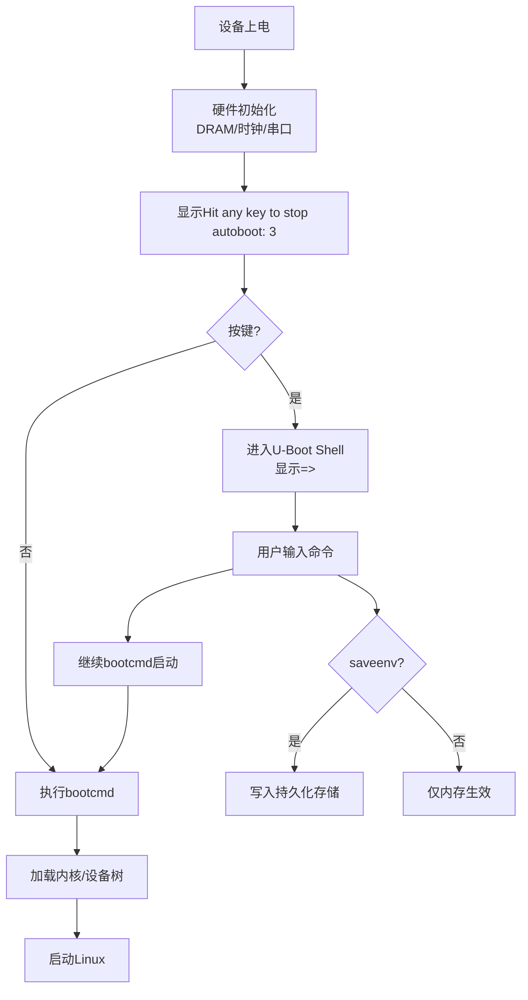

# 3.4.1 进入命令行与基本交互

> 所属章节：第3章 嵌入式Bootloader详解 > 3.4 U-Boot命令行使用入门
> 难度：[B→I] | 预计阅读时间：15分钟

## 本节导读

本节将带领读者进入U-Boot的命令行世界。你将学会如何打断自动启动、使用基本命令、获取帮助、操作环境变量——这些是调试和配置嵌入式设备的基础技能。学完本节，你可以像使用Linux终端一样在U-Boot提示符下游刃有余。

## 知识点1：进入U-Boot Shell [B] ~600字

当嵌入式设备上电后，U-Boot会执行一系列初始化操作，然后尝试自动加载并启动操作系统。但开发调试阶段，我们常常需要暂停这个过程，手动输入命令来排查问题或调整配置。

### 什么是Autoboot

U-Boot启动的最后一步是**autoboot（自动启动）**。它会按照环境变量中定义的规则，从存储介质（如eMMC、SD卡、网络）加载内核镜像和设备树，然后跳转执行。autoboot大大简化了量产设备的启动流程——上电即开机，无需人工干预。

但对开发者来说，我们恰恰需要"打断"这个自动流程。

### 如何进入命令行

U-Boot在启动过程中会在串口终端输出大量信息。当看到类似下面的提示时，迅速按下键盘上的**任意键**（空格键或回车键最方便）：

```
Hit any key to stop autoboot:  3
```

上面的数字是倒计时，默认通常为3秒或1秒。在倒计时结束前按下任意键，autoboot就会被中断，U-Boot停止自动启动，转而显示命令提示符：

```
=> 
```

这个简洁的`=>`就是U-Boot的命令行提示符（prompt），表示U-Boot已经准备好接受你的指令。

### 操作步骤

1. **连接串口**：确保USB转串口线已连接PC和目标板的调试串口
2. **打开串口工具**：如minicom、picocom、PuTTY或MobaXterm，波特率通常为115200
3. **给设备上电或按复位键**
4. **紧盯屏幕**：在出现`Hit any key to stop autoboot`时立即按键 [图1：串口终端按键时机示意图]
5. **看到`=>`**：成功进入U-Boot Shell

```bash
# 串口工具打开示例（Linux）
$ sudo picocom -b 115200 /dev/ttyUSB0

# 屏幕中看到的典型输出
U-Boot 2022.10 (Oct 15 2023 - 08:32:11 +0800)

Model: MyBoard Development Kit
DRAM:  2 GiB
MMC:   mmc@ff160000: 1, mmc@ff170000: 0
Loading Environment from MMC... OK
Hit any key to stop autoboot:  0
=> 
```

### 常见错误

⚠️ **按晚了**：倒计时结束才按键，U-Boot已经去加载内核了。解决办法：给设备断电重启，或者按下复位键重来。

⚠️ **按键无响应**：检查串口线是否接反（TX/RX交叉连接），确认波特率设置正确，尝试更换USB转串口模块。

💡 **提示**：如果你每次都很难赶上那3秒倒计时，可以通过修改环境变量`bootdelay`来延长等待时间（见本节知识点3）。

## 知识点2：命令格式与帮助 [B] ~800字

U-Boot的命令行是一个精简但功能完备的交互环境。它与Linux Shell在风格上很相似，但也有自己的特色。

### 命令的基本格式

U-Boot命令遵循简单的格式：

```
=> 命令 [参数1] [参数2] ...
```

与Linux不同，U-Boot命令**不需要输入完整的程序路径**，每个命令都是U-Boot内置实现的。命令和参数之间用**空格**分隔。参数的数量和含义因命令而异。

```bash
# 示例：查看内存内容
=> md.b 0x80000000 0x40    # 从地址0x80000000开始，显示64字节的十六进制值
#     │    │         │
#     │    │         └── 显示长度（十六进制，0x40 = 64）
#     │    └──────────── 内存起始地址
#     └───────────────── 命令：memory display（按byte显示）
```

### help命令：你的随身手册

U-Boot内置了`help`命令（可简写为`?`），是学习和查询命令的最佳途径：

```bash
# 列出所有可用命令
=> help

# 查看某个命令的详细用法
=> help md
=> ? md

# 屏幕输出示例
=> help md
md - memory display
Usage:
md [.b, .w, .l] address [# of objects]
    - memory display
```

`md`命令后面跟的`.b`、`.w`、`.l`是显示格式的后缀：`.b`表示按字节（byte）显示，`.w`表示按半字（2字节），`.l`表示按字（4字节）。如果不加后缀，U-Boot会使用默认格式（通常是`.l`）。

### Tab自动补全

💡 **提示**：U-Boot支持**Tab键自动补全**，这能显著减少输入量和拼写错误。

```bash
# 输入命令的前几个字母，按Tab
=> pri[TAB键]          # 自动补全为 printenv

# 如果有多个匹配，按两次Tab列出所有可能
=> bo[TAB][TAB]
boot    bootd   bootefi  bootelf  booti   bootm   bootp   bootvx
```

### 历史命令（上下箭头）

U-Boot会缓存你输入过的命令，通过键盘的**上下箭头**（↑ ↓）可以快速翻阅历史记录。当你需要反复执行相似命令（比如多次尝试不同的启动参数）时，这个功能非常实用。

```bash
# 按上箭头调出上一条命令
# 按下箭头往后翻
# 然后可以用左右箭头移动光标编辑
```

### 常用控制键速查

| 按键 | 功能 |
|------|------|
| `↑` / `↓` | 浏览历史命令 |
| `←` / `→` | 移动光标 |
| `Tab` | 自动补全命令/参数 |
| `Ctrl+C` | 取消当前输入行 |
| `Backspace` | 删除前一个字符 |
| `Enter` | 执行命令 |

### 命令执行中的中断

🔴 **危险**：有些命令（如大规模内存擦除、网络传输）执行时间较长。如果你发现命令执行错误或不想等了，可以按`Ctrl+C`尝试中断。但不是所有命令都支持中断，特别是底层Flash操作一旦开始可能无法停止。

⚠️ **陷阱**：U-Boot命令对参数格式要求严格。例如`md.b 80000000`会被解析为**十进制**地址80000000，而不是十六进制的`0x80000000`。写地址时**务必带上`0x`前缀**，避免解析错误。

## 知识点3：环境变量操作 [B] ~600字

环境变量（Environment Variables）是U-Boot中一种持久化的键值对配置机制。它们决定了U-Boot如何初始化硬件、从哪里加载内核、传递哪些启动参数给Linux。可以把环境变量理解为U-Boot的"配置文件"。

### 查看环境变量：printenv

```bash
# 显示所有环境变量
=> printenv

# 显示指定的环境变量
=> printenv bootdelay
=> printenv bootcmd
```

执行`printenv`后，你会看到一长串输出，每行格式为`变量名=值`。例如：

```bash
=> printenv bootdelay
bootdelay=3
```

### 设置环境变量：setenv

`setenv`用于创建新的环境变量或修改已有变量：

```bash
# 设置变量（立即生效，但尚未保存）
=> setenv bootdelay 5

# 设置包含空格的变量值（不需要引号，空格后的内容都算值）
=> setenv bootargs console=ttyS0,115200 root=/dev/mmcblk0p2 rw

# 删除变量（不赋值即可删除）
=> setenv myvar
```

⚠️ **陷阱**：`setenv`修改后的变量**只存在于内存中**。如果此时断电或复位，修改会丢失。必须通过`saveenv`写入持久化存储。

### 保存环境变量：saveenv

```bash
# 将当前内存中的环境变量保存到存储介质
=> saveenv
Saving Environment to MMC... Writing to MMC(1)... OK
```

U-Boot会将环境变量写入预先划分好的存储区域（通常是Flash或eMMC的特定偏移位置）。`saveenv`执行成功后，下次启动这些修改仍然有效。

### 常见环境变量速查表

| 变量名 | 作用 | 典型值 |
|--------|------|--------|
| `bootdelay` | autoboot倒计时秒数 | `3`或`5` |
| `bootcmd` | 自动启动时执行的命令序列 | `run distro_bootcmd` |
| `bootargs` | 传递给Linux内核的启动参数 | `console=ttyS0,115200 root=/dev/mmcblk0p2` |
| `fdtfile` | 设备树文件名 | `myboard.dtb` |
| `kernel_addr_r` | 内核加载到内存的目标地址 | `0x80000000` |
| `fdt_addr_r` | 设备树加载到内存的目标地址 | `0x81000000` |
| `ipaddr` | 本机IP地址（网络启动时用） | `192.168.1.100` |
| `serverip` | TFTP服务器IP地址 | `192.168.1.1` |
| `ethaddr` | 以太网MAC地址 | `00:11:22:33:44:55` |

💡 **提示**：`bootcmd`是autoboot阶段自动执行的命令，如果你把`bootcmd`设为空，U-Boot启动后就会直接进入命令行，不再尝试自动启动系统——这在调试时非常有用。

```bash
# 暂停autoboot的终极方法
=> setenv bootcmd
=> saveenv
```

🔴 **危险**：不要随意修改`ethaddr`（MAC地址）。MAC地址应该是全球唯一的，随意设置可能导致网络冲突。通常MAC地址由硬件写入，U-Boot从中读取。

## 本节总结

| 概念 | 要点 | 操作 |
|------|------|------|
| 进入Shell | 启动时按任意键打断autoboot | 观察`Hit any key`提示，及时按键 |
| 提示符 | `=>`表示U-Boot就绪 | 在提示符后输入命令 |
| 帮助查询 | `help`或`?`查看命令用法 | `help 命令名`查看详细说明 |
| 自动补全 | Tab键补全命令 | 减少输入量和拼写错误 |
| 历史命令 | 上下箭头翻阅 | 快速重复或修改命令 |
| 查看变量 | `printenv` | `printenv [变量名]` |
| 设置变量 | `setenv` | `setenv 变量名 值` |
| 保存变量 | `saveenv` | 修改后必须saveenv才能持久化 |

## 下一步

你已经学会了如何在U-Boot中"站稳脚跟"——进入命令行、使用帮助、操作环境变量。下一节（3.4.2）我们将学习**内存操作与烧录命令**，掌握如何查看内存、下载文件到RAM、以及将镜像烧录到Flash存储器。

---

## 配套资源

### 表格清单
- 表1：常用控制键速查表
- 表2：常见U-Boot环境变量速查表

### 图示清单
- [图1：U-Boot交互流程图] [mermaid图]



- [图2：串口终端按键时机示意图] [配图说明：一张示意图，显示串口输出的文字流，在"Hit any key to stop autoboot: 3"这一行用红色高亮标注，并用箭头指示"在这里按空格键"]

### 代码清单
- 代码1：进入U-Boot Shell的串口操作示例
- 代码2：help命令使用示例
- 代码3：Tab自动补全示例
- 代码4：环境变量查看、设置、保存完整示例
