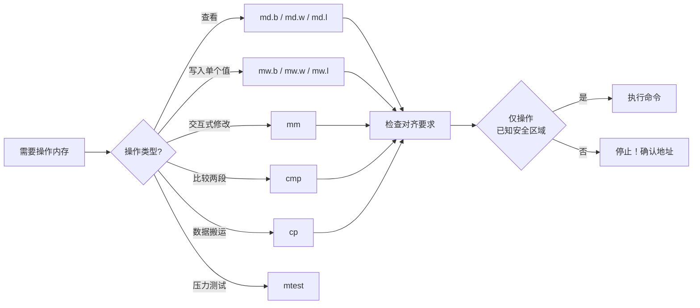

# 3.4.2 内存操作命令

> 所属章节：第3章 U-Boot命令行 > 3.4 内存与存储操作
> 难度：[B] | 预计阅读时间：25分钟

## 本节导读
本节介绍U-Boot下直接操作内存的核心命令。学完本节，你将能够在不借助外部工具的情况下，查看、修改、比较、拷贝和测试内存内容——这是调试硬件、验证数据、修补运行时状态的基础技能。

---

## 知识点1：md / mw —— 内存查看与修改 [B] [M] ~800字

嵌入式调试中，最常见的需求就是"看看某个地址存了什么"和"往某个地址写点什么"。U-Boot提供了简洁的内存查看命令 `md`（memory display）和内存写入命令 `mw`（memory write）。

### 1.1 用 md 查看内存

`md` 命令的完整格式为：

```
md[.b/.w/.l] address [count]
```

- **`.b`**：按字节（8位）显示，每个地址对应1个字节
- **`.w`**：按半字（16位）显示，每个地址对应2个字节
- **`.l`**：按字（32位）显示，每个地址对应4个字节
- **`address`**：要查看的起始地址（十六进制，可加 `0x` 前缀，也可不加）
- **`count`**：查看多少个单元（可选，默认16个）

#### 操作步骤

1. 启动开发板，进入U-Boot命令行
2. 查看某段内存的内容：

```bash
=> md.l 0x80000000 4
80000000: 12345678 deadbeef 00000000 11223344    .Vx......3D!
```

输出中，左侧是起始地址，中间是用 `.l` 格式解析出的4个32位数据，右侧是对应的ASCII字符（不可打印字符显示为 `.`）。

3. 用不同宽度查看同一地址，观察区别：

```bash
=> md.b 0x80000000 16       # 按字节显示16个字节
=> md.w 0x80000000 8        # 按半字显示8个半字
=> md.l 0x80000000 4        # 按字显示4个字
```

[图1：同一内存地址用 md.b / md.w / md.l 三种格式显示的对比效果]

三种格式的本质区别仅在于**数据解析宽度**。`md.l` 把4个连续字节拼成一个32位数显示；`md.b` 则逐个显示，最直观，常用于查看ASCII字符串或原始字节流。

### 1.2 用 mw 写入内存

`mw` 命令用于向指定地址写入数据：

```
mw[.b/.w/.l] address value [count]
```

- `value`：要写入的数据
- `count`：连续写入多少个单元（默认为1）

#### 操作步骤

1. 向单个地址写入一个32位值：

```bash
=> mw.l 0x80000000 0x12345678
```

2. 向连续地址批量写入相同值（常用于初始化一段内存）：

```bash
=> mw.l 0x80000000 0x0 64    # 从0x80000000开始，写64个32位0，共256字节
```

3. 写入后立即用 `md` 验证：

```bash
=> md.l 0x80000000 4
80000000: 00000000 00000000 00000000 00000000    ................
```

### 1.3 地址对齐要求

💡 **提示**：使用 `md.w` 或 `mw.w` 时，地址必须是2的倍数（偶数地址）；使用 `md.l` 或 `mw.l` 时，地址必须是4的倍数。不对齐的地址可能导致总线错误（Data Abort）或读取到错误数据。

```bash
=> md.l 0x80000001 1        # 错误！地址未4字节对齐
=> md.b 0x80000001 4        # 正确！字节访问不要求对齐
```

⚠️ **陷阱：地址前缀的0x可省略**
`md 80000000` 和 `md 0x80000000` 是等价的，但建议始终加上 `0x` 前缀，避免与十进制数混淆。

🔴 **危险：写错地址会立刻崩溃**
`mw` 命令没有任何保护机制。如果你向一个存放U-Boot自身代码或全局变量的地址写入数据，U-Boot可能立刻死机、命令错乱，甚至无法继续启动Linux。只向你**确认知道用途**的地址写入。

---

## 知识点2：mm / cmp / cp —— 循环修改、比较与拷贝 [B] ~600字

当需要反复修改同一个地址的值、比较两段内存是否相同、或将一段数据搬运到另一段时，`md` 和 `mw` 就显得笨拙了。U-Boot为此提供了 `mm`、`cmp`、`cp` 三个命令。

### 2.1 mm —— 循环修改内存（memory modify）

`mm` 是交互式命令。执行后，它会显示当前地址的旧值，等待你输入新值；输入后自动跳到下一个地址，直到你输入回车（空值）退出。

#### 操作步骤

```bash
=> mm.l 0x80000000
80000000: 00000000 ? 12345678          # 输入新值，回车
80000004: deadbeef ? aabbccdd          # 继续修改下一个地址
80000008: 00000000 ?                  # 直接回车，退出
=> 
```

💡 **提示**：`mm` 特别适合逐个修改寄存器字段。比如某个32位控制寄存器中有多个位域，你可以先用 `md.l` 读出当前值，计算好要修改的位，再用 `mm.l` 精确写入。

⚠️ **陷阱：mm不会自动停止**
如果你不停输入数据，`mm` 会一直往后修改。很容易不小心覆盖掉后面的重要数据。养成习惯：写入完成后，**立刻按回车退出**。

### 2.2 cmp —— 内存比较（compare）

`cmp` 用于比较两段内存区域的内容是否相同。

```
cmp[.b/.w/.l] addr1 addr2 count
```

#### 操作步骤

1. 先准备两段内容相同的内存：

```bash
=> mw.l 0x80000000 0xA5A5A5A5 8       # 第一段写8个相同值
=> cp.l 0x80000000 0x80010000 8       # 拷贝到第二段（见下文cp命令）
```

2. 比较两段内存：

```bash
=> cmp.l 0x80000000 0x80010000 8
Total of 8 word(s) were the same
```

3. 故意制造差异再比较：

```bash
=> mw.l 0x80000010 0x11111111         # 修改第一段中的一个值
=> cmp.l 0x80000000 0x80010000 8
word at 0x80000010 (0x11111111) != word at 0x80010010 (0xa5a5a5a5)
Total of 7 word(s) were the same
```

`cmp` 会精确定位到第一个不匹配的字（word/byte），这对于验证数据拷贝是否正确、排查内存损坏非常有用。

### 2.3 cp —— 内存拷贝（copy）

`cp` 用于在内存之间搬运数据，相当于最底层的 `memcpy`。

```
cp[.b/.w/.l] source dest count
```

#### 操作步骤

```bash
=> md.l 0x80000000 4                  # 先查看源数据
=> cp.l 0x80000000 0x80010000 4       # 拷贝4个字到目标地址
=> md.l 0x80010000 4                  # 验证目标地址
```

💡 **提示**：`cp` 拷贝的是数据内容，不是地址映射关系。如果你拷贝的是外设寄存器区域的内容，拷贝出来的只是当时的寄存器值快照，后续外设寄存器变化不会影响已拷贝的数据。

⚠️ **陷阱：源和目标区域重叠时行为未定义**
`cp` 不像标准C库的 `memmove` 那样能处理重叠区域。如果源地址和目标地址有重叠，结果不可预期。确保两段区域不重叠，或者使用安全的搬运顺序（从尾部开始拷贝）。

---

## 知识点3：mtest —— 内存压力测试 [B] ~400字

新板子bring-up阶段，最常见的硬件问题就是内存不稳定——可能是颗粒质量问题、PCB布线问题、或者DDR控制器参数配置不当。`mtest` 命令提供了一个简单的内存读写压力测试，用来快速验证内存是否可靠。

### 3.1 mtest 命令用法

```
mtest [start [end [pattern]]]
```

- `start`：测试起始地址（默认从 `CONFIG_SYS_MEMTEST_START` 开始）
- `end`：测试结束地址（默认到 `CONFIG_SYS_MEMTEST_END`）
- `pattern`：写入的测试模式值（默认是变化的内部算法）

### 3.2 操作步骤

1. 对一整段内存执行压力测试：

```bash
=> mtest 0x80000000 0x90000000
Testing 0x0000000080000000 ... 0x0000000090000000
Pattern 00000000  Writing...  Reading...  OK
Pattern FFFFFFFF  Writing...  Reading...  OK
Pattern 00000000  Writing...  Reading...  OK
Pattern A5A5A5A5  Writing...  Reading...  OK
Pattern 5A5A5A5A  Writing...  Reading...  OK
...（循环执行，按Ctrl+C终止）
```

2. 用指定模式测试：

```bash
=> mtest 0x80000000 0x88000000 0xDEADBEEF
```

### 3.3 测试原理与结果解读

`mtest` 的核心逻辑非常简单：向内存写入一个模式值，再读回来比较。它会轮流使用多种模式（全0、全1、棋盘格 `A5A5A5A5`、反棋盘格 `5A5A5A5A` 等），增加覆盖度。

如果读到的不等于写入的，会立刻报错：

```
Failure at address 0x84000000: expected 0xA5A5A5A5, actual 0xA5A5A55A
```

这说明地址 `0x84000000` 处存在位翻转（bit flip），可能是硬件问题。

🔴 **危险：mtest会覆盖所测试内存区域的所有内容**
运行 `mtest` 前，确保该区域内没有U-Boot代码、环境变量、或即将加载的Linux内核/设备树。否则这些数据会被无情覆盖，导致系统无法启动。

💡 **提示**：`mtest` 只是基础测试，无法替代专业的DDR压力测试工具（如memtest86+、stressapptest）。但它足够快速，是硬件 bring-up 阶段排查内存问题的第一道防线。

---

## 本节总结

| 命令 | 功能 | 典型用法 | 对齐要求 |
|------|------|----------|----------|
| `md.b` | 按字节查看内存 | `md.b 0x80000000 16` | 无 |
| `md.w` | 按半字查看内存 | `md.w 0x80000000 8` | 2字节对齐 |
| `md.l` | 按字查看内存 | `md.l 0x80000000 4` | 4字节对齐 |
| `mw.b` | 按字节写入内存 | `mw.b 0x80000000 0xAB` | 无 |
| `mw.w` | 按半字写入内存 | `mw.w 0x80000000 0xABCD` | 2字节对齐 |
| `mw.l` | 按字写入内存 | `mw.l 0x80000000 0x12345678` | 4字节对齐 |
| `mm` | 交互式循环修改 | `mm.l 0x80000000` | 与md/mw相同 |
| `cmp` | 比较两段内存 | `cmp.l 0x8000 0x9000 64` | 与md/mw相同 |
| `cp` | 拷贝内存数据 | `cp.l 0x8000 0x9000 64` | 与md/mw相同 |
| `mtest` | 内存压力测试 | `mtest 0x80000000 0x90000000` | 4字节对齐（内部） |



**本节核心要点回顾：**

1. `md` 家族用于查看内存，后缀 `.b/.w/.l` 决定数据解析宽度，选错只是显示方式不同，不会破坏数据；但 `mw` 选错宽度会导致写入数据量不同，必须谨慎。
2. `mm` 是最安全的修改方式——因为它每次只改一个地址，且显示旧值供你确认。
3. `cmp` 和 `cp` 经常配合使用：先 `cp` 搬运，再 `cmp` 验证。
4. 所有内存操作命令的共同前提是：**你必须清楚目标地址的用途**。在U-Boot下没有MMU保护，写错地址就是"一枪毙命"。

---

## 下一步

掌握了内存操作后，你已经可以手动查看和修改DDR中的任何数据了。但在实际工作中，大量数据（如内核镜像、根文件系统）不可能一个字一个字地敲进去。下一节将介绍U-Boot中用于读写存储设备（NOR Flash、NAND、eMMC、SD卡）的命令，让你能够批量加载和固化数据。

---

## 配套资源

### 表格清单
- **表1**：U-Boot内存操作命令速查表（见本节总结）

### 图示清单
- **图1**：md.b / md.w / md.l 三种格式显示同一内存地址的对比效果 [配图说明]
- **图2**：内存操作流程决策图（见本节总结的mermaid图）


### 代码清单
- **代码1**：`md.l 0x80000000 4` —— 按字查看内存示例
- **代码2**：`mw.l 0x80000000 0x0 64` —— 批量初始化内存示例
- **代码3**：`mm.l 0x80000000` —— 交互式修改内存示例
- **代码4**：`cmp.l 0x8000 0x9000 8` —— 内存比较示例
- **代码5**：`cp.l 0x8000 0x9000 4` —— 内存拷贝示例
- **代码6**：`mtest 0x80000000 0x90000000` —— 内存压力测试示例
