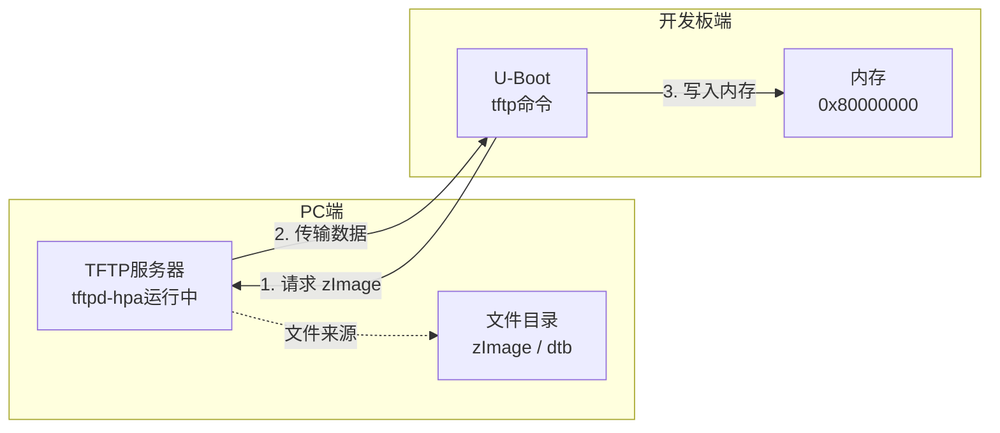

# 3.4.4 网络命令

> 所属章节：第3章 U-Boot基础 > 3.4 U-Boot常用命令
> 难度：[B→B][M] | 预计阅读时间：25分钟

## 本节导读
本节讲解U-Boot中的网络相关命令，包括IP地址配置、TFTP下载内核镜像、NFS挂载根文件系统以及DHCP自动获取IP。学完后，你将能够通过网络方式向开发板传输文件，这是嵌入式开发中最常用的调试手段。

[图1：开发板与PC通过网线连接的示意图]

## 知识点1：网络环境配置 [B] ~700字

在使用U-Boot的网络功能之前，必须先配置好网络参数。这就像你家里的电脑上网前需要设置IP地址一样，开发板也需要知道自己的"门牌号"和"邻居"是谁。

### 核心概念

U-Boot使用三个关键环境变量来定义网络身份：

- **ipaddr**：开发板自己的IP地址。这是开发板在网络中的唯一标识，就像你家的门牌号。
- **serverip**：服务器的IP地址，通常是PC的IP。开发板需要从这台机器上下载文件，所以要告诉它"找谁拿东西"。
- **netmask**：子网掩码，用于确定IP地址的网络部分和主机部分。最常见的值是 `255.255.255.0`，表示前三个数字是网络地址，最后一个是主机地址。

💡 **提示**：开发板和PC必须在同一个网段内才能通信。比如开发板IP是 `192.168.1.50`，PC是 `192.168.1.100`，它们的前三个数字相同，就可以直接通信。

### 操作步骤

1. **设置开发板IP地址**

```bash
U-Boot> setenv ipaddr 192.168.1.50
```

2. **设置服务器（PC）IP地址**

```bash
U-Boot> setenv serverip 192.168.1.100
```

3. **设置子网掩码**

```bash
U-Boot> setenv netmask 255.255.255.0
```

4. **保存环境变量到Flash**

```bash
U-Boot> saveenv
```

5. **验证网络连通性**

```bash
U-Boot> ping 192.168.1.100
```

如果看到类似下面的输出，说明网络通了：

```
host 192.168.1.100 is alive
```

如果看到 `ping failed; host 192.168.1.100 is not alive`，说明网络不通，需要排查。

⚠️ **陷阱**：`ping` 命令在U-Boot中是从开发板向PC发起请求，**但PC不能主动ping通开发板**。U-Boot的ping实现是单向的，只发送不回显，所以不要用PC的ping来测试U-Boot的网络。

### 常见错误排查

| 现象 | 可能原因 | 解决方法 |
|------|----------|----------|
| ping不通，提示not alive | 网线没插好 | 检查网线连接，观察网口灯是否闪烁 |
| ping不通 | IP不在同一网段 | 确认ipaddr和serverip前三个数字一致 |
| ping不通 | PC防火墙阻挡 | 暂时关闭PC防火墙或添加例外规则 |
| ping不通 | 使用了WiFi而非有线网卡 | 关闭WiFi，使用有线网卡并配置正确IP |

💡 **提示**：在设置网络前，先在PC上确认自己的IP地址。Linux下用 `ifconfig` 或 `ip addr`，Windows下用 `ipconfig`。

🔴 **危险**：不要用 `192.168.1.1` 作为开发板IP，这通常是路由器的默认地址，会导致IP冲突。

## 知识点2：TFTP下载 [B][M] ~800字

TFTP（Trivial File Transfer Protocol，简单文件传输协议）是嵌入式开发中最常用的文件传输方式。它极其简单——没有用户认证、没有目录列表功能，就是"你给我文件名，我给你文件内容"。对于传输内核镜像、设备树、根文件系统这类场景，TFTP简单高效，是首选工具。

### 工作流程

TFTP下载涉及三方角色：开发板（U-Boot作为客户端）、PC（运行TFTP服务器）、网线。流程如下：



[图2：TFTP下载流程示意图——PC端运行TFTP服务器，U-Boot通过tftp命令请求文件并写入内存]

### PC端TFTP服务器配置

在下载前，必须先在PC上启动TFTP服务。以Ubuntu为例：

```bash
# 1. 安装TFTP服务
$ sudo apt-get install tftpd-hpa tftp-hpa

# 2. 创建TFTP根目录
$ sudo mkdir -p /srv/tftp
$ sudo chmod 777 /srv/tftp

# 3. 放置要下载的文件
$ sudo cp zImage /srv/tftp/
$ sudo cp imx6ull-14x14-evk.dtb /srv/tftp/

# 4. 修改TFTP配置，指定根目录
$ sudo vim /etc/default/tftpd-hpa
```

配置文件中确保包含这一行：
```bash
TFTP_DIRECTORY="/srv/tftp"
TFTP_OPTIONS="--secure --create"
```

```bash
# 5. 重启TFTP服务
$ sudo systemctl restart tftpd-hpa

# 6. 确认服务运行
$ sudo systemctl status tftpd-hpa
```

### U-Boot端下载命令

TFTP下载的核心命令格式是：

```bash
tftp <内存地址> <文件名>
```

**下载内核镜像和设备树的完整序列**：

```bash
# 1. 下载内核镜像到内存0x80000000
U-Boot> tftp 0x80000000 zImage

# 期望输出：
# Using FEC1 device
# TFTP from server 192.168.1.100; our IP address is 192.168.1.50
# Filename 'zImage'.
# Load address: 0x80000000
# Loading: #########################
# done
# Bytes transferred = 6789012 (678654 hex)

# 2. 下载设备树到内存0x83000000
U-Boot> tftp 0x83000000 imx6ull-14x14-evk.dtb

# 3. 启动内核
U-Boot> bootz 0x80000000 - 0x83000000
```

💡 **提示**：内存地址 `0x80000000` 和 `0x83000000` 不是随意选的，而是根据你的芯片内存布局决定的。这些地址通常在芯片手册或开发板文档中有明确说明。如果写错地址，可能覆盖掉U-Boot自身或重要数据，导致死机。

⚠️ **陷阱**：TFTP传输大文件时，如果看到 `T` 字符不断出现，说明网络丢包严重。可以尝试：1）更换网线；2）将PC和开发板直连而不是经过路由器；3）检查子网掩码设置是否正确。

🔴 **危险**：每次执行 `tftp` 前，确认目标内存地址没有被U-Boot自身占用。向 `0x87800000` 附近写入数据可能破坏U-Boot运行环境。

## 知识点3：NFS挂载 [B] ~600字

NFS（Network File System，网络文件系统）允许开发板通过网络直接访问PC上的目录，就像访问本地磁盘一样。这在开发调试阶段非常有用——你不需要每次修改文件后都重新打包根文件系统并烧录，直接在PC上修改，开发板立刻就能看到变化。

### 核心原理

NFS的工作原理是把PC上的一个目录"共享"出来，开发板通过网络协议挂载这个共享目录到自己的文件系统中。对开发板上的程序来说，这个目录和本地目录没有任何区别。

### PC端NFS服务器配置

在U-Boot中使用NFS之前，先配置PC端的NFS服务：

```bash
# 1. 安装NFS服务
$ sudo apt-get install nfs-kernel-server

# 2. 创建要共享的根文件系统目录
$ sudo mkdir -p /home/user/rootfs
$ sudo tar -xvf rootfs.tar.gz -C /home/user/rootfs/

# 3. 编辑NFS导出配置文件
$ sudo vim /etc/exports
```

在文件末尾添加一行：

```bash
/home/user/rootfs *(rw,sync,no_root_squash,no_subtree_check)
```

参数含义：
- `*`：允许任何IP访问（开发阶段方便，生产环境请指定具体IP）
- `rw`：读写权限
- `sync`：同步写入，保证数据一致性
- `no_root_squash`：允许root用户保持root权限
- `no_subtree_check`：禁用子树检查，提高性能

```bash
# 4. 重启NFS服务使配置生效
$ sudo exportfs -ra
$ sudo systemctl restart nfs-kernel-server
```

### U-Boot端NFS命令

U-Boot中的 `nfs` 命令可以直接从NFS服务器下载文件到内存：

```bash
# 格式：nfs <内存地址> <服务器IP>:<文件路径>
U-Boot> nfs 0x80000000 192.168.1.100:/home/user/rootfs/boot/zImage
```

这个命令会从NFS服务器下载 `zImage` 到内存地址 `0x80000000`。

💡 **提示**：NFS在U-Boot阶段主要用于下载较大的文件或根文件系统。对于启动Linux后的日常使用，是在Linux内核启动后通过 `/etc/fstab` 或手动 `mount` 命令挂载NFS作为根文件系统。

Linux内核启动时挂载NFS根文件系统的命令示例（在U-Boot中设置bootargs）：

```bash
U-Boot> setenv bootargs 'console=ttymxc0,115200 root=/dev/nfs nfsroot=192.168.1.100:/home/user/rootfs,proto=tcp rw ip=192.168.1.50:192.168.1.100:192.168.1.1:255.255.255.0::eth0:off'
U-Boot> saveenv
```

⚠️ **陷阱**：NFS有多个版本（v2/v3/v4），U-Boot默认使用NFSv2/v3。如果PC端只开启了NFSv4，U-Boot将无法连接。确保 `/etc/default/nfs-kernel-server` 中启用了兼容版本：

```bash
RPCNFSDOPTS="--nfs-version 2,3,4 --debug --syslog"
```

🔴 **危险**：NFS共享目录使用 `no_root_squash` 时，开发板上的root用户对共享目录拥有完全的root权限。**永远不要**在生产环境中对不可信网络暴露这样的NFS共享。

## 知识点4：DHCP自动获取 [B] ~400字

每次手动配置IP地址既麻烦又容易出错。如果你的网络中有DHCP服务器（大多数路由器都内置了这个功能），可以让开发板自动获取IP地址，省时省力。

### DHCP工作原理

DHCP（Dynamic Host Configuration Protocol，动态主机配置协议）的本质是"租房子"：开发板开机时向网络广播"我要上网"，DHCP服务器回应"给你这个IP，租期24小时"。开发板拿到IP后就能正常通信，租期过半还会自动续约。

### U-Boot中使用DHCP

U-Boot的 `dhcp` 命令会执行完整的DHCP流程，自动配置 `ipaddr`、`netmask`、`gatewayip` 等环境变量：

```bash
# 自动获取IP地址
U-Boot> dhcp
```

成功后的典型输出：

```
BOOTP broadcast 1
DHCP client bound to address 192.168.1.105
```

执行 `dhcp` 后，U-Boot会自动从DHCP服务器获取：
- IP地址（写入 `ipaddr`）
- 子网掩码（写入 `netmask`）
- 网关地址（写入 `gatewayip`）
- DNS服务器（写入 `dnsip`，如果有的话）

获取完成后，可以直接使用网络命令：

```bash
# 确认自动获取到的IP
U-Boot> printenv ipaddr
ipaddr=192.168.1.105

# 使用自动获取的配置进行TFTP下载
U-Boot> tftp 0x80000000 zImage
```

⚠️ **陷阱**：使用 `dhcp` 自动获取IP后，`serverip` **不会**自动设置！你仍然需要手动配置 `serverip` 指向你的PC：

```bash
U-Boot> setenv serverip 192.168.1.100
U-Boot> saveenv
```

💡 **提示**：如果你的开发板直连PC（不经过路由器），PC需要运行DHCP服务，或者手动配置静态IP。没有DHCP服务器时，`dhcp` 命令会超时失败。此时请回到知识点1，使用手动配置IP的方式。

### dhcp与bootp的关系

U-Boot的 `dhcp` 命令实际上兼容BOOTP协议。BOOTP是DHCP的前身，功能类似但没有租约机制。在嵌入式环境中，很多工具把这两个术语混用，看到 `BOOTP broadcast` 的提示时不必惊讶，这说明DHCP流程正在进行。

## 本节总结

本节介绍了U-Boot中四类核心网络命令，涵盖了从手动配置到自动获取、从简单下载到文件系统挂载的完整网络操作能力。

| 命令 | 用途 | 典型用法 | 注意事项 |
|------|------|----------|----------|
| `setenv ipaddr` | 设置本机IP | `setenv ipaddr 192.168.1.50` | 与serverip同网段 |
| `setenv serverip` | 设置服务器IP | `setenv serverip 192.168.1.100` | 指向运行TFTP/NFS的PC |
| `setenv netmask` | 设置子网掩码 | `setenv netmask 255.255.255.0` | 通常用255.255.255.0 |
| `saveenv` | 保存环境变量 | `saveenv` | 不保存重启后丢失 |
| `ping` | 测试网络连通 | `ping 192.168.1.100` | U-Boot单向ping，PC无法ping通U-Boot |
| `tftp` | 下载文件到内存 | `tftp 0x80000000 zImage` | 确认内存地址安全 |
| `nfs` | 从NFS服务器读取 | `nfs 0x80000000 IP:/path/file` | PC需配置NFS服务 |
| `dhcp` | 自动获取IP | `dhcp` | 不自动设置serverip |

[图3：U-Boot网络命令全景图——展示了从IP配置到文件传输的完整工作流]

## 下一步
掌握了网络命令后，你已经具备了通过网络向开发板传输内核镜像和设备树的能力。下一节 `3.4.5 启动命令` 将教你如何把下载到内存中的内核真正启动起来，并传入正确的启动参数。届时，你将完成从"下载"到"启动"的完整闭环。

---

## 配套资源

### 表格清单
- 表1：网络环境配置常见错误排查表（知识点1中）
- 表2：U-Boot网络命令速查表（本节总结中）

### 图示清单
- 图1：开发板与PC通过网线连接的示意图 [配图说明]
- 图2：TFTP下载流程示意图 [mermaid流程图]
- 图3：U-Boot网络命令全景图 [配图说明]

### 代码清单
- 代码1：U-Boot网络环境变量配置命令（知识点1）
- 代码2：PC端TFTP服务器安装与配置命令（知识点2）
- 代码3：U-Boot TFTP下载完整命令序列（知识点2）
- 代码4：PC端NFS服务器配置命令（知识点3）
- 代码5：U-Boot NFS下载命令及bootargs配置（知识点3）
- 代码6：U-Boot DHCP自动获取IP命令（知识点4）
