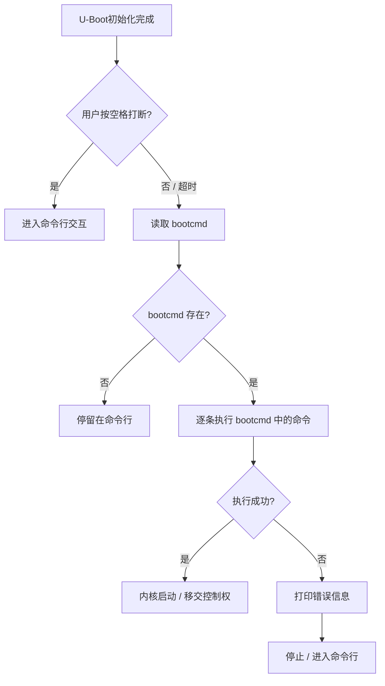

# 3.4.5 启动相关命令

> 所属章节：第3章 U-Boot命令详解 > 3.4 程序加载与启动命令
> 难度：[B→I] | 预计阅读时间：20分钟

## 本节导读

本节介绍U-Boot中最核心的三个启动命令——`boot`、`bootm`、`bootz`，以及控制自动启动行为的`bootcmd`环境变量和向内核传递参数的`bootargs`。学完本节，你将能够手动从U-Boot引导Linux内核启动，并理解开发板"上电自动进系统"的背后原理。

---

## 知识点1：boot、bootm 与 bootz 命令 [B] ~800字

U-Boot的最终使命是把Linux内核加载到内存并启动它。根据内核镜像的封装格式不同，U-Boot提供了三条专门的启动命令。

### 三种内核镜像格式

在讲命令之前，先理清常见的三种内核镜像：

| 镜像类型 | 文件特征 | 适用命令 |
|---------|---------|---------|
| **uImage** | 由 `mkimage` 工具封装，带64字节头部，含加载地址、入口地址、校验和 | `bootm` |
| **zImage** | 压缩的Image，自解压运行，无U-Boot专用头部 | `bootz` |
| **Image / zImage（FIT格式）** | Flattened Image Tree，设备树与内核打包在一起 | `bootm` |

💡 **提示**：`uImage` 名称来源于 "universal image"，是U-Boot发明的一种镜像封装格式。现代开发板越来越倾向于直接用 `zImage` + 设备树（dtb）的方式启动。

### boot —— 全自动启动 [B]

`boot` 命令本身并不直接加载内核，它只是**执行 `bootcmd` 环境变量中定义的命令序列**。换句话说，`boot` 是U-Boot的"一键启动"按钮：

```bash
U-Boot> boot
```

执行后，U-Boot会顺序执行 `bootcmd` 里的所有命令。如果 `bootcmd` 配置正确，你什么也不用做，开发板就自己跑起来了。

### bootm —— 启动 uImage [B]

`bootm` 专门用于启动带U-Boot头部的镜像（如uImage、FIT镜像）。命令格式为：

```bash
# 基本用法：启动内存中的uImage
U-Boot> bootm ${loadaddr}

# 带设备树启动（传递dtb地址）
U-Boot> bootm ${loadaddr} - ${dtb_addr}

# 实际示例
U-Boot> fatload mmc 0:1 0x80800000 uImage
U-Boot> fatload mmc 0:1 0x83000000 am335x-boneblack.dtb
U-Boot> bootm 0x80800000 - 0x83000000
```

`bootm` 的工作流程：

1. 解析镜像头部的64字节元数据，确认镜像类型、加载地址、入口地址
2. 将镜像搬运（或原地校验）到正确的内存地址
3. 如果带设备树，把dtb地址传递给内核
4. 设置好寄存器，跳转到内核入口点

### bootz —— 启动 zImage [B]

`bootz` 用于启动没有经过 `mkimage` 封装的原始压缩内核（zImage）。ARM架构的Linux内核通常以zImage形式发布，所以这个命令在实际开发中非常常用。

```bash
# 从TFTP加载zImage并启动
U-Boot> tftp 0x82000000 zImage
U-Boot> tftp 0x83000000 am335x-boneblack.dtb
U-Boot> bootz 0x82000000 - 0x83000000
```

注意 `bootz` 的第二个参数是**initrd地址**，没有initrd时用 `-` 占位。第三个参数是设备树地址。

⚠️ **陷阱1：镜像格式与命令不匹配**

用 `bootm` 去启动zImage，或者用 `bootz` 去启动uImage，U-Boot都会报错，常见提示如下：

```
Wrong Image Format for bootm command      # bootm遇到了非uImage
Bad Linux ARM zImage magic!              # bootz遇到了非zImage
```

**诊断方法**：用 `iminfo` 命令查看内存中镜像的头部信息：

```bash
U-Boot> iminfo 0x80800000
## Checking Image at 80800000 ...
   Image Name:   Linux-5.10.0
   Image Type:   ARM Linux Kernel Image (uncompressed)
   Data Size:    6789012 Bytes = 6.5 MiB
   Load Address: 80008000
   Entry Point:  80008000
```

如果能看到类似 `Image Name`、`Image Type` 等头部信息，说明这是uImage，该用 `bootm`。

💡 **提示**：现代U-Boot（2017年后）支持 `booti` 命令用于启动ARM64的Image镜像，ARM32则主要用 `bootz`。

---

## 知识点2：bootcmd 环境变量 [B] ~700字

开发板上电后，U-Boot启动完成，倒数几秒（默认3秒），如果用户没有按空格键打断，就会自动执行 `bootcmd`。这就是"自动进系统"的秘密。

### bootcmd 的本质

`bootcmd` 是一个**普通的U-Boot环境变量**，只不过名字特殊——U-Boot在启动最后阶段会检查它，如果存在就自动执行。

你可以把它理解为U-Boot的"批处理脚本"，里面可以写多条命令，用分号 `;` 分隔：

```bash
# 查看当前的 bootcmd
U-Boot> printenv bootcmd
bootcmd=mmc dev 0; fatload mmc 0:1 0x80800000 uImage; bootm 0x80800000
```

### 设置 bootcmd

使用 `setenv` 定义，`saveenv` 写入存储器（掉电不丢失）：

```bash
# 设置一个典型的 TFTP+NFS 开发环境 bootcmd
U-Boot> setenv bootcmd 'tftp 0x82000000 zImage; tftp 0x83000000 am335x-boneblack.dtb; bootz 0x82000000 - 0x83000000'
U-Boot> saveenv
Saving Environment to MMC...
Writing to MMC(0)... done
```

⚠️ **陷阱2：忘记 saveenv**

很多初学者用 `setenv` 改完 `bootcmd` 后直接复位板子，结果改动全丢了。记住：**`setenv` 只改内存中的环境变量副本，必须用 `saveenv` 才会写回MMC/Flash/NVRAM**。

### 典型 bootcmd 示例解析

下面是一个嵌入式开发中常见的完整 `bootcmd`，我们从MMC加载内核和设备树：

```bash
U-Boot> setenv bootcmd 'mmc dev 0; fatload mmc 0:1 0x80800000 uImage; fatload mmc 0:1 0x83000000 am335x-boneblack.dtb; bootm 0x80800000 - 0x83000000'
```

逐条拆解：

| 命令片段 | 作用 |
|---------|------|
| `mmc dev 0` | 选中第0个MMC设备（通常是SD卡或eMMC） |
| `fatload mmc 0:1 0x80800000 uImage` | 从MMC0的第1分区（FAT格式）加载uImage到内存0x80800000 |
| `fatload mmc 0:1 0x83000000 ...dtb` | 加载设备树到内存0x83000000 |
| `bootm 0x80800000 - 0x83000000` | 启动内核，无initrd，dtb在0x83000000 |

### bootcmd 执行流程



🔴 **危险**：如果 `bootcmd` 写错了（比如地址不对、文件不存在），自动启动会失败，可能连命令行都来不及进。调试时建议**先把 `bootdelay` 设大**（如10秒），给自己留出打断时间：

```bash
U-Boot> setenv bootdelay 10
U-Boot> saveenv
```

💡 **提示**：调试阶段也可以临时清空 `bootcmd` 来禁用自动启动，然后手动一条一条执行启动命令：

```bash
U-Boot> setenv bootcmd
U-Boot> saveenv
```

---

## 知识点3：bootargs 内核参数 [B] ~600字

内核启动后需要知道"控制台在哪里""根文件系统从哪挂载""用什么波特率打印日志"等信息。这些信息通过 `bootargs` 环境变量传递给内核。

### 设置 bootargs

```bash
# 典型嵌入式系统的 bootargs 设置
U-Boot> setenv bootargs 'console=ttyS0,115200 root=/dev/mmcblk0p2 rootfstype=ext4 rw init=/sbin/init'
U-Boot> saveenv
```

⚠️ **陷阱3：bootargs 拼写错误**

曾经有人写成 `bootarg`（少了s），结果内核启动后没有任何串口输出，也找不到根文件系统，调试了半天才发现是拼写错误。U-Boot不会检查这个变量名是否有效，它只管原样传递给内核。

### 常用 bootargs 参数速查表

| 参数 | 含义 | 常见取值 | 说明 |
|------|------|---------|------|
| `console=` | 指定内核控制台 | `ttyS0,115200` | 串口0，波特率115200 |
| `root=` | 根文件系统位置 | `/dev/mmcblk0p2` | eMMC/SD卡第2分区 |
| | | `/dev/nfs` | 通过NFS挂载根文件系统 |
| `rootfstype=` | 根文件系统类型 | `ext4` / `jffs2` / `ubifs` | 必须与分区实际格式一致 |
| `rw` / `ro` | 根分区挂载模式 | `rw`（读写） / `ro`（只读） | 开发环境通常用rw |
| `init=` | 第一个用户态进程 | `/sbin/init` | 标准Linux启动流程 |
| `ip=` | 静态IP配置（NFS用） | `192.168.1.10::192.168.1.1:255.255.255.0::eth0:off` | 避免内核阶段的DHCP等待 |
| `nfsroot=` | NFS根目录路径 | `192.168.1.100:/srv/nfsroot` | 配合 `/dev/nfs` 使用 |
| `mem=` | 限制可用内存大小 | `256M` | 调试时限制内存使用 |
| `quiet` | 静默模式 | 无值 | 减少内核打印，加快启动 |
| `earlyprintk` | 尽早输出调试信息 | `serial,ttyS0,115200` | 内核解压阶段就有串口输出 |

### 完整示例：MMC启动 + NFS根文件系统

```bash
# 内核从MMC加载，根文件系统通过NFS挂载（开发调试常用）
U-Boot> setenv bootargs 'console=ttyO0,115200n8 root=/dev/nfs nfsroot=192.168.1.100:/srv/rootfs ip=192.168.1.10::192.168.1.1:255.255.255.0::eth0:off rw'
U-Boot> setenv bootcmd 'mmc dev 0; fatload mmc 0:1 0x82000000 zImage; fatload mmc 0:1 0x88000000 am335x-boneblack.dtb; bootz 0x82000000 - 0x88000000'
U-Boot> saveenv
```

💡 **提示**：U-Boot提供了 `run bootargs` 吗？不，`bootargs` 不是被执行的脚本——U-Boot在调用 `bootm`/`bootz`/`booti` 时，会自动把 `bootargs` 的内容写入内核约定好的内存位置（或寄存器），内核启动后自己去读取。

🔴 **危险**：修改 `bootargs` 前建议先用 `printenv bootargs` 把原来的值记录下来。如果新值导致内核崩溃，你还能通过U-Boot命令行恢复旧值。否则一旦 `saveenv` 保存了错误值，你可能需要重新烧写整个环境变量分区才能恢复。

---

## 本节总结

| 概念 | 作用 | 典型命令 / 用法 |
|------|------|----------------|
| `boot` | 执行 `bootcmd`，全自动启动 | `U-Boot> boot` |
| `bootm` | 启动 uImage / FIT镜像 | `bootm 0x80800000 - 0x83000000` |
| `bootz` | 启动 zImage（原始压缩内核） | `bootz 0x82000000 - 0x83000000` |
| `bootcmd` | 自动启动命令序列 | `setenv bootcmd '...'; saveenv` |
| `bootargs` | 传递给内核的启动参数 | `console=... root=... rw` |
| `bootdelay` | 自动启动前等待秒数 | `setenv bootdelay 10` |

核心要点回顾：

1. **镜像格式决定命令**：uImage用 `bootm`，zImage用 `bootz`，不确定时用 `iminfo` 检查
2. **bootcmd 是自动启动的引擎**：修改后务必 `saveenv`，调试时增大 `bootdelay` 防锁死
3. **bootargs 是内核的"说明书"**：控制台、根文件系统、网络配置都靠它，拼错一个字就可能启动失败

---

## 下一步

下一节（3.4.6）将介绍U-Boot中用于烧写和更新的命令——`mmc write`、`sf write`、`nand write` 等，以及如何通过U-Boot更新固件而不借助外部编程器。

---

## 配套资源

### 表格清单
- 表1：三种内核镜像格式与适用命令对比表
- 表2：bootcmd 典型命令片段拆解表
- 表3：常用 bootargs 内核参数速查表
- 表4：本节核心概念总结表

### 图示清单
- 图1：bootcmd 自动执行流程图 [mermaid图]
- 图2：`iminfo` 命令执行后的典型输出截图 [配图说明]

### 代码清单
- 代码1：bootm 带设备树启动 uImage
- 代码2：bootz 启动 zImage
- 代码3：设置并保存 bootcmd 和 bootargs 完整示例
- 代码4：iminfo 查看镜像头部信息
