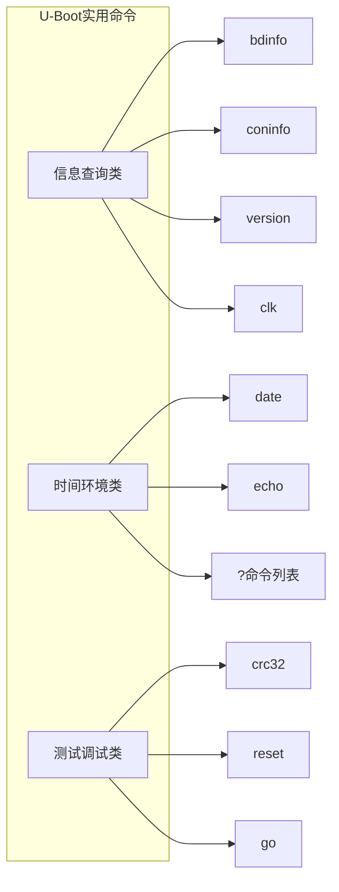

# 3.4.6 其他实用命令

> 所属章节：第3章 U-Boot命令行 > 3.4 常用命令详解
> 难度：[B] | 预计阅读时间：15分钟

## 本节导读

本节介绍U-Boot中那些"小而美"的实用命令——它们不像`nand read`或`tftpboot`那样承担核心数据传输任务，但在**诊断硬件状态**、**确认环境配置**、**快速验证内存数据**和**控制板级行为**时，往往是最先被用到的工具。学完本节，你将拥有一套完整的"问题排查组合拳"，在开发调试中快速定位问题。


[图1：其他实用命令分类图]

---

## 知识点1：信息查询命令 [B] ~600字

U-Boot启动后会进入命令行界面，面对一块陌生的开发板，开发者通常做的第一件事就是"摸底"——了解这块板子的硬件配置和软件版本。U-Boot提供了一组专门的信息查询命令，帮助你快速获取这些信息。

### 1.1 bdinfo —— 板子信息总览

`bdinfo`（board info）是U-Boot中最全面的硬件信息汇总命令。它从`bd_t`结构体中读取启动参数，一次性输出**DRAM大小与起始地址**、**FLASH大小与起始地址**、**CPU时钟频率**、**MAC地址**、**IP地址**等关键信息。

#### 操作步骤
1. U-Boot命令行输入 `bdinfo`
2. 逐行阅读输出，确认DRAM、Flash容量与硬件设计一致
3. 核对`ethaddr`字段，确保MAC地址有效（非全0或全FF）

### 代码示例
```bash
U-Boot> bdinfo
arch_number = 0x000008E0        # 机器码（ARM架构标识）
env_t       = 0x00000000
boot_params = 0x40000100        # 启动参数传递地址
DRAM bank   = 0x00000000
-> start    = 0x40000000        # DRAM起始地址
-> size     = 0x10000000        # DRAM大小 = 256MB
ethaddr     = 00:11:22:33:44:55 # 以太网MAC地址
ip_addr     = 192.168.1.100     # 默认IP地址
baudrate    = 115200 bps        # 串口波特率
```

### 1.2 coninfo —— 控制台信息

`coninfo`列出当前可用的**串口控制台**和**输入输出设备**。对于多串口开发板（如UART0/UART1/UART2），此命令可以确认哪个串口当前被用作U-Boot的标准输入输出。

```bash
U-Boot> coninfo
List of available devices:
serial   80000003 SIO stdin stdout stderr
```

💡 **提示**：如果开发板有多个串口但U-Boot只打印在一个上，可以通过修改`bootargs`中的`console=`参数切换，或修改板级初始化代码重新配置。

### 1.3 version —— 版本确认

`version`命令输出U-Boot的版本号、编译时间戳和使用的编译器信息。在团队协作和问题回溯时，这是**必查项**——确保每个人使用的是同一版本的U-Boot。

```bash
U-Boot> version
U-Boot 2023.04 (Oct 15 2023 - 09:32:18 +0800)

arm-linux-gnueabihf-gcc (Linaro GCC 7.5-2019.12) 7.5.0
GNU ld (Linaro_Binutils-2019.12) 2.28.2.20170706
```

### 1.4 clk —— 时钟信息（部分平台支持）

部分厂商（如Rockchip、NXP）在U-Boot中实现了`clk`命令，用于显示**各模块时钟频率**，如CPU_CLK、DDR_CLK、BUS_CLK、PLL状态等。这对排查性能问题或外设通信异常非常有用。

```bash
U-Boot> clk dump
 clk                        rate (Hz)   enable count  prepare count
 cpu                        816000000            1              1
 ddr                        528000000            1              1
 ahb                        132000000            1              1
```

⚠️ **陷阱**：`clk`命令不是U-Boot主线标准命令，某些平台（如较早的TI OMAP平台）可能不存在。输入后若提示`Unknown command`，说明当前U-Boot配置未启用此功能。

---

## 知识点2：时间与环境命令 [B] ~500字

在自动化测试脚本或环境变量批量修改时，一些基础命令能显著提升效率。

### 2.1 date —— 查看/设置日期时间

U-Boot支持一个简单的RTC（实时时钟）读写命令`date`。不带参数时读取当前RTC时间；带参数时设置时间（格式：`date MMDDhhmmYYYY.ss`）。

#### 操作步骤
1. 查看当前时间：`date`
2. 设置时间：`date 101509302024.00`（2024年10月15日09:30:00）
3. 再次执行`date`确认写入成功

### 代码示例
```bash
U-Boot> date
Date: 2024-10-15 (Tuesday)    Time: 09:30:00

U-Boot> date 101509302024.00
Date: 2024-10-15 (Tuesday)    Time: 09:30:00

U-Boot> date
Date: 2024-10-15 (Tuesday)    Time: 09:30:01
```

🔴 **危险**：设置错误的日期时间可能导致Linux启动后文件系统时间戳混乱，进而触发`fsck`强制检查或日志时间线异常。建议在量产前统一校准RTC。

### 2.2 echo —— 打印字符串与变量

`echo`命令在U-Boot中用途远超"打印Hello"。它可以：
- 打印普通字符串用于脚本调试
- 展开并显示**环境变量**的值
- 配合条件命令做流程控制输出

```bash
U-Boot> echo Hello from U-Boot
Hello from U-Boot

U-Boot> echo Current bootdelay is ${bootdelay}
Current bootdelay is 5

U-Boot> echo Kernel load address: ${loadaddr}
Kernel load address: 0x41000000
```

💡 **提示**：在U-Boot脚本中，`echo`是最常用的调试手段。如果某个自动化脚本行为异常，先在关键步骤插入`echo`输出中间变量，定位问题分支。

### 2.3 ? —— 命令列表与帮助

输入单个`?`会列出当前U-Boot支持的所有命令。若要查看某条命令的具体用法，输入`help <命令名>`或简写`? <命令名>`。

```bash
U-Boot> ?
?       - alias for 'help'
base    - print or set address offset
bdinfo  - print Board Info structure
boot    - boot default, i.e., run 'bootcmd'
bootd   - boot default, i.e., run 'bootcmd'
bootm   - boot application image from memory
...
```

💡 **提示**：不同U-Boot编译配置支持的命令差异很大。如果移植过程中发现某个命令"失踪"了，先执行`?`确认它是否被编译进当前固件，再检查对应的`CONFIG_CMD_xxx`宏是否开启。

---

## 知识点3：测试与调试命令 [B] ~500字

当你需要验证一段内存数据是否被正确写入，或者需要在不重启到Linux的情况下运行一段裸机程序时，以下命令是关键工具。

### 3.1 crc32 —— CRC校验

`crc32`命令计算指定内存区域的**32位CRC校验值**，用于验证数据传输的完整性。这是`md5sum`在U-Boot命令行中的简化版。

#### 操作步骤
1. 先将文件加载到内存（如通过`tftpboot`或`fatload`）
2. 记录文件大小（可从`filesize`环境变量读取）
3. 执行`crc32`计算校验值
4. 与宿主机用`crc32`工具计算的值比对

### 代码示例
```bash
U-Boot> tftpboot 0x41000000 uImage
Bytes transferred = 3670016 (380000 hex)

U-Boot> crc32 0x41000000 ${filesize}
crc32 for 00410000 ... 0047ffff ==> 0xa3b2c4d5
```

在Linux宿主机比对：
```bash
$ crc32 uImage
a3b2c4d5
```

⚠️ **陷阱**：`crc32`命令的校验结果若与宿主机不一致，常见原因包括：
- TFTP传输中被网络设备截断（检查`filesize`是否匹配）
- 内存地址计算错误（U-Boot的`crc32`使用物理地址，确保未遗漏MMU映射问题）
- 某些U-Boot版本`crc32`只接受十六进制长度参数，不能直接用`filesize`变量——此时先`echo ${filesize}`确认格式

### 3.2 reset —— 重启系统

`reset`命令触发CPU的硬件复位，U-Boot重新从头执行。它比直接按板子上的复位键方便，尤其适用于远程调试场景（如果板子有网络控制台或USB调试口）。

```bash
U-Boot> reset
resetting ...

# （板子重新启动，串口输出重新出现U-Boot logo）
```

🔴 **危险**：`reset`是硬复位，不会刷新文件系统缓存。如果在U-Boot中刚执行了`nand write`或`mmc write`等写操作，建议先执行`sync`（若支持）或确认写操作已完成，否则可能导致Flash数据不完整。

### 3.3 go —— 跳转到地址运行

`go`命令让CPU直接跳转到指定的内存地址执行代码，**不经过U-Boot的镜像解析流程**。这意味着目标地址必须存放的是纯二进制裸机代码（raw binary），而非`uImage`、`zImage`或`fitImage`等带头的封装格式。

```bash
# 将裸机程序加载到0x41000000后，直接跳转执行
U-Boot> go 0x41000000
## Starting application at 0x41000000 ...
```

⚠️ **陷阱**：`go`与`bootm`的核心区别在于：
- `bootm`会解析U-Boot镜像头（mkimage生成的头部），设置启动参数，跳转前完成CPU和缓存的清理；
- `go`什么都不管，直接把PC指针设为目标地址，执行原始的裸机代码。

如果你用`go`去执行一个`uImage`，CPU会尝试把镜像头当成指令执行，几乎必然导致**非法指令异常**或**立即挂死**。

💡 **提示**：`go`的常见应用场景包括：
- 运行一段独立的**硬件测试裸机程序**（不依赖Linux内核）
- 在U-Boot阶段临时运行**自定义固件**做深度诊断
- 早期移植阶段验证**二级引导程序**（SPL之后的下一阶段）能否正确执行

---

## 本节总结

| 概念 | 要点 | 操作 |
|------|------|------|
| `bdinfo` | 输出板级硬件全局信息 | `bdinfo` |
| `coninfo` | 查看当前可用的控制台设备 | `coninfo` |
| `version` | 查看U-Boot版本和编译信息 | `version` |
| `clk` | 查看各模块时钟频率（平台相关） | `clk` 或 `clk dump` |
| `date` | 读取/设置RTC时间 | `date` / `date MMDDhhmmYYYY.ss` |
| `echo` | 打印字符串或展开环境变量 | `echo ${varname}` |
| `?` | 列出所有命令或查看帮助 | `?` / `help <cmd>` |
| `crc32` | 计算内存区域的CRC32校验值 | `crc32 addr len` |
| `reset` | 硬件复位重启 | `reset` |
| `go` | 跳转到裸机二进制地址执行 | `go addr` |

## 下一步

本节介绍的命令虽然分散，但共同构成了U-Boot开发调试中的"瑞士军刀"工具集。下一节我们将进入**U-Boot环境变量**的专题，学习如何用`setenv`、`saveenv`等命令持久化配置，以及环境变量如何影响启动流程。

---

## 配套资源

### 表格清单
- **表1：其他实用命令速查表**（见本节总结表格）

### 图示清单
- **图1：其他实用命令分类图** [mermaid图] — 展示信息查询、时间环境、测试调试三大类命令的组织关系
- **图2**：`bdinfo`输出示例截图（终端输出） [配图说明]
- **图3**：`?`命令列表输出示例截图 [配图说明]

### 代码清单
- **代码1**：`bdinfo`输出示例
- **代码2**：`coninfo`输出示例
- **代码3**：`version`输出示例
- **代码4**：`date`设置与读取示例
- **代码5**：`echo`打印环境变量示例
- **代码6**：`crc32`内存校验与宿主机比对示例
- **代码7**：`go`跳转裸机程序示例
