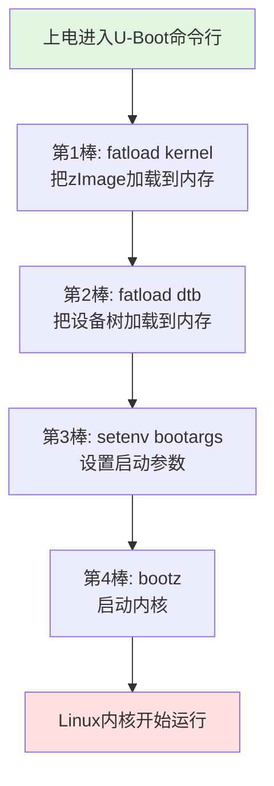

# 3.5.2 从U-Boot启动内核

> 所属章节：第3章 U-Boot入门 > 3.5 启动内核
> 难度：[B] | 预计阅读时间：25分钟

## 本节导读
本节将带领你完成从U-Boot命令行手动启动Linux内核的全过程。学完后，你将能够独立把内核镜像、设备树和根文件系统串联起来，让开发板真正"跑起来"；同时还能配置自动启动，让开发板上电后直接进入Linux系统，不再需要手动敲命令。

---

## 知识点1：手动启动内核的四步法 [B] ~1,200字

U-Boot本身只是一个引导程序，它的最终使命是把Linux内核"接力"到内存里，然后把控制权交出去。整个手动启动过程就像一场精心编排的四人接力赛，每个选手（命令）都负责一棒：



[图1：手动启动内核的四步接力流程]

### 第1步：加载内核镜像到内存（fatload kernel）

内核镜像通常存放在SD卡或eMMC的FAT分区里，文件名一般是 `zImage`（ARM 32位）或 `Image`（ARM 64位）。我们需要用 `fatload` 命令把它从存储介质读到内存的某个地址。

在U-Boot命令行输入：

```bash
fatload mmc 0:1 0x82000000 zImage
```

这行命令的参数拆解如下：

| 参数 | 含义 | 说明 |
|------|------|------|
| `fatload` | 从FAT分区加载文件 | U-Boot文件系统命令 |
| `mmc 0:1` | 第0个MMC设备的第1个分区 | SD卡通常是`mmc 0`，eMMC是`mmc 1` |
| `0x82000000` | 目标内存地址 | 加载到DDR的0x82000000处，具体值参考芯片手册 |
| `zImage` | 要加载的文件名 | 你的内核镜像实际文件名 |

💡 **提示**：不确定内存地址该填什么？在U-Boot命令行输入 `bdinfo` 或 `printenv loadaddr`，通常就能看到厂家预设的推荐地址。

执行成功后，你会看到类似输出：

```
reading zImage

count: 1234567, done
```

数字表示读取了多少字节。如果出现 `File not found`，说明文件名写错或分区里根本没这个文件。

### 第2步：加载设备树到内存（fatload dtb）

现代ARM芯片启动内核必须搭配设备树（Device Tree Blob，`.dtb` 文件）。设备树告诉内核板子上有什么外设、GPIO怎么连、时钟频率是多少。没有设备树，内核就像盲人摸象——根本不知道自己在什么板子上运行。

命令格式和加载内核几乎一样，只是内存地址要换一块区域，避免覆盖刚加载的内核：

```bash
fatload mmc 0:1 0x83000000 am335x-boneblack.dtb
```

这里 `am335x-boneblack.dtb` 要根据你的实际板子替换。如果是树莓派，可能是 `bcm2711-rpi-4-b.dtb`；如果是i.MX6，可能是 `imx6ull-14x14-evk.dtb`。

⚠️ **陷阱**：.dtb文件名和实际板型必须严格匹配。如果你换了板子但还用旧的dtb，内核启动时可能认不出网卡、串口，甚至直接崩溃。

### 第3步：设置启动参数（setenv bootargs）

`bootargs` 是一串传给内核的"启动参数字符串"，它告诉内核根文件系统在哪里、控制台用哪个串口、波特率多少，以及其他调试选项。

最常见的bootargs配置如下：

```bash
setenv bootargs 'console=ttyO0,115200n8 root=/dev/mmcblk0p2 rw rootfstype=ext4'
```

参数含义拆解：

| 参数 | 含义 |
|------|------|
| `console=ttyO0,115200n8` | 内核日志输出到ttyO0串口，波特率115200，8位数据位 |
| `root=/dev/mmcblk0p2` | 根文件系统在SD卡（mmcblk0）的第2分区（p2） |
| `rw` | 以读写方式挂载根文件系统 |
| `rootfstype=ext4` | 根文件系统的格式是ext4 |

💡 **提示**：`ttyO0` 是BeagleBone的串口命名。不同芯片串口名不同：i.MX6是 `ttymxc0`，全志H3是 `ttyS0`，树莓派是 `ttyAMA0`。记得对照你的板子 datasheet。

🔴 **危险**：`root=` 参数指定错了，内核会 panic！如果你不确定根文件系统分区号，可以先用 `fdisk -l`（在Linux PC上查看SD卡）或者U-Boot里用 `part list mmc 0` 来查看分区表。

### 第4步：启动内核（bootz）

前三步都是"准备食材"，最后一步才是"点火炒菜"。`bootz` 命令负责把内核和设备树从内存里真正启动起来：

```bash
bootz 0x82000000 - 0x83000000
```

三个参数分别代表：

| 参数 | 含义 |
|------|------|
| `0x82000000` | 内核镜像（zImage）在内存中的地址 |
| `-` | initrd地址，这里不用初始化内存盘，所以填 `-` |
| `0x83000000` | 设备树（dtb）在内存中的地址 |

⚠️ **陷阱**：三个参数之间要有空格。写成 `bootz 0x82000000-0x83000000` 会报错！中间那个 `-` 不能省略，它是占位符。

如果一切顺利，你会看到屏幕上飞速滚动的内核启动日志，最后停在一个登录提示符——恭喜你，Linux内核已经跑起来了！

### 完整命令序列（建议抄在小本本上）

把这四条命令按顺序执行，就是一个完整的手动启动流程：

```bash
# === 完整手动启动命令序列 ===
fatload mmc 0:1 0x82000000 zImage
fatload mmc 0:1 0x83000000 am335x-boneblack.dtb
setenv bootargs 'console=ttyO0,115200n8 root=/dev/mmcblk0p2 rw rootfstype=ext4'
bootz 0x82000000 - 0x83000000
```

[图2：串口终端中执行四条启动命令的截图，显示从U-Boot命令行过渡到内核启动日志]

---

## 知识点2：配置bootcmd实现自动启动 [B] ~800字

手动启动虽然能跑通，但每次都敲四条命令实在太累。想象你上电后先去倒杯水，回来发现板子还在U-Boot命令行干等着——这哪行？我们需要让U-Boot"自觉"一点，上电后自动执行那四条命令。

### bootcmd是什么

`bootcmd` 是U-Boot的一个环境变量，它的值是一串命令字符串。U-Boot启动倒计时结束后，会自动执行 `bootcmd` 里的内容。如果 `bootcmd` 为空，U-Boot就停留在命令行等你输入。

换句话说，`bootcmd` 就是U-Boot的"自动启动脚本"。

### 把手动启动写入bootcmd

在U-Boot命令行，用 `setenv` 把四条命令写进 `bootcmd`。注意要用分号 `;` 把多条命令隔开，并且整个字符串用单引号包起来：

```bash
setenv bootcmd 'fatload mmc 0:1 0x82000000 zImage; fatload mmc 0:1 0x83000000 am335x-boneblack.dtb; setenv bootargs console=ttyO0,115200n8 root=/dev/mmcblk0p2 rw rootfstype=ext4; bootz 0x82000000 - 0x83000000'
```

💡 **提示**：如果命令太长一行写不下，可以在U-Boot里用反斜杠 `\` 换行，但更简单的方法是在PC上的文本编辑器里先写好，然后复制粘贴到串口终端（注意你的终端要支持粘贴）。

### 保存环境变量（saveenv）

这一步极其关键！`setenv` 只是把变量写进了内存，断电就消失。必须用 `saveenv` 把它持久化到存储介质（通常是eMMC/SD卡的预留扇区或专用Flash分区）：

```bash
saveenv
```

执行后会看到：

```
Saving Environment to MMC...
Writing to MMC(0)... done
```

🔴 **危险**：`saveenv` 会改写存储介质上的环境变量区域。如果你用的是全新板子，通常没问题；但如果板子原本有出厂配置，saveenv会覆盖它。建议在执行前先 `printenv` 截个图备份，万一搞坏了还能恢复。

### 验证自动启动

保存完成后，重启板子：

```bash
reset
```

你会看到U-Boot倒计时从3跳到0，然后自动执行那四条命令，最后进入Linux内核。从此再也不用每次手动敲命令了！

### 取消自动启动（临时/永久）

有时候你想回到命令行调试，有几种方法：

**方法1：开机时狂按空格/回车**

在U-Boot倒计时期间按任意键，会中断自动启动，进入命令行。

**方法2：清空bootcmd（永久取消）**

```bash
setenv bootcmd
saveenv
```

把 `bootcmd` 设为空字符串，U-Boot就不再自动启动了。

**方法3：设置bootdelay为0（上电直接启动，不留等待时间）**

```bash
setenv bootdelay 0
saveenv
```

💡 **提示**：开发阶段建议 `bootdelay` 保持3秒左右，方便随时打断。等产品成熟了可以改成0，实现"秒开"。

---

## 知识点3：启动失败排查指南 [B] ~600字

哪怕命令都敲对了，启动内核时也可能遇到问题。下面是最常见的三种故障现象和排查方法。

### 排查表：按症状快速定位问题

| 现象 | 可能原因 | 排查方法 | 修复措施 |
|------|----------|----------|----------|
| `Kernel panic - not syncing: VFS: Unable to mount root fs` | `root=` 参数错误，或根文件系统不存在 | 检查 `bootargs` 里的 `root=`；确认SD卡对应分区有ext4文件系统 | 修正分区号，或重新烧录根文件系统 |
| 启动后串口无任何输出 | `console=` 参数错误；波特率不匹配 | 检查 `console=ttyX0` 中的串口名；确认波特率是否与终端一致 | 对照芯片手册修改串口名 |
| 内核加载后马上崩溃，显示乱码或PC寄存器值 | dtb文件不匹配；内存地址冲突 | 确认.dtb文件名与板子型号对应；检查kernel和dtb加载地址是否重叠 | 换用正确的dtb文件；调整内存加载地址 |
| `File not found` | FAT分区没有该文件；文件名拼写错误 | 用 `fatls mmc 0:1` 查看分区文件列表 | 把文件放到正确分区，或修正文件名 |
| 无限重启循环 | 看门狗超时；启动失败后复位 | 检查内核是否正确配置看门狗；检查bootcmd是否正确 | 临时在U-Boot里喂狗，或修复启动流程 |

### 故障1：Kernel panic - 根文件系统找不到

这是最常见的错误。内核已经把串口、网卡都驱动起来了，最后卡在一句红字：

```
Kernel panic - not syncing: VFS: Unable to mount root fs on unknown-block(0,0)
```

**原因分析**：`root=/dev/mmcblk0p2` 写错了分区号，或者该分区根本没有格式化。

**排查步骤**：

1. 在U-Boot命令行执行 `part list mmc 0`，查看实际分区表
2. 确认根文件系统是否在对应分区，格式是否为ext4
3. 如果不确定，可以先试试 `root=/dev/mmcblk0p1` 或 `root=/dev/mmcblk0p3`

### 故障2：dtb不匹配导致外设失踪

内核启动了，但网卡不能用、串口没反应、屏幕不亮。

**原因分析**：dtb文件和实际板子不匹配。比如用了BeagleBone Black的dtb去跑BeagleBone Green，虽然CPU一样，但某些外设（如HDMI、WiFi模块）的电路不同，dtb里描述的GPIO/时钟就不对了。

**排查步骤**：

1. 核对板子型号和dtb文件名是否一致
2. 在U-Boot里用 `fdt addr 0x83000000; fdt header` 查看dtb的设备树头信息，确认compatible字符串是否包含你的板子型号
3. 有条件的话，从板子厂商提供的SDK里拷贝.dtb文件

### 故障3：bootargs语法错误

有时候不是命令写错，而是 `bootargs` 里的字符串格式有问题。比如漏了单引号、逗号写成了中文逗号、或者参数之间少了个空格。

**排查步骤**：

1. 在U-Boot里执行 `printenv bootargs`，仔细检查输出的每个字符
2. 确保 `setenv bootargs '...'` 用的是英文单引号
3. 波特率部分 `115200n8` 中间没有空格，`n8` 表示无奇偶校验、8位数据位

💡 **提示**：遇到启动失败，第一时间拍一张串口输出的照片（尤其是最后几行红字）。Kernel panic的报错信息非常精准，通常直接告诉你问题出在哪。把这些信息复制到搜索引擎，90%的问题都有人踩过坑并给出解答。

---

## 本节总结

本节完成了从U-Boot到Linux内核的"最后一公里"。核心内容可以用下表概括：

| 概念 | 要点 | 操作命令 |
|------|------|----------|
| 加载内核 | 把zImage从SD卡读到内存 | `fatload mmc 0:1 0x82000000 zImage` |
| 加载设备树 | dtb告诉内核板子有什么硬件 | `fatload mmc 0:1 0x83000000 xxx.dtb` |
| 设置启动参数 | 指定控制台、根文件系统位置 | `setenv bootargs 'console=... root=...'` |
| 启动内核 | 把控制权交给Linux | `bootz 0x82000000 - 0x83000000` |
| 自动启动 | 上电自动执行上述四步 | `setenv bootcmd '...'; saveenv` |
| 保存环境 | 让配置断电不丢失 | `saveenv` |

---

## 下一步

内核已经跑起来了，但你可能发现：怎么停在了登录界面，没有图形桌面？或者登录进去后发现很多命令没有？这是因为你只启动了内核，还没有完整的**根文件系统（rootfs）**。下一节 `3.5.3 根文件系统的作用` 将告诉你为什么根文件系统是Linux系统的"灵魂"，以及如何准备一个最小可运行的根文件系统。

---

## 配套资源

### 表格清单
- 表1：bootargs常见参数含义表（知识点1第3步）
- 表2：启动失败排查表（知识点3）
- 表3：本节核心内容总结表（本节总结）

### 图示清单
- 图1：手动启动内核的四步接力流程 [mermaid流程图]
- 图2：串口终端中执行四条启动命令的截图 [配图说明]

### 代码清单
- 代码1：完整手动启动命令序列（四步）
- 代码2：设置bootcmd自动启动
- 代码3：取消自动启动的命令
