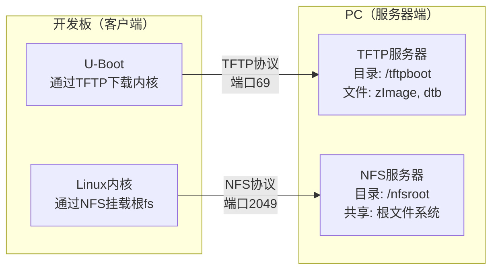

# 3.5.3 网络启动：TFTP/NFS

> 所属章节：第3章 嵌入式Linux系统移植与启动 > 3.5 系统启动方式
> 难度：[B→I] | 预计阅读时间：30分钟

## 本节导读
本节讲解如何通过网线而非SD卡启动嵌入式Linux系统。你将学会在PC上搭建TFTP+NFS服务器、配置U-Boot网络参数，最终实现"修改代码→编译→网线启动验证"的秒级开发循环，彻底告别反复插拔SD卡的繁琐操作。

---

## 知识点1：网络启动的优势 [B] ~400字

前面的章节中，每修改一次内核或设备树，我们都要经历"编译→拔SD卡→插读卡器→拷贝镜像→插回开发板→上电"的漫长流程。如果一天调试几十次，光是插拔SD卡就要花掉大量时间。

网络启动的核心思想很简单：**把开发板当成一台没有硬盘的"裸机"，通过网络从PC"借"操作系统来运行**。PC扮演"服务器"角色，提供内核镜像和根文件系统；开发板扮演"客户端"角色，上电后自动去服务器"下载"并启动。

| 启动方式 | 是否需要物理介质 | 修改后重启时间 | 适用场景 |
|----------|------------------|---------------|----------|
| SD卡启动 | 需要反复插拔SD卡 | 3~5分钟 | 产品量产、无网络环境 |
| U盘启动 | 需要插拔U盘 | 2~3分钟 | 临时调试、大文件拷贝 |
| **TFTP/NFS启动** | **只需要网线** | **30秒~1分钟** | **日常开发、频繁调试** |
| eMMC/Flash启动 | 烧录一次后固定 | 需要重新烧录 | 产品最终形态 |

*表1：四种启动方式对比*

网络启动在开发阶段有三大不可替代的优势：
- **极速迭代**：修改设备树中的某个引脚配置，编译后开发板直接重启即可生效，无需碰SD卡。
- **文件系统可写且持久**：NFS根文件系统是PC上的真实目录，开发板上的读写直接反映到PC磁盘上，调试日志、配置文件天然保存。
- **多板共享**：同一台PC可以同时为多块开发板提供启动服务，团队开发时尤其高效。

💡 **提示**：网络启动需要开发板与PC通过网线直连或接入同一局域网，且开发板网口在U-Boot阶段已能正常工作（驱动已移植）。

⚠️ **陷阱**：网络启动仅在开发阶段使用！产品量产时必须将镜像烧录到eMMC/SD卡/NAND等本地存储，否则设备脱离网络就无法工作。

---

## 知识点2：TFTP+NFS启动环境搭建 [I] ~1,200字

TFTP（Trivial File Transfer Protocol）是一种极简的文件传输协议，适合小文件快速下载。U-Boot阶段使用TFTP从PC下载内核镜像（zImage）和设备树（dtb）。NFS（Network File System）则把PC上的一个目录"共享"给开发板，作为其根文件系统使用。

[图1：网络启动架构图]



整个环境搭建分为PC端配置和U-Boot端配置两大步。

### 2.1 PC端TFTP服务器配置

以Ubuntu系统为例，安装并配置TFTP服务器：

```bash
# 1. 安装TFTP服务
sudo apt-get update
sudo apt-get install -y tftpd-hpa tftp-hpa

# 2. 创建TFTP共享目录并设权限
sudo mkdir -p /tftpboot
sudo chmod 777 /tftpboot

# 3. 修改配置文件
sudo tee /etc/default/tftpd-hpa << 'EOF'
# /etc/default/tftpd-hpa
TFTP_USERNAME="tftp"
TFTP_DIRECTORY="/tftpboot"
TFTP_ADDRESS="0.0.0.0:69"
TFTP_OPTIONS="-l -c -s"
EOF

# 4. 重启服务并验证
sudo systemctl restart tftpd-hpa
sudo systemctl status tftpd-hpa

# 5. 将编译好的镜像复制到TFTP目录
cp /path/to/zImage /tftpboot/
cp /path/to/xxx.dtb /tftpboot/
ls -lh /tftpboot/
```

🔴 **危险**：TFTP目录必须设为全局可读写（`chmod 777`），否则U-Boot下载时会收到"Permission denied"。

💡 **提示**：`TFTP_OPTIONS="-l -c -s"`中，`-c`参数允许客户端上传文件，`-s`表示以安全模式运行。如果不需要U-Boot向PC回传文件，可以去掉`-c`。

### 2.2 PC端NFS服务器配置

```bash
# 1. 安装NFS服务
sudo apt-get install -y nfs-kernel-server

# 2. 创建NFS共享目录
sudo mkdir -p /nfsroot
sudo chmod 777 /nfsroot

# 3. 将根文件系统解压到该目录
sudo tar -xvf /path/to/rootfs.tar.gz -C /nfsroot/

# 4. 配置导出目录
sudo tee -a /etc/exports << 'EOF'
/nfsroot *(rw,sync,no_root_squash,no_subtree_check)
EOF

# 5. 重启NFS服务
sudo exportfs -rav
sudo systemctl restart nfs-kernel-server

# 6. 本地验证共享是否生效
showmount -e localhost
```

⚠️ **陷阱**：`/etc/exports`中的`no_root_squash`非常关键！默认情况下NFS会将root用户映射为nobody，导致开发板上以root身份无法写入共享目录。加上`no_root_squash`后，开发板上的root在NFS目录中仍保持root权限。

🔴 **危险**：生产环境中请勿使用`*(rw,...)`这样向所有IP开放的配置！应改为具体的开发板IP，例如`/nfsroot 192.168.1.100(rw,sync,no_root_squash)`。

### 2.3 U-Boot网络参数设置

确保开发板与PC通过网线连接，且处于同一网段。在U-Boot命令行中设置以下环境变量：

```bash
# 设置开发板自身IP（不能与PC冲突）
setenv ipaddr 192.168.1.50

# 设置PC（TFTP/NFS服务器）的IP
setenv serverip 192.168.1.100

# 设置子网掩码和网关
setenv netmask 255.255.255.0
setenv gatewayip 192.168.1.1

# 设置网卡MAC地址（不同板子必须唯一，避免局域网冲突）
setenv ethaddr 00:11:22:33:44:55

# 保存变量
saveenv
```

这里的关键变量是`serverip`——它告诉U-Boot"去哪个IP地址找TFTP服务器"。`ipaddr`是开发板在局域网中的身份标识，必须保证唯一且与`serverip`处于同一网段。如果你的网络环境有DHCP服务器（比如路由器），也可以让U-Boot自动获取IP，只需执行`dhcp`命令代替手动设置`ipaddr`。

💡 **提示**：如果你的PC没有独立网口，可以用USB转网口扩展；或者用网线直连开发板与PC，此时需要给PC的有线网卡手动设置一个同网段静态IP（如`192.168.1.100`）。

💡 **提示**：如果你有多块开发板在同一局域网中调试，每块板子的`ethaddr`和`ipaddr`都必须不同，否则会导致IP冲突，U-Boot会提示`is not alive`或下载失败。

### 2.4 验证网络连通性

在U-Boot命令行中执行：

```bash
# 测试与PC的网络连通性
ping 192.168.1.100

# 出现 "host 192.168.1.100 is alive" 表示网络已通
```

然后测试TFTP下载：

```bash
# 从PC下载zImage到开发板内存0x80800000处
tftp 0x80800000 zImage

# 下载设备树到0x83000000处
tftp 0x83000000 imx6ull-14x14-evk.dtb
```

这里的`0x80800000`和`0x83000000`是开发板DDR内存中的加载地址。不同平台的地址不同：i.MX6ULL通常将内核加载到`0x80800000`，设备树加载到`0x83000000`（内核之后的安全区域）。如果你不确定自己平台的地址，可以在U-Boot中执行`bdinfo`查看内存布局，或参考该平台的U-Boot默认环境变量中的`loadaddr`和`fdtaddr`值。

⚠️ **陷阱**：如果`ping`不通，先检查物理连接（网口灯是否闪烁），再检查IP是否在同一网段，最后关闭PC防火墙试一下：`sudo ufw disable`。

---

## 知识点3：NFS根文件系统启动 [I] ~600字

TFTP解决了"从哪里下载内核"的问题，但内核启动后还需要挂载根文件系统。NFS根文件系统的核心配置在`bootargs`环境变量中——它告诉内核：不要找本地硬盘，而是通过NFS协议把PC的`/nfsroot`目录当作根目录来用。

### 3.1 配置bootargs

在U-Boot命令行中设置完整的启动参数：

```bash
setenv bootargs 'console=ttymxc0,115200 root=/dev/nfs nfsroot=192.168.1.100:/nfsroot,v3,tcp ip=192.168.1.50:192.168.1.100:192.168.1.1:255.255.255.0::eth0:off'
saveenv
```

这条长长的命令可以拆解为几个部分理解：

| 参数片段 | 含义 |
|----------|------|
| `console=ttymxc0,115200` | 串口控制台，波特率115200 |
| `root=/dev/nfs` | 告诉内核使用NFS作为根文件系统 |
| `nfsroot=192.168.1.100:/nfsroot,v3,tcp` | NFS服务器IP、共享路径、协议版本v3、使用TCP |
| `ip=...` | 开发板静态IP配置，格式为`本机IP:服务器IP:网关:掩码::网卡:自动配置off` |

*表2：bootargs参数拆解*

### 3.2 完整的网络启动命令序列

```bash
# 步骤1：从TFTP服务器下载内核到内存
tftp 0x80800000 zImage

# 步骤2：从TFTP服务器下载设备树到内存
tftp 0x83000000 imx6ull-14x14-evk.dtb

# 步骤3：设置启动参数（已保存则跳过）
setenv bootargs 'console=ttymxc0,115200 root=/dev/nfs nfsroot=192.168.1.100:/nfsroot,v3,tcp ip=192.168.1.50:192.168.1.100:192.168.1.1:255.255.255.0::eth0:off'

# 步骤4：启动内核
bootz 0x80800000 - 0x83000000
```

[图2：U-Boot网络启动流程图]

如果以上步骤每次都手动输入太繁琐，可以把它们封装成U-Boot的自动启动脚本：

```bash
setenv bootcmd 'tftp 0x80800000 zImage; tftp 0x83000000 imx6ull-14x14-evk.dtb; bootz 0x80800000 - 0x83000000'
saveenv
```

设置后，开发板上电自动执行网络启动，完全无需人工干预。

💡 **提示**：`bootz`中的三个参数分别是`内核地址` `-`（无initrd） `设备树地址`。如果用的是`uImage`格式而非`zImage`，则需要改用`bootm`命令。

⚠️ **陷阱**：`nfsroot`中的`,v3`不可省略！许多新内核默认尝试NFSv4，但嵌入式开发板的U-Boot/NFS环境通常只兼容NFSv3。如果省略版本号，内核挂载时可能卡住，串口只打印`VFS: Unable to mount root fs`却不继续。

💡 **提示**：`,tcp`参数指定使用TCP传输NFS数据。默认NFS可以使用UDP或TCP，但在现代局域网中TCP更可靠（有重传机制），而且大多数防火墙对TCP 2049端口的放行策略更友好。如果你的网络环境延迟较高或丢包严重，可以尝试去掉`,tcp`让内核自动选择。

🔴 **危险**：如果开发板内核已经启动NFS根文件系统，此时拔掉网线或关闭PC的NFS服务，开发板上的所有进程会因无法访问根文件系统而冻结，串口会刷出大量I/O error。恢复网络后通常能继续，但某些情况下需要重启。

---

## 本节总结

| 概念 | 要点 | 操作 |
|------|------|------|
| TFTP | 极简协议，用于传输内核/设备树小文件 | PC安装`tftpd-hpa`，镜像放`/tftpboot`目录 |
| NFS | 网络文件系统，共享PC目录给开发板当根fs | PC安装`nfs-kernel-server`，配置`/etc/exports` |
| bootargs | 传递给内核的启动参数 | 设置`root=/dev/nfs nfsroot=IP:/path,v3,tcp` |
| bootcmd | U-Boot自动启动脚本 | 封装`tftp; tftp; bootz`命令序列 |
| 优势 | 开发阶段无需物理介质、秒级迭代 | 修改→编译→重启开发板即可验证 |

*表3：本节核心知识点速查表*

网络启动本质上是用网线替代了SD卡的"搬运"职能。TFTP负责把内核镜像从PC搬到开发板内存，NFS负责把PC上的一个目录实时映射为开发板的根文件系统。掌握这套流程后，你的嵌入式开发效率将提升一个数量级。

---

## 下一步
下一节我们将讲解启动故障排查——当屏幕黑屏、内核 panic、文件系统挂载失败时，如何通过串口日志定位问题。建议你在继续阅读前先动手完成本节的环境搭建，故意制造几个错误（比如写错serverip），熟悉错误信息的模样。

---

## 配套资源

### 表格清单
- 表1：四种启动方式对比
- 表2：bootargs参数拆解
- 表3：本节核心知识点速查表

### 图示清单
- 图1：网络启动架构图（PC端TFTP+NFS服务器 ↔ 开发板U-Boot+Linux内核）[mermaid图]
- 图2：U-Boot网络启动流程图（配图说明：展示从DHCP/静态IP→TFTP下载→bootz启动→NFS挂载的完整时序，可用时序图或流程图形式）

### 代码清单
- 代码1：PC端TFTP服务器完整安装配置脚本
- 代码2：PC端NFS服务器完整安装配置脚本
- 代码3：U-Boot网络参数与bootargs配置命令
- 代码4：U-Boot完整网络启动命令序列及bootcmd自动脚本
