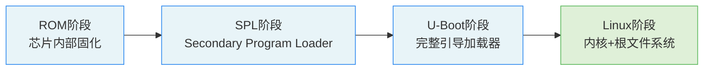

# 3.6.1 本章小结

> 所属章节：第3章 嵌入式系统启动流程 > 3.6 本章小结
> 难度：[B] | 预计阅读时间：10分钟

## 本节导读

本节带你回顾第3章的核心概念——从芯片上电到Linux启动的完整链条，帮你建立一张"启动流程全景图"，学完可以独立说出每个阶段的作用和它们之间的衔接关系。

## 知识点1：核心概念回顾 [B] ~500字

第3章我们跟随嵌入式设备的启动脚步，走完了从上电到操作系统运行的完整旅程。下面用一条主线把这四个阶段串起来。

### 启动链全景图

嵌入式Linux的启动不是一步到位，而是像接力赛跑一样，由四个阶段一棒接一棒完成：



[图1：嵌入式Linux启动链四阶段流程图]

每一棒的职责如下：

1. **ROM阶段**：芯片出厂时固化在内部的启动代码，负责初始化最基本的硬件（如DDR控制器），然后从外部存储器（SD卡、eMMC、SPI Flash等）加载下一阶段的程序到内存。开发者通常无法修改ROM代码。

2. **SPL阶段**：U-Boot的"精简分身"，体积极小（通常几十KB），任务单一——初始化DDR、时钟等关键硬件，然后加载完整的U-Boot。SPL的设计哲学是"够用就行"，只保留必要的驱动。

3. **U-Boot阶段**：完整的引导加载器（Universal Boot Loader），拥有丰富的命令集和网络支持。它负责加载内核镜像（zImage/uImage）和设备树（.dtb），设置启动参数（bootargs），最后把控制权交给Linux内核。开发者日常打交道最多的就是这一阶段。

4. **Linux阶段**：内核接管后初始化设备驱动、挂载根文件系统，最终进入用户空间，系统正式启动完成。

### 本章的核心搭档：设备树与启动命令

设备树（Device Tree）是本章的另一大主角。它用结构化文本（.dts文件）描述板级硬件信息，编译后生成.dtb二进制文件。U-Boot在启动时把.dtb传递给内核，内核据此知道"我的板子上有什么硬件"。这取代了传统硬编码的方式，让同一内核镜像可以支持多种硬件板型。

启动命令是U-Boot的灵魂。`bootcmd`环境变量定义了自动启动时执行的命令序列，例如：

```bash
# U-Boot启动命令示例：从SD卡加载内核和设备树并启动
setenv bootcmd 'mmc dev 0; fatload mmc 0:1 ${kernel_addr_r} zImage; fatload mmc 0:1 ${fdt_addr_r} am335x-boneblack.dtb; bootz ${kernel_addr_r} - ${fdt_addr_r}'
saveenv
```

💡 **提示**：`bootz`命令用于启动压缩的zImage格式内核，如果使用的是未压缩的uImage，则需要改用`bootm`命令。

⚠️ **陷阱**：修改`bootcmd`后忘记执行`saveenv`保存到Flash，下次重启修改会丢失！

### 自检清单

读完本章后，用下面三个问题检验自己：
1. 能否说出ROM、SPL、U-Boot各自完成什么任务？
2. 能否解释为什么需要设备树？.dts和.dtb是什么关系？
3. 能否看懂`fatload` + `bootz`这条启动命令的含义？

如果三个问题都能回答，说明你已经掌握了本章核心内容。

## 本节总结

| 阶段 | 核心职责 | 关键记忆点 | 本章对应章节 |
|------|----------|-----------|-------------|
| ROM阶段 | 硬件最小初始化，加载SPL | 芯片出厂固化，开发者不可改 | 3.2.1 |
| SPL阶段 | 初始化DDR/时钟，加载完整U-Boot | "精简版U-Boot"，够用就行 | 3.2.2 |
| U-Boot阶段 | 加载内核+设备树，传递参数，启动内核 | 开发者最常交互的阶段 | 3.3.x |
| Linux阶段 | 驱动初始化，挂载根文件系统，进入用户空间 | 内核接管，启动完成 | 3.5 |
| 设备树 | 用文本描述硬件，替代硬编码 | .dts → 编译 → .dtb | 3.4 |
| 启动命令 | U-Boot的"自动化脚本" | `bootcmd` + `saveenv` | 3.3.4 |

[表1：本章核心概念总表——启动链各阶段与设备树、启动命令对比]

## 下一步

恭喜你已经理解了嵌入式系统的"开机第一步"。接下来在第4章，我们将进入Linux内核的世界——学习如何编译内核、裁剪驱动、以及让内核真正"认识"你的硬件板子。准备好动手编译你的第一个嵌入式内核了吗？

---

## 配套资源

### 表格清单
- 表1：本章核心概念总表——启动链各阶段与设备树、启动命令对比

### 图示清单
- 图1：嵌入式Linux启动链四阶段流程图 [mermaid图]

### 代码清单
- 代码1：U-Boot启动命令示例（从SD卡加载zImage+dtb并启动）
