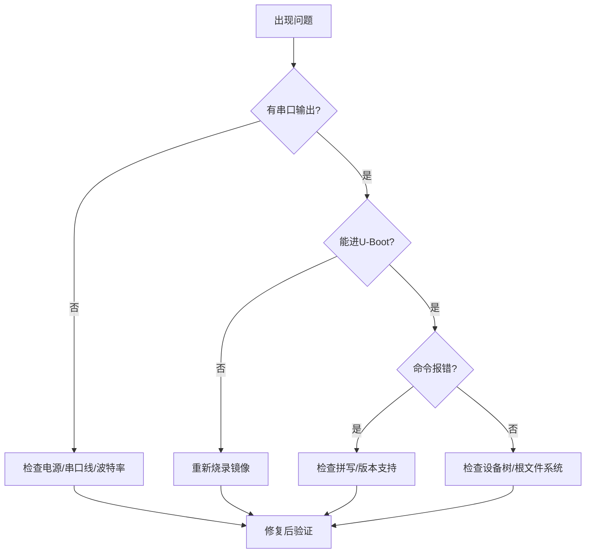

# 3.6.2 常见问题FAQ

> 所属章节：第3章 嵌入式Linux开发环境搭建 > 3.6 调试与故障排除
> 难度：[B] | 预计阅读时间：10分钟

## 本节导读

U-Boot调试中80%的故障遵循相似排查模式。本节汇总10个最高频问题，帮你建立"定位现象→锁定原因→动手修复"的排障思维。

---

## 问题诊断流程 [B]

遇到异常时按此流程排查：



[图1：U-Boot问题诊断通用流程]

---

## Q1：烧录后板子完全没反应 [B]

**现象**：上电后串口空白，LED不闪。

**排查**：量供电电压→查串口TX/RX是否接反→确认波特率115200→重新烧录并校验文件大小。

🔴 **危险**：部分板子需按住BOOT键再上电，查阅手册确认。

---

## Q2：U-Boot倒计时太快 [B]

**现象**：数字飞速跳到0，来不及打断。

```bash
setenv bootdelay 5
saveenv
```

💡 **提示**：开发阶段设5~10秒，量产时设0加速启动。

---

## Q3：串口输出乱码 [B]

**现象**：字符显示为"#$%@"等乱码。

**根因99%是波特率不匹配**。U-Boot默认115200，将终端设为`115200 8N1`即可。

⚠️ **陷阱**：少数板子用1500000等非标波特率，需查看板级文档。

---

## Q4：`fatload` 报 File not found [B]

**现象**：从SD/eMMC加载zImage时找不到文件。

**排查**：确认文件在分区根目录→分区须为FAT32→文件名大小写敏感（`zImage`≠`ZIMAGE`）。

```bash
fatls mmc 0:1    # 查看分区内容
```

---

## Q5：`bootz` 后内核panic [I]

**现象**：启动后打印 `Kernel panic: VFS: Unable to mount root fs`。

**这是根文件系统挂载失败**，不是内核损坏。检查`bootargs`中`root=`是否指向正确设备（如`/dev/mmcblk0p2`），并确认内核编译时开启对应文件系统支持（如`CONFIG_EXT4_FS`）。

---

## Q6：设备树不匹配 [I]

**现象**：内核加载后卡在 `Uncompressing Linux... done, booting the kernel.`。

**原因**：编译的.dtb与实际板子型号不一致。

```bash
printenv fdtfile                      # 查看当前dtb
setenv fdtfile myboard-correct.dtb  # 修改为正确文件
saveenv
```

⚠️ **陷阱**：同厂商不同板子dtb不同，照搬教程易踩坑。

---

## Q7：TFTP传输超时 [B]

**现象**：`tftp`命令返回 `Retry count exceeded`。

**排查**：确认网线已插、同网段→PC端TFTP服务已启动且文件在正确目录→检查防火墙是否拦截UDP 69。

💡 **提示**：先用`ping ${serverip}`测连通性，比反复TFTP高效。

---

## Q8：NFS挂载失败 [I]

**现象**：提示 `nfs: server not responding`。

**修复**：PC端确认`/etc/exports`导出路径且权限为`(rw,no_root_squash)`→执行`sudo exportfs -ra`重载→确认`nfsroot`参数格式正确：`nfsroot=192.168.1.100:/path/to/rootfs,v3,tcp`。

⚠️ **陷阱**：建议显式指定`,v3,tcp`，避免NFSv4兼容性问题。

---

## Q9：U-Boot提示 Unknown command [B]

**现象**：输入`mdio`、`gpio`等命令被告知不认识。

**原因**：U-Boot模块化编译，很多命令需在配置中手动开启。

**修复**：源码目录执行`make menuconfig`，在`Command line interface`中启用对应命令后重编。

---

## Q10：`saveenv` 失败 [I]

**现象**：修改环境变量后`saveenv`报错。

**原因**：存储介质无可写分区、eMMC写保护、或未定义`CONFIG_ENV_IS_IN_MMC`等保存位置宏。

**验证**：执行`env info`查看环境变量存储后端。

---

## 本节总结

10个问题可归为三类：**硬件连接类**（Q1/Q3/Q7）、**配置参数类**（Q2/Q4/Q6/Q9/Q10）、**启动链类**（Q5/Q8）。

| 问题 | 核心关键词 | 第一步查什么 | 难度 |
|------|-----------|-------------|------|
| 烧录后无反应 | 电源/串口 | 量电压、查波特率 | [B] |
| 倒计时太快 | bootdelay | `setenv bootdelay 5` | [B] |
| 串口乱码 | 波特率 | 确认115200 8N1 | [B] |
| fatload失败 | 分区/文件名 | `fatls`确认文件存在 | [B] |
| kernel panic | 根文件系统 | 检查`root=`参数 | [I] |
| 设备树不匹配 | dtb错误 | `printenv fdtfile` | [I] |
| TFTP超时 | 网络不通 | `ping`测连通性 | [B] |
| NFS挂载失败 | 服务端配置 | 检查`/etc/exports` | [I] |
| 命令找不到 | 编译未启用 | menuconfig开启选项 | [B] |
| saveenv失败 | 存储后端 | `env info`查看位置 | [I] |

[表1：U-Boot常见问题速查表]

## 下一步

你已具备独立解决U-Boot阶段大部分故障的能力。第4章将进入Linux内核的世界——学习获取源码、配置编译选项，让亲手编译的内核真正跑起来。

---

## 配套资源

### 表格清单
- 表1：U-Boot常见问题速查表

### 图示清单
- 图1：U-Boot问题诊断通用流程 [mermaid流程图]

### 代码清单
- 代码1：修改bootdelay参数
- 代码2：`fatls`查看分区文件
- 代码3：确认和修改fdtfile设备树文件名
- 代码4：NFS根文件系统参数格式示例
