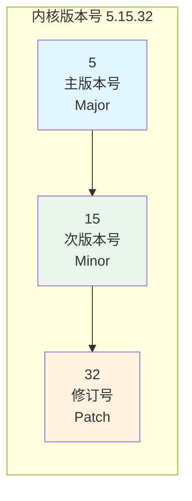
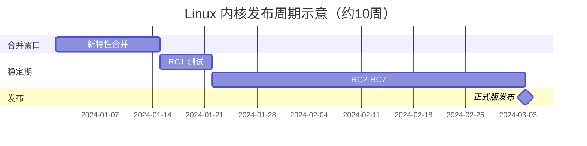

# 4.1.1 内核版本号与发布节奏

> 所属章节：第4章 内核基础 > 4.1 Linux内核概览
> 难度：[B→B] | 预计阅读时间：15分钟

## 本节导读
本节带你认识Linux内核的版本编号规则，学会区分稳定版和开发版，掌握LTS（长期支持）内核的概念。学完本节，你能看懂任何Linux系统的内核版本号，并知道该选哪个版本做嵌入式开发。

---

## 知识点1：版本号格式 [B] ~600字

Linux内核版本号采用**三段式编号**：`主版本.次版本.修订号`。打开任意一台Linux设备，在终端输入以下命令即可看到：

```bash
# 查看当前系统运行的内核版本
$ uname -r
5.15.32
```

以 `5.15.32` 为例，三段数字分别代表：

| 字段 | 名称 | 含义 | 变化频率 |
|------|------|------|----------|
| 5 | 主版本号（Major） | 代表内核的"大世代"，通常在底层架构有重大变革时递增 | 数年一次 |
| 15 | 次版本号（Minor） | 代表该世代的功能更新批次，每2-3个月发布一次 | 数月一次 |
| 32 | 修订号（Patch/Revision） | 仅修复Bug和安全漏洞，不新增功能 | 每周多次 |

[图1：三段式版本号结构示意]



### 稳定版 vs 开发版

Linux内核目前只有一个活跃主线分支（`mainline`），由 Linus Torvalds 亲自维护。新特性在约2周的**合并窗口**期内进入主线，随后经过6-8周的RC测试，发布为新的稳定版。稳定版仅接受Bug修复，适合生产环境。历史上曾用奇偶次版本号区分开发/稳定版（如2.5.x为开发版、2.4.x为稳定版），该做法在3.0时代后已废除。

💡 **提示**：`mainline` 发布后，稳定版维护者 Greg Kroah-Hartman 会接管并创建稳定分支，持续修复Bug。

### 什么是 LTS 内核？

**LTS**（Long-Term Support，长期支持）内核是从稳定版中挑选出来的"重点版本"，会获得比普通稳定版更长的维护周期。普通稳定版只维护到下一个新版本发布为止（约2-3个月），而LTS内核会持续修复Bug和安全漏洞长达数年。

🔴 **危险**：在嵌入式产品中，务必使用LTS内核！普通稳定版停止维护后不再接收安全补丁，继续使用会使设备暴露在已知漏洞之下。

---

## 知识点2：内核发布节奏 [B] ~500字

### 主线版本的发布节拍

Linux内核社区保持着惊人的开发节奏：**大约每9-10周发布一个新的次版本**（如 6.5 → 6.6）。整个发布流程像一列准点的火车：



[图2：内核发布周期甘特图——约2周合并窗口 + 6-8周稳定测试期]

具体阶段如下：

1. **合并窗口**：约2周，Torvalds 接收各大子系统维护者提交的新特性。
2. **RC测试期**：合并窗口关闭后发布 `6.6-rc1`，此后每周发布一个RC版本。通常到 `rc6~rc8` 时，如无重大Bug即发布正式版。
3. **正式发布**：新的次版本号诞生（如 `6.6.0`），进入稳定版维护分支。

### LTS 内核的生命周期

LTS内核的维护周期近年有所变化：

| LTS版本 | 发布时间 | 计划维护终止 | 维护时长 | 嵌入式适用性 |
|---------|----------|-------------|----------|-------------|
| 5.4 | 2019.11 | 2025.12 | ~6年 | 旧平台兼容 |
| 5.10 | 2020.12 | 2026.12 | ~6年 | 平衡稳定与功能 |
| 5.15 | 2021.10 | 2026.10 | ~5年 | 推荐过渡期选择 |
| 6.1 | 2022.12 | 2027.12 | ~5年 | 当前主流推荐 |
| 6.6 | 2023.10 | 2026.12 | ~3年 | 新硬件首选 |
| 6.12 | 2024.12 | 预计~2027 | ~3年 | 最新LTS |

💡 **提示**：选择LTS版本时，不要一味追新。嵌入式产品从开发到量产通常需要1-2年，选择一个已经发布半年以上、社区验证充分的LTS版本，风险更低。

⚠️ **陷阱**：芯片厂商的BSP往往绑定特定LTS版本。若该版本即将结束维护而厂商无迁移计划，产品将失去上游安全支持。

---

## 本节总结

| 概念 | 要点 | 操作建议 |
|------|------|----------|
| 版本三段式 | 主.次.修订，次版本偶数为稳定版 | `uname -r` 快速查看 |
| 稳定版维护 | 普通稳定版约2-3个月，仅修Bug | 生产环境**不要**用非LTS版本 |
| LTS内核 | 选中的重点版本，维护2-6年不等 | 嵌入式开发首选LTS |
| 发布节奏 | 约10周一个新次版本，RC测试驱动 | 关注 `kernel.org` 获取最新动态 |
| 厂商BSP | 往往绑定特定LTS版本，有维护风险 | 选型时评估厂商内核维护策略 |

---

## 下一步
下一节（4.1.2）将带你深入内核源码树的目录结构，认识 `kernel/`、`drivers/`、`arch/` 等核心目录的作用，并动手下载一份完整的内核源码。

---

## 配套资源

### 表格清单
- 表1：三段式版本号字段含义与变化频率
- 表2：近期LTS版本时间表与嵌入式适用性评估

### 图示清单
- 图1：三段式版本号结构示意 [mermaid图]
- 图2：内核发布周期甘特图 [mermaid图]

### 代码清单
- 代码1：使用 `uname -r` 查看当前内核版本

### 延伸阅读
- Linux Kernel Release Model（官方文档）：https://kernel.org/category/releases.html
- LTS 维护者 Greg Kroah-Hartman 的博客：https://www.kroah.com/log/
