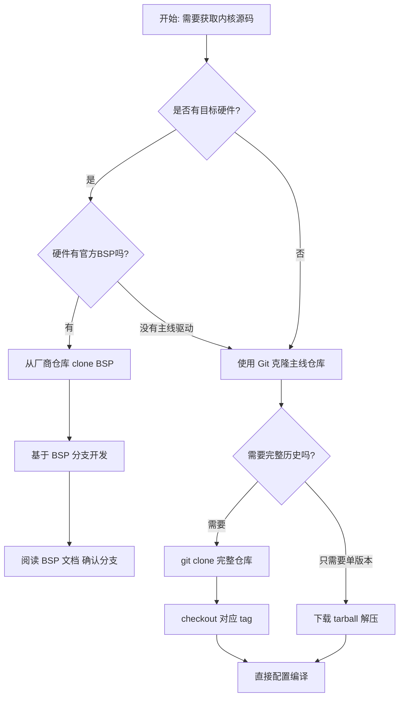

# 4.1.2 获取源码的三种途径

> 所属章节：第4章 内核编译 > 4.1 准备内核源码
> 难度：[B→I] | 预计阅读时间：15分钟

## 本节导读
本节介绍获取Linux内核源码的三种主流途径——下载tarball压缩包、克隆Git仓库、拉取厂商BSP。学完本节，你能根据场景选择最合适的获取方式，并独立完成源码下载与版本切换。

---

## 知识点1：三种获取方式对比 [B] ~1,000字

嵌入式Linux开发中，获取内核源码就像装修房子前选购材料——选对渠道能省去后续大量麻烦。下面介绍的三种方式覆盖了绝大多数场景。

### 方式一：kernel.org 下载 Tarball [B]

kernel.org 是Linux内核的**官方分发站**。每隔一段时间，官方会将某个版本的完整源码打包成 `.tar.xz` 文件（俗称 tarball）发布到网站上。

**适用场景**：
- 只需要某个稳定版本，不需要版本历史
- 编译环境没有Git或网络不稳定
- 需要快速获得一份干净的源码快照

**操作步骤**：

1. 打开浏览器访问 https://kernel.org
2. 找到需要的版本（如 `linux-6.1.50.tar.xz`），复制下载链接
3. 用 `wget` 或 `curl` 下载到本地

```bash
# 下载 Linux 6.1.50 稳定版源码
wget https://cdn.kernel.org/pub/linux/kernel/v6.x/linux-6.1.50.tar.xz

# 解压（-J 表示处理 .xz 压缩格式）
tar -xvf linux-6.1.50.tar.xz

# 查看解压后的目录
cd linux-6.1.50 && ls
```

⚠️ **陷阱**：不要习惯性地用 `tar -zxvf`！`.tar.xz` 需要 `-J` 或 `tar -xvf`（新版tar会自动识别），用 `-z`（gzip）会报错。

---

### 方式二：Git 克隆官方仓库 [B]

Linux内核从2005年起就使用Git进行版本管理。官方仓库托管在 kernel.org，由 Linus Torvalds 维护主分支。

**适用场景**：
- 需要查看版本历史、对比不同版本差异
- 需要在多个版本之间切换（开发/调试/回归测试）
- 计划为内核贡献补丁或跟踪最新开发进度

**仓库地址**：
- 主仓库：`git://git.kernel.org/pub/scm/linux/kernel/git/torvalds/linux.git`
- GitHub镜像：`https://github.com/torvalds/linux.git`（国内访问更友好）

---

### 方式三：厂商/芯片 BSP 仓库 [B]

芯片厂商（如NXP、Rockchip、全志等）会基于某个Linux主线版本，添加自家硬件的驱动、设备树和板级支持代码，形成 **BSP（Board Support Package）**。

**适用场景**：
- 使用特定开发板（如i.MX6ULL、RK3568）
- 需要厂商提供的专用驱动（GPU、VPU、NPU等）
- 厂商有预编译的固件或工具链配套

⚠️ **陷阱**：厂商BSP的版本号看起来和主线一样（比如都叫 `5.10`），但内部可能包含大量未合入主线补丁。直接用主线内核启动可能导致**硬件功能缺失**或**设备树不兼容**。

🔴 **危险**：某些厂商BSP里的闭源驱动（如GPU驱动）基于特定内核API版本编译，一旦换内核版本，驱动模块可能**无法加载（insmod失败）**。

---

### 三种方式对比

| 对比维度 | kernel.org Tarball | Git 官方仓库 | 厂商 BSP 仓库 |
|:---------|:-------------------|:-------------|:--------------|
| 下载体积 | 小（约120MB） | 大（首次约3GB+，含完整历史） | 中等（约200MB-1GB） |
| 版本切换 | ❌ 不可切换，只有单版本 | ✅ 任意切换tag/分支 | ✅ 切换厂商维护的分支 |
| 版本历史 | ❌ 无 | ✅ 完整20年开发历史 | ⚠️ 只有厂商修改历史 |
| 网络要求 | 低，一次HTTP下载 | 高，Git协议长时间连接 | 中，通常走HTTPS/Git |
| 国内访问 | 慢，推荐换镜像源 | 极慢，推荐GitHub镜像 | 取决于厂商仓库位置 |
| 硬件支持 | 通用，主线驱动 | 通用 | 专用，含厂商私有驱动 |
| 适用阶段 | 快速体验、编译学习 | 开发调试、贡献代码 | 产品开发、量产部署 |

💡 **提示**：实际工作中，**三种方式往往组合使用**。比如先用厂商BSP让板子跑起来，再用Git跟踪主线补丁解决某个已知Bug。

---

### 源码获取决策流程

面对一个新项目时，按下图流程判断该走哪条路：



[图1：内核源码获取决策流程图]

---

## 知识点2：实操——Git Clone 与版本管理 [I] ~800字

本节手把手教你从Git仓库下载内核源码，并切换到指定版本。以GitHub镜像为例（国内访问更稳定）。

### 步骤1：克隆仓库 [B]

```bash
# 创建专用目录
mkdir -p ~/linux-src && cd ~/linux-src

# 克隆官方镜像仓库（--depth=1 表示只下载最新一层，节省时间和空间）
git clone --depth=1 https://github.com/torvalds/linux.git

# 完整克隆（保留所有历史，约3GB+，耗时较长）
# git clone https://github.com/torvalds/linux.git
```

💡 **提示**：第一次完整克隆内核仓库在国内可能需要 **30分钟~2小时**。如果只是想编译某个版本，强烈建议加 `--depth=1`，体积骤降到约150MB，几分钟就能下完。

---

### 步骤2：查看可用标签 [B]

内核版本在Git中以 **tag**（标签）的形式存在，如 `v6.1`、`v6.1.50`、`v5.15.120`。

```bash
cd linux

# 列出所有 tag（输出极长，建议配合 grep）
git tag | grep "v6.1"

# 查看最新的几个 tag
git tag --sort=-creatordate | head -20

# 查看某个 tag 的详细信息
git show v6.1.50 --quiet
```

输出示例：

```
v6.1
v6.1-rc1
v6.1-rc2
...
v6.1.49
v6.1.50    <-- 这是我们想要的稳定版
v6.1.51
```

---

### 步骤3：切换到指定版本 [I]

```bash
# 检出（checkout）到指定标签
# 注意：tag 默认是"分离头指针"状态，不能直接修改后提交
git checkout v6.1.50

# 如果后续要在这个版本上做修改并保存，建议创建本地分支
git checkout -b my-custom-v6.1.50 v6.1.50

# 确认当前位置
git log --oneline -1
```

输出确认：
```
1f2c3d4e Linux 6.1.50
```

⚠️ **陷阱**：如果克隆时用了 `--depth=1`，仓库里**只有最新一个提交**，没有历史tag。此时 `git checkout v6.1.50` 会报错：`pathspec 'v6.1.50' did not match any file(s) known to git`。解决办法是重新用完整模式克隆，或只拉取该tag的提交：

```bash
# 如果之前用了 --depth=1，现在需要补全历史到特定tag
git fetch --depth=1 origin tag v6.1.50
git checkout v6.1.50
```

---

### 步骤4：下载速度优化 [I]

国内访问GitHub/KERNEL.ORG速度慢，可用以下方法加速：

```bash
# 方法1：使用国内GitHub加速镜像站
# 将 https://github.com 替换为 https://mirror.ghproxy.com/https://github.com
git clone --depth=1 https://mirror.ghproxy.com/https://github.com/torvalds/linux.git

# 方法2：使用 git 的浅克隆 + 只拉取特定分支
git clone --depth=1 --branch v6.1.50 https://github.com/torvalds/linux.git linux-6.1.50

# 方法3：已克隆的仓库更换远程地址为国内源
git remote set-url origin https://mirror.ghproxy.com/https://github.com/torvalds/linux.git
git pull

# 方法4：配置 git 使用代理（如果你有本地代理服务）
git config --global http.proxy http://127.0.0.1:7890
git config --global https.proxy https://127.0.0.1:7890
```

💡 **提示**：嵌入式开发中常用 `stable` 分支（长期维护版）。rockchip/nxp 等厂商通常基于 `5.10.y` 或 `6.1.y` 这类 LTS（Long Term Support）分支开发。在Git中，这些对应 `linux-stable` 仓库的 tag。

```bash
# 稳定版仓库地址（适合找LTS小版本）
git clone https://git.kernel.org/pub/scm/linux/kernel/git/stable/linux.git --depth=1
```

---

## 本节总结

| 概念 | 要点 | 操作 |
|:-----|:-----|:-----|
| Tarball | 单版本快照，体积小 | `wget` + `tar -xvf` 解压 |
| Git官方 | 完整历史，版本任意切换 | `git clone` → `git checkout tag` |
| 厂商BSP | 含硬件专属驱动和补丁 | 从芯片/板卡手册获取仓库地址 |
| 浅克隆 | 只下载最新一层，节省90%时间 | `git clone --depth=1` |
| Tag切换 | Git中内核版本以tag标记 | `git checkout -b 分支名 tag名` |
| 国内加速 | GitHub访问慢需要镜像或代理 | 替换URL或配置git proxy |

核心原则：**有硬件先找BSP，没硬件用主线，不确定就tarball试手**。

---

## 下一步

源码已就位，但还不能直接编译。下一节 `4.1.3 配置内核（Kconfig入门）` 将带你认识内核配置系统，学会用 `make menuconfig` 开启/关闭功能，并保存自己的配置文件。

---

## 配套资源

### 表格清单
- 表1：三种获取方式对比表（下载体积、版本切换、网络要求、适用场景等7个维度）

### 图示清单
- 图1：内核源码获取决策流程图 [mermaid流程图] —— 根据"是否有硬件""是否有BSP""是否需要历史"三个判断节点选择获取路径

### 代码清单
- 代码1：wget下载tarball并解压（bash）
- 代码2：git clone 官方仓库（完整版与浅克隆对比）
- 代码3：查看tag、checkout标签、创建本地分支（bash）
- 代码4：国内加速git clone的4种方法（bash）
- 代码5：浅克隆仓库补全特定tag的方法（bash）
