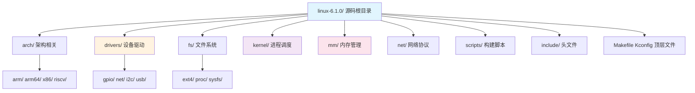

# 4.1.3 内核源码目录结构速览

> 所属章节：第4章 内核源码与构建系统 > 4.1 获取内核源码
> 难度：[B→B] | 预计阅读时间：15分钟

## 本节导读

拿到内核源码压缩包后，解压出来的几千个文件和目录让人望而生畏。本节带你做一次"顶层设计图"级别的游览，快速搞清楚每个目录是干什么的、哪些文件最重要。学完本节，你将能像看地图一样阅读内核源码树，知道去哪里找自己需要的东西。

---

## 知识点1：顶层目录功能 [B][M] ~1,200字

Linux内核源码采用清晰的树状结构组织，顶层大约包含20～30个目录。掌握这些目录的分工，相当于拿到了内核源码的"城市地图"——知道哪个"街区"住着什么样的人。

### 操作步骤：先亲眼看看全貌

拿到源码后，第一步不是急着阅读代码，而是用命令感受一下这个"代码城市"的规模。

1. 进入内核源码目录，查看顶层有哪些目录和文件：

```bash
cd linux-6.1.0/
ls -la
```

2. 用 `tree` 命令只看一层，获得整体印象：

```bash
tree -L 1
```

💡 **提示**：如果你的系统没有安装 `tree`，可以用 `ls -d */` 只显示目录，效果类似。

3. 统计各目录的代码量，快速了解哪里"人多"（代码多）：

```bash
du -sh */ | sort -hr | head -15
```

通常你会看到 `drivers/` 和 `arch/` 是两个最大的目录，这很合理——内核要支持的硬件太多了。

### 八大核心目录逐个讲

下面这8个目录是你需要优先记住的"主干道"。

#### 1. `arch/` — 体系结构相关代码 [B]

这是内核中最"五花八门"的目录。CPU架构不同，底层代码完全不同。`arch/` 下每个子目录对应一种处理器架构：

- `arch/arm/` — 32位ARM处理器（树莓派Zero、旧手机）
- `arch/arm64/` — 64位ARM处理器（树莓派4、Apple Silicon）
- `arch/x86/` — Intel/AMD桌面和服务器CPU
- `arch/riscv/` — RISC-V开源架构（越来越火）

⚠️ **陷阱**：初学时容易把 `arch/arm/` 和 `drivers/` 搞混。记住原则——`arch/` 管的是**CPU本身**（启动、中断、MMU、寄存器），`drivers/` 管的是**CPU外面的设备**（网卡、传感器、屏幕）。

#### 2. `drivers/` — 设备驱动程序 [B]

这是内核源码中体积最大的目录，通常占整个内核代码量的50%以上。从GPIO点灯到WiFi芯片，从LCD屏幕到温度传感器，所有硬件设备的驱动都在这里。

子目录按总线或设备类型组织：
- `drivers/gpio/` — GPIO驱动
- `drivers/net/` — 网卡驱动
- `drivers/i2c/` — I2C总线驱动
- `drivers/usb/` — USB子系统

💡 **提示**：做嵌入式开发时，你80%的时间可能在 `drivers/` 和 `arch/` 两个目录之间来回穿梭。

#### 3. `fs/` — 文件系统 [B]

文件系统代码。Linux支持几十种文件系统，常见的都在这里：
- `fs/ext4/` — 最常用的Linux文件系统
- `fs/vfat/` — FAT32/ExFAT，用于U盘和SD卡
- `fs/proc/` — 虚拟文件系统 `/proc`
- `fs/sysfs/` — 虚拟文件系统 `/sys`

#### 4. `kernel/` — 核心调度与进程管理 [B]

注意！这个目录名字容易让人误解。它不是"整个内核"，而是专指**进程管理、调度器、信号、定时器**等核心机制的代码。

- `kernel/sched/` — 进程调度器（CFS、实时调度）
- `kernel/fork.c` — 创建新进程的核心代码
- `kernel/exit.c` — 进程退出的处理

#### 5. `mm/` — 内存管理 [B]

Memory Management 的缩写。虚拟内存、页表、内存分配、交换分区（swap）的代码都在这里。

- `mm/page_alloc.c` — 物理页分配
- `mm/slab.c` — SLAB分配器（内核对象缓存）

🔴 **危险**：修改 `mm/` 下的代码极易导致内核崩溃或内存泄漏。除非你有十足把握，否则只做阅读。

#### 6. `net/` — 网络协议栈 [B]

完整的TCP/IP协议栈实现，以及socket接口、网桥、路由等网络子系统。

- `net/ipv4/` — IPv4协议实现
- `net/socket.c` — socket系统调用入口
- `net/core/` — 网络核心基础设施

#### 7. `scripts/` — 构建辅助脚本 [B]

内核编译过程中用到的各种脚本和工具，不是内核运行时的一部分。

- `scripts/Makefile` — 内核构建的核心规则
- `scripts/config` — 配置脚本工具
- `scripts/dtc/` — 设备树编译器（Device Tree Compiler）

💡 **提示**：`scripts/` 下的工具在编译内核时会自动调用，你通常不需要手动执行它们。

#### 8. `include/` — 头文件 [B]

内核代码共享的头文件集中地。分为两部分：
- `include/linux/` — 通用内核头文件（如 `kernel.h`、`module.h`）
- `arch/<架构>/include/` — 架构相关头文件（如寄存器定义）

⚠️ **陷阱**：写内核模块时，`#include <linux/module.h>` 中的头文件就来自 `include/linux/`，而不是你系统的 `/usr/include`。

[图1：内核源码目录结构概览]



---

## 知识点2：关键文件介绍 [B] ~600字

除了目录，根目录下还有几个"门面文件"，它们掌控着整个内核的构建和配置流程。

### Makefile — 总指挥官

顶层的 `Makefile` 是内核编译的入口。你执行的 `make menuconfig`、`make -j$(nproc)` 等命令，第一个读取的就是它。

核心职责：
- 设置内核版本号（`VERSION`、`PATCHLEVEL`、`SUBLEVEL`）
- 定义编译目标（`vmlinux`、`bzImage`、`modules`）
- 递归调用各子目录的 `Makefile`

```bash
# 查看内核版本号定义
head -n 5 Makefile
```

### Kbuild — 构建系统的骨架

`Kbuild` 文件定义了内核模块化的构建规则。它告诉编译系统：某个目录下有哪些源文件、哪些需要编译进内核、哪些要编译成模块。

底层目录下的 `Makefile` 实际上都是 `Kbuild` 语法的扩展。例如 `drivers/gpio/Makefile` 中常见这样的写法：

```makefile
# drivers/gpio/Makefile 示例片段
obj-$(CONFIG_GPIO_GENERIC) += gpio-generic.o
obj-$(CONFIG_GPIO_MXC) += gpio-mxc.o
```

`obj-y` 表示编译进内核，`obj-m` 表示编译为 `.ko` 模块，`obj-$(CONFIG_XXX)` 则根据配置决定。

### Kconfig — 配置界面的菜单定义

`Kconfig` 文件描述 `make menuconfig` 图形界面里的菜单结构。每一个可配置的选项（如 `CONFIG_GPIO_MXC`）都在某个 `Kconfig` 文件中定义。

```bash
# 查看GPIO驱动的配置选项定义
cat drivers/gpio/Kconfig | head -n 30
```

你会看到类似这样的条目：

```kconfig
config GPIO_MXC
    tristate "MXC GPIO support"
    depends on ARCH_MXC
    help
      Say yes here to enable GPIO support for Freescale MXC/iMX
```

这定义了一个菜单项，用户可以按 `Y`（编译进内核）、`M`（编译为模块）或 `N`（不编译）。

### MAINTAINERS — 找人指南

这个文件是内核的"通讯录"。当你发现一个bug、想提交补丁，或者想知道某个子系统由谁维护时，查这个文件。

```bash
# 查找GPIO子系统的维护者
grep -A 5 "GPIO SUBSYSTEM" MAINTAINERS
```

输出会告诉你该找谁、邮件列表是什么、对应的Git树在哪里。它是参与内核社区开发的必备工具。

---

## 本节总结

| 目录/文件 | 核心功能 | 初学关注程度 | 典型操作 |
|:----------|:---------|:------------|:---------|
| `arch/` | CPU架构相关代码（启动、中断、MMU） | ★★★★★ | 进入对应架构目录找板级支持 |
| `drivers/` | 设备驱动（占代码量50%+） | ★★★★★ | 按总线类型查找驱动源码 |
| `fs/` | 文件系统实现 | ★★★☆☆ | 查看 `proc/` `sysfs/` 虚拟文件系统 |
| `kernel/` | 进程调度与核心机制 | ★★★★☆ | 阅读 `sched/` 目录了解调度器 |
| `mm/` | 内存管理 | ★★★☆☆ | 慎改！以阅读为主 |
| `net/` | 网络协议栈 | ★★★☆☆ | 查看 `ipv4/` 目录 |
| `scripts/` | 构建辅助脚本 | ★★☆☆☆ | 了解 `dtc/` 设备树工具 |
| `include/` | 内核头文件 | ★★★★☆ | 找 `linux/module.h` 等公共头 |
| `Makefile` | 编译入口 | ★★★★☆ | `head Makefile` 查看版本号 |
| `Kconfig` | 配置菜单定义 | ★★★★☆ | 驱动开发时需阅读对应Kconfig |
| `MAINTAINERS` | 维护者通讯录 | ★★★☆☆ | `grep` 查找责任人 |

## 下一步

搞清楚了"城里每条街住什么人"，接下来就要学习如何进城了——下一节 `4.1.4` 将讲解内核源码的多种获取方式（官网下载、Git克隆、BSP厂商渠道），让你真正拥有一份可编译的内核源码。

---

## 配套资源

### 表格清单
- 表1：内核源码顶层目录与关键文件速查表（见"本节总结"）

### 图示清单
- 图1：Linux内核源码顶层目录结构树状图 [mermaid图，见知识点1末尾]
- 图2：各目录代码量占比饼图（建议配图：用 `cloc` 工具生成的统计图）

### 代码清单
- 代码1：用 `tree -L 1` 查看顶层目录结构
- 代码2：用 `du -sh */` 统计各目录体积
- 代码3：用 `head Makefile` 查看内核版本号
- 代码4：用 `grep` 在 MAINTAINERS 中查找维护者信息

### 扩展阅读
- 官方文档：`Documentation/process/` 目录下的开发流程文档
- 工具推荐：`cloc`（统计代码行数）、`ctags`/`cscope`（代码索引）
