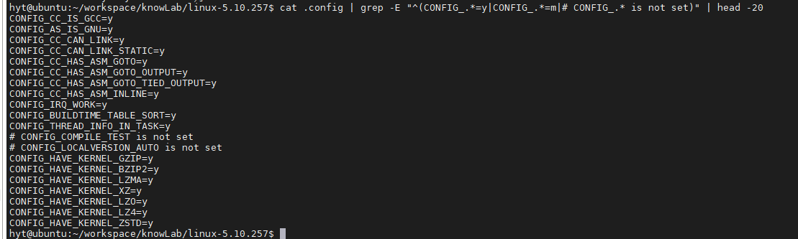

# 4.2.1 Kconfig 为什么存在：从混乱到有序

> 所属章节：第4章 内核配置与编译 > 4.2 配置系统
> 
> 难度：[B→I] | 预计阅读时间：20分钟

## <span class="blue"> 本节导读

本节覆盖：Kconfig 的设计哲学、配置三态 Y/M/N 的含义、Kconfig 与构建系统的流水线关系。读完会理解整个配置系统的**设计意图**，而不是只会机械地勾选。

---

## <span class="blue"> 为什么需要 Kconfig [B]

### 一个惊人的数字

```bash
cd ~/linux-source
find . -name "Kconfig*" | wc -l
# 典型输出：> 800

grep -r "^config" --include="Kconfig*" . | wc -l
# 典型输出：> 15000
```

一个现代内核源码树里有 **800 多个 Kconfig 文件**，管理着 **15000 多条配置选项**。如果直接改 Makefile 来控制这些选项，会发生什么？

### 直接改 Makefile 的灾难

假设没有 Kconfig，想把 EXT4 文件系统编进内核，得在 `fs/Makefile` 里手动加：

```makefile
# 反面教材：没有 Kconfig 的世界
obj-y += ext4/
obj-y += ext4/jbd2/
```

这带来三个致命问题：

| 问题 | 后果 |
|------|------|
| **选项之间没有依赖声明** | 启用了某个驱动，但它依赖的 SMP 或 PCI 没开，编译到一半报错 |
| **没有统一的开关文件** | 改了 10 个 Makefile 后，两周后完全忘了改了哪里 |
| **没有可视化界面** | 新人面对几千行 Makefile，根本不知道哪个选项是干什么的 |

### Kconfig 带来的三个改变

1. **菜单层级化**：像浏览文件系统一样浏览配置。顶层是 `General setup`，进去是 `Device Drivers`，再进去是 `Network device support`，层层递进。

2. **依赖自动化**：每个 `config` 都可以声明 `depends on`。如果要启用 E1000 网卡驱动，但底层没开 PCI 支持，menuconfig 会直接把这个选项**灰掉**，连选错的机会都不给。

3. **配置可持久化**：所有选择最终被汇总到一个文件 `.config`。把它备份好，换一台机器、`make clean` 后再复制回来，编译结果完全一致。

> 💡 Kconfig 的核心设计思想只有一句话——**"用声明式的语法描述选项，用工具自动生成配置界面，用机器检查依赖关系。"**

---

## <span class="blue"> 配置的三态：Y / M / N [B]

当在内核配置界面中移动光标时，会看到每个选项前面有 `[*]`、`[M]` 或 `[ ]` 这样的标记。它们就是内核配置的**三态**（Tristate）。

### 三态的本质区别

| 状态 | 符号 | 含义 | 代码去向 | 何时可用 |
|------|------|------|----------|----------|
| **Y** | `[*]` | 编译进内核 | 成为 `vmlinux` / `zImage` / `uImage` 的一部分 | 开机即可用 |
| **M** | `[M]` | 编译成模块 | 生成独立的 `.ko` 文件 | 需要手动或自动加载后可用 |
| **N** | `[ ]` | 不编译 | 完全不参与编译 | 不可用 |

在 menuconfig 中按空格键可以在三种状态之间循环切换：`[ ]` → `[*]` → `[M]` → `[ ]`。有些选项只有两个状态（布尔型），只能选 `[ ]` 或 `[*]`，这通常表示该功能不支持模块化。

### 在 .config 文件中长什么样

```bash
cat .config | grep -E "^(CONFIG_.*=y|CONFIG_.*=m|# CONFIG_.* is not set)" | head -10
```

典型输出：

```text
CONFIG_BLK_DEV_INITRD=y          ← 编译进内核
CONFIG_USB_STORAGE=m             ← 编译成模块
# CONFIG_VGA_CONSOLE is not set  ← 不编译（状态N）
```



### 三态的实际影响

- **选 Y**：功能在内核启动时自动初始化，始终可用，无法在不重启的情况下移除，占用常驻内存。
- **选 M**：内核启动时它们并不存在，需要等到系统运行后通过 `modprobe` 或 `insmod` 加载。适合热插拔设备。
- **选 N**：代码完全不编译。如果之后想启用，必须重新配置并重新编译内核。

> ⚠️ 某些核心驱动（如根文件系统驱动、中断控制器、时钟源）如果选 M，会导致内核启动失败——因为启动过程中根本没有机会去加载模块！

---

## <span class="blue"> Kconfig 与内核构建系统的关系 [B]

Kconfig 不是孤立存在的。它实际上是一条**数据流水线**的起点，最终决定了哪些 C 文件被编译、哪些头文件被包含。


这条流水线有四个关键产物：

| 产物 | 使用者 | 作用 |
|------|--------|------|
| `.config` | 开发者阅读、备份 | 人类可读的配置清单 |
| `auto.conf` | Makefile | 把配置翻译成 `CONFIG_EXT4_FS=y` 这样的变量 |
| `autoconf.h` | C 编译器 | 把配置翻译成 `#define CONFIG_EXT4_FS 1` 这样的宏 |
| `include/config/` 下的头文件 | Kbuild 依赖追踪 | 判断"哪个配置变了，需要重新编译哪些文件" |

> 💡 `auto.conf` 和 `autoconf.h` 回答的是**同一个配置**在不同语境下的表示问题——Makefile 不懂 C 宏，C 编译器不认识 Makefile 变量。

---

## <span class="blue"> 本节总结 [B]

| 概念 | 要点 | 操作 |
|------|------|------|
| Kconfig 的定位 | 声明式配置语言，管理 15000+ 选项的依赖和层级 | `find . -name "Kconfig*" \| wc -l` 看看有多少 |
| 三态 Y/M/N | Y=内置、M=模块、N=不编译 | 按空格循环切换 |
| `.config` | 人类可读的唯一配置真相源 | `grep CONFIG_XXX .config` 查询 |
| `auto.conf` | Makefile 的"翻译件" | `grep XXX include/config/auto.conf` |
| `autoconf.h` | C 代码的"翻译件" | `grep XXX include/generated/autoconf.h` |

---

## <span class="blue"> 下一步

已经理解了 Kconfig "为什么存在" 和 "三态是什么"。下一节（4.2.2）将动手进入 menuconfig 界面，学习方向键、快捷键、搜索功能和子菜单导航——**在 15000 个选项中快速找到目标项**。

---

## 动手练习

1. 进入内核源码目录，执行 `find . -name "Kconfig*" | wc -l`，确认 Kconfig 文件的数量级。
2. 执行 `grep -r "^config" --include="Kconfig*" . | wc -l`，感受配置选项的庞大数量。
3. 启动 menuconfig：`make menuconfig`（如果报错缺少 `libncurses-dev`，先安装它）。
4. 在 menuconfig 中随意移动光标，观察 `[*]` / `[M]` / `[ ]` 三种状态，按空格键切换，体会三态的含义。
5. 不保存退出（按 `Esc` 两次或选择 `< Exit >`）。
