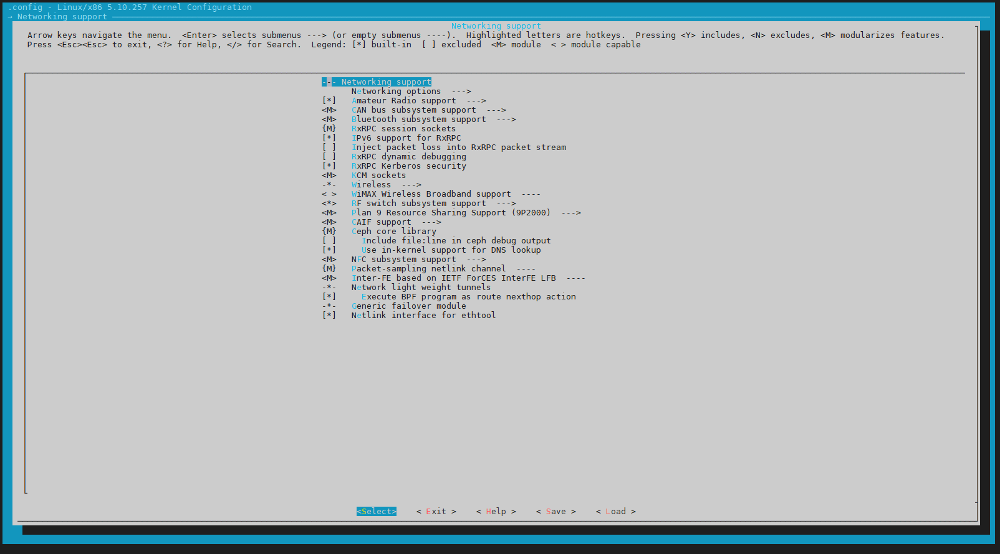
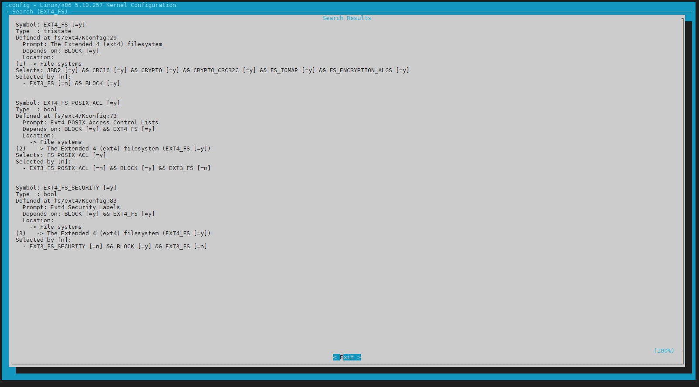
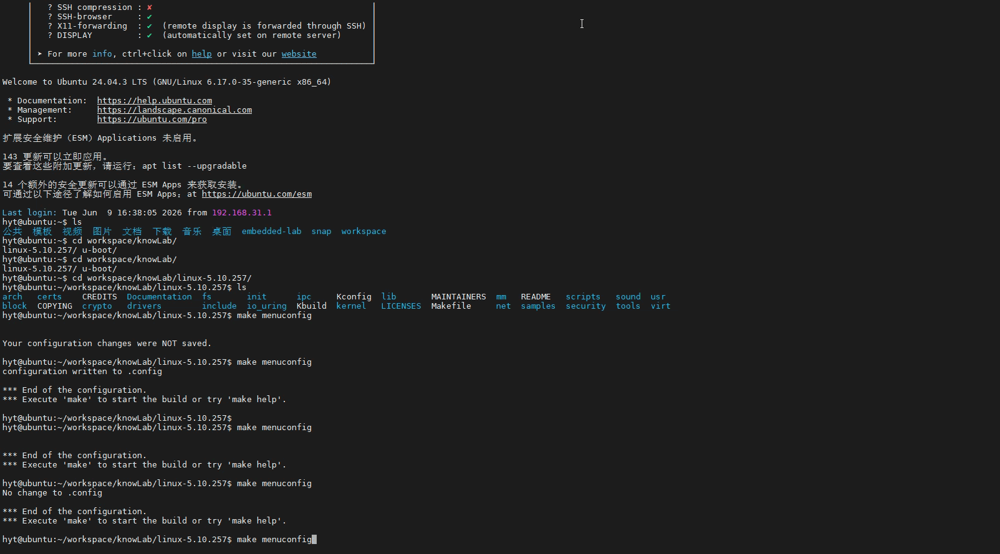

# 4.2.2 menuconfig 实战导航：搜索、勾选、保存

> 所属章节：第4章 内核配置与编译 > 4.2 配置系统
> 
> 难度：[B→I] | 预计阅读时间：20分钟

## <span class="blue"> 本节导读

本节覆盖：menuconfig 界面分区、核心按键、子菜单导航、`/` 搜索功能、配置保存与退出。读完能像操作文件管理器一样在配置界面中自由穿梭，并在 15000 个选项中**用 `/` 搜索瞬间定位**目标。

---

## <span class="blue"> menuconfig 界面分区 [B]



执行 `make menuconfig` 后，屏幕变成一个交互式界面。整个界面划分为三个功能区域：

### 区域一：中部菜单区（主体区域，占 ~80%）

显示当前层级下所有可配置选项。每个选项前面的标记告诉你类型：

| 前缀符号 | 含义 | 说明 |
|:------:|:----:|:-----|
| `[*]` | 布尔-已启用 | 功能是开启状态 |
| `[ ]` | 布尔-已禁用 | 功能是关闭状态 |
| `<M>` | 三态-编译为模块 | 驱动编译成 `.ko` 文件 |
| `< >` | 三态-不编译 | 驱动不编译进内核 |
| `<*>` | 三态-编译进内核 | 驱动直接内置 |
| `(XXX)` | 数值/字符串 | 可输入数字或文本 |
| `--->` | 子菜单 | 按 Enter 进入下一级 |
| `< Exit >` | 返回上级 | 按 Enter 或 Esc 返回 |

菜单项之间用方向键 `↑` / `↓` 移动选择，当前高亮条目以反色显示。

### 区域二：顶栏说明区

屏幕最上方两行显示当前菜单标题和简短说明。当深入到三级、四级子菜单时，这个标题是判断"自己在哪"的唯一路标。

### 区域三：底栏快捷键提示区

屏幕最下方两行列出当前可用快捷键：

```
<Select>  < Exit >  < Help >  < Save >  < Load >
  Enter      Esc        ?         S         L
```

> 💡 底栏提示会根据光标位置动态变化。光标停在数值输入项上时，会额外显示编辑快捷键。

> ⚠️ 如果运行 `make menuconfig` 后屏幕乱码或提示"终端尺寸太小"，是因为终端高度小于 19 行、宽度小于 80 列。拖动窗口拉大后再试。

---

## <span class="blue"> 核心操作按键 [B]

menuconfig 的所有操作通过键盘完成，不需要鼠标。掌握以下 10 个按键即可自由穿梭：

| 按键 | 作用 | 使用场景 |
|:----:|:----:|:---------|
| `↑` / `↓` | 上下移动光标 | 在菜单列表中选择条目 |
| `Enter` | 确认/进入 | 进入子菜单，或确认修改数值 |
| `Esc` (按两次) | 返回上级/退出 | 单次 Esc 取消当前操作，两次 Esc 返回上级 |
| `Space` | 切换选项状态 | 在 `[ ]` ↔ `[*]` 或 `< >` ↔ `<M>` ↔ `<*>` 之间循环 |
| `?` | 查看帮助 | 显示当前选项的详细说明和依赖关系 |
| `/` | 全局搜索 | **在所有配置项中按名称搜索** |
| `q` | 退出 | 从当前菜单退出，若有未保存修改会提示 |
| `s` | 保存配置 | 将当前配置写入 `.config` 文件 |
| `x` | 退出不保存 | 放弃所有修改直接退出 |
| `n` / `y` / `m` | 快速设置三态 | `n`=不编译, `y`=编译进内核, `m`=编译为模块 |

> 💡 如果只记住 4 个键，就记住：**↑↓ 移动、Enter 进入、Esc 返回、Space 切换**。这是 80% 的操作。

---

## <span class="blue"> 子菜单导航 [B]

### 识别子菜单

任何以 `--->` 结尾的菜单项都是子菜单入口。例如：

```
[*] Enable loadable module support  --->
    Bus support  --->
    Device Drivers  --->
    File systems  --->
```

### 进入与返回

1. **进入子菜单**：光标停在带 `--->` 的条目上，按 `Enter`。
2. **返回上级菜单**：按 `Esc` 两次（第一次取消，第二次返回），或光标移到 `< Exit >` 按 `Enter`。
3. **查看当前路径**：顶栏标题实时显示当前位置，例如 `Device Drivers → Character devices`。

> 💡 按 `↑` 超过第一个选项时，光标会循环跳到末尾的 `< Exit >`，这是快速返回上级的捷径。

---

## <span class="blue"> 搜索大法——用 `/` 快速定位任何选项 [B→I]



面对 15000 个选项，最常见的疑问是："XXX 选项在哪一级菜单里？" 答案是 **按 `/` 搜索**。

### 具体操作步骤

1. 在 menuconfig 的任意界面中，直接按 **`/`**（斜杠键）。
2. 屏幕下方弹出搜索框：
   ```
   Search (Enter to exit, ESC to cancel): \_
   ```
3. 输入关键词。搜索是**大小写不敏感**的，输入 `ext4` 和 `EXT4` 效果一样。可以输入：
>   - 选项名称（如 `usb storage`）
>   - 驱动名称（如 `smsc95xx`）
>   - 功能描述（如 `sound`）
>   - 配置符号名（如 `CONFIG_USB_STORAGE` 搜 `USB_STORAGE` 即可）
4. 按回车查看搜索结果。如果结果太多，按空格键翻页，按 `Esc` 退出搜索。

### 搜索结果的五个关键字段

每个搜索结果包含以下信息（这是本节**最需要理解**的部分）：

| 字段 | 含义 | 实战价值 |
|------|------|----------|
| **Symbol** | 配置项的内部名称（如 `USB_STORAGE`）| 在 `.config` 和网上资料中搜索时用的名字 |
| **Type** | 类型（tristate/bool/string/hex/int）| 决定你能选 Y/M 还是只能 Y/N |
| **Prompt** | 菜单中显示的文字 | 确认是不是你要找的那个选项 |
| **Location** | 在菜单树中的路径 | **告诉你"在哪"，按路径导航过去即可** |
| **Depends on** | 依赖哪些选项 | 如果选项灰色，看这里就知道"还差什么没开" |
| **Selected by** | 被谁自动选择 | 排查"为什么这个选项自己变勾了" |

### 搜索后找不到选项？

有些配置选项因为上层依赖未被满足，在菜单中是**隐藏**的。搜索能找到它，但按 Location 路径走过去却看不到。<br>解决方法是**先确保依赖条件被满足**——这正是下一节（4.2.4）要深入的内容。

> ⚠️ 搜索框中不支持"点击跳转"，需要记下 Location 中的路径，手动按 `Esc` 退出搜索框，再一层层导航过去。这是初学者最容易卡壳的地方。

> 💡 搜索框支持正则表达式风格的通配，输入 `EXT.*FS` 可匹配 `EXT2_FS`、`EXT3_FS`、`EXT4_FS` 等同类选项。

---

## <span class="blue"> 修改配置并保存 [B]

### 标准操作流

1. 用 `↑`/`↓` 找到目标选项，或用 `/` 搜索后导航过去。
2. 按 `Space` 切换状态（`[ ]` → `[*]` → `[M]` → `[ ]`）。
3. 按 `s` 保存配置到 `.config`。
4. 按 `q` 退出 menuconfig。

### 保存时的确认对话框

保存时会弹出一个确认框，询问保存路径（默认是 `.config`），直接按回车确认即可。如果不想覆盖，可以指定其他路径（如 `config.backup`）。

> 🔴 `x` 是"退出不保存"，如果花半小时精心配置后手滑按了 `x`，所有修改都会丢失。养成习惯：修改后先按 `s` 保存，再按 `q` 退出。

---

## <span class="blue"> 本节总结 [B]

| 概念 | 要点 | 操作 |
|:----:|:----:|:----:|
| 界面分区 | 顶栏(说明)、中部(菜单)、底栏(快捷键) | 启动后先观察三个区域 |
| 菜单项符号 | `[*]` 布尔、`<M>` 模块、`(值)` 数值、`--->` 子菜单 | 看前缀判断类型 |
| 核心按键 | ↑↓移动、Enter进入、Esc返回、Space切换 | 熟记这4个即可 |
| 搜索 | `/` 全局搜索，看 Location 字段导航 | 按 `/` 输入关键词 |
| 保存退出 | `s` 保存、`q` 退出、`x` 放弃 | 修改后务必先保存 |
| 子菜单 | `--->` 表示有下一级、`< Exit >` 返回 | Esc 两次等价于选 Exit |

---

## <span class="blue"> 下一步

掌握本节内容后，已经可以在配置界面中自由穿梭了。但"能找到"不等于"能看懂"。下一节（4.2.3）将学习**每个配置项背后的含义**——如何读懂 Help 窗口的字段，以及如何理解 `.config` 文件的语法，这才是真正做"有效配置"的开始。

---

## 动手练习

1. 启动 menuconfig：`make menuconfig`。
2. 花 10 秒钟观察界面的三个区域（顶栏、中部菜单、底栏快捷键）。
3. 用 `↓` 键逐行移动，观察底栏提示是否随光标变化。
4. 按 `/` 搜索 `usb storage`，解读搜索结果中的 Symbol、Location 和 Depends on 字段。
5. 根据 Location 路径手动导航到 `USB Mass Storage support`，按 `Space` 切换它的状态，观察 `[ ]` ↔ `[M]` ↔ `[*]` 的变化。
6. 按 `s` 保存，按 `q` 退出。
7. 用 `grep CONFIG_USB_STORAGE .config` 确认保存结果。

