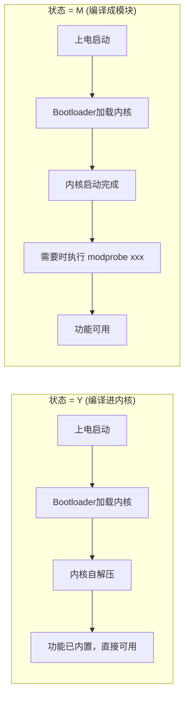
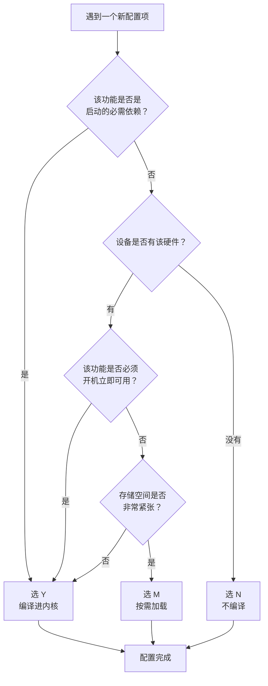

# 4.2.2 配置的三态：Y / M / N

> 所属章节：第4章 构建与配置 > 4.2 Kconfig与内核配置
> 难度：[B→I] | 预计阅读时间：15分钟

## 本节导读

当你在内核配置界面（menuconfig）中移动光标时，会看到每个选项前面有 `[*]`、`[M]` 或 `[ ]` 这样的标记——它们就是内核配置的"三态"（Tristate）。本节将彻底讲清这三种状态的区别、实际影响，以及在嵌入式开发中如何选择。学完本节，你将不再凭直觉打勾，而是能根据产品需求做出最优配置决策。

---

## 知识点1：Y/M/N 三态的含义 [B] ~800字

在Kconfig系统中，大多数驱动和功能选项都有三种可能的状态。这三种状态用一个字母表示：**Y**（Yes）、**M**（Module）、**N**（No）。

### 三态的本质区别

| 状态 | 符号 | 含义 | 代码去向 | 何时可用 |
|------|------|------|----------|----------|
| **Y** | `[*]` | 编译进内核 | 成为 `vmlinux` / `zImage` / `uImage` 的一部分 | 开机即可用 |
| **M** | `[M]` | 编译成模块 | 生成独立的 `.ko` 文件（如 `mydriver.ko`） | 需要手动或自动加载后可用 |
| **N** | `[ ]` | 不编译 | 完全不参与编译 | 不可用 |

[图1：menuconfig界面中的三态符号示意]

在 `menuconfig` 的蓝色界面中，按空格键可以在三种状态之间循环切换：`[ ]` → `[*]` → `[M]` → `[ ]`。有些选项只有两个状态（布尔型），只能选 `[ ]` 或 `[*]`，这通常表示该功能不支持模块化（如某些核心调度特性）。

### 在 .config 文件中长什么样

配置完成后，内核根目录会生成 `.config` 文件（一个隐藏文件），其中记录了所有选项的选择。三态用三种不同的赋值语句表示：

```bash
# 在 ~/linux/.config 文件中查找三态配置
cat .config | grep -E "^(CONFIG_.*=y|CONFIG_.*=m|# CONFIG_.* is not set)" | head -20
```

典型的输出如下：

```text
CONFIG_BLK_DEV_INITRD=y          ← 编译进内核
CONFIG_USB_STORAGE=m             ← 编译成模块
# CONFIG_VGA_CONSOLE is not set  ← 不编译（状态N）
```

### 代码示例：.config 中的三态表示

```text
# === 示例：某嵌入式板卡的 .config 片段 ===

# 文件系统支持 - 核心功能，选Y
CONFIG_EXT4_FS=y
CONFIG_EXT4_FS_POSIX_ACL=y

# 网络驱动 - 可能需要热插拔，选M
CONFIG_USB_RTL8150=m
CONFIG_USB_RTL8152=m

# 不需要的硬件 - 选N
# CONFIG_PCMCIA is not set
# CONFIG_MACINTOSH_DRIVERS is not set

# 调试功能 - 嵌入式通常不需要
# CONFIG_DEBUG_KERNEL is not set
```

### 常见错误

⚠️ **错误1**：分不清 `[M]` 和 `[*]` 的区别。很多初学者看到 `[M]` 以为"选中了一半"，其实它是第三种独立状态——编译成独立的模块文件。

💡 **提示**：如果你发现某个功能在 `menuconfig` 中只能选 `[*]` 或 `[ ]`，不能出现 `[M]`，说明这个功能**不支持模块化**，它要么是内核核心机制，要么作者没有实现模块加载接口。

⚠️ **错误2**：以为选 `N` 就是"暂时不启用"。实际上选 `N` 意味着这段代码**完全不会编译**，甚至连编译检查都不会走。如果你之后想启用它，需要重新配置并重新编译。

---

## 知识点2：三态选择的实际影响 [B] ~600字

选择 Y、M 还是 N，不只是界面上的符号变化，它会在三个维度上产生真实影响：启动行为、镜像大小和功能可用性。

### 影响一：启动时加载 vs 运行时加载



[图2：Y与M的启动加载流程对比]

选 **Y** 的功能在内核启动过程中自动初始化，不需要额外操作。比如根文件系统驱动（EXT4）必须选 Y，否则内核连根分区都挂载不了。

选 **M** 的功能则像"插件"——内核启动时它们并不存在，需要等到系统运行后通过 `insmod` 或 `modprobe` 命令加载。Linux 的 `udev` 机制可以在检测到硬件时自动加载对应的模块。

### 影响二：内核镜像大小的变化

| 选择 | 对 zImage/uImage 的影响 | 对文件系统的影响 |
|------|------------------------|------------------|
| Y | 直接增加内核镜像大小 | 无需额外文件 |
| M | 不增加内核镜像大小 | 需要在文件系统中存放 `.ko` 文件 |
| N | 不增加 | 无需额外文件 |

💡 **提示**：在存储紧张的嵌入式设备上，选 M 可以把 `.ko` 文件放到压缩过的根文件系统中，反而比全部选 Y 更节省整体空间。

### 影响三：功能可用性边界

- **选 Y**：功能始终可用，无法在不重启的情况下移除。占用内存无法释放。
- **选 M**：需要时加载，不需要时卸载（`rmmod`），内存可释放。适合偶尔使用的外设。
- **选 N**：完全不可用。如果想要使用，必须重新配置编译内核。

### 代码示例：模块的手动加载与卸载

```bash
# 查看已加载的模块
lsmod

# 手动加载一个模块（如USB网卡驱动）
modprobe rtl8152

# 查看模块是否加载成功
lsmod | grep rtl8152

# 卸载模块（释放内存）
rmmod rtl8152
```

🔴 **危险**：某些核心驱动（如根文件系统、中断控制器、时钟源）如果选 M，会导致内核启动失败——因为启动过程中根本没有机会去加载模块！

---

## 知识点3：嵌入式场景的推荐策略 [B] ~500字

嵌入式设备通常有明确的硬件边界：CPU型号固定、外设板载、存储空间有限、启动速度要求高。这种确定性让三态选择比桌面Linux更容易决策。

### 决策原则：一张图搞定



[图3：嵌入式场景的三态选择决策流程]

### 具体策略对照表

| 配置项类别 | 推荐选择 | 原因 |
|-----------|---------|------|
| CPU架构核心支持（ARM/x86/MIPS） | Y | 内核运行的基础 |
| 时钟源（Clocksource）、中断控制器 | Y | 启动阶段就必须工作 |
| 根文件系统驱动（EXT4/UBIFS） | Y | 否则无法挂载根分区 |
| 串口控制台（Console） | Y | 调试和日志输出的生命线 |
| 网卡驱动（板载） | Y 或 M | 固定网口可Y，USB网口建议M |
| USB控制器驱动 | Y（主机模式）/ M（设备模式） | 主机模式通常开机需要 |
| USB外设驱动（U盘、摄像头） | M | 热插拔场景，按需加载 |
| WiFi/蓝牙驱动 | M | 可能需要固件，模块化更灵活 |
| 声卡、GPU加速 | M 或 N | 无音频/显示需求的设备选N |
| 调试功能（KDB、TRACE） | N | 生产环境禁用 |
| 不相关架构的驱动（PCIE、PCMCIA） | N | 嵌入式板卡通常没有 |

💡 **提示**：一个实用的经验法则——如果你不确定某驱动是否板载且必须，先选 M。嵌入式设备通常有确定的设备树（Device Tree），`udev` 或 `mdev` 会在检测到硬件后自动加载对应的 `.ko` 模块。

⚠️ **陷阱**：不要为了"精简内核"而把不确定的项都选 N。一旦选 N，之后想用时需要完整重新编译内核+重新烧录，比选 M 多花费几十分钟。

---

## 本节总结

本节核心是三态的含义和选择策略，用下表速查：

| 状态 | 含义 | 镜像影响 | 内存占用 | 嵌入式推荐场景 |
|------|------|----------|----------|----------------|
| **Y** `[*]` | 编译进内核 | 增大zImage | 常驻内存 | 启动必需、核心驱动 |
| **M** `[M]` | 编译成模块 | 不增大zImage | 加载时占用 | 可选外设、热插拔设备 |
| **N** `[ ]` | 不编译 | 无影响 | 无 | 设备无此硬件、不需要的功能 |

记住三条铁律：
1. 启动链上的任何东西（时钟、中断、根文件系统、串口）必须选 **Y**
2. 存在但不一定是开机必需的外设选 **M**，保留灵活性
3. 板上没有的硬件果断选 **N**，减少编译时间和镜像体积

---

## 下一步

理解了三态的含义后，下一节（4.2.3）将深入 `menuconfig` 的操作界面——如何在成百上千个选项中快速定位你要配置的驱动，如何使用搜索功能，以及如何保存和导出配置。你会在真实操作中把本节的三态知识用起来。

---

## 配套资源

### 表格清单
- 表1：Y/M/N三态对比表（状态、符号、含义、代码去向、何时可用）
- 表2：三态选择对镜像大小和文件系统的影响
- 表3：嵌入式场景各类配置项的推荐策略对照表
- 表4：本节总结速查表

### 图示清单
- 图1：menuconfig界面中的三态符号示意 [配图说明]
- 图2：Y与M的启动加载流程对比 [mermaid图]
- 图3：嵌入式场景的三态选择决策流程 [mermaid图]

### 代码清单
- 代码1：在 `.config` 中查找三态配置的grep命令
- 代码2：`.config` 文件中Y/M/N的典型表示示例
- 代码3：模块的手动加载（modprobe）与卸载（rmmod）命令

---

*文档版本：v1.0 | 最后更新：2024年*