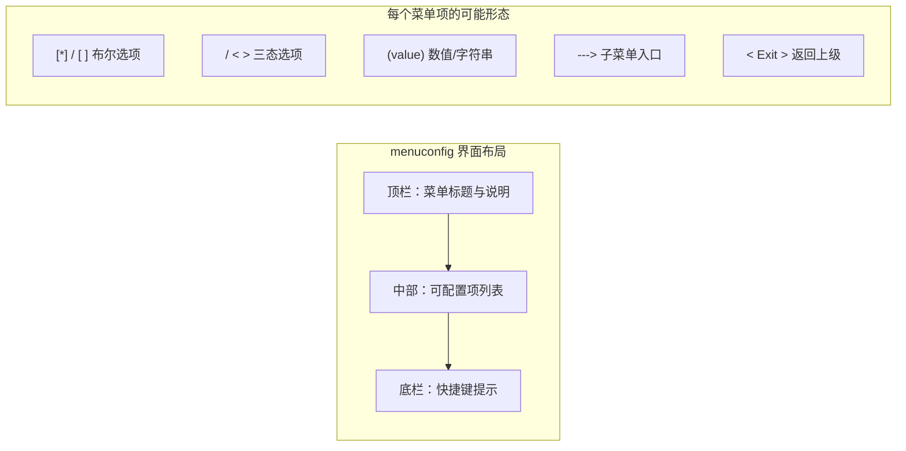

# 4.2.3 menuconfig界面导航全攻略

> 所属章节：第4章 内核构建 > 4.2 用Kconfig配置内核
> 难度：[B→I] | 预计阅读时间：15分钟

## 本节导读
本节带你认识menuconfig的交互界面，掌握方向键、快捷键和子菜单导航的使用方法。读完本节，你可以独立完成内核配置的导航操作，不会因为"看不懂界面"而卡住。

---

## 知识点1：menuconfig界面分区 [B] ~800字

当你执行 `make menuconfig` 后，屏幕不再是黑白滚动的编译日志，而是一个彩色（或单色）的交互式界面。整个界面可以划分为三个功能区域，就像浏览器的地址栏、网页主体和底部状态栏一样各司其职。

### 界面布局概览



### 区域一：中部菜单区（主体区域）

这是界面的核心，占屏幕大约80%的空间，显示当前层级下所有可配置的选项。每个选项前面都有一个标记符号，告诉你这个选项的类型：

| 前缀符号 | 含义 | 说明 |
|:------:|:----:|:-----|
| `[*]` | 布尔-已启用 | 功能是开启状态 |
| `[ ]` | 布尔-已禁用 | 功能是关闭状态 |
| `<M>` | 三态-编译为模块 | 驱动编译成 `.ko` 文件 |
| `< >` | 三态-不编译 | 驱动不编译进内核 |
| `<*>` | 三态-编译进内核 | 驱动直接内置 |
| `(XXX)` | 数值/字符串 | 可输入数字或文本 |
| `--->` | 子菜单 | 按Enter进入下一级 |
| `< Exit >` | 返回上级 | 按Enter或Esc返回 |

菜单项之间用方向键 `↑` / `↓` 移动选择，当前高亮的条目会以反色（或加粗）显示。

### 区域二：顶栏说明区

屏幕最上方两行显示当前菜单的标题和简短说明。标题告诉你"现在站在哪一层菜单"，比如 `Networking support` 或 `Device Drivers → Character devices`。当你深入到三级、四级子菜单时，这个标题是你判断"自己在哪"的唯一路标。

### 区域三：底栏快捷键提示区

屏幕最下方两行列出当前可用的快捷键操作，通常显示为：

```
<Select>  < Exit >  < Help >  < Save >  < Load >
  Enter      Esc        ?         S         L
```

**注意**：底栏提示会根据当前光标所在的菜单项动态变化。如果光标停在数值输入项上，会额外显示 `[ ]` 编辑快捷键；如果停在子菜单上，则只显示导航相关的快捷键。

[图1：menuconfig界面分区示意图，用红/绿/蓝框分别标出顶栏、中部菜单区、底栏快捷键区]

### 操作步骤：启动并观察界面

1. 进入内核源码目录：
   ```bash
   cd ~/linux-source
   ```

2. 运行menuconfig（假设已生成默认配置）：
   ```bash
   make menuconfig
   ```

3. 界面加载后，不要急着操作，先花10秒钟观察三个区域的位置和内容。

4. 用 `↓` 键逐行移动，观察底栏提示是否随光标位置变化。

💡 **提示**：如果你的终端只显示黑白颜色，是正常的。menuconfig支持 ncurses 库的颜色渲染，但部分终端模拟器或串口终端可能不支持彩色输出，功能完全不受影响。

⚠️ **陷阱**：如果运行 `make menuconfig` 后屏幕变成乱码或出现"终端尺寸太小"的提示，是因为终端窗口高度小于19行、宽度小于80列。拖动窗口拉大后再试即可。

---

## 知识点2：方向键与快捷键 [I] ~700字

menuconfig的所有操作都通过键盘完成，不需要鼠标。掌握以下10个按键，你就可以在配置界面中自由穿梭。

### 核心操作按键

| 按键 | 作用 | 使用场景 |
|:----:|:----:|:---------|
| `↑` / `↓` | 上下移动光标 | 在菜单列表中选择条目 |
| `Enter` | 确认/进入 | 进入子菜单，或确认修改数值 |
| `Esc` (按两次) | 返回上级/退出 | 单次Esc取消当前操作，两次Esc返回上级菜单 |
| `Space` | 切换选项状态 | 在 `[ ]` ↔ `[*]` 或 `< >` ↔ `<M>` ↔ `<*>` 之间循环 |
| `?` | 查看帮助 | 显示当前选项的详细说明和依赖关系 |
| `/` | 全局搜索 | 在所有配置项中按名称搜索 |
| `q` | 退出 | 从当前菜单退出，若有未保存修改会提示 |
| `s` | 保存配置 | 将当前配置写入 `.config` 文件 |
| `x` | 退出不保存 | 放弃所有修改直接退出 |
| `n` / `y` / `m` | 快速设置三态 | `n`=不编译, `y`=编译进内核, `m`=编译为模块 |

### 操作演示：修改一个配置项

假设你想启用 `Kernel .config support`（将配置文件嵌入内核镜像），完整操作如下：

```bash
# 在menuconfig界面中执行以下按键序列
↓  ↓  ↓      # 移动到 "General setup"
Enter         # 进入子菜单
↓  ↓  ↓  ↓   # 找到 "Kernel .config support"
Space         # 将 [ ] 切换为 [*]
?             # 查看帮助（可选，确认这个选项的作用）
Esc  Esc      # 两次Esc返回主菜单
s             # 保存配置
Enter         # 确认保存到 .config
q             # 退出menuconfig
```

### 搜索功能详解

按 `/` 键后，屏幕底部弹出搜索框，输入关键词（如 `SPI`），menuconfig会列出所有匹配的选项，并告诉你每个选项当前位于哪个菜单路径下。这是在大海一样的内核配置中定位特定驱动的最快方法。

搜索结果显示示例：
```
Symbol: SPI [=y]
Type  : bool
Prompt: SPI support
  Defined at drivers/spi/Kconfig:1
  Location:
    -> Device Drivers
```

🔴 **危险**：不要同时按下多个键或快速连击。ncurses界面基于终端按键序列，过快的输入可能导致按键丢失或误触发。每个操作之间留半秒间隔。

⚠️ **陷阱**：按 `Space` 切换三态选项时，顺序是 `< >` → `<M>` → `<*>` → `< >` 循环。如果你只想设为模块 (`<M>`) 却不小心按过了变成 `<*>`（内置），需要再按两次 Space 调回来。

💡 **提示**：数值输入项（如 `(16)` 表示进程最大优先级数）需要按 `Enter` 进入编辑模式，输入数字后再按 `Enter` 确认。按 `Esc` 可放弃编辑恢复原值。

---

## 知识点3：子菜单导航 [B] ~400字

内核配置项数量超过一万个，不可能全部平铺在一个页面。Kconfig通过层级菜单来组织这些选项，理解子菜单的进出规则是高效配置的关键。

### 识别子菜单

任何以 `--->` 结尾的菜单项都是子菜单入口。例如：

```
[*] Enable loadable module support  --->
    Bus support  --->
    Device Drivers  --->
    File systems  --->
```

`--->` 是一个视觉指示器，告诉你"这里面还有更多选项"。

### 进出子菜单的操作流程

```mermaid
graph TD
    A[主菜单] -->|Enter on "Device Drivers --->"| B[Device Drivers子菜单]
    B -->|Enter on "Character devices --->"| C[Character devices子菜单]
    C -->|Esc 或 选择 "< Exit >"| B
    B -->|Esc 或 选择 "< Exit >"| A
    A -->|Esc 两次| D[退出menuconfig]
```

[图2：子菜单层级导航示意图，展示从主菜单进入Device Drivers→Character devices，再逐层返回的路径]

### 操作步骤

1. **进入子菜单**：光标停在带 `--->` 的条目上，按 `Enter`。

2. **返回上级菜单**：有两种等价方式：
   - 按 `Esc` 键两次（第一次取消当前输入/选择，第二次返回上级）
   - 光标移到菜单底部或顶部的 `< Exit >`，按 `Enter`

3. **直接返回主菜单**：部分版本的menuconfig支持按 `Home` 键直接跳到主菜单（取决于ncurses版本，不保证所有环境可用）。

4. **查看当前路径**：顶栏标题实时显示当前位置，例如：
   ```
   ┌────────────────────────────┐
   │ Linux/arm 6.1.0 Kernel Con │
   │ figuration                 │
   ├────────────────────────────┤
   │ Device Drivers --->        │
   │     Character devices ---> │
   │         (current screen)   │
   ```

⚠️ **陷阱**：初学者常犯的错误是在子菜单里按 `q` 想返回上级，结果整个menuconfig直接退出了。记住：**Esc是返回上级菜单，`q`是退出整个程序**。

💡 **提示**：每个子菜单的最底部和最顶部通常都有 `< Exit >` 条目。如果你按 `↑` 超过第一个选项，光标会循环跳到末尾的 `< Exit >`；同理按 `↓` 超过最后一个选项会跳到顶部的 `< Exit >`。善用循环跳转可以快速返回上级。

---

## 本节总结

| 概念 | 要点 | 操作 |
|:----:|:----:|:----:|
| 界面分区 | 顶栏(说明)、中部(菜单)、底栏(快捷键) | 启动后先观察三个区域 |
| 菜单项符号 | `[*]`布尔、`<M>`模块、`(值)`数值、`--->`子菜单 | 看前缀判断类型 |
| 核心按键 | ↑↓移动、Enter进入、Esc返回、Space切换 | 熟记这4个即可 |
| 搜索 | `/` 全局搜索配置项 | 按 `/` 输入关键词定位 |
| 保存退出 | `s` 保存、`q` 退出、`x` 放弃 | 修改后务必保存 |
| 子菜单 | `--->` 表示有下一级、`< Exit >` 返回 | Esc 两次等价于选 Exit |

掌握本节内容后，你已经可以像操作文件管理器一样在内核配置界面中自由穿梭了。接下来我们将学习如何理解每个配置项背后的含义——这才是真正做"有效配置"的开始。

---

## 下一步

4.2.4节将讲解**配置项的类型与依赖关系**，带你理解 `[ ]` 和 `<M>` 背后的Kconfig语法，以及为什么某些选项是灰色不可选的（依赖未满足）。只有理解了依赖，你才能在茫茫配置项中做出正确的选择。

---

## 配套资源

### 表格清单
- 表1：menuconfig界面菜单项前缀符号速查表
- 表2：核心快捷键速查表

### 图示清单
- 图1：menuconfig界面分区示意图 [配图说明：用红/绿/蓝框标出顶栏、中部菜单区、底栏快捷键区]
- 图2：menuconfig子菜单层级导航图 [mermaid图]

### 代码清单
- 代码1：启动menuconfig的shell命令
- 代码2：修改一个配置项的完整按键操作序列
