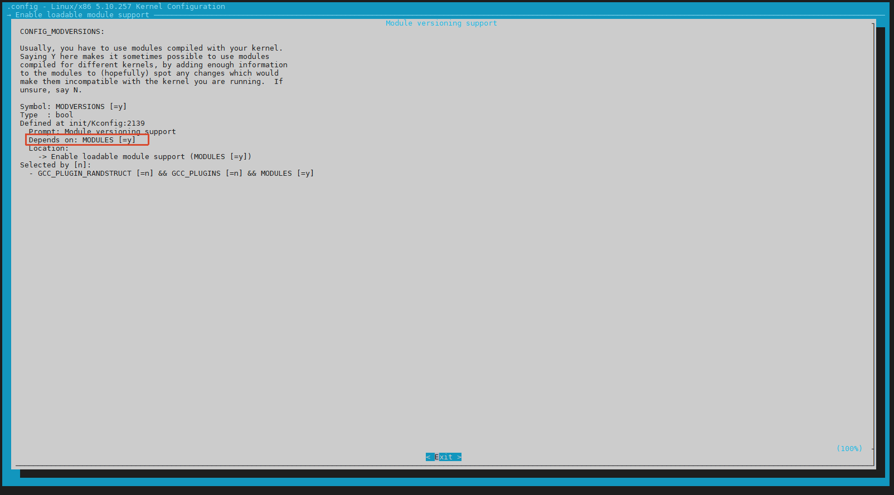

# 4.2.3 读懂配置：Help 窗口与 .config 文件

> 所属章节：第4章 内核配置与编译 > 4.2 配置系统
> 
> 难度：[B→I] | 预计阅读时间：20分钟

## <span class="blue"> 本节导读

本节覆盖：Help 窗口字段解读、利用 Help 做配置决策、.config 文件格式、安全手动编辑方法、备份策略。<BR>读完能从"会找选项"变成"会判断这个选项要不要开"。

---

## <span class="blue"> Help 窗口内容解读 [B]

### 调出 Help 窗口

选中目标选项，按 **`?`** 键（问号键，不需要按 Shift）。屏幕会弹出一个帮助信息窗口。

### Help 窗口的六大字段

下面以 `CONFIG_EXT4_FS` 为例，逐字段拆解：

```text
Symbol: EXT4_FS [=y]
Type  : tristate
Prompt: The Extended 4 (ext4) filesystem
  Location:
    -> File systems
(1)   -> Ext4 filesystem support (EXT4_FS [=y])
  Defined at fs/ext4/Kconfig:1
  Depends on: BLOCK [=y]
  Selected by [n]:
    - EXT4_USE_FOR_EXT2 [=n] && EXT2_FS [=n] && BLOCK [=y]
  Help:
    This is the basic support for the second extended filesystem.
    Ext4 is a high-performance, journaling filesystem. If you want
    to use ext4 as your root filesystem, you must say Y here.

    If unsure, say N if you do not use ext4.
```

| 字段 | 含义 | 实战价值 | 重要程度 |
|------|------|----------|----------|
| **Symbol** | 配置项的内部名称，带 `CONFIG_` 前缀 | 在 `.config` 和网上搜索时用的名字 | 必看 |
| **Type** | 选项的数据类型 | `tristate`=Y/M/N 可选；`bool`=只能 Y/N；`string`/`hex`/`int`=文本/数值 | 必看 |
| **Prompt** | 菜单中显示的文字 | 辅助确认是不是你要找的选项 | 辅助 |
| **Location** | 该选项在菜单树中的位置 | 导航用 | 导航用 |
| **Defined at** | 在哪个 Kconfig 文件中定义 | 查源码时用 | 进阶 |
| **Depends on** | 启用该选项必须先满足的前置条件 | **灰色选项的解锁指南** | 必看 |
| **Selected by** | 有哪些选项会自动选择它 | 排查"为什么这个选项自己变勾了" | 进阶 |


### 三个必须重点理解的字段

**1. Symbol 字段——你的"配置身份证"**

Symbol 告诉你这个选项在源码中的"真名"。当你在网上搜索"怎么开启 ext4"，搜到的答案往往是 `CONFIG_EXT4_FS=y`。Symbol 字段就是帮你把菜单里的描述和网上资料对应起来的桥梁。

**2. Type 字段——决定你能怎么选**

| Type 值 | 可选状态 | 菜单中的样子 | 典型场景 |
|--------|----------|--------------|----------|
| `boolean` | 只有 Y 或 N 两种 | `[ ]` 或 `[*]` | 功能开关，如"启用调试信息" |
| `tristate` | Y、M、N 三种 | `[ ]`、`[M]`或`[*]` | 驱动程序，可内置也可模块化 |
| `string` | 任意文本 | 输入框 | 如默认主机名 |

**3. Depends on 字段——解开"为什么这个选项是灰色的"**

这是 Help 窗口最有实战价值的字段。当一个选项显示为灰色（不可选）时，看这个字段就能知道"我还需要先打开什么"。

例如，某 USB 网卡驱动的 Help 显示：

```text
Depends on: USB [=y] && NET [=y] && USB_USBNET [=n]
```

这告诉你：USB 总线支持和网络子系统已开启（满足），但 `USB_USBNET`（USB 网络适配器框架）**未开启**（不满足！）。你需要先去开启 `USB_USBNET`，这个网卡驱动才会变成可选状态。



> ⚠️ Help 窗口不会实时更新。如果先看了某选项的 Help，然后跑到别处改了一个依赖项，再回来看同一个 Help，显示的 `[=y]`/`[=n]` 状态**不会自动刷新**。需要关闭 Help（按 `Q`），重新选中该选项，再按 `?` 打开，才能看到最新状态。

> 💡 有些选项没有 Help 文本。Kconfig 不强制每个选项都写 Help。如果按 `?` 后只看到了结构字段，没有自由文本说明，说明维护者没写。此时可以记下 `Defined at` 字段的 Kconfig 文件路径，直接去源码目录查看，或在网上搜索 Symbol 名称。

---

## <span class="blue"> 利用 Help 做决策 [B]

知道了 Help 窗口里每个字段的含义，下一步是学会**用这些信息做判断**。

### 四步决策法

1. **确认类型**：看 `Type` 字段。如果是 `tristate`，可选 Y/M/N；如果是 `bool`，只能 Y/N。
2. **判断使用时机**：
>   - 启动时就必须可用（如根文件系统驱动、串口控制台驱动）→ 选 **Y**
>   - 启动后按需加载（如 USB 摄像头驱动、声卡）→ 选 **M**
>   - 根本用不上（如你的板子没有 WiFi 芯片）→ 选 **N**
3. **验证依赖关系**：看 `Depends on` 字段。如果所有依赖项都是 `[=y]`，说明可以直接启用。如果有 `[=n]`，需要先找到并开启那个依赖。
4. **交叉确认**：如果 Help 正文有明确场景描述（如"for embedded systems with limited RAM"），把它和你的实际情况对比。

> 💡 嵌入式原则：启动路径上的选 Y，其他尽量选 M，没有的选 N。

> ⚠️ 不要盲目相信 Help 末尾的标准套话 "If unsure, say N"。很多嵌入式驱动在合入主线时带这个标记，但厂商 BSP 里已经用了很久。判断依据应该是**硬件是否需要它**，而不是看它带什么标签。

---

## <span class="blue"> .config 文件格式 [B]

当你保存配置后，内核源码根目录会生成一个隐藏文件 `.config`（执行 `ls -a` 才能看到）。它本质上是一个纯文本文件，只有三种行：

### 1. 生效的配置项（启用）

```text
CONFIG_SMP=y
CONFIG_MODULES=y
CONFIG_ARM64=y
```

所有配置项名称都以 `CONFIG_` 前缀开头。等号后面的值有三种：

| 值 | 含义 | 类比 |
|:---|:---|:---|
| `y` | 编译进内核（built-in） | 把家具固定在墙上，不可拆卸 |
| `m` | 编译为可加载模块（module） | 像 U 盘，用时插入，不用时拔出 |
| 字符串/数值 | 文本或数字配置 | 如默认主机名、内存分区大小 |

### 2. 注释行（明确禁用）

```text
# CONFIG_IPV6 is not set
```

以 `#` 开头的注释行中，`# CONFIG_XXX is not set` 表示该功能被**明确禁用**。这与"从未配置过"有微妙区别——menuconfig 生成的 `.config` 会用这种方式记录你主动取消勾选的项。

> ⚠️ 如果某个选项未被选中，它在 `.config` 文件中**不会出现**（或被注释掉），而不是写成 `CONFIG_XXX=n`。这是新手最容易误解的地方。

---

## <span class="blue"> 安全地手动编辑 .config [I]

既然 `.config` 是纯文本，能否跳过 menuconfig，直接用 Vim 或 VS Code 编辑它？**答案是肯定的，但必须了解风险。**

### 为什么可以手动编辑

- 格式简单：只有 `CONFIG_XXX=y/m/值` 和 `# 注释` 两种语法
- 速度快：如果你知道确切要改哪个选项，直接搜索替换比层层进入菜单更高效
- 自动化友好：脚本生成 `.config` 是实现自动化编译的必要手段

### 三大注意事项

1. **依赖关系**：内核配置项之间存在复杂的依赖链。手动编辑会跳过 Kconfig 的依赖检查，导致选出非法组合。例如你手动打开了 `CONFIG_USB_STORAGE` 但漏开了 `CONFIG_USB`，编译时可能会报晦涩错误。
2. **无效值**：如果你写成 `CONFIG_XXXXXXX=y`，而 `XXXXXXX` 根本不是合法配置项，构建系统不会报错，只是白白占了一行。
3. **格式陷阱**：`CONFIG_SMP = y`（等号两侧有空格）是**错误的**！`.config` 解析器对空格敏感，这会被视为无效行。

### 修改后的恢复：make oldconfig

手动编辑后，最安全的做法是执行：

```bash
cp .config .config.backup        # 先备份
vim .config                       # 手动修改
make oldconfig                    # 恢复一致性
```

`make oldconfig` 以内核源码中最新的 Kconfig 文件为基准，检查 `.config` 中的每个选项，对新增选项或依赖缺失逐个询问（或按默认值处理），最终生成一个**完整且一致**的新 `.config`。

> 💡 如果不想被交互式提问打断，可以用 `make olddefconfig`，它会自动对所有新选项使用默认值。

> 🔴 永远不要在内核构建过程中手动编辑 `.config`。构建系统会缓存配置状态，运行时修改可能导致不可预知的行为。正确流程是：停掉编译 → 修改 `.config` → 执行 `make oldconfig` → 重新编译。

---

## <span class="blue"> .config 的存放与备份 [B]

### 默认位置

`.config` 默认放在**内核源码根目录**，`make` 时会自动读取。

### 自定义位置

```bash
export KCONFIG_CONFIG=/path/to/my_defconfig
make menuconfig      # 会读取指定路径的配置
make                 # 同样使用指定路径的配置
```

### 备份策略

| 场景 | 备份方式 | 命令示例 |
|:---|:---|:---|
| 日常修改前 | 本地副本 | `cp .config .config.bak.$(date +%Y%m%d)` |
| 发布给团队 | 导出为 defconfig | `make savedefconfig`（生成精简差异文件） |
| 归档保存 | 版本控制 | `git add -f .config` 或单独存放到 configs/ 目录 |

> ⚠️ 执行 `make distclean` 或 `make mrproper` 会**删除 `.config`**！这是内核清理命令的默认行为。在执行这类清理操作前，务必确认已备份。

---

## <span class="blue"> 本节总结 [B→I]

| 概念 | 要点 | 操作 |
|:---|:---|:---|
| Help 窗口调出 | 选中选项后按 `?` 或 `H` 键 | 在任意选项上按 `?` |
| Symbol 字段 | 选项的真名，对应 `.config` 中的 `CONFIG_XXX` | 用于搜索和提问 |
| Type 字段 | 决定可选状态：tristate(Y/M/N) 或 bool(Y/N) | 看到 tristate 就知道可以模块化 |
| Depends on | 前置依赖清单，`[=n]` 表示尚未满足 | 灰色选项的解锁指南 |
| 帮助正文 | 人话版说明书，质量看维护者良心 | 作为决策参考，但不是唯一依据 |
| 四步决策法 | 确认类型 → 判断时机 → 验证依赖 → 交叉确认 | 拿不准时按流程走 |
| `CONFIG_` 前缀 | 所有内核配置项的统一命名前缀 | `grep CONFIG_SMP .config` |
| 手动编辑 | 可以但需谨慎，可能破坏依赖一致性 | 编辑后执行 `make oldconfig` |
| 备份策略 | `cp` 备份、`savedefconfig` 导出、版本控制归档 | `make savedefconfig` |

---

## <span class="blue"> 下一步

已经掌握了"看懂配置"的能力。但配置界面中还有一个让初学者最困惑的现象：**有些选项是灰色的，按空格也切换不了**。下一节（4.2.4）将深入 Kconfig 的依赖机制，彻底理解 `depends on`、`select` 和 `choice` 是如何决定一个选项能否被勾选的。

---

## 动手练习

1. 启动 menuconfig，找到一个你认识的选项（如 `EXT4`），按 `?` 查看 Help。
2. 逐字段解读 Symbol、Type、Location、Depends on，确认你理解每个字段的含义。
3. 找到一个灰色不可选的选项，查看它的 Help 中的 `Depends on`，定位是哪个依赖未满足。
4. 退出 menuconfig，执行 `ls -a`，找到 `.config` 文件。
5. 用 `grep CONFIG_EXT4_FS .config` 查看它的三态表示。
6. 复制 `.config` 为 `.config.bak`，用文本编辑器打开 `.config`，手动修改一行（如改某个值为 `m`）。
7. 执行 `make olddefconfig`，观察是否有新增选项被询问（如果没有，说明你的修改是合法的）。
8. 对比修改前后的 `.config` 差异：`diff .config.bak .config`。
