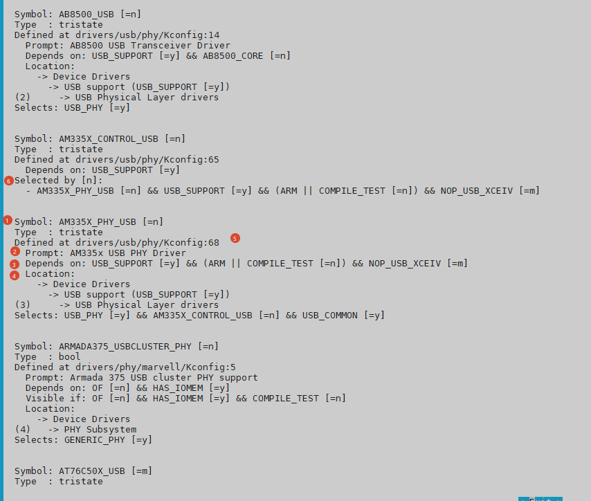
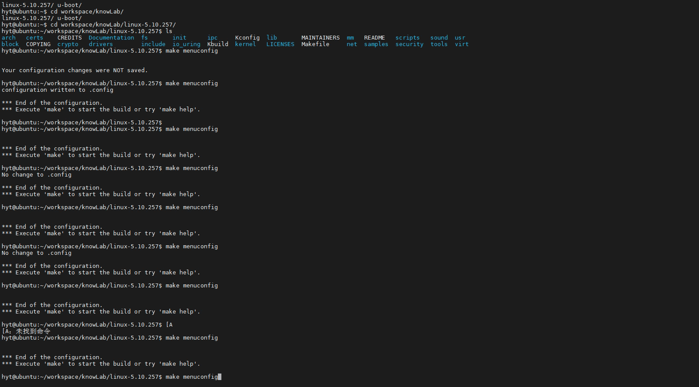

# 4.2.4 依赖关系：为什么选项是灰色的

> 所属章节：第4章 内核配置与编译 > 4.2 配置系统
> 
> 难度：[I→E] | 预计阅读时间：20分钟

## <span class="blue"> 本节导读

本节覆盖：depends on 反向依赖、select 正向依赖、imply 弱化选择、choice 互斥机制、promptless 无提示符号。读完能独立解锁灰色选项，并理解为什么某些选项会"自动被勾选"。

---



## <span class="blue"> depends on——反向依赖，"你想出现？先满足条件" [I]

`depends on` 规定了一个选项**可被用户看到并操作**的前提条件。只有当指定的符号被选中（值为 `y` 或 `m`）时，这个选项才会从灰色状态变为可配置状态。

### 典型示例

```kconfig
config USB_STORAGE
    tristate "USB Mass Storage support"
    depends on USB && SCSI
```

USB 大容量存储功能只有在 `USB` 和 `SCSI` 都被选中后才会从灰色变为可选。如果 `SCSI` 没有配置，`USB_STORAGE` 对用户完全不可见（除非进入专家模式）。

### 逻辑组合

- `depends on A && B`：同时依赖两个符号，必须都满足
- `depends on A || B`：满足其一即可
- `depends on A && (B || C)`：组合条件

### 实战：解锁一个灰色选项

1. 在 menuconfig 中找到灰色选项，按 `?` 查看 Help。
2. 记录 `Depends on` 字段中所有 `[=n]` 的项（这些就是未满足的依赖）。
3. 按 `/` 搜索这些未满足项的 Symbol 名称，导航到对应菜单位置并启用。
4. 返回原选项，此时它应该已变为可选状态。

> 💡 如果依赖项本身也是灰色的，说明它还有上层依赖。需要逐层向上追溯，直到找到最顶层的那个未满足条件，从上往下逐个开启。这就像一个"解锁链"。

---

## <span class="blue"> select——正向依赖，"我选了，你也必须跟着选" [I]

与 `depends on` 不同，`select` 的作用是**自动强制选中**另一个符号，常用于"选了上层功能就必须启用底层基础设施"的场景。

### 典型示例

```kconfig
config TCP_CONG_CUBIC
    tristate "CUBIC TCP"
    default y
    select CRYPTO_SHA256
```

一旦选中了 `TCP_CONG_CUBIC`，`CRYPTO_SHA256` 就会被**自动打上勾**，即使 `CRYPTO_SHA256` 本身在菜单中不可见。这确保了 CUBIC 拥塞控制算法需要的哈希计算能力始终可用。

### select 的陷阱

> ⚠️ `select` 是单向强制的，它**不会检查**被 `select` 的符号自身依赖是否满足。如果 `A select B`，而 `B depends on C` 且 `C` 未选中，那么 Kconfig 会进入**不一致状态**。这种不一致通常不会立刻报错，但可能导致编译失败或运行时异常。

### imply——select 的弱化版本

`imply` 表示："我建议你选它，但如果用户明确取消，尊重用户决定"。

```kconfig
config NETFILTER_XT_MATCH_TCPMSS
    tristate "TCPMSS match support"
    imply NETFILTER_XT_TARGET_TCPMSS
```

---

## <span class="blue"> 互斥选项——choice 多选一 [I]

在内核中，经常遇到"A、B、C 三种方案只能选一种"的需求。Kconfig 的 `choice` 关键字专门处理这类**多选一**场景。

### 典型示例

```kconfig
choice
    prompt "Default I/O scheduler"
    default DEFAULT_CFQ

config DEFAULT_DEADLINE
    bool "Deadline"

config DEFAULT_CFQ
    bool "CFQ"

config DEFAULT_NOOP
    bool "No-op"
endchoice
```

`choice` 块内的所有选项构成一个**单选按钮组**。用户只能选中其中一项（对于 `bool` 类型），Kconfig 会自动确保互斥性。

### 注意事项

> ⚠️ `choice` 内不能混用 `tristate` 和 `bool` 类型。如果一个成员是 `tristate`，其他成员也必须都是 `tristate`，否则 Kconfig 解析会报错或行为异常。

> 🔴 在 `choice` 成员上使用 `select` 强制选中另一个 `choice` 内的符号，会破坏互斥性，导致配置逻辑混乱。**永远不要这样做**。

> 💡 `choice` 块本身可以设置 `optional` 属性，表示"可以不选任何一项"。默认情况下用户必须选一项。

---

## <span class="blue"> 强制选项——看不见但已经选中的符号 [I]

在内核配置中，有些符号没有对应的菜单条目，用户在任何菜单中都找不到它，但它确确实实存在于 `.config` 文件中。这类符号被称为 **promptless symbol（无提示符号）**。

### 没有 prompt 的 config

```kconfig
config HAVE_PERF_EVENTS
    bool
    select HAVE_ARCH_PERF_EVENTS
```

注意这个定义**没有 `prompt "xxx"` 行**。这意味着它永远不会出现在 menuconfig 的交互界面中。但它可以被其他符号 `depends on`、`select` 或 `imply`。

### 设计意图

- **平台能力声明**：如 `HAVE_PERF_EVENTS` 表示当前架构硬件上支持性能监控单元，不是用户"配置"出来的，而是平台代码"声明"出来的。
- **条件编译开关**：作为多个功能共享的底层条件，由上层功能的 `select` 统一触发。

```kconfig
config HAVE_PERF_EVENTS
    bool

config PERF_EVENTS
    bool "Kernel performance events and counters"
    depends on HAVE_PERF_EVENTS
```

在这个结构中，`HAVE_PERF_EVENTS` 是平台代码自动设置的，而 `PERF_EVENTS` 才是用户可以开关的功能。如果平台不支持，`PERF_EVENTS` 直接灰色不可见，避免用户困惑。

> 🔴 手动修改 `.config` 文件时，不要随意给 promptless symbol 添加 `CONFIG_XXX=y` 或 `# CONFIG_XXX is not set`，因为它们通常被 Kconfig 的依赖系统严格控制。改错可能导致 `make` 时大量配置被静默修正，产生难以排查的编译问题。

---

## <span class="blue"> 在源码中定位依赖链 [I]

如果你想深入了解某个符号的依赖关系，可以直接在源码中追踪：

```bash
# 搜索该符号的 Kconfig 定义
grep -rn "config USB_STORAGE" drivers/usb/storage/ arch/ configs/ 2>/dev/null

# 更通用的搜索：查看所有 Kconfig 中对该符号的引用
grep -rn "USB_STORAGE" $(find . -name "Kconfig*") | head -30
```

查看定义处的 `depends on` 和 `select` 行，逐层向上追溯，可以画出完整的依赖关系图。

> 💡 也可以使用 `make menuconfig` 中选中选项后按 `?` 键，直接查看 Help 中列出的依赖关系。对于 90% 的日常场景，这已经足够。

---

## <span class="blue"> 本节总结 [I→E]

| 概念 | 方向 | 作用 | 典型场景 | 注意事项 |
|------|------|------|----------|----------|
| `depends on` | 反向 | 选项可见/可操作的前提条件 | USB 存储依赖 USB 和 SCSI 总线 | 依赖不满足时选项灰色或隐藏 |
| `select` | 正向 | 自动强制选中另一符号 | CUBIC 算法自动选中 SHA256 | 不检查被选项的依赖链，可能引发不一致 |
| `imply` | 正向（弱） | 建议选中，但允许用户取消 | 功能建议配套子功能 | 被明确取消时尊重用户 |
| `choice` | 互斥 | 多选一的单选组 | IO 调度器、init 系统 | 成员类型必须一致；不能用 select 破坏互斥 |
| promptless | 自动 | 无菜单但参与依赖链 | 平台能力声明 | 不要手动改 `.config` 控制 |

---

## <span class="blue"> 下一步

已经掌握了配置系统的全部核心机制：设计哲学（4.2.1）、界面操作（4.2.2）、配置解读（4.2.3）和依赖关系（4.2.4）。下一节（4.2.5）将学习一个省时省力的技巧：**defconfig 默认模板**。它不需要从零勾选 15000 个选项，而是站在巨人的肩膀上，加载一份经过验证的默认配置，再在此基础上微调。

---

## 动手练习

1. 启动 menuconfig，找到至少一个灰色选项，按 `?` 记录它的 `Depends on` 字段。
2. 根据 `Depends on` 中的路径，逐层向上找到最顶层的未满足依赖，开启它。
3. 返回原选项，确认它已从灰色变为可选。
4. 在源码中搜索一个你认识的 config 符号（如 `CONFIG_USB_STORAGE`），查看它所在 Kconfig 文件中的 `depends on` 和 `select` 语句。
5. 尝试在 menuconfig 中找到一个 `choice` 块（如 I/O 调度器选择），观察它如何强制单选。
6. 退出 menuconfig，不保存。

