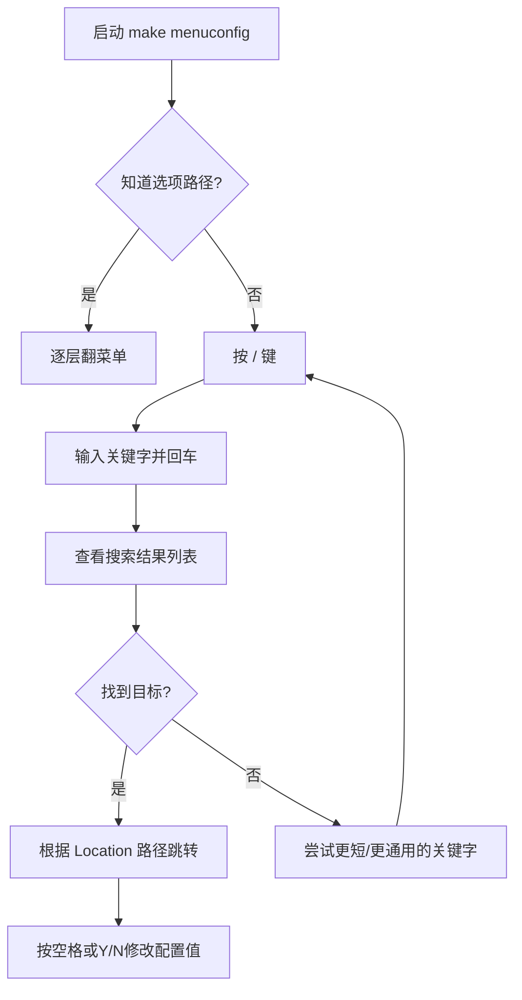

# 4.2.4 搜索大法：用"/"快速定位任何选项

> 所属章节：第4章 内核构建系统与配置机制 > 4.2 内核配置系统与Kconfig
> 难度：[B→I] | 预计阅读时间：15分钟

## 本节导读
内核源码树中有数万条配置选项，翻菜单找到它们无异于大海捞针。本节教你用 `/` 搜索功能三秒内定位任何配置选项，并学会解读搜索结果中的依赖关系，彻底告别"这个选项在哪里？"的困惑。

---

## 知识点1：按 `/` 弹出搜索框，输入关键字即刻查找 [B] ~800字

当你面对 `make menuconfig` 打开的庞大菜单树时，最常见的疑问是：**"XXX 选项在哪一级菜单里？"** 比如你想启用 `USB Mass Storage` 支持，却不想一层层翻 `Device Drivers → USB support → USB Mass Storage support` 的三层菜单。

内核配置界面的设计者早已想到了这个问题——他们内置了一个全局搜索引擎，快捷键就是 **`/`** 。

### 搜索流程总览

下图展示了从启动搜索到定位选项的完整流程：



**图1：menuconfig 搜索定位流程图**

### 具体操作步骤

1. **进入配置界面**
   ```bash
   # 在内核源码根目录执行
   cd ~/linux-source
   make menuconfig
   ```

2. **激活搜索** [B]
   在任意菜单界面中，直接按键盘上的 **`/`**（斜杠键），屏幕下方会弹出一个搜索对话框：
   ```
   Search (Enter to exit, ESC to cancel): \_
   ```
   光标闪烁等待你输入。

3. **输入关键字** [B]
   输入你记得的**任何片段**：选项名称、缩写、甚至文件系统类型名。例如：
   - 要找 `CONFIG_USB_STORAGE`，可以输入 `usb storage` 或 `mass storage` 或简单的 `usb_stor`
   - 要找 `EXT4` 文件系统支持，可以输入 `ext4` 或 `The Fourth Extended Filesystem`

   搜索是**大小写不敏感**的，输入 `ext4` 和 `EXT4` 效果一样。输入完成后按 **回车键**。

4. **查看搜索结果**
   界面上方会显示一个结果列表，每个结果包含四条关键信息（见知识点2）。如果结果太多，按 **空格键** 翻页，按 **ESC** 退出搜索回到原菜单。

5. **根据路径跳转（关键一步）**
   记下搜索结果中 **Location** 一行给出的路径，然后按 **ESC** 退出搜索框，手动导航到该菜单位置即可找到目标选项。

   💡 **提示**：目前 menuconfig 的搜索界面还不支持"点击跳转"，需要人工按路径导航。这是初学者最容易卡壳的地方，记住：**搜索告诉你"在哪"，但还需要你自己走过去**。

### 代码示例：一次完整的搜索会话

```bash
# 终端中启动配置
$ make menuconfig

# 在菜单中按 /，然后输入：
usb storage

# 搜索结果示例（界面中实际显示为带框的文本区域）：
# ┌─────────────────────────────────────────────────────────────┐
# │ Symbol: USB_STORAGE [=n]                                    │
# │ Prompt: USB Mass Storage support                            │
# │   Defined at drivers/usb/storage/Kconfig:21                │
# │   Location:                                                  │
# │     -> Device Drivers                                        │
# │       -> USB support (USB_SUPPORT [=y])                      │
# │         -> USB Mass Storage support                          │
# │   Depends on: USB [=y] && SCSI [=y]                          │
# │   Selected by: <choice>                                     │
# │ ┌──────────────────────────────────────────────────────────┐│
# │ │USB Mass Storage driver for Linux                          ││
# │ │Say Y here if you want to use USB ...                      ││
# │ └──────────────────────────────────────────────────────────┘│
# └─────────────────────────────────────────────────────────────┘

# 记下 Location 中的路径：
# Device Drivers → USB support → USB Mass Storage support
# 按 ESC 退出搜索框，手动导航过去
```

### 常见错误

⚠️ **陷阱1：搜索后找不到选项**
有些配置选项因为上层依赖未被满足（例如 `USB_SUPPORT` 未启用），在菜单中是被**隐藏**的。搜索能找到它，但你按照 Location 路径走过去却看不到。解决方法是先确保依赖条件被满足（见知识点3）。

⚠️ **陷阱2：搜索关键字太短导致结果爆炸**
输入 `usb` 可能返回上百条结果。建议使用更精确的关键字，比如 `usb storage` 而非 `usb`，或者使用选项的**配置符号名**（如 `USB_STORAGE`）。

💡 **提示**：搜索框中支持 **正则表达式风格** 的通配，你可以输入 `EXT.*FS` 来匹配 `EXT2_FS`、`EXT3_FS`、`EXT4_FS` 等同类选项。

---

## 知识点2：读懂搜索结果的四个核心字段 [B] ~700字

搜索结果界面虽然文字密集，但结构非常固定。看懂下面四个字段，你就能从任何搜索结果中准确推断出"这个选项是什么、在哪里、怎么才能启用"。

### 搜索结果字段解读表

| 字段名 | 示例值 | 含义说明 | 如何利用它 |
|--------|--------|----------|------------|
| **Symbol** | `USB_STORAGE [=n]` | 内核配置系统使用的内部符号名，大写，带括号内的当前值 | 在源码中 grep 这个符号，可快速找到相关代码和Kconfig定义 |
| **Prompt** | `USB Mass Storage support` | 菜单中实际显示给用户的文字描述 | 在菜单中按这个文字核对是否找到正确的位置 |
| **Location** | `Device Drivers → USB support → ...` | 该选项在菜单树中的完整层级路径 | 按照此路径一层层进入子菜单，最终定位到目标选项 |
| **Defined at** | `drivers/usb/storage/Kconfig:21` | 定义该选项的Kconfig文件及行号 | 用 vim 或 less 打开该文件，可查看完整的依赖逻辑和 help 文本 |
| **Depends on** | `USB [=y] && SCSI [=y]` | 该选项能被显示/启用的前置条件 | 检查这些依赖符号的值是否为 `y`，否则当前选项会被隐藏或灰色不可选 |
| **Selected by** / **Implied by** | `<choice>` 或 `MMC_BLOCK [=n]` | 有哪些其他选项会自动选中/暗示本选项 | 如果找不到手动启用的位置，可能是因为被某个上层选项自动选择了 |

**表1：menuconfig 搜索结果六字段速查表**

### 逐字段实战讲解

**Symbol 字段** [B]
这是配置系统真正的"身份证号"。内核源码中所有以 `CONFIG_` 为前缀的宏定义，都是从这个符号生成的。比如 `Symbol: USB_STORAGE` 意味着编译后源码中会出现：
```c
#ifdef CONFIG_USB_STORAGE
// USB存储相关的驱动代码
#endif
```
如果你在内核源码根目录执行 `grep -r "CONFIG_USB_STORAGE" --include="*.c" --include="*.h"`，能找到所有依赖这个功能的代码文件。

**Location 字段** [B]
这是最重要、最实用的字段。它用箭头 `→` 展示了从主菜单开始的完整导航路径。

```
Location:
  -> Device Drivers
    -> USB support (USB_SUPPORT [=y])
      -> Support for Host-side USB (USB [=y])
        -> USB Mass Storage support
```

💡 **提示**：括号里的 `(USB_SUPPORT [=y])` 表示当前这个父菜单选项的值为 `y`。如果括号里是 `[=n]`，说明这个父菜单根本没启用，那你走进去也看不到子菜单——这就是前面提到的"陷阱1"。

**Defined at 字段** [B]
这个字段告诉你"去哪查户口"。比如 `drivers/usb/storage/Kconfig:21`，你可以直接用编辑器打开查看原始定义：

```bash
vim drivers/usb/storage/Kconfig +21
```

原始Kconfig定义长这样（片段）：
```kconfig
config USB_STORAGE
	tristate "USB Mass Storage support"
	depends on USB && SCSI
	select USB_COMMON
	help
	  Say Y here if you want to use USB Mass Storage devices
	  (hard drives, flash card readers, digital cameras, etc.)
```

**图2：搜索结果界面示意** [配图说明：一张标注了 Symbol / Prompt / Location / Defined at / Depends on 五个区域的高亮截图]

---

## 知识点3：追踪依赖关系，排查"为什么选不了/看不见" [I] ~500字

搜索结果中最让初学者困惑的，莫过于 **Depends on**、**Selected by** 和 **Implied by** 这三行。它们直接关系到"为什么这个选项我按空格没反应"或"为什么这个选项菜单里找不到"。

### `Depends on`：我能出现的前提条件

`Depends on` 表示"如果父依赖不满足，我就把自己藏起来"。例如：
```
Depends on: USB [=y] && SCSI [=y] && BLOCK [=y]
```
这表示 `USB_STORAGE` 只有在 `USB`、`SCSI`、`BLOCK` 三个选项都启用为 `y` 的情况下，才会显示在菜单中并允许被配置。如果你看到 `SCSI [=n]`，那问题就很明确了——先去把 SCSI 支持打开。

**排查步骤**：
1. 看 `Depends on` 列表中每个符号的当前值（括号里的 `=y` 或 `=n`）
2. 把所有 `=n` 的符号逐个搜索（再用 `/`），找到并启用它们
3. 返回目标选项的菜单路径，此时它应该已经可见

### `Selected by`：谁替我做了主

`Selected by` 表示反向依赖——**其他选项选了我，而不是我主动选的**。比如：
```
Selected by: USB_ULPI [=n] && <choice>
```
这意味着某个选项（如 `USB_ULPI`）如果被选中了，它会强制把 `USB_STORAGE` 也选中。这种关系通常用于"某个大功能模块必须附带某些子功能"的场景。

如果你发现一个选项莫名其妙变成了 `*`，自己却从来没选过，就要看看 `Selected by` 是谁在"替你做主"。

### `Implied by`：暗示而非强制

`Implied by` 是 `select` 的弱化版。它表示"如果那个选项启用了，我也倾向于启用，但用户仍然可以手动关闭我"。在日常配置中遇到得较少，记住它与 `Selected by` 的区别在于**是否允许用户手动覆盖**。

### 实战：一次完整的依赖排查

假设你想启用 `USB_STORAGE`，搜索后发现：
```
Symbol: USB_STORAGE [=n]
Depends on: USB [=y] && SCSI [=n]
```
看到 `SCSI [=n]`，问题定位！接下来：
1. 按 `/` 搜索 `SCSI`
2. 找到 SCSI 的 Location 路径，导航过去启用它
3. 回到 `USB_STORAGE` 的路径，此时选项已可见，按空格或 `Y` 启用

🔴 **危险提示**：不要随意用文本编辑器直接修改 `.config` 文件来绕过依赖检查！虽然改了文件再编译不会报错，但 **依赖不满足时编译出的内核可能是残缺或无法启动的**。始终通过 menuconfig 操作，让Kconfig机制替你维护依赖一致性。

---

## 本节总结

| 操作 | 按键/命令 | 目的 |
|------|-----------|------|
| 启动搜索 | 在 menuconfig 中按 `/` | 打开全局配置搜索引擎 |
| 输入关键字 | 输入选项名/片段后回车 | 模糊匹配所有相关选项 |
| 解读结果 | 查看 Symbol / Location / Depends on | 明确"这是什么、在哪、需要什么前提" |
| 导航到选项 | 按 Location 路径逐层进入子菜单 | 在真实菜单中找到该选项并修改 |
| 排查依赖 | 检查 Depends on 中的 `=n` 项 | 逐级启用缺失的前置依赖 |
| 追踪反向依赖 | 查看 Selected by / Implied by | 搞清楚"是谁替我选中了这个选项" |

---

## 下一步

学会了搜索和解读依赖关系后，你已经能在大海般的内核选项中精准定位任何配置了。下一节 `4.2.5 配置的保存与导出` 将介绍：当你配置完内核后，`.config` 文件到底存在哪？如何把它复制到其他设备或内核版本中复用？以及如何理解 `.config` 与 `defconfig` 的关系。

---

## 配套资源

### 表格清单
- **表1**：menuconfig 搜索结果六字段速查表（Symbol、Prompt、Location、Defined at、Depends on、Selected by/Implied by）

### 图示清单
- **图1**：menuconfig 搜索定位流程图 [mermaid图]
- **图2**：搜索结果界面示意（标注 Symbol / Prompt / Location / Defined at / Depends on 五个区域） [配图说明]

### 代码清单
- **代码1**：完整搜索会话示例（从 `make menuconfig` 到根据 Location 路径导航）
- **代码2**：Kconfig 原始定义片段（`config USB_STORAGE`）
- **代码3**：依赖排查实战步骤（grep 定位、逐级启用）
