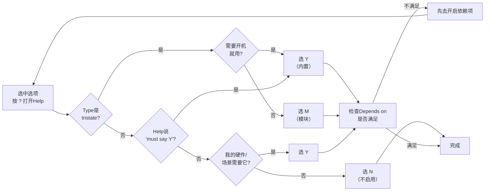

# 4.2.5 读懂配置帮助信息（Help窗口）

> 所属章节：第4章 内核配置与编译 > 4.2 Kconfig配置系统
> 难度：[B→M] | 预计阅读时间：15分钟

## 本节导读

菜单里的每个选项名字往往只有两三个单词，根本看不出它是干什么的。本节教你调出每个选项的"说明书"——Help窗口，并逐字段读懂里面的功能描述、配置建议和依赖关系。学完本节，你就能像查字典一样，通过Help信息独立判断某个选项是否需要启用。

---

## 知识点1：Help窗口内容解读 [B→M] ~1,000字

在menuconfig里，你面对上万条选项时，最大的困惑往往是："这个选项到底是干什么的？我需不需要开它？"Kconfig的设计者早就想到了这个问题——每个选项都可以附带一段帮助文本，按`?`键就能随时查看。

### 调出Help窗口的两种方式

1. **选中目标选项**，按键盘上的 **`?`** 键（问号键，不需要按Shift）
2. 或者按 **`H`** 键（大小写均可， Help的首字母）

菜单底部的快捷键栏会提示你当前可用的按键：

```
<Select> < Exit > < Help > < Save > < Load >
                     ^^^^^
```

按下`?`后，屏幕右侧（或底部，取决于终端大小）会弹出一个帮助信息窗口，显示当前选中选项的完整说明。

### Help窗口的六大字段

下面是一个真实的Help信息示例（以`CONFIG_EXT4_FS`文件系统选项为例），我们来逐字段拆解：

```
Symbol: EXT4_FS [=y]
Type  : tristate
Prompt: The Extended 4 (ext4) filesystem
  Location:
    -> File systems
(1)   -> Ext4 filesystem support (EXT4_FS [=y])
  Defined at fs/ext4/Kconfig:1
  Depends on: BLOCK [=y]
  Selected by [n]:
    - EXT4_USE_FOR_EXT2 [=n] && EXT2_FS [=n] && BLOCK [=y]
  Help:
    This is the basic support for the second extended filesystem.
    Ext4 is a high-performance, journaling filesystem. If you want
    to use ext4 as your root filesystem, you must say Y here.

    If unsure, say N if you do not use ext4.
```

这段文字包含了六个关键字段，它们的含义各不相同：

| 字段 | 含义 | 示例解读 | 重要程度 |
|------|------|----------|----------|
| **Symbol** | 配置项的内部名称，带`CONFIG_`前缀 | `EXT4_FS` = 不带前缀的符号名；`[=y]` = 当前已设为内置 | 必看 |
| **Type** | 选项的数据类型 | `tristate` = 可选Y/M/N；`bool` = 只能Y或N；`string`/`hex`/`int` = 文本/数值 | 必看 |
| **Prompt** | 菜单中显示给用户看的文字 | "The Extended 4 (ext4) filesystem" | 辅助确认 |
| **Location** | 该选项在菜单树中的位置 | `File systems` → `Ext4 filesystem support` | 导航用 |
| **Defined at** | 该选项在哪个Kconfig文件中定义 | `fs/ext4/Kconfig:1` = 第1行 | 查源码时用 |
| **Depends on** | 启用该选项必须先满足的前置条件 | `BLOCK [=y]` = 需要块设备层已启用 | 解锁灰色选项时用 |
| **Selected by** | 有哪些选项会自动选择它 | `[n]` = 当前未被自动选择 | 排查意外开启时用 |

[图1：menuconfig Help窗口实拍截图，标注六大字段的对应位置]

### 必须重点理解的三个字段

**1. Symbol字段——你的"配置身份证"**

Symbol告诉你这个选项在内核源码中的"真名"。当你在`.config`文件中搜索、在启动日志中查问题、在邮件列表里提问时，用的都是这个名字。`[=y]`表示当前已设为内置（Y），`[=m]`表示模块（M），`[ = ]`或`[n]`表示未启用。

💡 **提示**：如果你在网上搜索"怎么开启ext4"，搜到的答案往往是`CONFIG_EXT4_FS=y`。Symbol字段就是帮你把菜单里的中文/英文描述，和网上的技术资料对应起来的桥梁。

**2. Type字段——决定你能怎么选**

| Type值 | 可选状态 | 菜单中的样子 | 典型场景 |
|--------|----------|--------------|----------|
| `boolean`（布尔） | 只有Y或N两种 | `[ ]` 或 `[*]` | 功能开关，如"启用调试信息" |
| `tristate`（三态） | Y、M、N三种 | `[ ]`、`[M]`或`[*]` | 驱动程序，可内置也可模块化 |
| `string` | 任意文本 | 输入框 | 如默认主机名 |
| `hex` / `int` | 十六进制/十进制数字 | 输入框 | 如内存分区地址、调试等级 |

💡 **提示**：不是所有驱动都能选M。如果Type是`boolean`，你只能选Y或N——这通常是因为该功能不支持模块化编译。

**3. Depends on字段——解开"为什么这个选项是灰色的"**

这是Help窗口最有实战价值的字段。当一个选项显示为灰色（不可选）时，看这个字段就能知道"我还需要先打开什么"。

例如，某USB网卡驱动的Help显示：

```
Depends on: USB [=y] && NET [=y] && USB_USBNET [=n]
```

这告诉你三个信息：
- USB总线支持已开启（`[=y]`，满足）
- 网络子系统已开启（`[=y]`，满足）
- USB网络适配器框架**未开启**（`[=n]`，不满足！）

所以，这个驱动是灰色的，原因是缺少`USB_USBNET`。你需要先去开启`USB_USBNET`，这个网卡驱动才会变成可选状态。

### 帮助文本（Help正文）——写给人看的"说明书"

Help正文位于所有字段之后，通常是一段自由文本，由该选项的维护者编写。它的质量参差不齐：

- **写得好的Help**：会明确告诉你这个选项是干什么的、在什么场景下需要启用、有什么已知限制。例如上面的ext4例子直接告诉你："If you want to use ext4 as your root filesystem, you must say Y here."（如果你想用ext4做根文件系统，这里必须选Y。）
- **写得差的Help**：可能只有一句话甚至为空。常见于一些老旧驱动或内部调试选项。

⚠️ **陷阱：不要盲目相信"If unsure, say N"**

很多Help末尾有一句标准套话："If unsure, say N."（如果你不确定，选N。）这对安全，但也可能让你错过需要的功能。比如你的板子确实需要某个特殊总线支持，但Help建议你"不确定就选N"，结果板子启动后找不到设备。正确做法是：**结合你的硬件需求来判断，而不是完全依赖Help中的建议**。

### Help信息还有"附加页"

有些复杂选项（尤其是平台级选项）的Help内容很长，一屏显示不完。此时Help窗口右侧会出现滚动提示，你可以用 **`Page Down`** / **`Page Up`** 键翻页，或者按 **`↓`** / **`↑`** 键逐行滚动。全部看完后按 **`Q`** 键关闭Help窗口，回到菜单。

[图2：长Help文本的翻页操作示意，标注Page Up/Down和Q键的位置]

### 常见错误

⚠️ **陷阱：Help窗口不会实时更新**
如果你先看了某选项的Help，然后跑到别处改了一个依赖项，再回来看同一个Help，Help窗口里显示的`[=y]`/`[=n]`状态**不会自动刷新**。你需要关闭Help（按Q），重新选中该选项，再按`?`打开，才能看到最新状态。

💡 **提示**：有些选项没有Help文本
Kconfig不强制每个选项都写Help。如果你按`?`后只看到了Symbol、Type等结构字段，下面没有自由文本的说明，这说明维护者没写Help。此时你可以：
1. 记下`Defined at`字段的Kconfig文件路径，直接去源码目录查看
2. 在网上搜索Symbol名称，通常能找到邮件列表或文档中的讨论

---

## 知识点2：利用Help做决策 [B] ~500字

知道了Help窗口里每个字段的含义，下一步是学会**用这些信息做判断**：我到底要不要启用这个选项？

下面是一个实用的四步决策法，适用于任何你拿不准的选项。



[图3：基于Help信息的四步决策流程图]

### 第一步：确认选项类型

看Help里的`Type`字段。如果是`tristate`，说明这个选项可以是Y（内置）、M（模块）或N（不启用）。如果是`boolean`，则只能Y或N。

### 第二步：判断使用时机

- **启动时就必须可用**（如根文件系统驱动、串口控制台驱动、内存控制器）→ 选 **Y**
- **启动后按需加载**（如USB摄像头驱动、声卡、非核心网卡）→ 选 **M**
- **根本用不上**（如你的板子没有WiFi芯片，却看到一个无线驱动）→ 选 **N**

💡 **提示**：嵌入式开发有一个常用原则——"启动路径上的选Y，其他的尽量选M"。启动路径指的是：从U-Boot交权到内核，到挂载根文件系统，到启动init进程，这条链路上的所有驱动都应该内置（Y），否则内核在启动中途可能找不到设备。

### 第三步：验证依赖关系

看`Depends on`字段。如果所有依赖项都是`[=y]`，说明你可以直接启用这个选项。如果有`[=n]`，你需要先找到并开启那个依赖。

### 第四步：交叉确认

如果Help正文有明确的场景描述（如"for embedded systems with limited RAM"），把它和你的实际情况对比。如果Help写得很模糊，可以用上一节（4.2.4）学的`/`搜索，找到这个选项在Kconfig中的定义位置，查看周围的注释或关联选项，获取更多上下文。

### 一个真实决策示例

假设你在menuconfig里看到一个选项叫`CONFIG_SND_USB_AUDIO`（USB音频支持），你不确定要不要开：

1. **按`?`看Help**：Type是`tristate`，说明可选Y/M/N
2. **看Depends on**：`USB [=y] && SND [=n]` → USB已开，但声音子系统(SND)没开
3. **判断场景**：你的板子接了USB音箱，需要音频输出 → 需要启用
4. **决策**：先去开启`SND`（声音子系统），返回后再把`SND_USB_AUDIO`设为M（音频不是启动必需品）

💡 **提示**：对于嵌入式产品，还有个实用技巧——搜索一下你的板子原理图或BSP文档，看看有没有对应的硬件芯片型号。如果原理图上根本没有这个芯片，直接选N，不需要犹豫。

### 常见错误

⚠️ **陷阱：看到"experimental"就关掉**

有些Help正文里会标注`EXPERIMENTAL`或`DEPRECATED`（已废弃）。标`EXPERIMENTAL`的选项表示还在测试中，**不代表不能用**。很多嵌入式驱动在合入主线时都会带这个标记，但厂商BSP里已经用了很久、很稳定。标`DEPRECATED`的才需要考虑是否替换为新方案。判断依据应该是**你的硬件是否需要它**，而不是单纯看它带什么标签。

---

## 本节总结

| 概念 | 要点 | 操作 |
|------|------|------|
| Help窗口调出 | 选中选项后按`?`或`H`键 | 在任意选项上按`?` |
| Symbol字段 | 选项的真名，对应`.config`中的`CONFIG_XXX` | 用于搜索和提问 |
| Type字段 | 决定可选状态：tristate(Y/M/N)或boolean(Y/N) | 看到tristate就知道可以模块化 |
| Depends on | 前置依赖清单，`[=n]`表示尚未满足 | 灰色选项的解锁指南 |
| 帮助正文 | 人话版说明书，质量看维护者良心 | 作为决策参考，但不是唯一依据 |
| 四步决策法 | 确认类型→判断时机→验证依赖→交叉确认 | 拿不准时按流程走 |
| 嵌入式原则 | 启动路径上的选Y，其他尽量M，没有的选N | 减少内核体积，保证启动可用 |

## 下一步

你已经学会了如何调出Help窗口，并读懂里面的每一个字段来辅助决策。下一节（4.2.6）我们将离开menuconfig的交互界面，看看**配置最终被保存到哪里**——`.config`文件是内核配置的物理载体，理解它的格式能让你在自动构建和批量配置时游刃有余。

---

## 配套资源

### 表格清单
- 表1：Help窗口六大字段含义解读表
- 表2：Kconfig数据类型（Type）与可选状态对照表

### 图示清单
- 图1：menuconfig Help窗口实拍截图，标注六大字段位置 [配图说明]
- 图2：长Help文本翻页操作示意 [配图说明]
- 图3：基于Help信息的四步决策流程图 [mermaid图]

### 代码清单
- 代码1：Help窗口完整示例（EXT4_FS的真实帮助文本）
