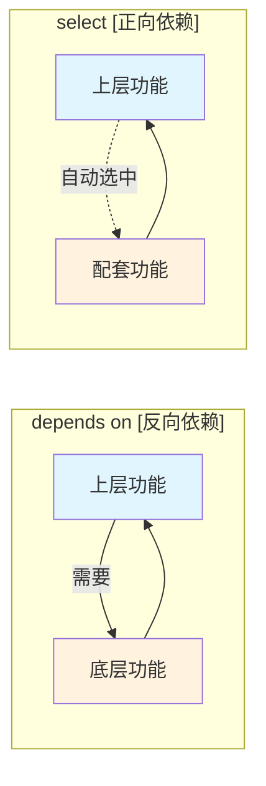

# 4.2.5 读懂配置帮助信息（Help窗口）

> 所属章节：第4章 内核配置与编译 > 4.2 Kconfig配置系统
> 
> 难度：[B→M] | 预计阅读时间：15分钟

## 本节导读

菜单里的每个选项名字往往只有两三个单词，根本看不出它是干什么的。本节教你调出每个选项的"说明书", Help窗口，并逐字段读懂里面的功能描述、配置建议和依赖关系。
---

## <span class="blue"> Help窗口内容解读 [B→M] 

在menuconfig里，你面对上万条选项时，最大的困惑往往是："这个选项到底是干什么的？我需不需要开它？"Kconfig的设计者早就想到了这个问题, 每个选项都可以附带一段帮助文本，按`?`键就能随时查看。

### 调出Help窗口的两种方式

1. **选中目标选项**，按键盘上的 **`?`** 键（问号键，不需要按Shift）
2. 或者按 **`H`** 键（大小写均可， Help的首字母）

菜单底部的快捷键栏会提示你当前可用的按键：

```
<Select> < Exit > < Help > < Save > < Load >
                     ^^^^^
```

按下`?`后，屏幕右侧（或底部，取决于终端大小）会弹出一个帮助信息窗口，显示当前选中选项的完整说明。

### Help窗口的六大字段

下面是一个真实的Help信息示例（以`CONFIG_EXT4_FS`文件系统选项为例），我们来逐字段拆解：

```
Symbol: EXT4_FS [=y]
Type  : tristate
Prompt: The Extended 4 (ext4) filesystem
  Location:
    -> File systems
(1)   -> Ext4 filesystem support (EXT4_FS [=y])
  Defined at fs/ext4/Kconfig:1
  Depends on: BLOCK [=y]
  Selected by [n]:
    - EXT4_USE_FOR_EXT2 [=n] && EXT2_FS [=n] && BLOCK [=y]
  Help:
    This is the basic support for the second extended filesystem.
    Ext4 is a high-performance, journaling filesystem. If you want
    to use ext4 as your root filesystem, you must say Y here.

    If unsure, say N if you do not use ext4.
```

这段文字包含了六个关键字段，它们的含义各不相同：

| 字段 | 含义 | 示例解读 | 重要程度 |
|------|------|----------|----------|
| **Symbol** | 配置项的内部名称，带`CONFIG_`前缀 | `EXT4_FS` = 不带前缀的符号名；`[=y]` = 当前已设为内置 | 必看 |
| **Type** | 选项的数据类型 | `tristate` = 可选Y/M/N；`bool` = 只能Y或N；`string`/`hex`/`int` = 文本/数值 | 必看 |
| **Prompt** | 菜单中显示给用户看的文字 | "The Extended 4 (ext4) filesystem" | 辅助确认 |
| **Location** | 该选项在菜单树中的位置 | `File systems` → `Ext4 filesystem support` | 导航用 |
| **Defined at** | 该选项在哪个Kconfig文件中定义 | `fs/ext4/Kconfig:1` = 第1行 | 查源码时用 |
| **Depends on** | 启用该选项必须先满足的前置条件 | `BLOCK [=y]` = 需要块设备层已启用 | 解锁灰色选项时用 |
| **Selected by** | 有哪些选项会自动选择它 | `[n]` = 当前未被自动选择 | 排查意外开启时用 |


### 必须重点理解的三个字段

**1. Symbol字段, 你的"配置身份证"**

Symbol告诉你这个选项在内核源码中的"真名"。当你在`.config`文件中搜索、在启动日志中查问题、在邮件列表里提问时，用的都是这个名字。`[=y]`表示当前已设为内置（Y），`[=m]`表示模块（M），`[ = ]`或`[n]`表示未启用。

> 💡 如果你在网上搜索"怎么开启ext4"，搜到的答案往往是`CONFIG_EXT4_FS=y`。Symbol字段就是帮你把菜单里的中文/英文描述，和网上的技术资料对应起来的桥梁。

**2. Type字段, 决定你能怎么选**

| Type值 | 可选状态 | 菜单中的样子 | 典型场景 |
|--------|----------|--------------|----------|
| `boolean`（布尔） | 只有Y或N两种 | `[ ]` 或 `[*]` | 功能开关，如"启用调试信息" |
| `tristate`（三态） | Y、M、N三种 | `[ ]`、`[M]`或`[*]` | 驱动程序，可内置也可模块化 |
| `string` | 任意文本 | 输入框 | 如默认主机名 |
| `hex` / `int` | 十六进制/十进制数字 | 输入框 | 如内存分区地址、调试等级 |

> 💡 不是所有驱动都能选M。如果Type是`boolean`，你只能选Y或N, 这通常是因为该功能不支持模块化编译。

**3. Depends on字段, 解开"为什么这个选项是灰色的"**

这是Help窗口最有实战价值的字段。当一个选项显示为灰色（不可选）时，看这个字段就能知道"我还需要先打开什么"。

例如，某USB网卡驱动的Help显示：

```
Depends on: USB [=y] && NET [=y] && USB_USBNET [=n]
```

这告诉你三个信息：

- USB总线支持已开启（`[=y]`，满足）
- 网络子系统已开启（`[=y]`，满足）
- USB网络适配器框架**未开启**（`[=n]`，不满足！）

所以，这个驱动是灰色的，原因是缺少`USB_USBNET`。你需要先去开启`USB_USBNET`，这个网卡驱动才会变成可选状态。

### 帮助文本（Help正文）, 写给人看的"说明书"

Help正文位于所有字段之后，通常是一段自由文本，由该选项的维护者编写。它的质量参差不齐：

- **写得好的Help**：会明确告诉你这个选项是干什么的、在什么场景下需要启用、有什么已知限制。例如上面的ext4例子直接告诉你："If you want to use ext4 as your root filesystem, you must say Y here."（如果你想用ext4做根文件系统，这里必须选Y。）
- **写得差的Help**：可能只有一句话甚至为空。常见于一些老旧驱动或内部调试选项。

> ⚠️ **不要盲目相信"If unsure, say N"**

很多Help末尾有一句标准套话："If unsure, say N."（如果你不确定，选N。）这对安全，但也可能让你错过需要的功能。比如你的板子确实需要某个特殊总线支持，但Help建议你"不确定就选N"，结果板子启动后找不到设备。正确做法是：**结合你的硬件需求来判断，而不是完全依赖Help中的建议**。

### Help信息还有"附加页"

有些复杂选项（尤其是平台级选项）的Help内容很长，一屏显示不完。此时Help窗口右侧会出现滚动提示，你可以用 **`Page Down`** / **`Page Up`** 键翻页，或者按 **`↓`** / **`↑`** 键逐行滚动。全部看完后按 **`Q`** 键关闭Help窗口，回到菜单。


### 常见错误

> ⚠️ **Help窗口不会实时更新**<BR>
如果你先看了某选项的Help，然后跑到别处改了一个依赖项，再回来看同一个Help，Help窗口里显示的`[=y]`/`[=n]`状态**不会自动刷新**。你需要关闭Help（按Q），重新选中该选项，再按`?`打开，才能看到最新状态。

> 💡 **提示**：有些选项没有Help文本<BR>
Kconfig不强制每个选项都写Help。如果你按`?`后只看到了Symbol、Type等结构字段，下面没有自由文本的说明，这说明维护者没写Help。此时你可以：

1. 记下`Defined at`字段的Kconfig文件路径，直接去源码目录查看
2. 在网上搜索Symbol名称，通常能找到邮件列表或文档中的讨论

---

## <span class="blue"> 利用Help做决策 [B] 

知道了Help窗口里每个字段的含义，下一步是学会**用这些信息做判断**：我到底要不要启用这个选项？

### 第一步：确认选项类型

看Help里的`Type`字段。如果是`tristate`，说明这个选项可以是Y（内置）、M（模块）或N（不启用）。如果是`boolean`，则只能Y或N。

### 第二步：判断使用时机

- **启动时就必须可用**（如根文件系统驱动、串口控制台驱动、内存控制器）→ 选 **Y**
- **启动后按需加载**（如USB摄像头驱动、声卡、非核心网卡）→ 选 **M**
- **根本用不上**（如你的板子没有WiFi芯片，却看到一个无线驱动）→ 选 **N**

> 💡 嵌入式开发有一个常用原则, "启动路径上的选Y，其他的尽量选M"。启动路径指的是：从U-Boot交权到内核，到挂载根文件系统，到启动init进程，这条链路上的所有驱动都应该内置（Y），否则内核在启动中途可能找不到设备。

### 第三步：验证依赖关系

看`Depends on`字段。如果所有依赖项都是`[=y]`，说明你可以直接启用这个选项。如果有`[=n]`，你需要先找到并开启那个依赖。

### 第四步：交叉确认

如果Help正文有明确的场景描述（如"for embedded systems with limited RAM"），把它和你的实际情况对比。如果Help写得很模糊，可以用上一节（4.2.4）学的`/`搜索，找到这个选项在Kconfig中的定义位置，查看周围的注释或关联选项，获取更多上下文。

### 一个真实决策示例

假设你在menuconfig里看到一个选项叫`CONFIG_SND_USB_AUDIO`（USB音频支持），你不确定要不要开：

1. **按`?`看Help**：Type是`tristate`，说明可选Y/M/N
2. **看Depends on**：`USB [=y] && SND [=n]` → USB已开，但声音子系统(SND)没开
3. **判断场景**：你的板子接了USB音箱，需要音频输出 → 需要启用
4. **决策**：先去开启`SND`（声音子系统），返回后再把`SND_USB_AUDIO`设为M（音频不是启动必需品）

> 💡 对于嵌入式产品，还有个实用技巧, 搜索一下你的板子原理图或BSP文档，看看有没有对应的硬件芯片型号。如果原理图上根本没有这个芯片，直接选N，不需要犹豫。

### 常见错误

> ⚠️ **看到"experimental"就关掉**

有些Help正文里会标注`EXPERIMENTAL`或`DEPRECATED`（已废弃）。标`EXPERIMENTAL`的选项表示还在测试中，**不代表不能用**。很多嵌入式驱动在合入主线时都会带这个标记，但厂商BSP里已经用了很久、很稳定。标`DEPRECATED`的才需要考虑是否替换为新方案。判断依据应该是**你的硬件是否需要它**，而不是单纯看它带什么标签。

## <span class="blue"> depends on 与 select — 依赖关系如何决定选项是否可选 [I][M] 

在 `menuconfig` 的图形界面中，你是否遇到过这种情况：某个功能选项前面既不是 `[*]` 也不是 `[ ]`，而是直接显示为 `--` 并且根本无法按空格切换？这就是**依赖未满足**的典型表现。Kconfig 的依赖系统由两个核心指令控制：主动依赖 `depends on` 和自动选择 `select`。

### 1.1 depends on：反向依赖, "你想出现？先满足条件"

`depends on` 规定了一个选项**可被用户看到并操作**的前提条件。只有当指定的符号被选中（值为 `y` 或 `m`）时，这个选项才会从灰色状态变为可配置状态。

```kconfig
config USB_STORAGE
    tristate "USB Mass Storage support"
    depends on USB && SCSI
```

上面的例子中，USB 大容量存储功能只有在 `USB` 和 `SCSI` 都被选中后才会从灰色变为可选。如果 `SCSI` 没有配置，`USB_STORAGE` 对用户完全不可见（除非进入专家模式）。

> 💡 `depends on A && B` 表示同时依赖两个符号；`depends on A || B` 表示满足其一即可。

### 1.2 select：正向依赖, "我选了，你也必须跟着选"

与 `depends on` 不同，`select` 的作用是**自动强制选中**另一个符号，常用于"选了上层功能就必须启用底层基础设施"的场景。

```kconfig
config TCP_CONG_CUBIC
    tristate "CUBIC TCP"
    default y
    select CRYPTO_SHA256
```

这里一旦选中了 `TCP_CONG_CUBIC`，`CRYPTO_SHA256` 就会被**自动打上勾**，即使 `CRYPTO_SHA256` 本身不可见。这确保了 CUBIC 拥塞控制算法需要的哈希计算能力始终可用。

> ⚠️ `select` 是单向强制的，它**不会检查**被 `select` 的符号自身依赖是否满足。如果 `A select B`，而 `B depends on C` 且 `C` 未选中，那么 Kconfig 会进入**不一致状态**。

### 1.3 implied by：隐含依赖

这是 `select` 的弱化版本，用 `imply` 表示："我建议你选它，但如果用户明确取消，尊重用户决定"。

```kconfig
config NETFILTER_XT_MATCH_TCPMSS
    tristate "TCPMSS match support"
    imply NETFILTER_XT_TARGET_TCPMSS
```

[图1：depends on 与 select 的方向关系示意]


```mermaid
graph LR
    subgraph "depends on [反向依赖]"
        A[上层功能] -->|需要| B[底层功能]
        B --> A
    end
    
    subgraph "select [正向依赖]"
        C[上层功能] -.->|自动选中| D[配套功能]
        D --> C
    end
    
    style A fill:#e1f5fe
    style C fill:#e1f5fe
    style B fill:#fff3e0
    style D fill:#fff3e0
```

### 操作步骤：在源码中定位依赖链

1. 找到你关注的符号（例如 `CONFIG_USB_STORAGE`）
2. 在内核源码根目录执行：
   ```bash
   # 搜索该符号的 Kconfig 定义
   grep -rn "config USB_STORAGE" drivers/usb/storage/ arch/ configs/ 2>/dev/null
   
   # 更通用的搜索方式：查看所有 Kconfig 中对该符号的引用
   grep -rn "USB_STORAGE" $(find . -name "Kconfig*") | head -30
   ```
3. 查看定义处的 `depends on` 和 `select` 行，逐层向上追溯

> 💡 也可以使用 `make menuconfig` 中选中选项后按 `?` 键，直接查看 Help 中列出的依赖关系。

---

## <span class="blue"> 互斥选项处理, 多选一的场景 [I] 

在内核中，经常遇到"A、B、C三种方案只能选一种"的需求，例如初始化系统（init）的选择、处理器架构变体、或者压缩算法。Kconfig 的 `choice` 关键字专门处理这类**多选一**场景。

### 2.1 choice 单选组

```kconfig
choice
    prompt "Default I/O scheduler"
    default DEFAULT_CFQ
    help
      Select the I/O scheduler to be used by default.

config DEFAULT_DEADLINE
    bool "Deadline"

config DEFAULT_CFQ
    bool "CFQ"

config DEFAULT_NOOP
    bool "No-op"
endchoice
```

`choice` 块内的所有选项构成一个**单选按钮组**。用户只能选中其中一项（对于 `bool` 类型），Kconfig 会自动确保互斥性。

### 2.2 依赖与 choice 的组合

每个 `choice` 成员也可以有自己的 `depends on`，从而实现"在某些条件下该选项才出现在单选组中"的效果。

```kconfig
choice
    prompt "Memory allocator"

config SLAB
    bool "SLAB"

config SLUB
    bool "SLUB (Unqueued Allocator)"
    depends on !SLOB    # SLUB 和 SLOB 不能同时存在时，这里控制可见性

config SLOB
    bool "SLOB"
    depends on EMBEDDED # SLOB 只在嵌入式精简模式下出现
endchoice
```

>⚠️ `choice` 内不能混用 `tristate` 和 `bool` 类型。如果一个成员是 `tristate`，其他成员也必须都是 `tristate`，否则 Kconfig 解析会报错或行为异常。

>🔴 在 `choice` 成员上使用 `select` 强制选中另一个 `choice` 内的符号，会破坏互斥性，导致配置逻辑混乱。**永远不要这样做**。

>💡 `choice` 块本身可以设置 `optional` 属性，表示"可以不选任何一项"，默认情况下用户必须选一项。

---

## <span class="blue"> 强制选项, 看不见但已经选中的符号 [E] 

在内核配置中，有些符号没有对应的菜单条目，用户在任何菜单中都找不到它，但它确确实实存在于 `.config` 文件中。这类符号被称为 **promptless symbol（无提示符号）**。

### 3.1 没有 prompt 的 config

```kconfig
config HAVE_PERF_EVENTS
    bool
    select HAVE_ARCH_PERF_EVENTS
```

注意这个定义**没有 `prompt "xxx"` 行**。这意味着它永远不会出现在 `menuconfig` 的交互界面中。但它可以被其他符号 `depends on`、`select` 或 `imply`。

### 3.2 强制选中但不显示的设计意图

promptless symbol 的典型用途：

- **平台能力声明**：如 `HAVE_PERF_EVENTS` 表示当前架构硬件上支持性能监控单元，不是用户"配置"出来的，而是平台代码"声明"出来的。
- **条件编译开关**：作为多个功能共享的底层条件，由上层功能的 `select` 统一触发。

```kconfig
config HAVE_PERF_EVENTS
    bool

config PERF_EVENTS
    bool "Kernel performance events and counters"
    depends on HAVE_PERF_EVENTS
```

在这个结构中，`HAVE_PERF_EVENTS` 是平台代码自动设置的（通常在 `arch/xxx/Kconfig` 中由 `def_bool y` 定义），而 `PERF_EVENTS` 才是一个用户可以开关的功能。如果平台不支持，`PERF_EVENTS` 直接灰色不可见，避免用户产生困惑。

>🔴 手动修改 `.config` 文件时，不要随意给 promptless symbol 添加 `# CONFIG_XXX is not set` 或 `CONFIG_XXX=y`，因为它们通常被 Kconfig 的依赖系统严格控制。改错可能导致 `make` 时大量配置被 silently 修正，产生难以排查的编译问题。

>💡 如果需要在某配置文件中强制启用某个 promptless 符号，正确的做法是在 `Kconfig` 中用 `default y` 或在依赖链中用 `select` 触发，而不是直接写 `.config`。

---

## <span class="blue"> 本节总结

| 概念 | 要点 | 操作 |
|------|------|------|
| Help窗口调出 | 选中选项后按`?`或`H`键 | 在任意选项上按`?` |
| Symbol字段 | 选项的真名，对应`.config`中的`CONFIG_XXX` | 用于搜索和提问 |
| Type字段 | 决定可选状态：tristate(Y/M/N)或boolean(Y/N) | 看到tristate就知道可以模块化 |
| Depends on | 前置依赖清单，`[=n]`表示尚未满足 | 灰色选项的解锁指南 |
| 帮助正文 | 人话版说明书，质量看维护者良心 | 作为决策参考，但不是唯一依据 |
| 四步决策法 | 确认类型→判断时机→验证依赖→交叉确认 | 拿不准时按流程走 |
| 嵌入式原则 | 启动路径上的选Y，其他尽量M，没有的选N | 减少内核体积，保证启动可用 |

| 概念 | 方向 | 作用 | 典型场景 | 注意事项 |
|------|------|------|----------|----------|
| `depends on` | 反向 | 选项可见/可操作的前提条件 | USB存储依赖USB和SCSI总线 | 依赖不满足时选项灰色或隐藏 |
| `select` | 正向 | 自动强制选中另一符号 | CUBIC算法自动选中SHA256 | 不检查被选项的依赖链 |
| `imply` | 正向（弱） | 建议选中，但允许用户取消 | 功能建议配套子功能 | 被明确取消时尊重用户 |
| `choice` | 互斥 | 多选一的单选组 | IO调度器、init系统 | 成员类型必须一致 |
| promptless | 自动 | 无菜单但参与依赖链 | 平台能力声明 | 不要手动改 `.config` 控制 |

---
