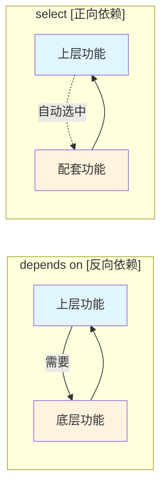

# 4.2.8 依赖关系与选择冲突：为什么这个选项是灰色的

> 所属章节：第4章 内核配置管理 > 4.2 Kconfig语法与菜单设计
> 难度：[I→E] | 预计阅读时间：20分钟

## 本节导读
本节揭示内核配置界面中选项变灰（不可选）的真正原因，讲解 `depends on`、`select`、`choice` 三种依赖/互斥机制的原理与使用，让你不仅能看懂菜单状态，还能自主设计合理的依赖链和互斥组。

---

## 知识点1：depends on 与 select — 依赖关系如何决定选项是否可选 [I][M] ~900字

在 `menuconfig` 的图形界面中，你是否遇到过这种情况：某个功能选项前面既不是 `[*]` 也不是 `[ ]`，而是直接显示为 `--` 并且根本无法按空格切换？这就是**依赖未满足**的典型表现。Kconfig 的依赖系统由两个核心指令控制：主动依赖 `depends on` 和自动选择 `select`。

### 1.1 depends on：反向依赖——"你想出现？先满足条件"

`depends on` 规定了一个选项**可被用户看到并操作**的前提条件。只有当指定的符号被选中（值为 `y` 或 `m`）时，这个选项才会从灰色状态变为可配置状态。

```kconfig
config USB_STORAGE
    tristate "USB Mass Storage support"
    depends on USB && SCSI
```

上面的例子中，USB 大容量存储功能只有在 `USB` 和 `SCSI` 都被选中后才会从灰色变为可选。如果 `SCSI` 没有配置，`USB_STORAGE` 对用户完全不可见（除非进入专家模式）。

💡 **提示**：`depends on A && B` 表示同时依赖两个符号；`depends on A || B` 表示满足其一即可。

### 1.2 select：正向依赖——"我选了，你也必须跟着选"

与 `depends on` 不同，`select` 的作用是**自动强制选中**另一个符号，常用于"选了上层功能就必须启用底层基础设施"的场景。

```kconfig
config TCP_CONG_CUBIC
    tristate "CUBIC TCP"
    default y
    select CRYPTO_SHA256
```

这里一旦选中了 `TCP_CONG_CUBIC`，`CRYPTO_SHA256` 就会被**自动打上勾**，即使 `CRYPTO_SHA256` 本身不可见。这确保了 CUBIC 拥塞控制算法需要的哈希计算能力始终可用。

⚠️ **陷阱**：`select` 是单向强制的，它**不会检查**被 `select` 的符号自身依赖是否满足。如果 `A select B`，而 `B depends on C` 且 `C` 未选中，那么 Kconfig 会进入**不一致状态**。

### 1.3 implied by：隐含依赖

这是 `select` 的弱化版本，用 `imply` 表示："我建议你选它，但如果用户明确取消，尊重用户决定"。

```kconfig
config NETFILTER_XT_MATCH_TCPMSS
    tristate "TCPMSS match support"
    imply NETFILTER_XT_TARGET_TCPMSS
```

[图1：depends on 与 select 的方向关系示意]



### 操作步骤：在源码中定位依赖链

1. 找到你关注的符号（例如 `CONFIG_USB_STORAGE`）
2. 在内核源码根目录执行：
   ```bash
   # 搜索该符号的 Kconfig 定义
   grep -rn "config USB_STORAGE" drivers/usb/storage/ arch/ configs/ 2>/dev/null
   
   # 更通用的搜索方式：查看所有 Kconfig 中对该符号的引用
   grep -rn "USB_STORAGE" $(find . -name "Kconfig*") | head -30
   ```
3. 查看定义处的 `depends on` 和 `select` 行，逐层向上追溯

💡 **提示**：也可以使用 `make menuconfig` 中选中选项后按 `?` 键，直接查看 Help 中列出的依赖关系。

---

## 知识点2：互斥选项处理——多选一的场景 [I] ~600字

在内核中，经常遇到"A、B、C三种方案只能选一种"的需求，例如初始化系统（init）的选择、处理器架构变体、或者压缩算法。Kconfig 的 `choice` 关键字专门处理这类**多选一**场景。

### 2.1 choice 单选组

```kconfig
choice
    prompt "Default I/O scheduler"
    default DEFAULT_CFQ
    help
      Select the I/O scheduler to be used by default.

config DEFAULT_DEADLINE
    bool "Deadline"

config DEFAULT_CFQ
    bool "CFQ"

config DEFAULT_NOOP
    bool "No-op"
endchoice
```

`choice` 块内的所有选项构成一个**单选按钮组**。用户只能选中其中一项（对于 `bool` 类型），Kconfig 会自动确保互斥性。

### 2.2 依赖与 choice 的组合

每个 `choice` 成员也可以有自己的 `depends on`，从而实现"在某些条件下该选项才出现在单选组中"的效果。

```kconfig
choice
    prompt "Memory allocator"

config SLAB
    bool "SLAB"

config SLUB
    bool "SLUB (Unqueued Allocator)"
    depends on !SLOB    # SLUB 和 SLOB 不能同时存在时，这里控制可见性

config SLOB
    bool "SLOB"
    depends on EMBEDDED # SLOB 只在嵌入式精简模式下出现
endchoice
```

⚠️ **陷阱**：`choice` 内不能混用 `tristate` 和 `bool` 类型。如果一个成员是 `tristate`，其他成员也必须都是 `tristate`，否则 Kconfig 解析会报错或行为异常。

🔴 **危险**：在 `choice` 成员上使用 `select` 强制选中另一个 `choice` 内的符号，会破坏互斥性，导致配置逻辑混乱。**永远不要这样做**。

💡 **提示**：`choice` 块本身可以设置 `optional` 属性，表示"可以不选任何一项"，默认情况下用户必须选一项。

---

## 知识点3：强制选项——看不见但已经选中的符号 [E] ~400字

在内核配置中，有些符号没有对应的菜单条目，用户在任何菜单中都找不到它，但它确确实实存在于 `.config` 文件中。这类符号被称为 **promptless symbol（无提示符号）**。

### 3.1 没有 prompt 的 config

```kconfig
config HAVE_PERF_EVENTS
    bool
    select HAVE_ARCH_PERF_EVENTS
```

注意这个定义**没有 `prompt "xxx"` 行**。这意味着它永远不会出现在 `menuconfig` 的交互界面中。但它可以被其他符号 `depends on`、`select` 或 `imply`。

### 3.2 强制选中但不显示的设计意图

promptless symbol 的典型用途：

- **平台能力声明**：如 `HAVE_PERF_EVENTS` 表示当前架构硬件上支持性能监控单元，不是用户"配置"出来的，而是平台代码"声明"出来的。
- **条件编译开关**：作为多个功能共享的底层条件，由上层功能的 `select` 统一触发。

```kconfig
config HAVE_PERF_EVENTS
    bool

config PERF_EVENTS
    bool "Kernel performance events and counters"
    depends on HAVE_PERF_EVENTS
```

在这个结构中，`HAVE_PERF_EVENTS` 是平台代码自动设置的（通常在 `arch/xxx/Kconfig` 中由 `def_bool y` 定义），而 `PERF_EVENTS` 才是一个用户可以开关的功能。如果平台不支持，`PERF_EVENTS` 直接灰色不可见，避免用户产生困惑。

🔴 **危险**：手动修改 `.config` 文件时，不要随意给 promptless symbol 添加 `# CONFIG_XXX is not set` 或 `CONFIG_XXX=y`，因为它们通常被 Kconfig 的依赖系统严格控制。改错可能导致 `make` 时大量配置被 silently 修正，产生难以排查的编译问题。

💡 **提示**：如果需要在某配置文件中强制启用某个 promptless 符号，正确的做法是在 `Kconfig` 中用 `default y` 或在依赖链中用 `select` 触发，而不是直接写 `.config`。

---

## 本节总结

| 概念 | 方向 | 作用 | 典型场景 | 注意事项 |
|------|------|------|----------|----------|
| `depends on` | 反向 | 选项可见/可操作的前提条件 | USB存储依赖USB和SCSI总线 | 依赖不满足时选项灰色或隐藏 |
| `select` | 正向 | 自动强制选中另一符号 | CUBIC算法自动选中SHA256 | 不检查被选项的依赖链 |
| `imply` | 正向（弱） | 建议选中，但允许用户取消 | 功能建议配套子功能 | 被明确取消时尊重用户 |
| `choice` | 互斥 | 多选一的单选组 | IO调度器、init系统 | 成员类型必须一致 |
| promptless | 自动 | 无菜单但参与依赖链 | 平台能力声明 | 不要手动改 `.config` 控制 |

[图2：Kconfig 依赖关系类型对比图]

## 下一步

4.2.9 将带你用实际案例从头设计一个子系统的 Kconfig 菜单结构，把本节学的 `depends on`、`select`、`choice` 组合起来，搭建一个功能完整、层级清晰的配置菜单。

---

## 配套资源

### 表格清单
- 表1：Kconfig 依赖关系类型对比表（见"本节总结"）

### 图示清单
- 图1：`depends on` 与 `select` 方向关系示意图 [mermaid 图]
- 图2：Kconfig 依赖关系类型对比图（概念性配图）

### 代码清单
- 代码1：`depends on` 示例 — `USB_STORAGE` 定义片段
- 代码2：`select` 示例 — `TCP_CONG_CUBIC` 定义片段
- 代码3：`choice` 单选组示例 — IO 调度器选择
- 代码4：promptless symbol 示例 — `HAVE_PERF_EVENTS` 与 `PERF_EVENTS`
- 代码5：依赖链搜索命令 — `grep` 查找 Kconfig 引用
