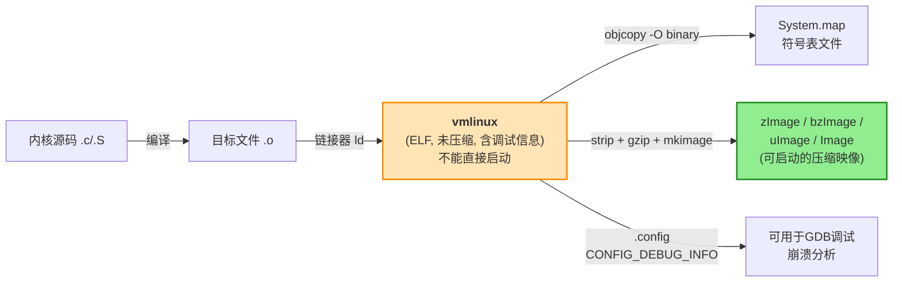

# 4.3.1 vmlinux：未压缩的ELF内核

> 所属章节：第4章 内核映像与启动流程 > 4.3 内核映像格式解析
> 难度：[B→I] | 预计阅读时间：12分钟

## 本节导读

本节带你认识Linux内核编译后产生的第一个"庞然大物"——`vmlinux`。你会明白它到底是什么格式、为什么不能直接烧录到板子上启动，以及它在后续调试和分析工作中扮演的关键角色。

---

## 知识点1：vmlinux是什么 [B] ~800字

当你第一次完整地编译完Linux内核，在源码根目录下执行 `ls -lh vmlinux` 时，你很可能会被它的体积震惊：一个几十兆甚至上百兆的文件赫然在目。这就是`vmlinux`——Linux内核编译过程中产生的**未压缩的ELF格式内核映像**。

### ELF格式：通用可执行文件格式

`vmlinux` 是一个标准的 ELF（Executable and Linkable Format，可执行与可链接格式）文件。ELF是Linux系统中几乎所有可执行文件、共享库、目标文件都遵循的通用格式。你可以把它理解为一种"集装箱"：它把程序的机器码、数据、符号表、调试信息等各种内容分门别类地装进不同的"货舱"（ELF术语叫`Section`），并附上一张"货物清单"（ELF Header和Program Header）。

```bash
# 查看vmlinux的ELF头部信息
$ readelf -h vmlinux
ELF Header:
  Magic:   7f 45 4c 46 02 01 01 00 00 00 00 00 00 00 00 00
  Class:                             ELF64
  Data:                              2's complement, little endian
  Type:                              EXEC (Executable file)
  Machine:                           AArch64
  Entry point address:               0xffff000008080000
```

上面的输出清楚地告诉我们：这是一个64位小端序的ELF可执行文件，目标平台是AArch64（ARM64），入口地址是 `0xffff000008080000`。

### 为什么叫"vm"linux？

`vmlinux` 名称中的 `vm` 代表 **Virtual Memory**（虚拟内存）。早期的Linux内核直接编译为原始二进制格式（`linux`），后来随着内核引入虚拟内存管理机制，编译输出的文件名就变成了 `vmlinux`，以示区别。

### 未压缩 = 体积巨大

`vmlinux` 最大的特征之一就是**完全没有经过压缩**。它里面包含了内核的全部代码段、数据段、BSS段，以及完整的符号表（Symbol Table）和调试信息（Debug Info）。

你可以用 `file` 命令快速确认：

```bash
$ file vmlinux
vmlinux: ELF 64-bit LSB executable, ARM aarch64, version 1 (SYSV), statically linked, BuildID[sha1]=..., with debug_info, not stripped
```

注意输出中的两个关键描述：
- `with debug_info`：包含调试信息
- `not stripped`：符号表没有被剥离

这两个特性使得 `vmlinux` 体积庞大，但也正是后续内核调试和分析的根基。

### ⚠️ 陷阱：vmlinux不能直接启动

这是初学者最容易犯的错误：`vmlinux` 虽然是一个"内核"文件，但它**不能直接用于启动系统**。原因有两点：

1. **体积太大**：嵌入式设备的Bootloader（如U-Boot）通常有加载映像的大小限制，且未压缩的映像会占用过多内存。
2. **缺少启动头信息**：真正用于启动的映像（如 `zImage`、`uImage`）会在内核代码前加上一个自解压的Stub头，Bootloader通过识别这个头来加载和跳转到内核。`vmlinux` 没有这个头。

💡 **提示**：可以类比理解——`vmlinux` 好比工厂里的"完整图纸+模具"，而 `zImage`/`uImage` 则是"打包好的可发货产品"。前者用于研发和维修，后者用于实际部署。

### vmlinux在编译流程中的位置

下图展示了Linux内核编译过程中 `vmlinux` 所处的位置：



从图中可以看出，所有 `.o` 目标文件通过链接器 `ld` 链接后，首先产生的就是 `vmlinux`。它是后续所有"可启动映像"和"符号表文件"的源头。

---

## 知识点2：vmlinux的作用 [I] ~600字

既然 `vmlinux` 不能直接启动，那它存在的意义是什么？实际上，它是内核开发和问题排查中**不可替代的核心资产**。下面介绍三大主要用途。

### 用途一：配合GDB进行源码级调试

当你使用GDB调试内核（无论是通过JTAG、QEMU，还是KGDB远程调试）时，GDB需要知道"当前运行的机器码对应哪一行C语言源代码"。这个映射关系就存放在 `vmlinux` 的调试信息段（`.debug_*` Section）中。

```bash
# 查看vmlinux中包含的调试信息段
$ readelf -S vmlinux | grep debug
  [20] .debug_info       PROGBITS        0000000000000000 00000000
  [21] .debug_abbrev     PROGBITS        0000000000000000 00000000
  [22] .debug_line       PROGBITS        0000000000000000 00000000
  [23] .debug_str        PROGBITS        0000000000000000 00000000
```

💡 **提示**：如果你编译内核时关闭了 `CONFIG_DEBUG_INFO`，`vmlinux` 将不再包含这些调试段，GDB就只能进行汇编级别的调试，无法看到C源代码。

### 用途二：内核崩溃（Oops/Panic）分析

嵌入式设备现场运行时，内核如果发生空指针访问等严重错误，会打印一段被称为 **Oops** 或 **Panic** 的崩溃日志。日志里通常只有一堆内存地址，例如：

```
[   12.345678] pc : do_something_bad+0x24/0x80
[   12.345690] lr : caller_function+0x58/0xc0
```

要把这些地址翻译成人类可读的函数名和代码行号，就需要借助 `vmlinux` 中的符号表。常用的工具包括：

- `addr2line`：将地址转换为源代码行号
- `gdb`：加载 `vmlinux` 后，用 `list *<address>` 查看对应代码
- `decode_stacktrace.sh`：内核自带的自动化解码脚本

```bash
# 用addr2line查找地址对应的源代码位置
$ aarch64-linux-gnu-addr2line -e vmlinux -f -p 0xffffff8008080000
```

🔴 **危险**：如果你的 `vmlinux` 和现场运行的内核**版本不一致**（哪怕只差一个commit），符号表的地址映射就会偏移，导致分析结果完全错误。分析崩溃日志时，务必确保使用的是同一批次编译出来的 `vmlinux`。

### 用途三：System.map的生成来源

`System.map` 是内核源码目录下另一个重要文件，它本质上是一个纯文本的"内核符号地址表"，记录了每个内核函数和全局变量的虚拟地址。很多内核工具和模块都依赖它来解析符号。

```bash
# System.map 内容示例
$ head -5 System.map
ffff000008080000 T _text
ffff000008080000 T stext
ffff000008080040 T _head
ffff000008080048 T __mmap_switched
ffff000008080080 T __mmap_switched_data
```

`System.map` 是怎么来的？内核编译系统从 `vmlinux` 中提取符号表后生成的：

```bash
# 等效于内核Makefile中执行的命令
$ nm vmlinux | grep -v '\(compiled\)\|\(\.o$$\)\|\( [aUw] \)\|\(\.\.ng$$\)\|\(LASH[RL]DI\)' > System.map
```

### 用readelf查看段信息

除了符号和调试，`vmlinux` 还包含内核的完整段布局。通过以下命令可以查看各个段的大小和类型，帮助你理解内核内存布局：

```bash
# 查看各Section的大小排序（从大到小）
$ readelf -S vmlinux | awk 'NR>3 && NF>1 {print $1, $2, $5, $6}' | sort -k3 -n -r | head -10
```

---

## 本节总结

| 特征 | vmlinux | zImage / bzImage / uImage |
|------|---------|---------------------------|
| **文件格式** | ELF（标准可执行文件） | 压缩的二进制 + 自解压头 |
| **压缩状态** | 未压缩，体积大（数十MB~上百MB） | 压缩后体积小（通常<10MB） |
| **调试信息** | 完整保留（含`.debug_*`段） | 通常已剥离，无调试信息 |
| **符号表** | 完整（`not stripped`） | 通常已剥离（`stripped`） |
| **能否直接启动** | ❌ 不能 | ✅ 可以（配合Bootloader） |
| **主要用途** | 调试、崩溃分析、符号提取 | 实际烧录、现场运行启动 |
| **生成阶段** | 编译链接后直接产出 | 由`vmlinux`二次加工生成 |

记住这个核心结论：**`vmlinux`是内核编译的"母版"文件**——它不能直接启动，却是所有调试和分析工作的源头。在实际项目中，每次发布内核版本时，都应该将对应的 `vmlinux` 和 `System.map` 妥善归档保存，以便后续现场问题追溯。

---

## 下一步

了解了 `vmlinux` 这个"母版"文件后，4.3.2节我们将继续探索它的"衍生品"——`zImage`和`bzImage`。你会看到内核是如何通过 `objcopy` 和压缩工具，从一个庞大的ELF文件变身为一个可以自解压、可以被Bootloader直接加载启动的映像。

---

## 配套资源

### 表格清单
- 表1：vmlinux与可启动映像的对比特征表

### 图示清单
- 图1：vmlinux在Linux内核编译流程中的位置 [mermaid图]
- 图2：vmlinux与最终可启动映像的关系示意图 [图2：用一张示意图展示vmlinux作为"源头"，向下分叉产生System.map、压缩启动映像、GDB调试信息等多个产物]

### 代码清单
- 代码1：`file vmlinux` — 快速识别文件格式
- 代码2：`readelf -h vmlinux` — 查看ELF头部信息
- 代码3：`readelf -S vmlinux | grep debug` — 查看调试段
- 代码4：`nm vmlinux > System.map` — 提取符号表
- 代码5：`aarch64-linux-gnu-addr2line -e vmlinux <address>` — 地址反查源码
