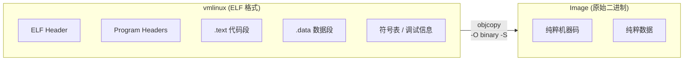

# 4.3.2 Image：原始二进制内核

> 所属章节：第4章 内核构建与引导 > 4.3 节 内核映像格式
> 难度：[B→I] | 预计阅读时间：15分钟

## 本节导读
本节带你理解 Linux 内核构建流程中最基础的一种输出格式——**Image**。你将弄清楚它从哪来、长什么样、为什么嵌入式设备很少直接用它，以及如何亲手把它从 vmlinux 中提取出来。

---

## 知识点1：Image 是什么 [B] ~800字

如果你曾经执行过 `make` 编译 Linux 内核，在 `arch/arm/boot/` 目录下可能会看到一个名叫 `Image` 的文件。它不大不小，但名字极其朴素。这个 `Image` 到底是什么呢？

### 1.1 从 vmlinux 到 Image 的“瘦身”过程

编译内核的最后阶段，链接器会生成一个 ELF 格式的可执行文件，叫做 `vmlinux`。这个文件包含了**完整的符号表、调试信息和 ELF 头**，体积通常非常大（几十到上百兆），并且依赖 ELF 加载器才能运行。然而，嵌入式启动引导程序（Bootloader）通常不认识 ELF，它只需要一段可以直接复制到内存某个地址就能执行的**纯机器码**。于是，内核构建系统通过一个关键工具，把 vmlinux “瘦身”成原始二进制：

```bash
# 等价于内核 Makefile 中执行的命令
arm-linux-gnueabihf-objcopy -O binary -R .note -R .comment -S \
    vmlinux arch/arm/boot/Image
```

这里的 `objcopy` 就像一台“文件切片机”：

| 参数 | 含义 |
|------|------|
| `-O binary` | 输出格式设为**原始二进制**（raw binary），抛弃所有 ELF 结构 |
| `-R .note`  | 移除 `.note` 段（编译器附注信息） |
| `-R .comment` | 移除 `.comment` 段（工具链版本注释） |
| `-S` | **Strip all** —— 删除符号表和重定位信息 |

执行后，Image 只剩一个东西：**内核代码和数据的顺序排布**，没有任何包装。

### 1.2 Image 与 vmlinux 的本质区别

可以用一个表格来对比两者的差异（这也是后续“Image 特征表”的雏形）：

| 项目 | vmlinux | Image |
|------|---------|-------|
| 文件格式 | ELF 可执行文件 | 原始二进制（raw binary） |
| 包含内容 | 代码 + 数据 + 符号表 + 调试信息 + ELF 头 | 仅代码 + 数据 |
| 体积 | 大（通常 50~150 MB） | 中等（通常 8~20 MB） |
| 启动方式 | 需 ELF 加载器解析 | 直接复制到物理地址即可运行 |
| 可调试性 | 可用 GDB 直接符号调试 | 无符号信息，调试困难 |

### 1.3 Image 的内存排布

因为 Image 是原始二进制，它没有 ELF 头告诉你“代码段该放哪、数据段该放哪”。它的内容只是按照链接时的**物理地址顺序**线性展开。Bootloader 加载 Image 时，必须知道内核的链接地址（通常是 `0x80008000` 对于 ARM 32 位），然后原封不动地把它复制到该地址，跳转执行即可。



[图1：vmlinux 到 Image 的转换过程 —— 剥离 ELF 包装，保留纯机器码]

⚠️ **陷阱**：很多初学者误以为 Image 是压缩过的，其实完全没有压缩。它只是去掉了 ELF 头，数据段和代码段的排布与 vmlinux 完全一致。如果你的内核配置了压缩（`CONFIG_KERNEL_GZIP` 等），Makefile 会进一步把 Image 压缩成 `arch/arm/boot/compressed/piggy.gzip`，再封装成 `zImage`。

💡 **提示**：如果你需要确认某个 Image 文件的入口地址，可以用 `head` 查看前几个字节，或者直接在内核源码的 `System.map` 中查找 `_stext` 对应的地址。Image 文件本身不提供这些信息。

---

## 知识点2：Image 的特点 [B] ~500字

### 2.1 无压缩，加载即执行

Image 是“所见即所得”的格式。Bootloader 把它复制到内存的某个物理地址后，**不需要解压、不需要解析、不需要重定位**，直接设置 PC 寄存器跳转到该地址，CPU 就开始执行第一条指令。这种简单性在早期的嵌入式系统中非常珍贵——Bootloader 可以写得极其精简。

也正因为没有压缩，Image 的体积是内核最真实的体积。如果编译出来的 Image 有 16 MB，那么 Bootloader 就必须在内存中为它预留至少 16 MB 的连续空间。

### 2.2 体积大、浪费存储和带宽

嵌入式设备的存储介质通常是 NAND Flash、eMMC 或 SPI NOR，这些存储不仅容量紧张，读取速度也有限。一个没有压缩的 16 MB Image，意味着：

- 烧写固件的时间更长；
- 从 Flash 加载到内存的时间更长；
- 占用更多的 Flash 存储空间。

这就是嵌入式领域**极少直接使用 Image** 的根本原因。厂商和开发者更倾向于使用经过压缩的 `zImage`、`uImage` 或 FIT Image，它们在启动时多花几百毫秒解压，但能节省数倍存储空间。

### 2.3 适用场景

虽然很少直接用于最终产品，Image 在以下场景中仍然不可替代：

1. **调试阶段**：内核开发者有时需要直接加载 Image 到仿真器（如 QEMU `-kernel` 参数实际加载的就是 Image），避免压缩带来的额外逻辑干扰。
2. **裸机测试**：验证 Bootloader 的内存拷贝和跳转逻辑是否正确时，用 Image 最简单。
3. **进一步压缩或打包的原材料**：`zImage`、`xipImage`、`uImage` 都是以 Image 为起点，二次加工而来。

🔴 **危险**：如果你试图把 Image 直接写入 Flash 的某个偏移地址，然后让 Bootloader 跳转到该地址启动，必须确保这个地址**严格等于**内核链接地址（可通过 `readelf -h vmlinux` 查看 `Entry point address`）。地址不匹配会导致内核启动瞬间崩溃，且没有任何错误输出。

---

## 本节总结

| 概念 | 要点 | 操作 |
|------|------|------|
| Image 来源 | vmlinux 经 `objcopy -O binary -S` 生成 | `make Image` 或手动 objcopy |
| 文件格式 | 原始二进制，无 ELF 头、无符号表 | 用 `file arch/arm/boot/Image` 确认 |
| 是否压缩 | **不压缩**，体积与内核代码+数据等大 | 对比同版本的 zImage 体积 |
| 启动方式 | 直接复制到链接地址，跳转执行 | Bootloader 用 `memcpy` + 设置 PC |
| 典型用途 | 调试、裸机测试、进一步封装原材料 | QEMU 裸核启动、制作 zImage |
| 常见错误 | 误以为 Image 可自解压 / 误以为含加载地址信息 | 记住：Image = 纯数据，元数据全在 vmlinux |

---

## 下一步
理解了最朴素的 `Image` 之后，下一节（4.3.3）我们将看内核构建系统如何在 Image 基础上**加上自解压头**，形成启动时能够自我解压的 `zImage`——这是嵌入式 ARM 设备上最常见的内核格式。

---

## 配套资源

### 表格清单
- 表1：objcopy 参数含义表（知识点1）
- 表2：vmlinux 与 Image 对比表（知识点1）
- 表3：Image 特征与操作速查表（本节总结）

### 图示清单
- 图1：vmlinux 到 Image 的转换过程 [mermaid图]
- 图2：objcopy 剥离 ELF 结构的示意图 [配图说明：建议用一张对比图展示 vmlinux 内部段排布 vs Image 的线性排布]

### 代码清单
- 代码1：`arm-linux-gnueabihf-objcopy` 生成 Image 的命令（知识点1）
