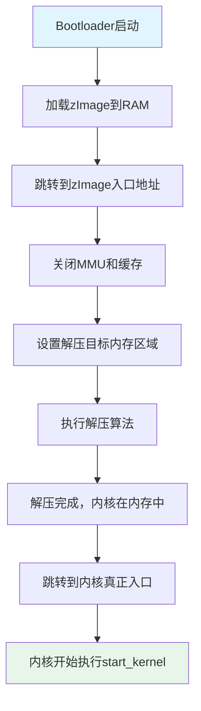

# 4.3.3 zImage：压缩的自解压内核

> 所属章节：第4章 内核启动流程 > 4.3 内核映像格式
> 难度：[B] | 预计阅读时间：15分钟

## 本节导读

本节讲解嵌入式Linux中最经典的压缩内核映像——zImage。你将理解为什么内核需要被压缩、Bootloader如何把zImage搬到内存、以及zImage在启动时如何"自己把自己解开"。学完本节，你能看懂启动日志中`Uncompressing Linux... done`的含义，也能根据存储空间大小选择合适的内核映像格式。

## 知识点1：zImage原理 [B] ~1,000字

### 什么是zImage

在嵌入式设备中，Flash存储空间往往非常珍贵。一块早期的ARM开发板可能只有8MB的NOR Flash，而Linux内核的原始二进制文件（vmlinux）动辄超过5MB，再加上文件系统和Bootloader，存储空间很快就会捉襟见肘。

**zImage**（zipped Image的缩写）就是为解决这个问题的经典方案：

> **zImage = 压缩后的内核代码 + 一小段自解压头（decompressor stub）**

它的核心思想很朴素：把庞大的内核用gzip算法压缩，在头部附加一段极小的自解压程序。存储时只保留压缩后的体积；启动时，这段小程序先把"包裹"打开，释放出真正的内核，再把控制权交给它。整个过程中，Bootloader只需要把zImage当作一个普通二进制文件加载到内存即可，完全不需要理解压缩格式。

### zImage的内部结构

你可以把zImage想象成一个"俄罗斯套娃"：

```
┌─────────────────────────────────────┐
│  自解压头 (decompressor stub)        │  ← 几KB的汇编/C代码
│  - 关闭MMU/缓存（如需要）            │
│  - 初始化串口（可选，用于打印信息）    │
│  - 调用解压算法                      │
├─────────────────────────────────────┤
│  压缩后的内核数据 (gzip/bzip2/lzma)   │  ← 主体部分，大幅缩小
└─────────────────────────────────────┘
```

[图1：zImage内部结构示意图]

上图中，自解压头通常只占 **1KB~4KB**，而压缩后的内核数据可以比原始内核缩小 **40%~60%**。对于一个5MB的vmlinux，压缩后可能只有2MB多一点，这在Flash紧缺的年代是巨大的节省。

### 压缩与打包的完整流程

要生成zImage，内核构建系统会经历以下步骤（你不需要手动执行，但理解它有助于排查构建问题）：

1. **编译内核**：把源码编译成ELF格式的 `vmlinux`，这是未压缩的原始内核
2. **提取二进制**：用 `objcopy` 去掉ELF头，得到纯二进制映像 `Image`
3. **压缩数据**：用gzip等工具把 `Image` 压缩成 `piggy.gz`（piggy = piggyback，背负的意思）
4. **链接自解压头**：把预编译的解压代码（`head.o`、`decompress.o`）和 `piggy.gz` 链接在一起
5. **输出zImage**：最终生成可执行的zImage文件

```bash
# 查看zImage文件信息（在你的构建主机上）
file arch/arm/boot/zImage
# 输出示例：arch/arm/boot/zImage: Linux kernel ARM boot executable zImage (little-endian)

# 查看zImage大小，与未压缩的vmlinux对比
ls -lh arch/arm/boot/zImage vmlinux
# 输出示例：
# -rwxr-xr-x 1 user user 2.1M zImage
# -rwxr-xr-x 1 user user 5.8M vmlinux
```

### zImage与Image、vmlinux的关系

| 文件 | 格式 | 是否压缩 | 体积 | 用途 |
|------|------|---------|------|------|
| vmlinux | ELF可执行文件 | 否 | 最大 | 调试、符号分析 |
| Image | 纯二进制 | 否 | 大 | 不压缩直接启动 |
| zImage | 自解压二进制 | **是** | **小** | **嵌入式常用** |
| uImage | zImage + U-Boot头 | 是 | 略大于zImage | U-Boot专用 |

⚠️ **陷阱：zImage不是纯压缩包**

> 初学者容易误以为zImage就是一个gzip压缩文件，可以随便用`gunzip`解压。实际上zImage是一个**可执行程序**，它的头部是自解压代码，尾部才是压缩数据。如果你用`file`命令检查，它会报告为"Linux kernel ARM boot executable"，而不是"gzip compressed data"。

💡 **提示：查看压缩信息**

如果你用Linux内核源码构建，可以在构建日志中看到压缩步骤：

```bash
# 在arch/arm/boot/compressed/目录下，编译系统会输出类似信息
# "OBJCOPY arch/arm/boot/Image"
# "GZIP    arch/arm/boot/compressed/piggy.gz"
# "LD      arch/arm/boot/zImage"
```

这证实了整个流程：先提取二进制，再压缩，最后链接解压头。

### 解压算法的选择

Linux内核源码的`arch/arm/boot/compressed/`目录下，自解压头支持多种压缩算法：

| 压缩算法 | 压缩比 | 解压速度 | 适用场景 |
|---------|--------|---------|---------|
| gzip | 中等 | 快 | 通用默认，平衡选择 |
| bzip2 | 较高 | 慢 | 极致压缩比需求 |
| lzma/xz | 高 | 较慢 | 存储极度受限 |
| lzo | 较低 | **极快** | **启动速度优先** |

你可以在内核配置时选择压缩算法：

```bash
# 进入内核源码根目录
make menuconfig

# 导航路径：
# General setup  --->
#     Kernel compression mode (Gzip)  --->
#         选择你需要的算法（Gzip / Bzip2 / LZMA / XZ / LZO / LZ4）
```

💡 **提示：嵌入式设备推荐LZO或LZ4**

对于Flash空间不是极度紧张、但启动速度敏感的设备（比如需要快速开机的车载系统、工业控制器），建议选择 **LZO** 或 **LZ4** 压缩算法。它们的压缩比不如gzip，但解压速度极快，能显著缩短启动阶段`Uncompressing Linux...`的等待时间。

## 知识点2：zImage启动过程 [B] ~700字

### 从Bootloader到内核的接力

zImage的启动是一个"接力赛"，由Bootloader跑第一棒，zImage的自解压头跑第二棒，真正的内核跑第三棒。整个过程可以用下面这个流程图描述：



[图2：zImage自解压启动流程图]

### 启动过程详解

#### 步骤1：Bootloader加载zImage到内存

Bootloader（如U-Boot）从Flash或网络把zImage加载到RAM的某个地址。这个地址通常是`0x80008000`（具体取决于硬件内存布局和Bootloader配置）。此时内存中存放的是**压缩状态**的内核。

```bash
# U-Boot命令行示例：从TFTP加载zImage到内存
tftp 0x80008000 zImage
# 含义：通过网络把zImage文件下载到内存地址0x80008000
```

#### 步骤2：跳转到zImage入口

Bootloader设置好必要参数（如机器码、启动参数指针）后，跳转到zImage头部。此时CPU开始执行**自解压头**的代码。

```bash
# U-Boot命令：启动内核
bootz 0x80008000 - 0x83000000
# 含义：从0x80008000启动zImage，设备树在0x83000000
```

#### 步骤3：自解压头的初始化工作

自解压头是用汇编和少量C代码写成的精简程序，它执行以下关键任务：

1. **关闭MMU和缓存**：确保后续解压操作访问的是物理内存，避免地址映射混乱
2. **确定解压目标地址**：计算应该把解压后的内核放到哪里。通常是在当前zImage所在位置的后面，或者一个固定的偏移地址
3. **预留空间**：确保目标区域足够大，不会覆盖zImage自身或Bootloader留下的数据

#### 步骤4：执行解压

自解压头调用解压函数（如`gunzip()`），把尾部的压缩数据解压到目标内存区域。如果配置了串口输出，你会在终端上看到经典的启动信息：

```
Uncompressing Linux... done, booting the kernel.
```

这行日志就是自解压头通过串口打印的。看到它，说明解压已经成功完成。

#### 步骤5：跳转到真正内核入口

解压完成后，真正的内核二进制已经躺在内存中了。自解压头最后的工作是：**清理现场**（关闭可能开启的硬件、恢复一些寄存器），然后执行一条跳转指令，把PC寄存器设置到内核的入口地址。

从这一刻起，CPU开始执行的是`arch/arm/kernel/head.S`中的真正内核启动代码，最终走向`start_kernel()`，Linux内核的世界就此展开。

🔴 **危险：解压目标地址冲突**

> 如果解压后的内核大小超过了自解压头预留的空间，解压数据会**覆盖**到尚未解压的源数据上，导致启动失败甚至系统崩溃。在旧版内核或自定义内存布局时尤其要注意。现代内核的自解压头一般会做安全检查，但了解这个风险是必要的。

💡 **提示：查看启动日志确认解压成功**

在串口控制台观察启动信息时，看到`Uncompressing Linux... done`是健康标志。如果卡在这一步或者出现乱码，可能的原因：
- 压缩数据在Flash中损坏（重新烧录zImage）
- 解压目标地址的RAM有坏块（检查硬件）
- 使用了不匹配的压缩算法（检查内核配置和Bootloader参数）

## 本节总结

| 概念 | 要点 | 关键操作 |
|------|------|----------|
| zImage本质 | 压缩内核 + 自解压头，存储体积小 | 用`file`命令识别映像类型 |
| 构建产物 | vmlinux → Image → piggy.gz → zImage | 在内核源码`arch/arm/boot/`下查看 |
| 压缩算法 | gzip（默认）、lzo、lz4、xz等 | `make menuconfig`中`Kernel compression mode`配置 |
| 启动流程 | Bootloader加载 → 自解压头解压 → 跳转内核入口 | 观察串口输出`Uncompressing Linux...` |
| 解压地址 | 自解压头自动计算目标内存区域 | 确保RAM空间充足，避免覆盖冲突 |

## 下一步

你已经理解了zImage这种"自带解压能力"的内核映像。但在实际嵌入式开发中，如果你使用的是U-Boot作为Bootloader，更常见的内核映像格式是**uImage**——它在zImage的基础上增加了一个64字节的U-Boot专用头部，让U-Boot能更好地管理加载地址、入口地址和校验信息。4.3.4节将详细介绍uImage格式及其与zImage的区别。

---

## 配套资源

### 表格清单
- 表1：vmlinux / Image / zImage / uImage 特征对比表
- 表2：内核压缩算法对比表（gzip / bzip2 / lzma / lzo / lz4）
- 表3：本节核心概念总结表

### 图示清单
- 图1：zImage内部结构示意图（压缩内核+自解压头两层结构）
- 图2：zImage自解压启动流程图 [mermaid流程图]

### 代码清单
- 代码1：查看zImage文件信息和大小对比（`file` + `ls -lh`）
- 代码2：U-Boot加载zImage并启动命令示例（`tftp` + `bootz`）
- 代码3：内核配置中选择压缩算法的导航路径
