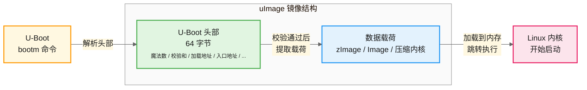

# 4.3.4 uImage：U-Boot专用的内核镜像

> 所属章节：第4章 嵌入式Linux启动流程 > 4.3 Bootloader引导阶段
> 难度：[B→I] | 预计阅读时间：25分钟

## 本节导读

本节讲解 U-Boot 专属的内核镜像格式 **uImage**——它是什么、如何生成、U-Boot 为什么需要它。学完后，你将能够使用 `mkimage` 工具把普通内核镜像转换成 U-Boot 可识别的格式，并在目标板上用 `bootm` 命令成功启动内核。

---

## 知识点1：uImage是什么 [B] ~900字

### 从一个生活比喻说起

想象你寄快递时，除了包裹本身，还需要在快递单上填写**收件地址**、**寄件人电话**、**物品清单**等信息，这样物流公司才能正确派送。uImage 对 U-Boot 来说，就类似于"贴好了快递单的包裹"——它不仅包含内核本体，还在头部附加了一段 **64 字节的元信息**，告诉 U-Boot 这个镜像应该怎么搬、放到哪里、从哪里开始执行。

### uImage 的定义

**uImage**（U-Boot Image）是 U-Boot 引导加载程序专属定义的一种镜像封装格式。它在原始内核镜像（通常是 `zImage` 或 `Image`）的前面增加了一个固定的 64 字节头部，使得 U-Boot 能够通过统一的接口来识别、校验和加载内核，而不必关心内核具体是哪种压缩格式、哪个架构版本。



[图1：uImage 结构示意图——头部与数据载荷的层次关系]

### 64 字节头部里装了什么

这 64 字节头部由 `mkimage` 工具在生成 uImage 时自动填充，U-Boot 在加载时按固定偏移读取。下面是头部的关键字段说明：

| 字段（偏移） | 大小 | 说明 | 典型值示例 |
|:---:|:---:|:---|:---|
| `ih_magic` (0x00) | 4 字节 | 魔数，标识这是一个 U-Boot 镜像 | `0x27051956`（固定值） |
| `ih_hcrc` (0x04) | 4 字节 | 头部本身的 CRC32 校验和 | 由 `mkimage` 自动计算 |
| `ih_time` (0x08) | 4 字节 | 镜像生成时的 Unix 时间戳 | 如 `0x65A4F800` |
| `ih_size` (0x0C) | 4 字节 | 数据载荷的大小（不含头部 64 字节） | 如 `0x0045_6780` |
| `ih_load` (0x10) | 4 字节 | **加载地址**：U-Boot 应将内核搬移到哪个物理地址 | 如 `0x8000_8000` |
| `ih_ep` (0x14) | 4 字节 | **入口地址**：内核启动时第一条指令的地址 | 通常与加载地址相同或略有偏移 |
| `ih_dcrc` (0x18) | 4 字节 | 数据载荷的 CRC32 校验和 | 由 `mkimage` 自动计算 |
| `ih_os` (0x1C) | 1 字节 | 操作系统类型 | `0x05` = Linux |
| `ih_arch` (0x1D) | 1 字节 | CPU 架构 | `0x02` = ARM，`0x16` = ARM64 |
| `ih_type` (0x1E) | 1 字节 | 镜像类型 | `0x02` = Kernel |
| `ih_comp` (0x1F) | 1 字节 | 压缩类型 | `0x00`=无压缩，`0x01`=gzip，`0x02`=bzip2 |
| `ih_name` (0x20) | 32 字节 | 镜像名称字符串（人类可读） | `"Linux-5.15.32"` |

**表1：uImage 64 字节头部结构详解**

### 为什么要关注加载地址和入口地址

- **加载地址（Load Address）**：告诉 U-Boot 把内核本体解压/拷贝到内存的哪个位置。如果填错了，内核可能被放到不存在的内存区域，或被覆盖到 U-Boot 自己身上，导致启动失败。
- **入口地址（Entry Point）**：告诉 U-Boot 启动时 PC 寄存器应该跳转到哪里。对于未压缩的原始内核，入口地址通常等于加载地址；对于自解压的 zImage，入口地址可能与加载地址不同，因为 zImage 内部有一个自解压 Stub，它会先把真正的内核解压到另一个地址再跳转。

💡 **提示**：加载地址和入口地址需要根据你的硬件平台内存布局来设置。最常见的方法是查阅 U-Boot 源码中该板级配置的头文件（`include/configs/xxx.h`），或直接使用 U-Boot 环境变量中的默认值。

### mkimage 工具从哪里来

`mkimage` 全称 **make image**，它是 U-Boot 源码树的一部分，编译 U-Boot 时会连带生成。工具路径通常在 U-Boot 源码的 `tools/` 目录下，交叉编译后得到一个可以在宿主机（如 x86 PC）上运行的可执行文件。很多 Linux 发行版也把它打包成了独立的软件包，例如 Debian/Ubuntu 上的 `u-boot-tools`：

```bash
# 在 Ubuntu/Debian 上直接安装
sudo apt-get install u-boot-tools

# 验证 mkimage 是否可用
mkimage -V
```

---

## 知识点2：uImage的生成与使用 [B] ~700字

### 用 mkimage 生成 uImage

假设你已经编译好了一个 ARM 平台的内核镜像 `arch/arm/boot/zImage`，现在要用 `mkimage` 把它封装成 uImage。核心命令格式如下：

```bash
# 基本格式
mkimage -A <arch> -O <os> -T <type> -C <comp> -a <load_addr> -e <entry_point> \
        -n <name> -d <data_file> <output_file>

# 实际示例：为 ARM 平台 Linux 内核生成 uImage
mkimage -A arm -O linux -T kernel -C gzip \
        -a 0x80008000 -e 0x80008000 \
        -n "Linux-5.15.32-custom" \
        -d arch/arm/boot/zImage \
        uImage

# 输出示例
Image Name:   Linux-5.15.32-custom
Created:      Thu Jan 15 09:30:00 2024
Image Type:   ARM Linux Kernel Image (gzip compressed)
Data Size:    4635648 Bytes = 4527.00 kB = 4.42 MB
Load Address: 80008000
Entry Point:  80008000
```

**命令参数速查：**

| 参数 | 含义 | 常用值 |
|:---|:---|:---|
| `-A` | 架构（Architecture） | `arm`、`arm64`、`x86`、`mips`、`riscv` |
| `-O` | 操作系统（OS） | `linux`、`netbsd`、`openbsd` |
| `-T` | 镜像类型（Type） | `kernel`、`ramdisk`、`multi`、`firmware` |
| `-C` | 压缩方式（Compression） | `none`、`gzip`、`bzip2`、`lzma`、`lz4`、`lzo` |
| `-a` | 加载地址（load Address） | 如 `0x80008000`（十六进制，带或不带 `0x` 均可） |
| `-e` | 入口地址（Entry point） | 如 `0x80008000` |
| `-n` | 镜像名称（Name） | 任意描述字符串，最多 31 个字符 |
| `-d` | 输入数据文件（Data） | 原始内核镜像路径，如 `zImage` |

### 在 U-Boot 中用 bootm 加载 uImage

生成 uImage 后，需要把它烧写到目标板的存储介质（如 NAND Flash、SD 卡、TFTP 服务器）中。U-Boot 提供 `bootm` 命令来专门启动 uImage 格式的镜像：

```bash
# 从 TFTP 服务器下载 uImage 到内存地址 0x81000000
tftp 0x81000000 uImage

# 使用 bootm 启动（U-Boot 会自动解析头部、校验、加载、跳转）
bootm 0x81000000

# 如果同时有设备树文件（DTB），可以用第三个参数指定
tftp 0x82000000 myboard.dtb
bootm 0x81000000 - 0x82000000
```

`bootm` 命令的执行流程是：
1. 读取指定内存地址处的 64 字节头部，检查魔数 `0x27051956`；
2. 计算并校验头部的 CRC32，确保头部没有被破坏；
3. 计算并校验数据载荷的 CRC32，确保内核本体完整；
4. 根据头部中的 `ih_comp` 字段决定是否需要解压；
5. 将数据载荷拷贝/解压到 `ih_load` 指定的加载地址；
6. 设置启动参数（bootargs），关闭中断和 MMU，跳转到 `ih_ep` 入口地址执行。

### uImage 与 zImage 的关系

| 对比项 | zImage | uImage |
|:---|:---|:---|
| 本质 | 压缩的自解压内核（ARM 特有） | U-Boot 封装格式 |
| 能否自启动 | 能被支持 zImage 的 Bootloader 直接启动 | 需要 U-Boot 解析头部后启动 |
| 头部信息 | 有自解压 Stub（约几百字节） | 有 64 字节 U-Boot 头部 |
| 用途 | ARM 传统启动方式 | U-Boot 环境下的标准启动方式 |
| 兼容性 | 需要 Bootloader 认识 zImage 格式 | 任何支持 `bootm` 的 U-Boot 版本均可 |

**表2：zImage 与 uImage 对比**

⚠️ **陷阱**：在较老的 U-Boot 版本中，如果直接用 `go` 命令跳转到 zImage 地址，可能会因为缺少 U-Boot 头部而失败。`bootm` 和 `go` 的区别在于：`bootm` 认识 uImage 头部并做完整处理，`go` 只是简单粗暴地跳转到指定地址执行，不解析任何头部信息。

💡 **提示**：现代 U-Boot 已经支持直接启动 `zImage`（通过 `bootz` 命令）和原始 `Image`（通过 `booti` 命令），因此 uImage 的使用正在逐渐减少。但在许多 legacy 平台和教学场景中，理解 uImage 仍然非常重要。

---

## 知识点3：为什么U-Boot需要特殊格式 [B] ~400字

### 统一加载接口：屏蔽底层差异

U-Boot 的设计目标之一是**跨平台兼容**。它要支持 ARM、PowerPC、MIPS、RISC-V 等几十种 CPU 架构，每种架构的内核镜像格式可能都不相同：ARM 用 zImage，PowerPC 用 cuImage，RISC-V 用 Image.gz……如果没有一个统一的封装格式，U-Boot 的启动代码就需要为每种架构写专门的解析逻辑，代码会爆炸式增长。

uImage 的 64 字节头部充当了"通用语言"：不管原始内核是什么格式、什么架构，只要包上一层 uImage 外壳，U-Boot 就可以用同一套 `bootm` 代码来处理。头部中的 `ih_arch`、`ih_os`、`ih_comp`、`ih_type` 等字段，让 U-Boot 在启动前就知道自己面对的是什么类型的镜像，从而选择正确的处理路径。

### 校验和验证：防止静默失败

嵌入式设备的启动环境往往很恶劣：NAND Flash 有坏块、SD 卡会接触不良、网络传输可能丢包。如果内核镜像在烧写或传输过程中损坏了一点点，Bootloader 直接跳转过去执行，结果往往是**没有任何输出**的硬挂死——这对调试来说是噩梦。

uImage 头部中的两段 CRC32 校验和（`ih_hcrc` 校验头部本身，`ih_dcrc` 校验数据载荷）让 U-Boot 在启动前就能发现镜像是否完整：

```
## Checking Image at 81000000 ...
   Image Name:   Linux-5.15.32-custom
   Image Type:   ARM Linux Kernel Image (gzip compressed)
   Data Size:    4635648 Bytes = 4.4 MB
   Load Address: 80008000
   Entry Point:  80008000
   Verifying Checksum ... OK          <-- CRC 校验通过
```

如果校验失败，U-Boot 会立即报错并停留在命令行，让开发者知道问题出在镜像本身，而不是内存或设备树配置：

```
## Checking Image at 81000000 ...
   Verifying Checksum ... Bad Data CRC
Error: Bad Data CRC
```

🔴 **危险**：千万不要用 `-n` 参数给 uImage 起一个超过 31 字节的名字，也不要修改 uImage 头部后再用普通编辑器保存——这些操作会破坏头部的 CRC 校验和，导致 U-Boot 拒绝加载。如果必须修改，需要重新运行 `mkimage` 生成。

💡 **提示**：在量产环境中，建议在烧写镜像后让 U-Boot 自动做一次 CRC 校验，或在生产脚本中加入 `mkimage -l uImage`（list 模式查看头部但不启动），作为出厂前的质量检查步骤。

---

## 本节总结

| 概念 | 要点 | 操作 |
|:---|:---|:---|
| uImage 是什么 | U-Boot 封装格式，原始内核 + 64 字节头部 | 用 `mkimage` 工具生成 |
| 64 字节头部 | 包含魔数、CRC、加载地址、入口地址、OS/架构/类型/压缩信息 | U-Boot `bootm` 自动解析 |
| 生成命令 | `mkimage -A arm -O linux -T kernel -C gzip -a 0x80008000 -e 0x80008000 -n name -d zImage uImage` | 安装 `u-boot-tools` 包即可获得 |
| 启动命令 | U-Boot 下用 `bootm <addr>` 启动 uImage | 先通过 TFTP/NAND/SD 把镜像加载到内存 |
| 为什么需要 | 统一接口 + 校验和验证，屏蔽架构差异 | 校验失败时 U-Boot 会报错，避免静默崩溃 |
| 与 zImage 关系 | uImage 可以封装 zImage；现代 U-Boot 也可用 `bootz` 直接启动 zImage |  legacy 平台和教学场景仍常用 uImage |

**表3：本节核心知识速查表**

## 下一步

你已经掌握了 uImage 的格式原理和生成方法。下一节（4.3.5）将介绍 **FIT Image（Flattened Image Tree）**——这是 U-Boot 针对现代嵌入式系统推出的下一代镜像格式，它用设备树语法把内核、设备树、ramdisk 打包在一个镜像里，解决了 uImage 只能封装单个文件的局限。理解了 uImage 的头部概念后，学习 FIT Image 的 image source 文件结构会更加轻松。

---

## 配套资源

### 表格清单
- **表1**：uImage 64 字节头部结构详解（偏移、大小、说明、典型值）
- **表2**：zImage 与 uImage 对比（本质、启动方式、头部、兼容性）
- **表3**：本节核心知识速查表（概念、要点、操作）

### 图示清单
- **图1**：uImage 结构示意图 [mermaid 图]——展示 uImage 的头部与数据载荷层次，以及 U-Boot `bootm` 的解析加载流程
- **图2**：mkimage 工具与 U-Boot 源码树的关系示意图 [配图说明]——建议配图展示 mkimage 在 U-Boot `tools/` 目录下的位置，以及宿主机编译、目标板运行的关系

### 代码清单
- **代码1**：Ubuntu/Debian 上安装 u-boot-tools 并验证 mkimage 版本
- **代码2**：完整的 `mkimage` 命令示例，为 ARM Linux 内核生成 gzip 压缩的 uImage
- **代码3**：U-Boot 命令行中使用 `tftp` + `bootm` 下载并启动 uImage，以及带设备树的三参数启动格式
- **代码4**：U-Boot 校验通过和校验失败时的典型串口输出对比
