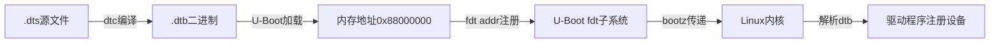

# 4.3.5 .dtb：设备树的二进制表示

> 所属章节：第4章 设备树与设备驱动 > 4.3 设备树基础
> 难度：[B→B] | 预计阅读时间：25分钟

## 本节导读

上一节我们学会了用文本编写`.dts`设备树源文件，但内核启动时并不会直接"阅读"这份人类可读的文本。本节讲解`.dts`如何变成内核能直接解析的二进制`.dtb`文件，以及Bootloader如何把这个"硬件说明书"传递给内核。学完本节，你将能独立完成dtb的编译、定位和使用。

---

## 知识点1：.dtb是什么 [B] ~800字

### 从文本到二进制的必然之路

想象一下，你写了一份`.dts`设备树源文件，里面用人类熟悉的语法描述了CPU有多少核、内存有多大、串口接在哪个引脚。这份文件对人类友好，但对计算机来说却是一份"天书"——内核启动代码需要用尽可能少的步骤、尽可能快的速度读取硬件信息，逐行解析文本显然太慢了。

`.dtb`（Device Tree Blob，设备树二进制大对象）就是解决这个问题的答案：**它是.dts经过编译后生成的紧凑二进制格式，内核可以直接按固定格式读取，无需任何文本解析**。

### dtb文件的内部结构

dtb文件的设计非常精巧，它由四个主要部分顺序排列组成：

[图1：dtb文件内部结构示意图]

```
+-------------------+
|     文件头        |  ← 魔数、版本、各部分偏移量
+-------------------+
|   内存保留块      |  ← 标记内核不能使用的内存区域
+-------------------+
|    结构块         |  ← 设备树的节点和属性（主体）
+-------------------+
|    字符串块       |  ← 所有属性名集中存放，结构块引用偏移
+-------------------+
```

**文件头（Header）** 占40字节，包含关键的"魔数"（Magic Number）`0xd00dfeed`，内核靠这个数值判断"这是一个合法的dtb文件"。头里还记录了dtb版本、结构块起始位置、字符串块起始位置等信息。

**内存保留块（Memory Reservation Block）** 列出启动时内核不能占用的内存区域。例如，有些硬件固件或显示帧缓冲区需要固定内存地址，这部分就在这里标记为"保留"。

**结构块（Structure Block）** 是dtb的"心脏"，存储了所有设备节点和属性值。它使用紧凑的token格式：每个节点以`FDT_BEGIN_NODE`标记开始，属性以`FDT_PROP`标记开始，节点结束用`FDT_END_NODE`，整个结构以`FDT_END`收尾。

**字符串块（Strings Block）** 把所有属性名字符串集中存放。结构块中的属性不直接存名字，而是存一个指向字符串块的偏移量。这样多个节点使用同名属性（如`compatible`）时，名字只需存一份，大幅节省空间。

### 为什么用二进制格式？

| 特性 | .dts文本格式 | .dtb二进制格式 |
|------|-------------|---------------|
| 人类可读性 | ✅ 清晰直观 | ❌ 不可直接阅读 |
| 内核解析速度 | 慢（需词法/语法分析） | 快（直接按偏移读取） |
| 文件体积 | 较大（含注释、空白） | 紧凑（无冗余） |
| 启动阶段可用 | 需要复杂库支持 | 仅需基本内存访问 |
| 跨平台一致性 | 依赖编译器实现 | 格式规范统一 |

Bootloader在启动初期往往运行在非常简陋的环境中，没有完整的C库、没有文件系统解析器。dtb的扁平二进制结构使得Bootloader只需做简单的内存拷贝，就能把硬件信息交给内核——**这是文本格式无法比拟的优势**。

### 操作步骤：查看dtb文件信息

你可以用`fdtdump`工具把二进制dtb反编译回人类可读的文本，验证编译结果：

```bash
# 安装设备树工具（Ubuntu/Debian）
sudo apt-get install device-tree-compiler

# 反编译dtb为文本，查看内容
cd arch/arm/boot/dts
fdtdump am335x-boneblack.dtb | head -n 50

# 查看dtb文件原始头部信息（十六进制）
hexdump -C am335x-boneblack.dtb | head -n 5
```

运行`hexdump`后，你会看到文件最开始的4字节就是魔数 `d0 0d fe ed`（小端序下显示为`ed fe 0d d0`，注意字节序）。

### 常见错误

⚠️ **陷阱：混淆dtb与dts的扩展名**
> 初学者常把`.dts`和`.dtb`搞混。记住规律：**s**ource=源文件=`.dts`，**b**lob=二进制=`.dtb`。

💡 **提示：dtb版本兼容性**
> dtb文件头中有版本号。旧版内核可能无法解析新版dtb。如果遇到启动时报`FDT_ERR_BADVERSION`，说明dtb版本与内核不兼容，需要更换dtb或升级内核。

---

## 知识点2：dtb的生成 [B] ~600字

### dtc：设备树编译器

把`.dts`变成`.dtb`的工具叫**dtc**（Device Tree Compiler，设备树编译器）。它就像是设备树世界的"gcc"——读取人类可读的源文件，输出机器可执行的二进制文件。

dtc的用法非常直观：

```bash
# 基本语法：dtc -I <输入格式> -O <输出格式> -o <输出文件> <输入文件>
dtc -I dts -O dtb -o myboard.dtb myboard.dts

# 反向操作：dtb转dts（反编译）
dtc -I dtb -O dts -o myboard_recovered.dts myboard.dtb

# 编译时包含搜索路径（当dts引用了其他.dtsi文件时）
dtc -I dts -O dtb -i /path/to/include/ -o myboard.dtb myboard.dts
```

参数说明：
- `-I dts`：输入格式为dts源文件
- `-O dtb`：输出格式为dtb二进制
- `-i <path>`：添加`#include`的搜索路径
- `-o <file>`：指定输出文件名

### 在内核源码中编译dtb

实际开发中，你几乎不会手动调用`dtc`。Linux内核的Kbuild系统已经把dtb编译集成到构建流程中。当你编译内核时，内核Makefile会自动找到`arch/<架构>/boot/dts/`目录下的`.dts`文件，调用dtc生成对应的`.dtb`。

```bash
# 编译全部dtb文件（推荐）
cd linux-source/
make dtbs

# 编译特定架构的dtb
make ARCH=arm dtbs
make ARCH=arm64 dtbs
make ARCH=riscv dtbs

# 编译内核时dtb会一并生成
make zImage
```

🔴 **危险：内核源码路径与dtb输出路径**
> 不同架构的dtb输出位置不同。ARM32的dtb通常输出到`arch/arm/boot/dts/`目录，ARM64则在`arch/arm64/boot/dts/<厂商>/`。执行`make dtbs`后，注意终端输出的日志，找到实际生成的`.dtb`文件路径。

### 操作步骤：定位你的dtb文件

1. 进入内核源码目录：`cd ~/linux-source/`
2. 执行编译：`make ARCH=arm dtbs`
3. 根据你的开发板型号查找dtb。例如BeagleBone Black对应`am335x-boneblack.dtb`：

```bash
# 查找生成的dtb
find arch/arm/boot/dts -name "*.dtb" | grep boneblack
# 输出：arch/arm/boot/dts/am335x-boneblack.dtb

# 查看文件大小（通常几十KB到几百KB）
ls -lh arch/arm/boot/dts/am335x-boneblack.dtb
# 输出：-rw-rw-r-- 1 user user 32K Jan 15 09:30 am335x-boneblack.dtb
```

💡 **提示：dtb文件命名规律**
> dtb文件名通常与dts文件名一一对应，只是把扩展名从`.dts`改成`.dtb`。如果你的开发板是"myboard"，查找`myboard.dtb`即可。有些厂商会把dtb打包进内核镜像（zImage/Image），这时文件系统中看不到独立的dtb文件。

---

## 知识点3：dtb的使用 [B] ~500字

### Bootloader是dtb的"快递员"

内核启动时，自己无法读取SD卡或Flash上的文件——那时候文件系统驱动还没加载呢。所以`.dtb`文件必须由**Bootloader**（通常是U-Boot）提前加载到内存中，然后通过约定的方式"递给"内核。

这个交接过程用到一个关键概念：**FDT（Flattened Device Tree，扁平设备树）**。U-Boot内部有专门的fdt命令族来处理dtb。

### U-Boot中加载和传递dtb

下面是U-Boot命令行中操作dtb的典型流程：

```bash
# 步骤1：将dtb文件从存储介质加载到内存
# 假设SD卡分区1有dtb文件，加载到内存地址0x88000000
fatload mmc 0:1 0x88000000 am335x-boneblack.dtb

# 步骤2：告诉U-Boot"dtb在这"
fdt addr 0x88000000

# 步骤3：（可选）验证dtb是否合法
fdt print /model
# 输出：model = "TI AM335x BeagleBone Black"

# 步骤4：启动内核，同时把dtb地址传过去
# 格式：bootz <内核地址> - <dtb地址>
bootz 0x82000000 - 0x88000000
```

各参数含义：
- `fatload mmc 0:1`：从MMC（SD卡）设备0的分区1加载文件
- `0x88000000`：dtb加载到的内存地址（需避开内核镜像和initrd区域）
- `fdt addr`：向U-Boot注册dtb所在的内存地址
- `bootz ... - ...`：`-`表示没有initrd（根文件系统ramdisk），最后一个参数是dtb地址



[图2：dtb从编译到内核解析的完整流程]

### 常见错误

⚠️ **陷阱：dtb内存地址与内核镜像重叠**
> 如果dtb加载地址选得不好，可能与内核镜像、initrd或U-Boot自身占用的内存重叠。启动时会出现内核崩溃或dtb被覆盖。解决方法：查阅开发板内存布局文档，选择安全的加载地址（通常在内核镜像之后的高地址区域）。

⚠️ **陷阱：忘记执行fdt addr**
> 有些新手加载dtb后直接用`bootz`，却忘了执行`fdt addr 0x88000000`。U-Boot不知道dtb在哪，内核启动时接收不到设备树信息，导致所有设备驱动都无法匹配，最终启动后看不到任何外设。

💡 **提示：在U-Boot中临时修改dtb**
> U-Boot提供`fdt set`、`fdt rm`等命令，可以在启动前临时修改dtb内容（例如改启动参数、禁用某个设备）。这在调试时非常有用，但要注意修改的是内存中的副本，不会写回存储介质。

```bash
# 示例：临时修改bootargs
fdt set /chosen bootargs "console=ttyO0,115200 root=/dev/mmcblk0p2 rw"
```

---

## 本节总结

| 概念 | 要点 | 关键操作 |
|------|------|---------|
| .dtb本质 | .dts编译后的二进制，内核可直接解析 | 理解魔数、结构块、字符串块 |
| dtb生成 | 用`dtc`手动编译，或`make dtbs`自动编译 | `dtc -I dts -O dtb`，`make ARCH=arm dtbs` |
| dtb位置 | 通常在内核源码`arch/*/boot/dts/`下 | `find`命令搜索`.dtb` |
| U-Boot加载 | `fatload`把dtb读到内存 | `fatload mmc 0:1 <addr> <dtb文件>` |
| U-Boot注册 | `fdt addr`告知U-Boot dtb位置 | `fdt addr 0x88000000` |
| 启动传递 | `bootz`最后一个参数传dtb地址 | `bootz <kernel> - <dtb>` |
| dtb反编译 | `fdtdump`或`dtc -I dtb -O dts`查看内容 | `fdtdump xxx.dtb` |

.dtb是设备树从"人类语言"到"机器语言"的关键一跃。它让Bootloader能轻松地把硬件描述交给内核，也让内核在启动早期就能建立完整的设备认知。下一节，我们将进入内核内部，看看内核是如何逐字节解析这份二进制"说明书"的。

---

## 下一步

**4.3.6 内核如何解析dtb** — 我们将深入内核源码，追踪`setup_arch()`函数如何调用设备树解析代码，看内核怎样从dtb的二进制token流中重建出`device_node`树，最终把硬件信息传递给驱动框架。

---

## 配套资源

### 表格清单
- 表1：.dts文本格式与.dtb二进制格式对比表

### 图示清单
- 图1：dtb文件内部结构示意图（文件头、内存保留块、结构块、字符串块）
- 图2：dtb从编译到内核解析的完整流程 [mermaid图]

### 代码清单
- 代码1：`fdtdump`和`hexdump`查看dtb文件
- 代码2：`dtc`手动编译dtb命令
- 代码3：`make dtbs`内核编译dtb
- 代码4：`find`命令定位生成的dtb文件
- 代码5：U-Boot加载dtb完整流程（fatload + fdt addr + bootz）
- 代码6：U-Boot临时修改dtb属性示例
