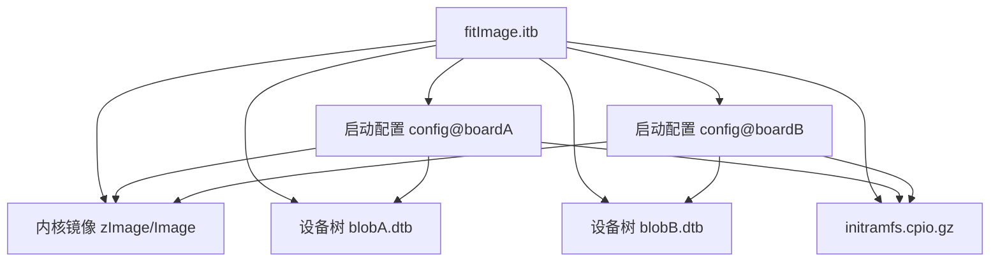

# 4.3.6 其他镜像格式与打包方式

> 所属章节：第4章 内核配置与编译 > 4.3 内核镜像类型
> 
> 难度：[I] | 预计阅读时间：20分钟

## <span class="blue"> 本节导读
本节覆盖：fitImage 多合一镜像结构、Android boot.img 格式、以及 U-Boot 三条启动命令（`bootz`/`bootm`/`booti`）的选择逻辑。

## <span class="blue"> fitImage，多合一镜像 [I] 

如果你用过Legacy uImage，一定遇到过这种麻烦：内核、设备树（DTB）、根文件系统（initramfs）是三个独立的文件，U-Boot启动时要分别加载到不同内存地址，地址算错一个系统就起不来。fitImage（Flat Image Tree）就是为解决这个问题而生的。

fitImage本质上是一个"容器"，它借鉴了设备树的语法，用一个`.its`（Image Tree Source）文件描述要打包的内容，最终生成一个`.itb`（Image Tree Blob）二进制文件。<BR>这个文件内部可以同时包含：

- 一个或多个内核镜像（适配不同CPU架构或压缩方式）
- 一个或多个设备树blob（适配不同硬件板型）
- initramfs镜像
- 可选的启动脚本或配置文件

### fitImage的结构原理

fitImage内部采用类似设备树的节点结构，有一个根节点`/images`，下面每个子节点代表一个组件。U-Boot启动时通过`loadables`或`bootm`命令解析这个结构，按配置自动选择正确的内核+dtb组合。


```mermaid
graph TD
    A[fitImage.itb] --> B[内核镜像 zImage/Image]
    A --> C[设备树 blobA.dtb]
    A --> D[设备树 blobB.dtb]
    A --> E[initramfs.cpio.gz]
    A --> F[启动配置 config@boardA]
    A --> G[启动配置 config@boardB]
    F --> B
    F --> C
    F --> E
    G --> B
    G --> D
    G --> E
```

### 操作步骤：创建fitImage

**步骤1：编写.its源文件**

以下是一个最小化的`.its`文件模板，包含内核、dtb和initramfs：

```its
/dts-v1/;

/ {
    description = "Kernel fitImage";
    #address-cells = <1>;

    images {
        kernel@1 {
            description = "Linux Kernel";
            data = /incbin/("arch/arm/boot/zImage");
            type = "kernel";
            arch = "arm";
            os = "linux";
            compression = "none";
            load = <0x80008000>;
            entry = <0x80008000>;
        };

        fdt@1 {
            description = "Device Tree";
            data = /incbin/("arch/arm/boot/dts/myboard.dtb");
            type = "flat_dt";
            arch = "arm";
            compression = "none";
        };

        ramdisk@1 {
            description = "initramfs";
            data = /incbin/("initramfs.cpio.gz");
            type = "ramdisk";
            arch = "arm";
            os = "linux";
            compression = "gzip";
        };
    };

    configurations {
        default = "config@1";
        config@1 {
            description = "Default configuration";
            kernel = "kernel@1";
            fdt = "fdt@1";
            ramdisk = "ramdisk@1";
        };
    };
};
```

**步骤2：用mkimage编译**

```bash
# 确保U-Boot源码已编译，mkimage在tools目录下
~/u-boot/tools/mkimage -f kernel.its kernel.itb

# 输出验证
ls -lh kernel.itb
dumpimage -l kernel.itb    # 查看fitImage内部结构

```

**步骤3：U-Boot启动**

```bash
# 加载fitImage到内存
fatload mmc 0:1 ${loadaddr} kernel.itb

# 启动（U-Boot自动解析fitImage内部配置）
bootm ${loadaddr}

```

### 常见错误

> ⚠️ entry 地址与 load 地址不一致导致启动挂死
> 
> fitImage 中 `entry` 必须指向内核解压后或可直接执行的入口地址。对于压缩内核，`load` 是解压目标地址，`entry` 通常是相同的地址。如果 entry 设置错误，U-Boot 会跳转到一个无意义地址，串口无任何输出。

> 💡 多个板型共用同一个 fitImage
> 
> 在 `configurations` 节点中定义多个 `config@xxx`，启动时通过 `bootm ${loadaddr}#config@boardA` 语法选择特定配置。这在产品系列化开发中极为方便，一个 fitImage 可以服务多个硬件变体。

> 🔴 its 文件路径错误不会报错
> 
> 如果 `data = /incbin/("xxx")` 中的文件路径不存在，mkimage 不会报错，而是生成一个空的 fitImage 节点。启动时会提示 "Bad Data CRC"。务必用 `dumpimage -l` 验证输出文件大小和节点完整性。

## <span class="blue"> bootz vs bootm vs booti，启动命令的选择 [I] 

U-Boot启动内核不是只有`bootm`一条命令。面对不同的内核镜像格式，U-Boot提供了三个核心启动命令：`bootm`、`bootz`、`booti`。选错命令，U-Boot会直接拒绝执行或启动崩溃。

### 三条命令的分工

| 命令 | 适用镜像格式 | 典型平台 | 内部行为 |
|------|-------------|---------|---------|
| `bootm` | Legacy uImage / fitImage / raw with header | ARM32/ARM64/PPC等 | 解析U-Boot镜像头，支持多组件（内核+dtb+ramdisk） |
| `bootz` | zImage（压缩的裸内核） | 主要为ARM32 | 不解析U-Boot头，直接跳到zImage自解压入口 |
| `booti` | Image（未压缩裸内核，ARM64标准） | ARM64（AArch64） | 要求内核为未压缩Image，dtb单独传入 |

### 操作步骤

**场景A：启动Legacy uImage（ARM32老平台）**

```bash
# 加载uImage到内存
fatload mmc 0:1 0x82000000 uImage

# 如有dtb，单独加载
fatload mmc 0:1 0x88000000 board.dtb

# 启动：bootm [内核地址] [ramdisk或'-' ] [dtb地址]
bootm 0x82000000 - 0x88000000

```

**场景B：启动zImage（ARM32常见情况）**

```bash
# zImage通常更小，直接加载
fatload mmc 0:1 0x82000000 zImage

# dtb紧跟zImage之后（注意地址对齐）
fatload mmc 0:1 0x88000000 board.dtb

# 启动：bootz [内核地址] - [dtb地址]
bootz 0x82000000 - 0x88000000

```

**场景C：启动ARM64 Image（ARM64平台）**

```bash
# ARM64用Image（未压缩大端对齐裸镜像）
fatload mmc 0:1 0x80080000 Image
fatload mmc 0:1 0x83000000 board.dtb

# 启动：booti [内核地址] - [dtb地址]
booti 0x80080000 - 0x83000000

```

> ⚠️ ARM64 平台误用 bootm 启动 Image
ARM64 的 `Image` 文件没有 U-Boot 镜像头，`bootm` 无法识别。如果强行使用 `bootm`，U-Boot 会提示"Bad Magic Number"。ARM64 平台必须用 `booti`。

> 💡 bootz/bootm/booti 命令中第二个参数位置的 `-` 表示没有 ramdisk
三个命令中的第二个参数位置原本用于 ramdisk 地址。如果没有 ramdisk，必须写 `-` 占位，否则 U-Boot 会把 dtb 地址当成 ramdisk 来解析。

## <span class="blue"> Android boot.img，移动设备的专用格式 [I] 

如果你在做Android设备移植（比如高通骁龙、联发科平台），一定会遇到`boot.img`。这是Android系统定义的专用启动镜像格式，与标准Linux的uImage/zImage完全不同。

### boot.img的结构

boot.img由Google在AOSP（Android Open Source Project）中定义，固定包含两部分：

1. **内核（kernel）**：通常是一个经过gzip压缩的Image或zImage
2. **ramdisk（ramdisk）**：Android的`initramfs`，里面包含`init`程序、属性服务、`ueventd`等Android特有组件

头部是一个`boot_img_hdr`结构体（2KB大小），包含各组件的偏移、大小、加载地址等元信息。

```c
// boot_img_hdr 关键字段示意（Android版本略有差异）
struct boot_img_hdr {
    unsigned char magic[8];     // "ANDROID!"
    unsigned kernel_size;       // 内核字节数
    unsigned kernel_addr;       // 内核加载地址
    unsigned ramdisk_size;      // ramdisk字节数
    unsigned ramdisk_addr;      // ramdisk加载地址
    unsigned second_size;       // stage2大小（通常0）
    unsigned second_addr;       // stage2地址
    unsigned tags_addr;         // 设备树/ATAG地址
    unsigned page_size;         // 页大小（通常2048/4096）
    unsigned dtb_size;          // DTB大小（新版）
    unsigned dtb_addr;          // DTB加载地址（新版）
    // ...
};
```

### 操作步骤：解包/打包 boot.img

```bash
# 安装Android官方工具（系统镜像解包工具）
pip install abootimg

# 解包现有boot.img
abootimg -x boot.img
# 输出：zImage（内核）、initrd.img（ramdisk）、bootimg.cfg（配置）

# 修改后重新打包
abootimg --create new_boot.img \
    -k zImage \
    -r initrd.img \
    -f bootimg.cfg

# 用mkbootimg（AOSP自带）更灵活地打包
mkbootimg --kernel zImage --ramdisk initrd.img \
    --base 0x80000000 --pagesize 4096 \
    --dtb board.dtb \
    -o boot.img

```

### 与标准Linux镜像的区别

Android boot.img最大的特点是**将内核和ramdisk强制绑定在一起**。标准Linux启动可以单独更新内核或initramfs，而Android的OTA升级通常替换整个boot.img分区。另外，Android的ramdisk里运行的是`init`进程，而不是标准Linux的`/sbin/init`或systemd。

> ⚠️ base地址算错导致黑屏
> `mkbootimg`的`--base`参数决定了所有地址的基址。如果与Bootloader传递的不一致，内核或dtb会被加载到错误物理地址，启动无任何输出。务必从设备厂商的BoardConfig.mk或dts中获取正确的base地址。

> 💡 Android Bootloader（如LK/aboot）也认标准格式
> 部分Android设备的Bootloader同时支持`boot.img`和`fitImage`。如果是做嵌入式Linux而非Android系统，完全可以不用boot.img，直接用fitImage+标准rootfs，减少Android专有格式的束缚。

## <span class="blue"> 本节总结

| 镜像格式 | 适用场景 | U-Boot启动命令 | 能否含dtb+ramdisk |
|---------|---------|---------------|-----------------|
| Legacy uImage | 老ARM32平台 | `bootm` | 需外部传入 |
| zImage | ARM32（压缩内核） | `bootz` | 需外部传入 |
| Image（ARM64） | ARM64平台 | `booti` | 需外部传入 |
| **fitImage** | 多板型/安全启动 | `bootm` | **内部自带** |
| **Android boot.img** | Android手机/平板 | 由Bootloader原生支持 | **内部自带** |

面对日益复杂的嵌入式硬件生态，理解这些镜像格式的差异至关重要。传统uImage适合简单单板系统；fitImage是多板型产品线的最佳实践；boot.img则是Android生态的既定标准。

## <span class="blue"> 下一步

掌握各种镜像格式后，下一节（4.3.7）将给出**镜像生成全景图**，把 vmlinux → Image → zImage → uImage 的完整转换链用一张总图串起来，并总结三条启动命令的选择逻辑。

---
