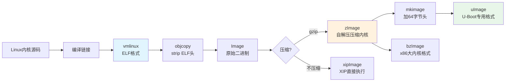
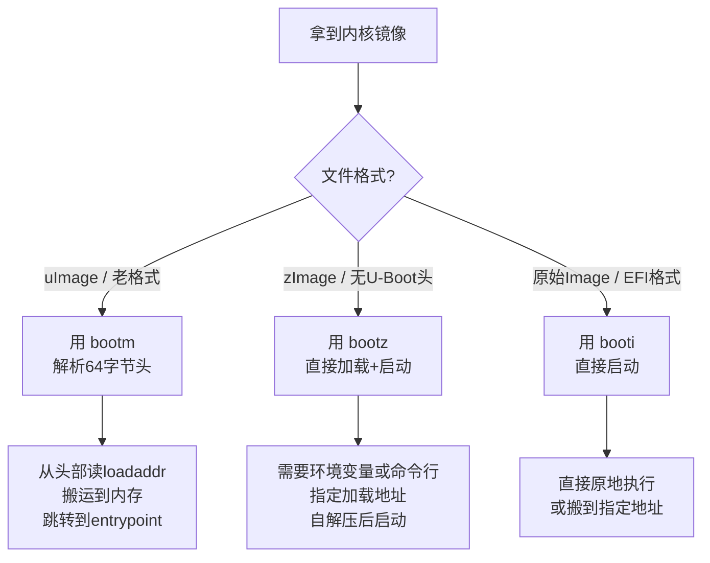

# 4.3.7 镜像生成全景图：从源码到可启动镜像

> 所属章节：第4章 U-Boot深度应用 > 4.3 镜像加载与启动
> 难度：[I→E] | 预计阅读时间：15分钟

## 本节导读

本节把分散在各处的镜像知识串成一条线——从`make`编译内核源码开始，到最终用`bootz`或`bootm`把镜像加载到内存并启动。学完本节，你能一眼看穿各种镜像文件（vmlinux、zImage、uImage、bzImage…）的来龙去脉，再也不会面对一桌子镜像文件时不知所措。

---

## 知识点1：镜像生成全景 [I] ~1,500字

如果你把之前几节的知识点比喻成“拼图碎片”，那么本节就是把它们拼成完整图画的过程。我们先从一个问题开始：**当你执行`make zImage`时，到底发生了什么？**

### 从源码到 vmlinux：编译的第一步

Linux内核源码经过编译链接后，首先生成的是`vmlinux`。这是一个标准的ELF格式文件，包含了完整的符号表、段信息等调试信息。它体积很大（通常几十MB），而且不能直接引导启动——因为Bootloader需要的是纯粹的二进制机器码，而不是ELF文件头。

```bash
# 编译内核，vmlinux 位于源码根目录
$ cd ~/linux-5.10/
$ make ARCH=arm CROSS_COMPILE=arm-linux-gnueabihf- -j$(nproc)
# 编译完成后检查
$ ls -lh vmlinux
-rwxr-xr-x  1 user user  82M  vmlinux    # ELF格式，带调试信息
```

💡 **提示**：`vmlinux`虽然启动不了，却是调试内核崩溃的“金钥匙”。用GDB加载`vmlinux`配合`add-symbol-file`，可以追溯到源码级别。保留好编译产物树下的`vmlinux`和`System.map`。

### 从 vmlinux 到各种启动镜像

内核编译系统会把`vmlinux`进一步加工成不同格式的启动镜像，以适应不同架构和不同Bootloader的需求。这个过程本质上就是：**去掉ELF头 → 可选压缩 → 添加自解压头或U-Boot头**。



**图1：从源码到可启动镜像的完整生成链路**

| 镜像文件 | 生成命令 | 格式说明 | 适用场景 | U-Boot启动命令 |
|---------|---------|---------|---------|---------------|
| **vmlinux** | 编译自动产生 | ELF格式，带符号表 | 调试分析，不能直接启动 | — |
| **Image** | `make Image` | 原始二进制，未压缩 | 调试或极小系统 | `booti`（部分平台） |
| **zImage** | `make zImage` | 自解压压缩格式（gzip），含解压头 | ARM等嵌入式主流格式 | `bootz` |
| **bzImage** | `make bzImage` | x86大内核压缩格式 | x86/PC平台 | 不适用 |
| **uImage** | `make uImage` 或 `mkimage` | zImage + 64字节U-Boot头（CRC、加载地址、入口地址等） | 老版本U-Boot强制要求 | `bootm` |
| **xipImage** | `make xipImage` | XIP（eXecute In Place）格式，就地执行 | NOR Flash直接执行场景 | `bootx` |
| **dtb/dtbo** | `make dtbs` | 设备树二进制Blob，描述硬件 | 所有现代ARM/ARM64平台 | 配合`bootz`/`bootm`通过`-`或`fdt`参数传入 |

**表1：Linux内核启动镜像格式全景对比**

⚠️ **陷阱：uImage ≠ zImage 的简单重命名**
很多初学者以为`uImage`就是改了个扩展名，实际上`mkimage`工具在zImage头部**额外添加了64字节的U-Boot专用头**（包含魔数`0x27051956`、镜像类型、压缩类型、加载地址`load addr`、入口地址`entry point`、CRC32校验值等）。这64字节决定了U-Boot能否正确识别并搬运镜像到内存的哪个位置。

### 三条启动命令的选择逻辑

面对不同格式的镜像，U-Boot提供了三条核心启动命令，选择逻辑如下：



**图2：U-Boot启动命令选择决策图**

| 启动命令 | 目标镜像 | 自动处理loadaddr? | 设备树传递方式 | 典型适用版本 |
|---------|---------|------------------|---------------|-------------|
| `bootm` | uImage | ✅ 从64字节头读取 | `bootm <addr> - <dtb_addr>` | 所有版本 |
| `bootz` | zImage | ❌ 需手动/脚本指定 | `bootz <addr> - <dtb_addr>` | U-Boot 2013+ |
| `booti` | Image/EFI | ❌ 需指定 | `booti <addr> - <dtb_addr>` | U-Boot 2017+ |

**表2：U-Boot三条启动命令对比**

🔴 **危险：镜像格式与启动命令不匹配会导致神秘崩溃**
- 用`bootm`去启动zImage → U-Boot会把zImage的前64字节当成U-Boot头来解析，魔数校验失败，提示"Bad Magic Number"
- 用`bootz`去启动uImage → U-Boot会跳过64字节头开始加载，导致CRC校验失败或直接跑飞
- **解决**：不确定镜像格式时，先用`md.l <addr> 1`查看前4字节。如果是`0x27051956`，那就是uImage；如果是自解压头的跳转指令（ARM上通常是`0xea0000XX`），那就是zImage。

### 实操：生成 uImage 的完整步骤

```bash
# 步骤1：确保已编译出 zImage
$ ls arch/arm/boot/zImage
arch/arm/boot/zImage

# 步骤2：使用 U-Boot 自带的 mkimage 工具生成 uImage
# -A arch: 架构 (arm / arm64 / x86 / mips ...)
# -O os:   操作系统 (linux)
# -T image: 镜像类型 (kernel / ramdisk / firmware)
# -C gzip:  压缩类型 (none / gzip / bzip2 / lzma / lzop / lz4 / zstd)
# -a addr:  加载地址 (Load Address, U-Boot会把镜像搬运到这里)
# -e addr:  入口地址 (Entry Point, 最终跳转执行的地址)
# -n name:  镜像名称（任意描述字符串）
# -d file:  输入文件（这里是zImage）
$ mkimage -A arm -O linux -T kernel -C gzip \
          -a 0x80008000 -e 0x80008000 \
          -n "Linux-5.10-custom" \
          -d arch/arm/boot/zImage \
          uImage

# 输出验证
$ ls -lh uImage
$ file uImage
uImage: u-boot legacy uImage, Linux-5.10-custom, Linux/ARM, OS Kernel Image (gzip), ...

# 步骤3：查看 uImage 头部信息（调试用）
$ mkimage -l uImage
Image Name:   Linux-5.10-custom
Created:      ...
Image Type:   ARM Linux Kernel Image (gzip)
Data Size:    4561234 Bytes = 4.35 MiB
Load Address: 80008000
Entry Point:  80008000
```

💡 **提示**：`load address`和`entry point`通常设为同一个地址，因为内核被加载到内存后直接从该地址开始执行。如果你的板子DDR映射地址从`0x80000000`开始，`0x80008000`是一个常见的偏移地址（留出32KB给页表或参数传递）。**务必根据具体芯片手册的内存映射来填写**，填错地址会导致启动时立刻Data Abort或没有任何输出。

### 现代趋势：zImage + bootz 正在取代 uImage + bootm

从U-Boot 2013.x版本开始，`bootz`命令被引入以原生支持zImage格式。这意味着：**你可以直接把内核编译出的zImage传给U-Boot启动，不再需要mkimage这一步**。这个趋势在ARM64上更加明显——ARM64内核甚至不提供`uImage`编译目标。

```bash
# 现代嵌入式系统的典型启动流程（以 i.MX6ULL 为例）
# 1. 从TFTP加载zImage和设备树
U-Boot> tftpboot 0x80800000 zImage
U-Boot> tftpboot 0x83000000 imx6ull-14x14-evk.dtb

# 2. 使用 bootz 启动（注意中间那个 '-' 表示没有initrd）
U-Boot> bootz 0x80800000 - 0x83000000

# 如果是uImage格式，则使用 bootm
U-Boot> bootm 0x80800000 - 0x83000000
```

⚠️ **陷阱：忘记那个“-”**
`bootz`和`bootm`的命令格式是`<kernel_addr> <ramdisk_addr> <dtb_addr>`。如果没有initrd/ramdisk，**中间必须放一个减号`-`作为占位符**。漏掉它会导致U-Boot把dtb地址当成ramdisk地址来解析，启动直接失败。

### 镜像加载地址速查规律

初学者最困惑的问题之一是：“这些十六进制地址到底怎么来的？”其实有规律可循：

| 地址名称 | 典型值（以i.MX6ULL为例） | 含义 | 确定方法 |
|---------|------------------------|------|---------|
| RAM基址 | `0x80000000` | DDR内存起始物理地址 | 查芯片Reference Manual的Memory Map |
| 内核加载地址 | `0x80800000`（zImage） / `0x80008000`（uImage） | 内核被搬运到的内存位置 | uImage头决定；zImage需环境变量或脚本指定 |
| 设备树地址 | `0x83000000` | DTB加载位置 | 确保与内核解压后的内存区域不重叠即可 |
| 页表/PGD预留 | `0x80004000` ~ `0x80008000` | 内核自解压/启动阶段的临时页表 | 内核源码arch/arm/boot/compressed/head.S决定 |

**表3：典型ARM32平台内存地址分配规律**

💡 **提示**：如果你用的是ARM64平台（如RK3399、树莓派4），地址通常是`0x80080000`或更高，而且**ARM64没有zImage概念**，直接用Image（`arch/arm64/boot/Image`）配合`booti`命令启动。

---

## 本节总结

| 概念 | 核心要点 | 实操判断 |
|------|---------|---------|
| vmlinux | ELF调试文件，不能启动，保留用于GDB调试 | `file vmlinux` 显示 ELF |
| zImage | 自解压压缩内核，ARM主流格式，无U-Boot头 | 前4字节不是`0x27051956` |
| uImage | zImage + 64字节U-Boot头，含加载/入口地址 | 前4字节是`0x27051956`（魔数） |
| bzImage | x86专用大内核格式，嵌入式基本不用 | — |
| bootm | 启动uImage，自动解析64字节头 | 老项目/legacy系统 |
| bootz | 启动zImage，需要脚本指定地址 | **现代嵌入式推荐方式** |
| booti | 启动原始Image，ARM64常用 | ARM64平台 |
| 设备树dtb | 单独加载，通过启动命令第3参数传入 | 所有现代ARM/ARM64必须 |

---

## 下一步

4.3.8节将聚焦于**ramdisk与initrd加载**。当你掌握了内核镜像的加载原理后，下一步就是理解根文件系统镜像（initrd、initramfs、cpio.gz）如何被加载并作为早期用户空间运行。ramdisk镜像同样可以用`mkimage`封装，它的加载地址和设备树、内核地址之间又有什么冲突规则？我们在下一节揭晓。

---

## 配套资源

### 表格清单
- 表1：Linux内核启动镜像格式全景对比（格式、生成命令、适用场景、启动命令）
- 表2：U-Boot三条启动命令对比（目标镜像、自动处理loadaddr、设备树传递方式）
- 表3：典型ARM32平台内存地址分配规律（RAM基址、内核加载地址、设备树地址、页表预留区）

### 图示清单
- 图1：从源码到可启动镜像的完整生成链路 [mermaid图]
- 图2：U-Boot启动命令选择决策图 [mermaid图]

### 代码清单
- 代码1：内核编译命令与vmlinux产物检查
- 代码2：`mkimage`生成uImage的完整命令行及参数解释
- 代码3：U-Boot中使用`bootz`启动zImage+设备树的典型流程
- 代码4：使用`mkimage -l`查看uImage头部信息
