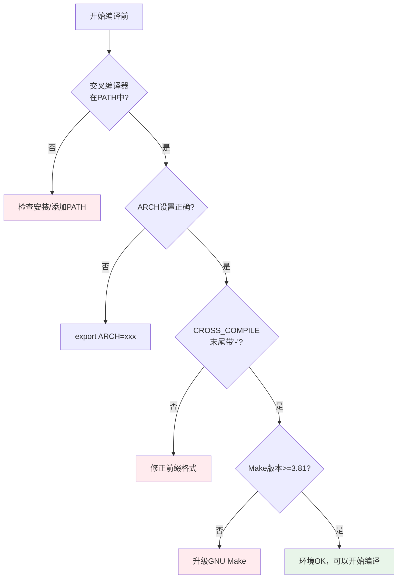

# 4.4.1 交叉编译环境检查

> 所属章节：第4章 交叉编译内核 > 4.4 编译环境准备
> 难度：[B] | 预计阅读时间：12分钟

## 本节导读

在真正动手编译内核之前，你需要先确认"武器库"是否齐全。本节提供一份系统性的交叉编译环境检查清单，涵盖工具链可用性、关键环境变量和构建工具版本。学完本节，你可以在30秒内判断当前环境是否具备编译ARM/AArch64内核的条件，避免在漫长的编译过程末尾才发现工具链缺失的窘境。

---

## 知识点1：环境检查清单 [B] ~800字

交叉编译Linux内核不是"随手敲个make"那么简单。它是一个多组件协同工作的过程：源码、工具链、配置系统、构建工具，任何一个环节出问题都会导致编译失败。有经验的嵌入式开发者在开始编译前，都会先跑一遍"环境自检四件套"。

### 为什么必须先检查环境？

想象你正在厨房做一道复杂的菜，做到一半发现缺了关键调料——那种挫败感在内核编译中更强烈：交叉编译动辄需要十几分钟到几小时，如果因为`CROSS_COMPILE`写错导致编译到70%时报错，你将浪费大量时间重新来过。

[图1：交叉编译环境检查流程示意——从工具链到环境变量的递进检查]

### 检查项总览

在开始编译前，请逐项确认下表中的四个核心检查点：

| 序号 | 检查项 | 检查命令/方法 | 合格标准 | 失败后果 |
|:---:|--------|--------------|---------|---------|
| 1 | 交叉编译器可用性 | `$(CROSS_COMPILE)gcc --version` | 能输出版本号，无"command not found" | 完全无法编译，make立即报错 |
| 2 | ARCH变量设置 | `echo $ARCH` 或查看make命令 | 与目标架构一致（arm/arm64等） | Kconfig选错架构，编译出错的指令集 |
| 3 | CROSS_COMPILE前缀 | `echo $CROSS_COMPILE` | 前缀完整且以"-"结尾，与工具链一致 | 调用本机gcc编译，产生x86代码 |
| 4 | make版本 | `make --version` | GNU Make 3.81+（推荐4.0+） | 旧版make语法不兼容，构建规则解析失败 |

上表中的四项检查构成了交叉编译的"最小可行环境"。下面逐一展开说明。

### 检查1：确认交叉编译器已安装

交叉编译器是"翻译官"——它把你的C代码翻译成目标处理器能理解的机器码。如果你为ARM Cortex-A53开发板编译内核，就需要`arm-linux-gnueabihf-gcc`（32位ARM）或`aarch64-linux-gnu-gcc`（64位ARM）。

**操作步骤**：

1. 先确认工具链前缀。常见组合如下：
   - ARM 32位硬浮点：`arm-linux-gnueabihf-`
   - ARM 64位：`aarch64-linux-gnu-`
   - RISC-V 64位：`riscv64-linux-gnu-`

2. 在终端执行版本查询：

```bash
# 以 ARM 64位工具链为例
$ aarch64-linux-gnu-gcc --version
aarch64-linux-gnu-gcc (Linaro GCC 7.5-2019.12) 7.5.0
Copyright (C) 2017 Free Software Foundation, Inc.
```

如果看到版本号输出，说明工具链已安装且PATH正确。如果报错`command not found`，说明要么没安装工具链，要么安装路径不在系统的`PATH`环境变量中。

### 检查2：确认ARCH环境变量

`ARCH`告诉内核"我要为谁编译"。Linux内核源码通过`ARCH`的值进入不同的架构目录（`arch/arm/`、`arch/arm64/`等），加载对应的汇编代码和板级支持。

```bash
# 查询当前ARCH设置
$ echo $ARCH
arm64

# 如果未设置，make时显式传入也可以
$ make ARCH=arm64 ...
```

💡 **提示**：`ARCH`的值是内核源码的"内部命名"，不是工具链的命名。例如工具链叫`aarch64-linux-gnu-gcc`，但内核中对应的`ARCH`必须写`arm64`。常见对应关系：`arm-linux-gnueabihf-` → `ARCH=arm`；`aarch64-linux-gnu-` → `ARCH=arm64`。

### 检查3：确认CROSS_COMPILE前缀

`CROSS_COMPILE`是工具链的"姓"——内核编译系统会在需要调用gcc、ld、objcopy等工具时，自动在这个前缀后面拼上工具名。

```bash
# 查询当前CROSS_COMPILE设置
$ echo $CROSS_COMPILE
aarch64-linux-gnu-

# 特别注意：前缀末尾的"-"不能漏
# 错误的写法会导致拼接出 "aarch64-linux-gnugcc" 这样的怪物
```

⚠️ **陷阱**：很多初学者导出变量时忘记末尾的短横线，写成`export CROSS_COMPILE=aarch64-linux-gnu`。这样make调用`$(CROSS_COMPILE)gcc`时会变成`aarch64-linux-gnugcc`，系统根本找不到这个命令。

### 检查4：确认make版本

Linux内核的构建系统（Kbuild）高度依赖GNU Make的特性。过旧的Make版本（如3.80以下）可能无法正确解析内核Makefile中的语法。

```bash
$ make --version | head -1
GNU Make 4.3
```

通常Ubuntu 18.04+或Debian 10+自带的Make版本都满足要求。如果你在非常老的发行版或某些精简的Docker镜像中工作，才需要特别关注这一点。



---

## 知识点2：验证工具链可用性 [B] ~600字

上一节的"四件套检查"属于"快速体检"。如果项目对工具链有严格要求（例如指定GCC版本范围、需要特定ABI支持），你还需要做一次"深度体检"——查看编译器的详细构建配置和目标三元组（Target Triple）。

### 用 `-v` 查看编译器自举过程

`gcc -v`（小写v）会输出GCC的编译过程详情，包括它如何调用自身组件、搜索哪些系统路径、使用什么配置。对交叉编译器执行这条命令，你能确认它确实是"交叉"的，而不是误调用了主机的原生GCC。

```bash
$ aarch64-linux-gnu-gcc -v
Using built-in specs.
COLLECT_GCC=aarch64-linux-gnu-gcc
COLLECT_LTO_WRAPPER=/usr/lib/gcc-cross/aarch64-linux-gnu/9/lto-wrapper
Target: aarch64-linux-gnu
...
Thread model: posix
gcc version 9.4.0 (Ubuntu 9.4.0-1ubuntu1~20.04.2)
```

输出中第二行的`Target: aarch64-linux-gnu`就是**Target Triple**（目标三元组）。它由三个部分组成：`aarch64`（CPU架构）- `linux`（操作系统）- `gnu`（ABI/库接口）。这个值必须与你的目标板子完全一致。

### 验证交叉编译器不会生成本机代码

一个更直接的验证方法：写一个最小的C程序，用交叉编译器编译，然后用`file`命令检查输出文件的架构属性。

```bash
# 1. 写一个简单的C文件
$ echo 'int main(){ return 0; }' > hello.c

# 2. 用交叉编译器编译
$ aarch64-linux-gnu-gcc -o hello_arm hello.c

# 3. 检查生成的可执行文件属性
$ file hello_arm
hello_arm: ELF 64-bit LSB executable, ARM aarch64, version 1 (SYSV),
           dynamically linked, interpreter /lib/ld-linux-aarch64.so.1,
           for GNU/Linux 3.7.0, not stripped
```

看到`ARM aarch64`了吗？这就是铁证——说明你的交叉编译器确实在产出ARM64格式的ELF文件，而不是x86_64。

🔴 **危险**：如果你省略了`CROSS_COMPILE`，直接用`gcc`编译内核，它在x86主机上也能顺畅跑完整个编译流程（因为主机gcc完全有能力编译任何C代码）。但生成的是x86内核，刷到ARM板子上根本无法启动，而且错误极其隐蔽。上面的`file`检查法就是防御这种事故的"最后防线"。

### 检查工具链的完整工具集

内核编译不只是调用gcc，还需要`ld`（链接器）、`objcopy`（格式转换）、`nm`（符号表）、`strip`（去符号）等工具。交叉编译工具链应该提供完整的一套。

```bash
# 快速检查核心工具是否齐全
$ for tool in gcc ld objcopy nm strip; do
>   which aarch64-linux-gnu-${tool} && echo "  OK"
> done
/usr/bin/aarch64-linux-gnu-gcc
  OK
/usr/bin/aarch64-linux-gnu-ld
  OK
/usr/bin/aarch64-linux-gnu-objcopy
  OK
...
```

⚠️ **陷阱**：有些精简安装的工具链包只包含gcc，缺少binutils（包含ld、objcopy等）。编译内核时会在链接阶段报错`aarch64-linux-gnu-ld: command not found`。确保安装的是完整工具链包，例如Debian/Ubuntu上的`gcc-aarch64-linux-gnu`和`binutils-aarch64-linux-gnu`两个包都要装。

---

## 本节总结

| 检查项 | 核心命令 | 合格标志 | 常见翻车点 |
|--------|---------|---------|-----------|
| 交叉编译器 | `$(CC)gcc --version` | 输出版本号 | PATH未包含工具链bin目录 |
| ARCH变量 | `echo $ARCH` | arm / arm64 / riscv等 | 与工具链架构不匹配 |
| CROSS_COMPILE前缀 | `echo $CROSS_COMPILE` | 末尾带`-` | 漏写末尾横线，导致工具名拼接错误 |
| make版本 | `make --version` | GNU Make 3.81+ | 老系统自带Make 3.80 |
| 深度验证 | `$(CC)gcc -v` + `file` | Target Triple匹配 + ELF目标架构正确 | 误用主机gcc编译出x86内核 |

一句话记住本节精髓：**编译前先花30秒跑检查清单，能避免数小时的返工。**

## 下一步

环境确认无误后，下一节（4.4.2）我们将正式进入"编译内核的完整命令与流程"——从`make defconfig`到生成`zImage`和`dtb`的全过程。届时你跑出的每一条命令，都建立在今天验证过的可靠环境之上。

---

## 配套资源

### 表格清单
- 表1：交叉编译环境四项核心检查清单（序号/检查项/命令/合格标准/失败后果）
- 表2：本节总结速查表（检查项/命令/合格标志/常见翻车点）

### 图示清单
- 图1：交叉编译环境检查流程示意——从工具链到环境变量的递进检查 [配图说明：一张检查清单风格的扁平化插图，左侧为四个打勾方框，分别标注"Compiler""ARCH""CROSS_COMPILE""make"，右侧为终端窗口输出样例]
- 图2：环境检查流程图 [mermaid图]

### 代码清单
- 代码1：查询交叉编译器版本（`aarch64-linux-gnu-gcc --version`）
- 代码2：验证ARCH与CROSS_COMPILE环境变量
- 代码3：使用`-v`查看GCC详细配置与Target Triple
- 代码4：编译最小测试程序并用`file`验证输出架构
- 代码5：批量检查工具链核心工具是否齐全（for循环+which）
