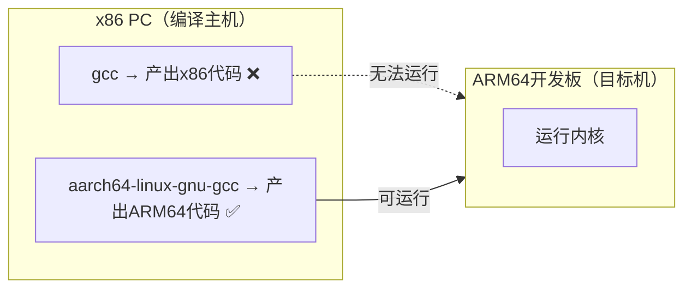

# 4.4.2 配置ARCH与CROSS_COMPILE

> 所属章节：第4章 内核编译基础 > 4.4 交叉编译环境搭建
> 难度：[B→I] | 预计阅读时间：15分钟

## 本节导读
本节教你告诉内核源码"我要为谁编译"——通过`ARCH`指定目标处理器架构，通过`CROSS_COMPILE`指定交叉编译器。学完本节，你将能正确配置任意嵌入式平台的编译参数，并验证配置是否生效。

---

## 知识点1：ARCH变量——告诉内核目标架构 [B] ~700字

Linux内核源码支持二十多种处理器架构，从常见的ARM、x86，到相对小众的RISC-V、MIPS、PowerPC。`ARCH`变量的作用就是：**明确告诉内核的Makefile，你当前要编译的是哪一种架构的代码**。

如果把内核源码比作一份"万能图纸"，那么`ARCH`就是你选中的那一页——告诉工匠"我要造这一款的"。

### ARCH与源码目录的对应关系

打开任意版本的内核源码，你会看到顶层有一个`arch/`目录，里面按架构分了子目录：`arm/`、`arm64/`、`riscv/`、`x86/`等。当你设置`ARCH=arm64`时，Makefile就会进入`arch/arm64/`目录提取该架构特有的代码、链接脚本和头文件。

```bash
# 查看内核源码支持的架构列表
ls linux-6.6/arch/
```

### ARCH与defconfig的绑定关系

每一种架构都自带一组默认配置（defconfig），存放在`arch/<ARCH>/configs/`目录下。例如：

```bash
# 查看 arm64 架构的默认配置
ls arch/arm64/configs/
# 输出示例：defconfig  allyesconfig  allnoconfig  ...
```

**关键点**：`ARCH`的值决定了`make defconfig`时从哪个目录加载默认配置。如果你执行`make ARCH=arm64 defconfig`，内核会去`arch/arm64/configs/defconfig`读取；如果写成`ARCH=arm`，则会去`arch/arm/configs/`目录读取——**两者内容完全不同**。

### 操作步骤：选择正确的ARCH值

1. **确认目标设备的处理器架构**
   ```bash
   # 若设备已运行Linux，直接查看
   uname -m
   # 输出 aarch64 → 对应 ARCH=arm64
   # 输出 armv7l  → 对应 ARCH=arm
   ```

2. **根据处理器型号推断ARCH**

| 处理器型号 | ARCH值 | 说明 | 典型场景 |
|-----------|--------|------|---------|
| Cortex-A53/A72/A76 | `arm64` | 64位ARMv8架构 | 树莓派4、RK3399、全志H6 |
| Cortex-A7/A9/A15 | `arm` | 32位ARMv7架构 | 树莓派2、i.MX6ULL、STM32MP1 |
| RISC-V 64位（如C906） | `riscv` | 开源指令集 | 全志D1、VisionFive |
| x86_64 / AMD64 | `x86_64` | 64位x86 | PC、工控机 |

   💡 **提示**：如果设备是64位ARM处理器但运行32位系统（如某些早期树莓派3的发行版），`uname -m`可能显示`armv7l`，此时编译内核仍需以实际**硬件能力**为准。查阅SoC手册确认是否支持 AArch64。

3. **加载对应架构的默认配置**
   ```bash
   make ARCH=arm64 defconfig
   ```

⚠️ **陷阱**：在Makefile中`ARCH`的默认值会自动检测当前主机的架构。如果你在一台x86电脑上不指定`ARCH`，内核会尝试编译x86版本，导致ARM设备上完全无法启动。交叉编译时**必须显式指定**`ARCH`。

---

## 知识点2：CROSS_COMPILE——指定交叉编译器前缀 [B] ~700字

指定了`ARCH`之后，内核知道了"要编译什么架构"，但还缺一个关键信息——**用哪把刀来切**。这把刀就是交叉编译器。

### 为什么需要交叉编译器？

假设你在一台x86的Ubuntu电脑上工作，默认的`gcc`编译出来的是x86可执行文件。而目标设备是ARM64的——它根本看不懂x86指令。你需要一把"在x86上运行、但能产出ARM64代码"的特殊编译器，这就是**交叉编译器**（Cross Compiler）。



[图1：交叉编译器的作用示意图——主机编译、目标机运行]

交叉编译器的命令名通常带有前缀，例如`aarch64-linux-gnu-gcc`、`arm-linux-gnueabihf-gcc`。`CROSS_COMPILE`变量的作用就是：**把这个前缀告诉内核Makefile**，让它在所有编译命令前自动加上这个前缀。

### 两种设置方式

#### 方式A：通过环境变量 export（推荐）

```bash
# 设置环境变量，当前终端会话内有效
export ARCH=arm64
export CROSS_COMPILE=aarch64-linux-gnu-

# 之后所有 make 命令都不需要重复写前缀
make defconfig
make -j$(nproc)
```

💡 **提示**：`CROSS_COMPILE`的值末尾**必须带连字符`-`**。内核Makefile会把前缀和工具名拼接，例如`$(CROSS_COMPILE)gcc`实际变成`aarch64-linux-gnu-gcc`。漏写连字符会导致拼接失败。

#### 方式B：每次make时作为参数传递

```bash
# 每次都在命令行指定，适合临时切换或脚本场景
make ARCH=arm64 CROSS_COMPILE=aarch64-linux-gnu- defconfig
make ARCH=arm64 CROSS_COMPILE=aarch64-linux-gnu- -j$(nproc)
```

| 方式 | 优点 | 缺点 | 适用场景 |
|------|------|------|---------|
| export环境变量 | 命令简洁，不易遗漏 | 仅当前终端有效，关闭后失效 | 长时间专注编译一个平台 |
| make参数传递 | 明确可见，可写脚本 | 命令冗长，容易漏写 | CI/CD脚本、Makefile封装、多平台切换 |

⚠️ **陷阱**：如果你先`export ARCH=arm`然后执行`make ARCH=arm64`，**命令行参数会覆盖环境变量**，最终生效的是`arm64`。这是Make的行为规则，优先级：`make命令行 > 环境变量 > Makefile内部默认值`。

### 查找你系统上的交叉编译器

```bash
# 列出系统中可用的 ARM 交叉编译器
which aarch64-linux-gnu-gcc
which arm-linux-gnueabihf-gcc

# 如果没有，Ubuntu/Debian 安装方式
sudo apt install gcc-aarch64-linux-gnu   # 64位ARM
sudo apt install gcc-arm-linux-gnueabihf # 32位ARM带硬浮点
```

🔴 **危险**：千万不要混用架构的编译器！用`arm-linux-gnueabihf-gcc`编译`ARCH=arm64`的内核，或者反过来，编译过程会报错一堆诡异的汇编错误，而且错误信息极难定位。始终确保`ARCH`和`CROSS_COMPILE`前缀指向同一种架构。

---

## 知识点3：验证配置是否生效 [B] ~400字

配置写好了不等于配置生效了。本节介绍三个快速验证手段，确保`ARCH`和`CROSS_COMPILE`正确传递给内核构建系统。

### 验证方法1：观察make输出中的编译器调用

```bash
# 执行配置并观察输出的第一行
make ARCH=arm64 CROSS_COMPILE=aarch64-linux-gnu- defconfig
```

正常输出应包含：`SYSTBL arch/arm64/kernel/syscalls/syscall.tbl`，且**没有**`HOSTCC`开头的编译器检查误报。更直接的验证方式：

```bash
# 故意只编译一个文件，观察实际调用的命令
make ARCH=arm64 CROSS_COMPILE=aarch64-linux-gnu- -j1 V=1 init/main.o 2>&1 | head -20
```

💡 **提示**：`V=1`参数让Make显示完整命令。你应该在输出中看到`aarch64-linux-gnu-gcc ... -D__KERNEL__ ... -c init/main.o`，而不是普通的`gcc`。

### 验证方法2：检查.config中的架构标记

```bash
# 配置完成后，检查生成的 .config 文件
head -n 5 .config
# 输出应包含：
# #
# # Automatically generated file; DO NOT EDIT.
# # Linux/arm64 6.6.0 Kernel Configuration
```

如果显示`Linux/x86`或`Linux/i386`，说明`ARCH`没有被正确传递。

### 验证方法3：检查Makefile内置变量

```bash
# 使用 make 的打印变量功能
make ARCH=arm64 CROSS_COMPILE=aarch64-linux-gnu- --eval='print-%: ; @echo $*=$($*)' print-ARCH print-CROSS_COMPILE
```

输出应为：
```
ARCH=arm64
CROSS_COMPILE=aarch64-linux-gnu-
```

⚠️ **陷阱**：很多初学者修改`.config`文件时直接用文本编辑器（如`vim .config`），但后续执行`make menuconfig`或`make oldconfig`时，Makefile会根据`ARCH`重新生成`.config`，手动修改可能被覆盖。正确做法是：**先正确设置ARCH，再通过配置工具修改**。

---

## 本节总结

本节我们掌握了交叉编译的两个核心变量：`ARCH`指定"为谁编"，`CROSS_COMPILE`指定"用什么编"。

| 变量 | 作用 | 典型值 | 验证方法 |
|------|------|--------|---------|
| `ARCH` | 选择目标处理器架构 | `arm64` / `arm` / `riscv` | 检查`.config`头部的`Linux/<arch>` |
| `CROSS_COMPILE` | 交叉编译器命令前缀 | `aarch64-linux-gnu-` | `V=1`查看实际调用的gcc |
| `ARCH+CROSS_COMPILE` | 两者必须配对一致 | `arm64`配`aarch64-*` | `make print-变量`双重确认 |

记住一个口诀：**先选架构（ARCH），再选刀具（CROSS_COMPILE），配对一致，再动手编译**。

---

## 下一步

配置好`ARCH`和`CROSS_COMPILE`后，下一节（4.4.3）将介绍如何选择具体的内核配置项——从`defconfig`开始，用`menuconfig`进行定制化裁剪，最终生成一份适合你目标设备的`.config`文件。

---

## 配套资源

### 表格清单
- 表1：常见处理器型号与ARCH值速查表
- 表2：CROSS_COMPILE设置方式对比（export vs make参数）

### 图示清单
- 图1：交叉编译器的作用示意图（mermaid流程图）——展示主机编译器与交叉编译器的区别

### 代码清单
- 代码1：`ls linux-6.6/arch/` — 查看内核支持的架构
- 代码2：`make ARCH=arm64 defconfig` — 加载arm64默认配置
- 代码3：`export ARCH=arm64 CROSS_COMPILE=aarch64-linux-gnu-` — 环境变量设置
- 代码4：`make ARCH=arm64 CROSS_COMPILE=aarch64-linux-gnu- -j1 V=1 init/main.o` — 验证实际编译器调用
- 代码5：`make ... --eval='print-%: ; @echo $*=$($*)' print-ARCH` — Makefile变量打印技巧
