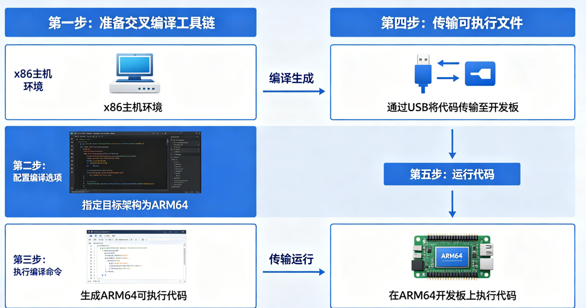
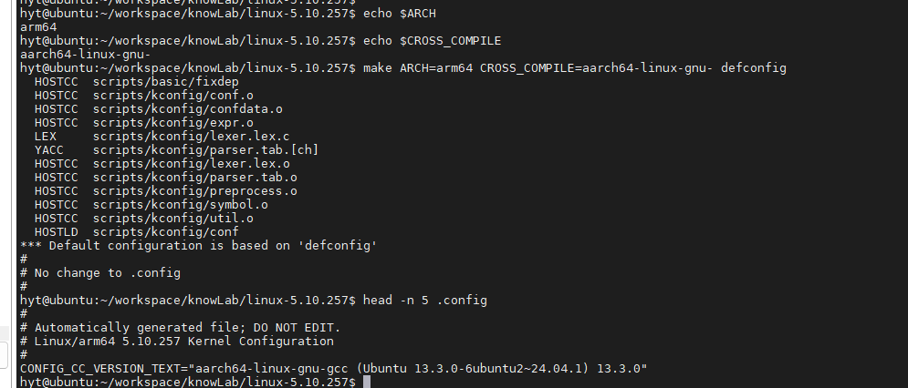

# 4.4.2 配置 ARCH 与 CROSS_COMPILE

> 所属章节：第4章 内核配置与编译 > 4.4 动手编译内核
> 
> 难度：[B→I] | 预计阅读时间：10分钟

## <span class="blue"> 本节导读

本节覆盖：ARCH 变量与内核源码架构目录的对应关系、CROSS_COMPILE 前缀的正确写法、三种设置方式（export / make 参数 / 修改 Makefile）的对比与选择、以及通过 `.config` 头部和 `V=1` 输出验证配置是否生效。

---

## <span class="blue"> ARCH 变量，指定目标架构 [B]

Linux 内核源码支持二十多种处理器架构。ARCH 变量的作用就是明确告诉内核 Makefile，当前要编译的是哪一种架构的代码。

### ARCH 与源码目录的对应关系

内核源码顶层有 `arch/` 目录，按架构分为 `arm/`、`arm64/`、`riscv/`、`x86/` 等子目录。设置 `ARCH=arm64` 时，Makefile 进入 `arch/arm64/` 提取该架构的汇编代码、链接脚本和头文件。

```bash
ls linux-6.6/arch/
```

### ARCH 与 defconfig 的绑定

每种架构的默认配置存放在 `arch/<ARCH>/configs/` 目录下：

```bash
# 查看 arm64 架构的默认配置
ls arch/arm64/configs/
```

`ARCH` 的值决定 `make defconfig` 从哪个目录加载。`make ARCH=arm64 defconfig` 读取 `arch/arm64/configs/defconfig`；`make ARCH=arm` 读取 `arch/arm/configs/defconfig`，**两者内容完全不同**。

### 常见处理器对应的 ARCH 值

| 处理器型号 | ARCH 值 | 说明 | 典型场景 |
|-----------|---------|------|---------|
| Cortex-A53/A72/A76 | arm64 | 64位 ARMv8 架构 | 树莓派 4、RK3399、全志 H6 |
| Cortex-A7/A9/A15 | arm | 32位 ARMv7 架构 | 树莓派 2、i.MX6ULL、STM32MP1 |
| RISC-V 64位（如 C906） | riscv | 开源指令集 | 全志 D1、VisionFive |
| x86_64 / AMD64 | x86_64 | 64位 x86 | PC、工控机 |

> 💡 设备是 64 位 ARM 处理器但运行 32 位系统时，`uname -m` 可能显示 `armv7l`。编译内核应以实际硬件能力为准，查阅 SoC 数据手册确认是否支持 AArch64。

> ⚠️ 内核顶层 Makefile 中 `ARCH` 的默认值自动检测当前主机架构。在 x86 主机上不指定 `ARCH`，内核会编译 x86 版本，导致 ARM 设备无法启动。交叉编译时**必须显式指定**。

---

## <span class="blue"> CROSS_COMPILE，指定交叉编译器前缀 [B]

在 x86 主机上，默认的 `gcc` 产出 x86 可执行文件。目标设备为 ARM64 时，需要运行在 x86 上但产出 ARM64 代码的交叉编译器。<BR>交叉编译器命令名带有前缀，如 `aarch64-linux-gnu-gcc`、`arm-linux-gnueabihf-gcc`。`CROSS_COMPILE` 的作用就是把这个前缀告诉内核 Makefile，使其在所有编译命令前自动加上该前缀。



---

## <span class="blue"> 三种设置方式对比 [I]

内核 Makefile 读取 ARCH 和 CROSS_COMPILE 有三种途径，优先级从高到低为：make 命令行参数 > 环境变量 > Makefile 内部默认值。

### 方式一：export 环境变量（推荐）

```bash
export ARCH=arm64
export CROSS_COMPILE=aarch64-linux-gnu-

make defconfig
make -j$(nproc)
```

当前终端会话内有效，后续所有 make 命令无需重复书写。

### 方式二：每次 make 时传入参数

```bash
make ARCH=arm64 CROSS_COMPILE=aarch64-linux-gnu- defconfig
make ARCH=arm64 CROSS_COMPILE=aarch64-linux-gnu- -j$(nproc)
```

适合 CI/CD 脚本或需要在同一终端中切换不同架构的场景。

### 方式三：直接修改 Makefile

```bash
# 编辑内核源码顶层 Makefile
vim Makefile
```

找到以下两行并修改：

```makefile
ARCH            ?= $(SUBARCH)
CROSS_COMPILE   ?= $(CONFIG_CROSS_COMPILE:"%"=%)
```

改为：

```makefile
ARCH            ?= arm64
CROSS_COMPILE   ?= aarch64-linux-gnu-
```

这种方式永久生效，但修改源码文件不利于版本管理，**不推荐**。

### 三种方式对比

| 方式 | 优点 | 缺点 | 适用场景 |
|------|------|------|---------|
| export 环境变量 | 命令简洁，不易遗漏 | 仅当前终端有效，关闭后失效 | 长时间专注编译一个平台 |
| make 参数传递 | 明确可见，可写脚本 | 命令冗长，容易漏写 | CI/CD 脚本、多平台切换 |
| 修改 Makefile | 永久生效，无需每次设置 | 污染源码，不利于版本控制 | 个人固定开发环境 |

> ⚠️ 优先级规则：`make 命令行参数` 会覆盖 `export` 的环境变量。若先 `export ARCH=arm` 再执行 `make ARCH=arm64`，最终生效的是 `arm64`。

---

## <span class="blue"> ARCH 与 CROSS_COMPILE 的配对关系 [B]

两个变量必须指向同一架构，否则编译会报大量汇编错误，且错误信息难以定位。

| ARCH 值 | CROSS_COMPILE 前缀示例 | 目标设备 |
|---------|----------------------|---------|
| arm | arm-linux-gnueabihf- | 32 位 ARM（ARMv7） |
| arm64 | aarch64-linux-gnu- | 64 位 ARM（ARMv8） |
| riscv | riscv64-linux-gnu- | 64 位 RISC-V |
| x86_64 | x86_64-linux-gnu- | x86_64 PC（原生编译） |

> 🔴 不要混用不同架构的编译器。用 `arm-linux-gnueabihf-gcc` 编译 `ARCH=arm64` 的内核，或者反过来，都会导致编译失败。

---

## <span class="blue"> 验证配置是否生效 [B]

配置写入不等于配置生效。以下三种方法可确认 ARCH 和 CROSS_COMPILE 已正确传递。

### 验证方法 1：检查 .config 头部

```bash
make ARCH=arm64 CROSS_COMPILE=aarch64-linux-gnu- defconfig
head -n 5 .config
```

输出应包含 `Linux/arm64 6.6.0 Kernel Configuration`。若显示 `Linux/x86` 或 `Linux/i386`，说明 ARCH 未正确传递。

### 验证方法 2：V=1 查看编译器调用

```bash
make ARCH=arm64 CROSS_COMPILE=aarch64-linux-gnu- -j1 V=1 init/main.o 2>&1 | head -20
```

`V=1` 让 Make 显示完整命令。输出中应出现 `aarch64-linux-gnu-gcc ... -D__KERNEL__ ... -c init/main.o`，而不是 `gcc`。

### 验证方法 3：打印 Makefile 变量

```bash
make ARCH=arm64 CROSS_COMPILE=aarch64-linux-gnu- --eval='print-%: ; @echo $*=$($*)' print-ARCH print-CROSS_COMPILE
```

输出应为：

```
ARCH=arm64
CROSS_COMPILE=aarch64-linux-gnu-
```



---

## <span class="blue"> 下一步

ARCH 与 CROSS_COMPILE 配置完成后，下一节（4.4.3）介绍执行编译命令的完整流程：从 `make defconfig` 到 `make zImage` / `make uImage` / `make dtbs` / `make modules` 的具体用法与参数。

---
