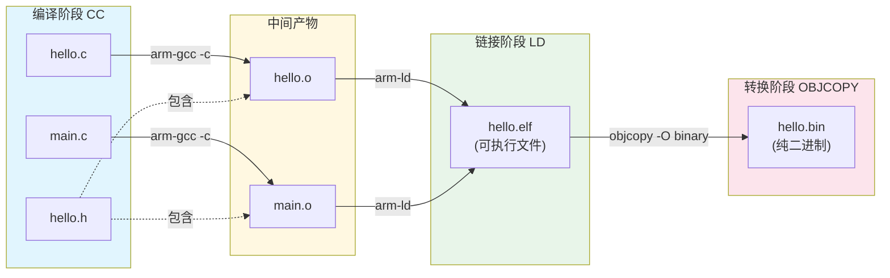

# 4.4.3 编译命令详解

> 所属章节：第4章 嵌入式Linux系统构建 > 4.4 使用Buildroot构建系统
> 难度：[B→I] | 预计阅读时间：15分钟

## 本节导读

本节教你在Buildroot中"怎么编译"和"怎么看编译输出"。学完本节，你将掌握最常用的编译命令、理解终端里刷屏的字母缩写含义，并学会用增量编译大幅缩短重复编译时间。

---

## 知识点1：make编译命令 [B][M] ~900字

Buildroot的编译入口就是`make`命令。但由于嵌入式项目文件成千上万，直接用裸`make`命令效率很低。下面三个参数是你必须学会的"三板斧"。

### 1. 并行编译：`-j$(nproc)`

默认的`make`只用单核编译，现代PC通常有4~16个CPU核心，这样太浪费了。

```bash
# 让make自动检测CPU核心数，全部派上用场
make -j$(nproc)
```

`$(nproc)`是一个shell命令替换，输出当前机器的逻辑CPU数量。例如你的电脑是8核，`$(nproc)`就会替换成8，make会同时启动8个编译任务。

⚠️ **陷阱**：`-j`数字并非越大越好。如果你的内存小于8GB，并行数建议不超过4，否则链接阶段可能因内存不足而失败。此时你会看到错误信息：`collect2: fatal error: ld terminated with signal 9 [Killed]`——这就是内存耗尽的典型表现。

💡 **提示**：一个更稳妥的写法是`make -j$(($(nproc)+1))`。加1的原理是：CPU满载时，恰好有一个进程在等待I/O，不浪费算力。

### 2. 显示详细输出：`V=1`

默认情况下，Buildroot为了界面整洁，只显示缩写：

```text
>>> host-autoconf 2.71 Building
CC      lib/foo.o
```

当你遇到编译错误需要排查时，这些缩写完全不够看。加上`V=1`参数：

```bash
# 显示完整的编译器调用命令
make -j$(nproc) V=1
```

此时你会看到完整的命令行，例如：

```text
/path/to/arm-linux-gnueabihf-gcc -fPIC -g -O2 -I. -I./include -c lib/foo.c -o lib/foo.o
```

这样你可以验证：编译器路径对不对？优化级别是不是`-O2`？头文件搜索路径有没有包含你修改的那一份？这些都是调试构建问题的关键信息。

### 3. 指定输出目录：`O=/path/to/output`

Buildroot默认在当前目录下创建`output/`文件夹存放所有编译产物。如果你需要同时维护多个板的配置（比如一个ARM32版本和一个ARM64版本），默认行为会导致文件互相覆盖。

```bash
# 把编译产物放到指定目录
make O=/home/user/buildroot-output-arm32
```

指定输出目录后，该目录下会生成独立的`images/`、`build/`、`target/`等子目录，和源码目录完全隔离。

💡 **提示**：如果你已经执行过`make menuconfig`，配置文件`.config`默认在源码根目录。当使用`O=`时，Buildroot会自动把`.config`复制到输出目录，后续的`make menuconfig O=/xxx`也要带同样的`O=`参数，否则修改的是源码目录下的配置，两边的配置不同步会非常混乱。

### 操作步骤

1. 进入Buildroot源码根目录：`cd ~/buildroot`
2. 确认已生成配置文件：`ls -la .config`
3. 执行并行编译（带详细输出）：`make -j$(nproc) V=1`
4. 如需指定输出目录：`make -j$(nproc) V=1 O=~/buildroot-output`

```bash
# 完整示例：首次编译命令
make -j$(nproc) V=1

# 示例：指定输出目录的编译
make -j$(nproc) V=1 O=/home/user/buildroot-armv7
```

🔴 **危险**：不要在源码目录本身作为`O=`的参数，例如`make O=.`。这会导致编译产物和源码混在一起，既不利于清理，也可能引发构建错误。

---

## 知识点2：编译过程解读 [B] ~700字

当你运行`make V=1`后，终端会滚过成千上万行输出。这一节教你看懂最核心的三行：CC、LD、OBJCOPY。

### CC（Compile）—— 编译源文件

`CC`代表"C Compiler"，是编译阶段。它把`.c`源文件编译成`.o`目标文件。

```text
CC      lib/foo.o
# 展开后实际是：
arm-linux-gnueabihf-gcc -c lib/foo.c -o lib/foo.o -Iinclude -DCONFIG_FOO=1
```

关键看点：
- 交叉编译器前缀是否正确？应该是`arm-linux-gnueabihf-gcc`或`aarch64-linux-gnu-gcc`这样的交叉工具链，而不是你主机的`gcc`。
- `-D`宏定义是否包含了你的配置选项？
- `-I`头文件路径是否指向了正确的目录？

[图1：编译过程示意图，从.c到.o的转换]



### LD（Link）—— 链接目标文件

`LD`代表"Linker"，把多个`.o`文件合并成最终的可执行文件（ELF格式）。

```text
LD      hello.elf
# 展开后实际是：
arm-linux-gnueabihf-ld hello.o main.o -o hello.elf -T linker_script.lds -lc
```

关键看点：
- 链接脚本`-T`：嵌入式系统常用自定义链接脚本（`.lds`文件）来规定代码在内存中的布局，例如U-Boot和Linux内核都有专属的链接脚本。
- `-lc`：链接C标准库。如果是裸机程序（不跑Linux），可能不需要。

⚠️ **陷阱**：最常见的链接错误是"undefined reference to xxx"，意思是某个函数声明了但没有对应的`.o`文件参与链接。检查该函数所在的源文件是否被加入编译列表。

### OBJCOPY（Object Copy）—— 格式转换

ELF格式包含了调试信息、符号表、重定位表等丰富信息，但嵌入式设备启动时通常只需要纯二进制机器码。

```text
OBJCOPY hello.bin
# 展开后实际是：
arm-linux-gnueabihf-objcopy -O binary hello.elf hello.bin
```

`-O binary`参数表示"输出格式为纯二进制"。转换后的`.bin`文件可以直接烧写到Flash，或者被`mkimage`工具进一步打包成U-Boot能识别的格式。

💡 **提示**：如果你想保留调试信息用于后续`gdb`远程调试，需要保留`.elf`文件（不要删掉）。`.elf`文件包含符号表，能把内存地址翻译成函数名；`.bin`文件则没有这个能力。

### 常见错误速查

⚠️ **错误1**：看到`CC`显示的是`gcc`而不是`arm-linux-gnueabihf-gcc`
→ 说明交叉编译器没有配置好，检查`make menuconfig`中的`Toolchain`路径设置。

⚠️ **错误2**：`LD`报错`cannot find -lc`
→ C库没有正确安装，需要重新配置Buildroot的工具链选项，或运行`make toolchain`先单独构建工具链。

💡 **提示**：Buildroot编译输出中还有`HOSTCC`（用主机gcc编译Buildroot自身需要的工具）和`INSTALL`（安装到`target/`目录），看到时不要和目标的`CC`混淆。

---

## 知识点3：增量编译 [I] ~500字

"增量编译"是开发日常中最省时间的技巧。它的原理是：make会检查每个源文件的最后修改时间，只编译发生变动的文件，跳过未改动的文件。

### 为什么要用增量编译

假设你第一次完整编译花了30分钟。然后你发现有个驱动配置错了，修改了一个`.c`文件里的几行代码。如果重新全量编译又要30分钟——这显然不合理。增量编译可能只需要几十秒到几分钟。

### 操作步骤

1. 修改你想要改动的源文件（例如修改`package/myapp/myapp.c`）
2. 重新执行编译命令：`make -j$(nproc)`
3. make会自动检测：只有`myapp.c`及其下游依赖被重新编译，其余跳过

```bash
# 修改代码后，直接重新 make 即可
make -j$(nproc)

# 如果修改的是Buildroot配置（如增加一个软件包），建议显式触发重建
make <package>-rebuild -j$(nproc)
```

Buildroot还提供了针对单个软件包的增量控制命令：

| 命令 | 作用 |
|------|------|
| `make <pkg>` | 构建该包（如果未构建） |
| `make <pkg>-rebuild` | **强制重新编译**该包（不清理编译目录） |
| `make <pkg>-reconfigure` | 重新运行该包的配置阶段（如`./configure`） |
| `make <pkg>-clean` | 清理该包的编译目录，下次重新完整编译 |

例如你修改了`package/myapp/`目录下的源码，想只重新编译这个包：

```bash
make myapp-rebuild -j$(nproc)
```

⚠️ **陷阱**：如果你修改了某个软件包的**配置选项**（如在`make menuconfig`中改变了`myapp`的某个子选项），仅运行`make`可能不会触发该包重新配置。此时应使用`make myapp-reconfigure`，让Buildroot重新执行该包的`./configure`并带上新的参数。

⚠️ **陷阱**：如果你修改了`Linux内核的配置`（通过`make linux-menuconfig`），普通的`make`可能只触发内核增量编译。但某些配置变更（如增加/删除驱动）会影响整个内核的链接结果，建议执行`make linux-rebuild`确保完整生效。

💡 **提示**：当你不确定某个包是否被正确重建时，可以用`touch`命令强制更新其时间戳：`touch package/myapp/myapp.c && make myapp-rebuild`，这样能确保该文件被重新编译。

🔴 **危险**：如果你发现增量编译后的固件行为"诡异"——比如修改了代码但现象没变——可能是依赖追踪出了问题。此时做一次`make clean`（或针对特定包的`make <pkg>-clean`）全量重建该包，能排除90%的增量编译残留问题。

---

## 本节总结

本节围绕"怎么编译"和"怎么看编译输出"展开，核心命令整理如下：

| 概念 | 要点 | 常用操作 |
|------|------|----------|
| 并行编译 | 利用多核加速 | `make -j$(nproc)` |
| 详细输出 | 查看完整命令行 | `make V=1` |
| 指定输出目录 | 隔离多平台编译产物 | `make O=/path` |
| CC | 把`.c`编译成`.o` | 检查交叉编译器前缀 |
| LD | 把`.o`链接成ELF | 检查链接脚本和库依赖 |
| OBJCOPY | ELF转纯二进制`.bin` | 保留`.elf`用于调试 |
| 增量编译 | 只编译改动文件 | 直接`make`或`make <pkg>-rebuild` |

编译命令速查表：

| 场景 | 推荐命令 | 说明 |
|------|----------|------|
| 首次编译 | `make -j$(nproc) V=1` | 全程可见详细输出 |
| 日常增量编译 | `make -j$(nproc)` | 只编译改动部分 |
| 修改单个软件包源码 | `make <pkg>-rebuild` | 精确重建该包 |
| 修改单个软件包配置 | `make <pkg>-reconfigure` | 重新执行配置脚本 |
| 某包编译异常需彻底清理 | `make <pkg>-clean` | 清理后下次全量重建 |
| 全部推倒重来 | `make clean` | 清理所有编译产物，下次全量编译 |
| 指定输出目录编译 | `make O=/path` | 编译产物隔离到指定目录 |

---

## 下一步

下一节（4.4.4）将讲解编译完成后，在`output/`目录中生成的各类文件分别是什么用途——`.bin`、`.dtb`、`.cpio`、`.ext4`、`.tar`……学会从产物中找到你需要烧写到板子上的那个文件。

---

## 配套资源

### 表格清单
- 表1：Buildroot常用编译命令速查表
- 表2：编译阶段缩写对照表（CC/LD/OBJCOPY/INSTALL/HOSTCC）
- 表3：增量编译单包重建命令表

### 图示清单
- 图1：嵌入式软件编译全流程示意图 [mermaid图] — 展示从`.c`源文件经CC、LD到OBJCOPY生成`.bin`的完整流程

### 代码清单
- 代码1：`make -j$(nproc)` — 并行编译基础命令
- 代码2：`make -j$(nproc) V=1` — 带详细输出的编译命令
- 代码3：`make -j$(nproc) O=/path` — 指定输出目录编译
- 代码4：`make myapp-rebuild` — 单包增量重建示例
