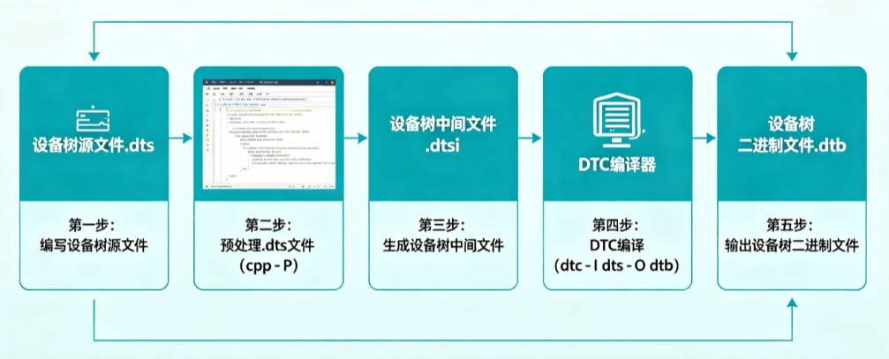
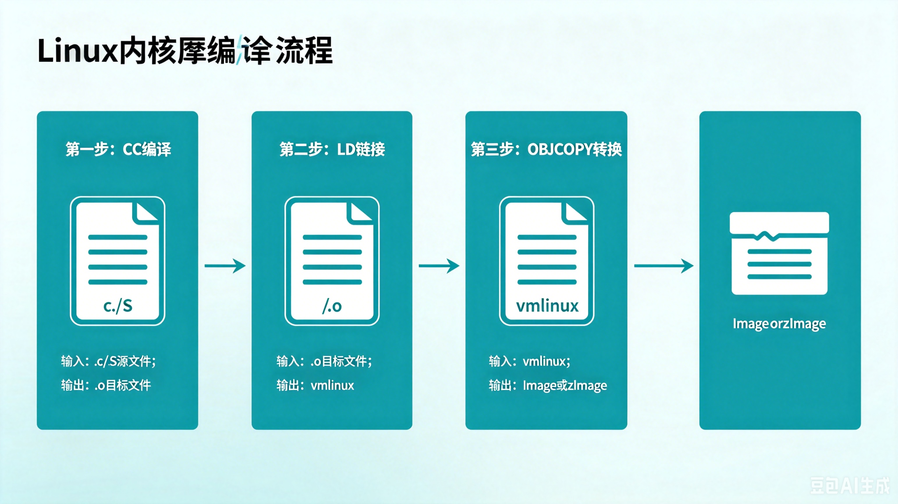

# 4.4.3 编译命令详解

> 所属章节：第4章 内核配置与编译 > 4.4 动手编译内核
> 难度：[B→I] | 预计阅读时间：15分钟

## <span class="blue"> 本节导读

本节覆盖：内核编译的主要目标（`zImage`/`uImage`/`dtbs`/`modules`/`all`）、并行编译策略、编译输出解读、以及增量编译机制。

---

## <span class="blue"> 分目标编译 [B]

Linux 内核 Makefile 提供了多个编译目标，可按需单独或组合执行。不同架构支持的目标不同，最常用的是以下五个。

### make zImage

`make zImage` 是 **ARM32** 架构的压缩内核镜像目标。编译器先将 `vmlinux` ELF 文件转为原始二进制 `Image`，再用 gzip 压缩并添加自解压头，生成 `zImage`。

```bash
make zImage
```

输出位置：`arch/arm/boot/zImage`

> ⚠️ **ARM64 没有 `zImage`。** <BR>ARM64 架构的压缩内核使用 `make Image.gz` 或 `make Image`（未压缩）。输出位置为 `arch/arm64/boot/Image.gz` 或 `arch/arm64/boot/Image`。

### make uImage

`uImage` 是在 `zImage` 基础上追加 64 字节 U-Boot 头的格式，便于 U-Boot 直接加载。在部分 ARM32 内核源码中，`make uImage` 是原生 make 目标，但执行时要求 `mkimage` 工具在 PATH 中。

```bash
make uImage LOADADDR=0x80008000
```

> ⚠️ 某些内核版本（尤其 ARM64）**不支持**原生 `make uImage`。此时需要先用 `make Image.gz` 生成内核，再手动调用 U-Boot 的 `mkimage` 工具包装：
> ```bash
> mkimage -A arm64 -O linux -T kernel -C gzip -a 0x80080000 -e 0x80080000 -n "Linux" -d arch/arm64/boot/Image.gz uImage
> ```
> 如果编译 uImage 时报 `mkimage command not found`，安装 `u-boot-tools` 即可。

### make dtbs

`make dtbs` 编译当前配置中所有启用的设备树源文件（`.dts`），生成对应的 `.dtb` 二进制文件。

```bash
make dtbs
```

输出位置：`arch/$(ARCH)/boot/dts/` 及其子目录。例如 ARM32 的 i.MX6ULL 设备树位于 `arch/arm/boot/dts/imx6ull-14x14-evk.dtb`。

也可以只编译单个设备树：

```bash
make imx6ull-14x14-evk.dtb
```



### make modules

`make modules` 只编译配置中标记为 `<M>`（模块）的驱动和组件，生成 `.ko` 文件。这些文件分散在内核源码树的各驱动目录下，例如 `drivers/net/usb/rtl8150.ko`。与标记为 `<Y>` 的内置驱动不同，模块不会被打包进内核镜像，而是后续独立加载到运行中的系统。

```bash
make modules
```

### make all

`make all` 是内核源码的**默认目标**。直接执行 `make` 不加参数时等价于 `make all`，它会编译内核镜像和模块。如果你需要一次性得到内核、模块、设备树，通常执行：

```bash
make all
```

或更常见的组合：

```bash
make zImage modules dtbs
```

> 💡 首次编译时建议执行 `make all` 或 `make zImage modules dtbs`，一次性产出所有产物。后续增量开发时，可针对改动单独执行 `make zImage` 或 `make dtbs`。

---

## <span class="blue"> 并行编译与资源控制 [B]

现代开发机通常有 4~16 个逻辑核心，单核编译会浪费大量时间。通过 `-j` 参数可以并行启动多个编译任务：

```bash
make -j$(nproc)
```

`$(nproc)` 返回当前机器的逻辑 CPU 数量。例如 8 核机器会同时启动 8 个编译任务。

> ⚠️ **并行数并非越大越好。** 链接阶段 `ld` 会占用大量内存。如果机器内存 **小于 4GB**，建议限制为 `make -j2`，否则链接阶段可能因 OOM 被系统终止。典型的内存耗尽报错如下：
> ```text
> collect2: fatal error: ld terminated with signal 9 [Killed]
> ```
> 出现此错误时，减少 `-j` 数值或增加 swap 空间即可解决。

> 💡 更稳妥的写法是 `make -j$(($(nproc)+1))`。加 1 的原理是：当 CPU 满载编译时，恰好有一个进程在等待 I/O，不浪费算力。

---

## <span class="blue"> 编译输出解读 [B]

执行编译后，终端会滚过大量输出。看懂以下前缀能快速判断当前阶段和状态。

| 前缀 | 含义 | 作用 |
|------|------|------|
| **CC** | C Compiler | 编译源文件（`.c` → `.o`） |
| **LD** | Linker | 链接目标文件（`.o` → `vmlinux` ELF） |
| **OBJCOPY** | Object Copy | 格式转换（`vmlinux` → `Image`/`zImage`） |
| **DTC** | Device Tree Compiler | 编译设备树（`.dts` → `.dtb`） |
| **CHK** | Check | 检查文件是否需要重新生成 |
| **MODPOST** | Module Post-processing | 生成模块符号信息和依赖关系 |

编译输出中还会穿插 `Building modules, stage 2.` 和 `MODPOST` 行，这是模块链接阶段的标志，表示内核正在汇总所有模块的导出符号。

正常编译结束时，终端会输出一行**完成信息**，提示镜像已就绪：

```text
Kernel: arch/arm/boot/zImage is ready
```

或 ARM64：

```text
Kernel: arch/arm64/boot/Image.gz is ready
```




> 💡 交叉编译时，**CC 行显示的编译器前缀必须是 `arm-linux-gnueabihf-gcc` 或 `aarch64-linux-gnu-gcc` 等交叉工具链**，而不是主机自带的 `gcc`。如果看到的是 `gcc`，说明 `ARCH` 或 `CROSS_COMPILE` 未正确配置，应回到 4.4.2 检查。

---

## <span class="blue"> 增量编译 [I]

增量编译是内核开发中最节省时间的机制。`make` 通过检查每个源文件及其头文件的时间戳，**只重新编译发生变动的文件及其下游依赖**，跳过未改动的部分。

例如，第一次完整编译花费 45 分钟。之后修改了 `drivers/net/usb/rtl8150.c` 中的几行代码，重新执行 `make -j$(nproc)` 可能只需要 1~3 分钟，因为仅该文件和最终链接阶段被重新执行。

```bash
# 修改代码后，直接重新 make 即可
make -j$(nproc)
```

当需要清理编译产物时，有两个常用目标：

- `make clean`：删除编译生成的 `.o`、`.ko`、内核镜像、模块等，保留 `.config` 配置文件。
- `make distclean`：在 `make clean` 基础上，额外删除 `.config`、`include/generated/` 等配置相关文件，将源码树恢复到接近原始状态。

> ⚠️ `make distclean` 会删除 `.config`。如果你已花费时间配置了内核选项，执行前请先备份 `.config`。

> 🔴 如果增量编译后固件行为异常（例如修改了代码但运行结果未变），可能是依赖追踪失效。此时执行 `make clean` 后重新全量编译，能排除 90% 的增量编译残留问题。

---

## <span class="blue"> 完整编译流程示例 [B]

以下是从 `defconfig` 到完整产出的命令序列，适用于 ARM64（AArch64） 交叉编译场景。每条命令带有注释说明执行目的。

```bash
# 1. 进入内核源码目录
cd linux-6.6

# 2. 加载 ARM64 默认配置（例如 rockchip_linux_defconfig，或通用 defconfig）
make ARCH=arm64 defconfig
# 若不确定平台，可直接用：make ARCH=arm64 defconfig

# 3. 编译内核镜像、模块、设备树
# 差异点：
#   - ARCH=arm64
#   - 交叉编译前缀改为 aarch64-linux-gnu-
#   - ARM64 内核镜像为 Image（或 Image.gz），没有 zImage
make ARCH=arm64 CROSS_COMPILE=aarch64-linux-gnu- -j$(nproc) Image modules dtbs

# 4. 查看编译产物
# 差异点：路径变为 arch/arm64/boot/
ls -lh arch/arm64/boot/Image
ls arch/arm64/boot/dts/rockchip/*.dtb   # 根据实际平台调整路径

# 5. 安装模块到临时目录
make ARCH=arm64 CROSS_COMPILE=aarch64-linux-gnu- modules_install INSTALL_MOD_PATH=~/rootfs-modules
```


> 💡 首次完整编译的时间参考：**30~60 分钟**，取决于内核配置规模、CPU 核心数和内存带宽。启用大量驱动或编译调试信息（`CONFIG_DEBUG_INFO`）时，时间可能延长到 90 分钟以上。后续增量编译通常在 **1~5 分钟** 内完成。

如果目标平台需要压缩镜像（例如 U-Boot 引导时要求），可在 Image 基础上额外编译 Image.gz
```bash
make ARCH=arm64 CROSS_COMPILE=aarch64-linux-gnu- -j$(nproc) Image.gz modules dtbs
```

> 💡 如果你需要精确测量编译耗时，可在 `make` 前加 `time`：
> ```bash
> time make ARCH=arm64 CROSS_COMPILE=aarch64-linux-gnu- -j$(nproc) Image modules dtbs
> ```
> 编译结束后，终端会输出 `real`（实际经过时间）、`user`（所有 CPU 时间总和）、`sys`（系统调用时间）三项统计。如果 `user` 远大于 `real`，说明并行编译发挥了多核优势。

---

## <span class="blue"> 下一步

编译完成后，内核源码树中会生成大量文件：镜像、设备树、模块、符号表等。下一节（4.4.4 编译产物清单与位置）将逐一说明这些文件的用途、存放路径和大小参考，帮助你快速定位所需产物。

---
