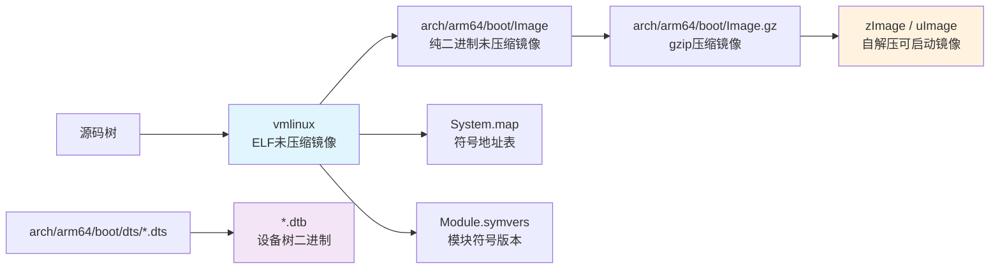

# 4.4.4 编译产物清单

> 所属章节：第4章 Linux内核编译 > 4.4 编译流程
> 难度：[B→M] | 预计阅读时间：15分钟

## 本节导读

编译完成后，内核源码目录会"凭空"多出许多文件。本节带你逐一认识这些编译产物的真面目——它们是什么、干什么用、该拷贝哪一个到开发板。学完本节，你将拥有一份"编译产物导航图"，再也不会面对一屏文件不知所措。

## 知识点1：五大核心编译产物 [B/M] ~1,000字

Linux内核编译完成后，会在源码树中生成数十种文件。对初学者而言，只需抓住**五大核心产物**，就能应对90%的嵌入式开发场景。

### 产物关系全景图

下图展示了从源码到最终烧录文件的"变身"链条：



[图1：内核编译产物生成链条]

---

### 1. vmlinux —— "老祖宗"镜像

`vmlinux` 是编译最先产生的**未压缩ELF格式**内核镜像，位于源码根目录。它体积庞大（通常几十MB到上百MB），包含完整的调试符号信息，是其他所有压缩/引导镜像的"原料"。

💡 **提示**：虽然 `vmlinux` 不能直接烧录到开发板运行，但调试内核崩溃（panic）时，它是 GDB 的必备搭档。

### 2. zImage / uImage —— "能启动"的镜像

嵌入式开发板通常使用压缩后的可启动镜像，常见两种格式：

| 镜像名称 | 适用引导程序 | 特点 |
|---------|-------------|------|
| zImage | 传统Linux引导器 | 自带解压缩头，启动时自动解压到内存 |
| uImage | U-Boot | 在zImage基础上加了64字节的U-Boot头（含加载地址、入口地址） |

🔴 **危险**：不要直接把 `vmlinux` 或 `Image` 丢给 U-Boot 用 `bootm` 命令启动！U-Boot 的 `bootm` 只认 `uImage` 格式，否则会出现 "Bad Magic Number" 错误。

### 3. System.map —— 内核"地址电话簿"

`System.map` 是一个纯文本文件，记录了内核中每个函数和全局变量的**运行时内存地址**。当内核打印一条类似 `PC is at __irq_usr+0x80/0xc0` 的 panic 信息时，配合 `System.map` 就能定位到具体的 C 函数。

### 4. Module.symvers —— 模块的"身份证"

编译内核模块（如驱动 `.ko` 文件）时，内核需要知道某些符号（函数/变量）是否存在及其版本。`Module.symvers` 就是这份"名单"。如果你以后要在该内核版本上**编译外部模块**（不随内核一起编），这个文件必须拷贝到外部模块的源码目录。

⚠️ **陷阱**：忽略 `Module.symvers` 会导致外部模块编译时出现 `"undefined symbol"` 或 `"modpost: WARNING: could not find"` 错误。很多人花几个小时排查头文件路径，最后发现是这个文件没拷贝。

### 5. .dtb 文件 —— 硬件"说明书"

`.dtb`（Device Tree Blob）是设备树的二进制文件。内核启动时由引导程序（如 U-Boot）将它加载到内存，告诉内核"这块板子上有多少内存、哪个地址挂着串口、网卡接在哪个总线上"。不同板型对应不同的 `.dtb` 文件，例如树莓派4B通常使用 `bcm2711-rpi-4-b.dtb`。

### 查看编译产物示例

编译完成后，在源码根目录执行以下命令，快速一览关键产物的"身材"：

```bash
# 进入内核源码根目录
cd ~/linux-stable

# 查看根目录核心产物
ls -lh vmlinux System.map Module.symvers

# 查看可启动镜像（以 arm64 为例）
ls -lh arch/arm64/boot/

# 查看生成的设备树文件
ls -lh arch/arm64/boot/dts/broadcom/*.dtb 2>/dev/null || echo "无此目录，请按实际 SoC 厂商查找"
```

典型输出如下（不同配置体积差异很大）：

```
-rwxr-xr-x 1 user user 215M Dec 10 09:32 vmlinux
-rw-r--r-- 1 user user 3.4M Dec 10 09:32 System.map
-rw-r--r-- 1 user user  56K Dec 10 09:32 Module.symvers

arch/arm64/boot/:
-rw-r--r-- 1 user user  22M Dec 10 09:32 Image          <-- 未压缩纯二进制
-rw-r--r-- 1 user user 8.5M Dec 10 09:32 Image.gz       <-- gzip压缩
-rw-r--r-- 1 user user 8.5M Dec 10 09:32 Image.lzma     <-- lzma压缩（若启用）
```

💡 **提示**：如果启用了 `CONFIG_DEBUG_INFO`，`vmlinux` 会包含 DWARF 调试信息，体积轻松突破 200MB。正式发布时可用 `make INSTALL_MOD_STRIP=1` 或手动 `strip` 来瘦身。

## 知识点2：产物都藏在哪？ [B] ~500字

编译产物不是胡乱散落的，内核的 Makefile 有严格的"收纳规则"。下表是核心产物的**速查坐标**：

### 编译产物位置速查表

| 产物名称 | 典型路径 | 文件格式 | 烧录/使用场景 |
|---------|---------|---------|-------------|
| vmlinux | `<源码根目录>/vmlinux` | ELF可执行文件 | 调试符号源，配合 GDB 使用 |
| Image | `arch/<架构>/boot/Image` | 纯二进制 | 引导程序直接加载（如 QEMU） |
| zImage | `arch/<架构>/boot/zImage` | 压缩二进制+自解压头 | ARM32 开发板常用 |
| uImage | `arch/<架构>/boot/uImage` | 压缩二进制+U-Boot头 | U-Boot `bootm` 命令启动 |
| System.map | `<源码根目录>/System.map` | 纯文本 | 解析内核 panic 地址 |
| Module.symvers | `<源码根目录>/Module.symvers` | 纯文本 | 编译外部内核模块时必需 |
| *.dtb | `arch/<架构>/boot/dts/<厂商>/` | 二进制设备树 | 启动时由引导程序加载 |
| 内核模块 | 暂未安装，仍分散在各子目录 | ELF (.ko) | 执行 `make modules_install` 后统一安装到 `/lib/modules/` |

💡 **提示**：架构目录 `<架构>` 需要替换为实际值。ARM64 写 `arm64`，ARM32 写 `arm`，RISC-V 写 `riscv`，x86 写 `x86`。初学者最常见的错误是在 `arch/arm/` 和 `arch/arm64/` 之间迷路。

### 快速定位命令

如果你不确定当前架构对应的产物目录，可以用一行命令"自动导航"：

```bash
# 在内核源码根目录执行，自动获取当前配置的目标架构
ARCH=$(sed -n 's/^ARCH = \(.*\)/\1/p' .config 2>/dev/null || echo "arm64")
echo "当前架构目录: arch/${ARCH}/boot/"
ls -lh "arch/${ARCH}/boot/"
```

对于多平台内核（如 ARM64 支持数十种 SoC），`.dtb` 文件可能散落在 `arch/arm64/boot/dts/` 下的各厂商子目录中：

```bash
# 以 ARM64 为例，查看所有生成的设备树
find arch/arm64/boot/dts -name "*.dtb" -exec ls -lh {} \;
```

⚠️ **陷阱**：`.dtb` 文件名通常与开发板型号严格对应。例如树莓派4B不能乱用树莓派3B的 `.dtb`，否则启动时会出现设备节点找不到的情况，串口日志会报 `of_platform_populate: Failed to create device` 之类的错误。务必使用与硬件匹配的 `.dtb`！

## 本节总结

| 产物 | 核心要点 | 你真正需要做的 |
|------|---------|--------------|
| vmlinux | ELF格式，带调试符号 | 保留它，调试崩溃时需要 |
| zImage/uImage | 可启动的压缩镜像 | 二选一拷贝到开发板/TF卡 |
| System.map | 符号→地址映射表 | 与内核版本配对保存，panic时查地址 |
| Module.symvers | 外部模块编译的"通行证" | 计划编译外部驱动时，一定拷贝它 |
| .dtb | 描述板级硬件的二进制树 | 确认文件名与开发板型号完全匹配 |

## 下一步

编译产物已经清晰，但 `vmlinux` 高达 200MB、各类镜像文件体积也不小。下一节 `4.4.5 编译输出分析` 将教你如何解读编译日志、分析镜像体积构成，以及用 `size`、`nm`、`readelf` 等工具给内核"体检"——让你从"编译完了"进阶到"编译对了"。

---

## 配套资源

### 表格清单
- 表1：zImage 与 uImage 对比表（适用引导程序、特点）
- 表2：编译产物位置速查表（产物名称、典型路径、文件格式、烧录/使用场景）
- 表3：本节总结表（产物、核心要点、操作建议）

### 图示清单
- 图1：内核编译产物生成链条 [mermaid图] —— 展示了从源码到 vmlinux 到压缩镜像、设备树的完整生成流程

### 代码清单
- 代码1：`ls -lh` 查看核心产物大小和位置
- 代码2：通过 `.config` 自动获取架构目录路径
- 代码3：`find` 命令遍历查找所有 .dtb 设备树文件
