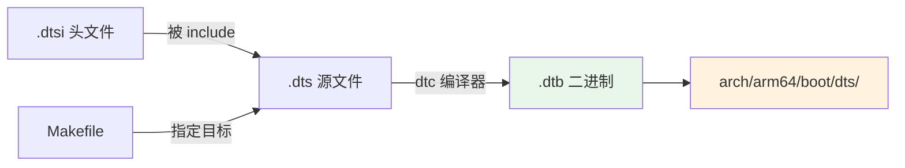

# 4.4.5 编译设备树

> 所属章节：第4章 内核编译实战 > 4.4 编译流程
> 难度：[B→M] | 预计阅读时间：15分钟

## 本节导读

上一节我们认识了编译产物清单中的 `.dtb` 文件——它是设备树的二进制形态，是内核启动时读取硬件配置的"说明书"。本节教你如何把 `.dts` 源文件变成 `.dtb`：既可以单独编译（只改设备树时省时省力），也可以随内核一起编译（完整编译时的默认行为），最后学会验证生成的 dtb 是否合法。

---

## 知识点1：单独编译 dtb [B][M] ~700字

在实际开发中，设备树的修改频率往往远高于内核代码。你可能只调整了串口波特率、修改了 GPIO 引脚定义，或者为新的外设追加了一个节点——如果每次都要把整个内核重新编译一遍（动辄十几分钟甚至数小时），效率将非常低下。

**Linux 内核的构建系统支持单独编译 dtb**，只改 `.dts` 的情况下，你可以在短短几秒内得到新的 `.dtb`，直接丢给 U-Boot 测试。

### dtb 编译流程



[图1：dtb 单独编译流程]

### 编译全部 dtb：make dtbs

在内核源码根目录执行以下命令，即可编译该架构下**所有**设备树：

```bash
export ARCH=arm64
make dtbs
```

`make dtbs` 是内核 Makefile 中定义的伪目标，它会遍历 `arch/$(ARCH)/boot/dts/` 目录下的 Makefile，找到所有 `.dtb` 目标并逐一编译。

### 编译指定 dtb

如果你只想编译某一个板子的 dtb，在 `make dtbs` 后追加文件名即可，**注意用 `.dtb` 后缀**：

```bash
# 只编译树莓派4B的dtb
make dtbs bcm2711-rpi-4-b.dtb

# 一次指定多个
make dtbs bcm2711-rpi-4-b.dtb rockchip/rk3399-nanopi4.dtb
```

编译完成后，dtb 文件默认输出到 `arch/$(ARCH)/boot/dts/` 目录（ARM32 为 `arch/arm/boot/dts/`，ARM64 为 `arch/arm64/boot/dts/`）。

### 操作步骤

1. 进入内核源码根目录：`cd ~/linux-stable`
2. 设置 ARCH 和交叉编译器：
   ```bash
   export ARCH=arm64
   export CROSS_COMPILE=aarch64-linux-gnu-
   ```
3. 编译全部 dtb：`make dtbs`
4. 或只编译指定 dtb：`make dtbs 你的板子名称.dtb`
5. 检查产物：`ls -lh arch/arm64/boot/dts/*.dtb`

### 常见错误

⚠️ **陷阱：忘了 export ARCH**
> 没设置 `ARCH`，内核 Makefile 默认按 x86 处理，会尝试在 `arch/x86/boot/dts/` 找设备树——这个目录不存在或设备树不对。错误表现通常是 `Nothing to be done` 或找不到 `.dts`。

⚠️ **陷阱：用 `.dts` 后缀作为 make 目标**
> `make dtbs xxx.dts` 不会报错，但也不会做任何事。Makefile 里的目标定义使用的是 `.dtb` 后缀，务必写对。

💡 **提示**：不确定板子对应哪个 dtb 文件名？去 `arch/arm64/boot/dts/` 目录下执行 `ls | grep -i 你的板子型号`，文件名通常包含芯片型号或商品名。

---

## 知识点2：设备树与内核一起编译 [B] ~500字

除了单独编译，dtb 更常见的出现方式是**随内核编译自动生成**。执行常规编译命令时，dtb 会被"顺带"生成，不需要额外操作。

### 哪些编译目标会自动编译 dtb？

`dtbs` 已被加入多个编译目标的依赖链中：

| 编译命令 | 是否自动编译 dtb | 说明 |
|---------|----------------|------|
| `make` | ✅ 是 | 默认目标 `all`，dtb 在内核镜像之后编译 |
| `make all` | ✅ 是 | 显式编译全部目标 |
| `make zImage` | ✅ 是 | ARM32 压缩镜像 |
| `make Image` | ✅ 是 | ARM64 未压缩镜像 |
| `make uImage` | ✅ 是 | U-Boot 专用镜像 |
| `make modules` | ❌ 否 | 只编译内核模块 |
| `make dtbs` | ✅ 是（仅 dtb）| 只编译 dtb，不碰内核 |

[表1：dtb 编译命令速查表]

这意味着，如果你已执行过 `make`，dtb 早就生成好了——直接去 `arch/arm64/boot/dts/` 目录找即可。

### dtb 为什么能随内核一起编译？

设备树编译规则写在了 `arch/$(ARCH)/boot/dts/Makefile` 中，例如：

```makefile
# 片段：arch/arm64/boot/dts/rockchip/Makefile
dtb-$(CONFIG_ARCH_ROCKCHIP) += rk3399-evb.dtb
dtb-$(CONFIG_ARCH_ROCKCHIP) += rk3399-nanopi4.dtb
```

每个 `dtb-$(CONFIG_xxx) += xxx.dtb` 表示：如果对应的内核配置被选中，该 dtb 就会被加入编译列表。顶层 `make` 执行时，构建系统会递归进入该目录，根据 `.config` 决定编译哪些 dtb。

💡 **提示**：想知道当前配置会编译出哪些 dtb？查看 `arch/$(ARCH)/boot/dts/Makefile` 里的 `dtb-y` 和 `dtb-$(CONFIG_...)` 列表即可。这也能帮你确认"我的板子在这个内核版本里有没有官方支持"。

---

## 知识点3：dtb 验证 [B] ~400字

.dtb 生成后，如何确认它是"好的"？有没有被截断？内容是否和 `.dts` 一致？下面两个方法最实用。

### 方法1：fdtdump 反编译查看内容

`fdtdump` 可以把二进制 dtb 还原成人类可读的文本格式：

```bash
# 安装工具
sudo apt-get install device-tree-compiler

# 反编译 dtb，查看前 60 行
cd arch/arm64/boot/dts
fdtdump bcm2711-rpi-4-b.dtb | head -n 60
```

如果 dtb 完好，你会看到类似 `.dts` 的节点和属性结构，以 `/dts-v1/` 开头。文件损坏时，fdtdump 会报 `FATAL ERROR`。

### 方法2：检查文件大小与魔数

快速判断 dtb 是否正常的"土办法"：

```bash
# 查看文件大小（正常 dtb 一般几 KB 到几百 KB）
ls -lh arch/arm64/boot/dts/bcm2711-rpi-4-b.dtb

# 检查文件头 4 字节的魔数
hexdump -C arch/arm64/boot/dts/bcm2711-rpi-4-b.dtb | head -n 1
```

正常 dtb 头部应包含魔数 `d0 0d fe ed`。如果 `hexdump` 输出全是 `00` 或文件大小为 0，说明编译过程出了差错。

### 常见错误

⚠️ **陷阱：fdtdump 报错 "could not decode FDT"**
> 这个错误通常意味着 dtb 文件不完整或损坏。可能原因：磁盘满了、复制中断、或者拿了编译中的半成品。解决：重新编译该 dtb 并确认 `echo $?` 输出 `0`。

💡 **提示**：验证 dtb 时建议同时对比 `.dts` 和 `fdtdump` 输出的差异。可用 `diff <(fdtdump xxx.dtb) xxx.dts` 大致比对，但注意 `fdtdump` 不含注释，且标签引用会被展开为完整路径，差异是正常的。

---

## 本节总结

本节学习了设备树的三种编译与验证方式，核心内容汇总如下：

| 概念 | 要点 | 操作 |
|------|------|------|
| 单独编译 dtb | 只改设备树时不需重编内核 | `make dtbs [xxx.dtb]` |
| 一起编译 dtb | 内核编译时自动触发 | `make` / `make Image` / `make all` |
| dtb 输出目录 | 按架构分目录存放 | `arch/arm64/boot/dts/` 或 `arch/arm/boot/dts/` |
| dtb 内容验证 | 反编译为文本查看结构 | `fdtdump xxx.dtb` |
| dtb 完整性验证 | 检查魔数与文件大小 | `hexdump -C xxx.dtb \| head -n 1` |

---

## 下一步

设备树编译完成后，下一步就是把它实际部署到开发板上。4.4.6 节将讲解如何把 dtb 与内核镜像一起交给 U-Boot 启动，以及 U-Boot 如何通过 `bootm` / `booti` 命令把 dtb 地址传递给内核——你将亲眼看到内核"读"设备树启动的全过程。

---

## 配套资源

### 表格清单
- 表1：dtb 编译命令速查表（哪些编译目标会自动编译 dtb）

### 图示清单
- 图1：dtb 单独编译流程 [mermaid 图]
- 图2：dtc 编译器将 dts/dtsi 转换为 dtb 的示意图 [配图说明]

### 代码清单
- 代码1：`make dtbs` —— 编译全部 dtb
- 代码2：`make dtbs xxx.dtb` —— 编译指定 dtb
- 代码3：`fdtdump` 反编译验证 dtb 内容
- 代码4：`hexdump` 检查 dtb 魔数
