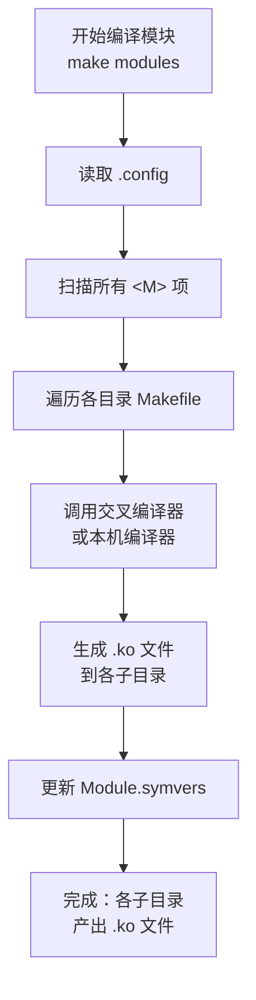

# 4.4.6 编译内核模块

> 所属章节：第4章 嵌入式Linux内核实战 > 4.4 内核编译与配置
> 难度：[B→I] | 预计阅读时间：25分钟

## 本节导读

本节教你编译Linux内核模块（ko文件）。学完本节，你能编译全部模块、单独编译某个驱动模块，将模块安装到指定目录，并理解模块依赖的自动解决机制。

## 知识点1：模块编译 [B][M] ~700字

### 为什么内核要分模块编译？

Linux内核有成千上万个驱动和功能组件。如果全部编译进内核镜像（built-in），最终的`zImage/vmlinuz`会变得臃肿，加载慢、内存占用大。模块化的设计让常用驱动随内核启动，不常用的驱动以后按需加载——这就是内核模块（Kernel Module，文件后缀`.ko`）。

> 💡 **提示**：编译模块前，必须确保你已经**完整编译过一次内核**（`make`或`make zImage`）。因为模块编译依赖内核构建系统生成的符号表和配置文件（如`.config`、`Module.symvers`、`include/generated`等）。

### 编译所有模块：make modules

编译全部已勾选为`<M>`（编译为模块）的组件，这是最常用的命令：

```bash
# 进入内核源码根目录
cd ~/linux-5.15.0

# 编译所有模块（-jN 使用N个并行编译任务）
make -j$(nproc) modules
```

[图1：`make modules`编译流程示意图]



编译完成后，你会在内核源码的各个子目录下看到大量`.ko`文件。例如：

```bash
# 查找编译出的模块文件
find . -name "*.ko" | head -10

# 典型输出：
# ./drivers/net/usb/ax88179_178a.ko
# ./drivers/usb/serial/option.ko
# ./drivers/gpio/gpio-pca953x.ko
```

### 单独编译指定模块：make M=…

在嵌入式开发中，我们经常只修改了一个驱动，不想全部重编。`M=`参数允许你精确指定要编译的目录：

```bash
# 只编译 drivers/net/usb 目录下的模块
make -C ~/linux-5.15.0 M=drivers/net/usb modules

# 或者先 cd 进目录，再编译（效果相同）
cd drivers/net/usb
make -C ~/linux-5.15.0 M=$(pwd) modules
```

⚠️ **陷阱**：`make M=drivers/net/usb`中的路径必须是**内核源码根目录下的相对路径**，而不是绝对路径，除非你同时指定了`-C <内核源码根目录>`。

### 操作步骤：编译单个驱动模块

1. 确认内核源码已完整编译（生成`Module.symvers`）
2. 进入要修改的驱动目录，修改源码
3. 执行`make -C <kernel_tree> M=$(pwd) modules`
4. 检查生成的`.ko`文件

💡 **提示**：交叉编译时记得加上`ARCH=`和`CROSS_COMPILE=`前缀，例如：

```bash
make ARCH=arm64 CROSS_COMPILE=aarch64-linux-gnu- \
     -C ~/linux-5.15.0 M=drivers/net/usb modules
```

🔴 **危险**：单独编译模块时，如果内核源码树版本与目标运行的内核版本不一致（如`uname -r`不同），模块将无法加载，报"Invalid module format"错误。务必确保模块与目标内核版本一致。

## 知识点2：模块安装 [B] ~500字

### modules_install 的作用

`.ko`文件编译出来后散落在源码各目录中，不方便部署。`make modules_install`会把所有模块按目录结构整理到安装路径，通常包含：

- `lib/modules/<内核版本>/kernel/` — 模块二进制文件（`.ko`）
- `lib/modules/<内核版本>/modules.dep` — 模块依赖关系
- `lib/modules/<内核版本>/modules.alias` — 模块别名映射
- 其他辅助文件（`modules.symbols`、`modules.builtin`等）

### 安装到本机系统

```bash
# 需要 root 权限，安装到 /lib/modules/
sudo make modules_install

# 指定安装路径（嵌入式常用，安装到 staging 目录）
make INSTALL_MOD_PATH=/tmp/rootfs modules_install
```

### 操作步骤：为嵌入式根文件系统安装模块

1. 确认模块已编译完成：`make modules`
2. 指定目标根文件系统路径：`make INSTALL_MOD_PATH=/path/to/rootfs modules_install`
3. 检查安装结果：

```bash
ls -la /tmp/rootfs/lib/modules/$(make kernelrelease)/kernel/drivers/net/usb/
```

💡 **提示**：`INSTALL_MOD_PATH`只是路径前缀，不是最终根目录的完整路径。安装后的结构为`$INSTALL_MOD_PATH/lib/modules/<版本>/`。确保目标设备的根文件系统中`lib/modules/`路径正确。

⚠️ **陷阱**：
- **忘记加`INSTALL_MOD_PATH`**：在本机执行`make modules_install`会覆盖你本机的`/lib/modules/`，可能导致本机无法启动。嵌入式开发时务必指定`INSTALL_MOD_PATH`！
- **目标目录不存在**：如果`/tmp/rootfs/lib/`不存在，`make modules_install`会自动创建，但父目录必须存在。

## 知识点3：模块依赖 [I] ~500字

### 什么是模块依赖？

一个内核模块可能依赖另一个模块。例如，USB网卡驱动`ax88179_178a.ko`依赖USB核心`usbcore.ko`。手工加载时必须按顺序执行`insmod usbcore.ko`再`insmod ax88179_178a.ko`，否则后者因缺少依赖而失败。

### modules.dep 文件

`make modules_install`会调用`depmod`生成`modules.dep`，它记录了所有模块的依赖关系：

```
# 文件格式：模块路径 : 依赖模块路径1 依赖模块路径2 ...
kernel/drivers/net/usb/ax88179_178a.ko: kernel/drivers/usb/core/usbcore.ko kernel/net/ipv4/tcp.ko
```

### 用 modprobe 自动解决依赖

`modprobe`比`insmod`更智能——它会自动读取`modules.dep`，先加载所有依赖模块，再加载目标模块：

```bash
# 手动加载（必须按顺序，容易出错）
insmod /lib/modules/5.15.0/kernel/drivers/usb/core/usbcore.ko
insmod /lib/modules/5.15.0/kernel/drivers/net/usb/ax88179_178a.ko

# 自动加载（modprobe 自动解决依赖）
modprobe ax88179_178a
```

### depmod 工具

当你手动复制`.ko`文件到目标设备后（非`modules_install`方式），需要手动更新依赖数据库：

```bash
# 在目标设备上运行（或指定根路径）
depmod -a                 # 重新生成当前内核版本的 modules.dep
depmod -b /tmp/rootfs     # 为指定根文件系统生成依赖
```

⚠️ **陷阱**：
- **直接用`insmod`加载有依赖的模块**：如果`A.ko`依赖`B.ko`，先`insmod A.ko`会报"Unknown symbol in module"错误。
- **复制了`.ko`但没运行`depmod`**：`modprobe`会找不到新模块或无法解析依赖，报"Module not found"。

💡 **提示**：嵌入式设备启动时，`/etc/init.d/`或systemd服务中应使用`modprobe`而非`insmod`加载驱动，这样模块启动顺序由内核自动处理，避免人为出错。

[图2：insmod vs modprobe 加载方式对比示意图]

## 本节总结

| 概念 | 要点 | 操作 |
|------|------|------|
| 编译全部模块 | 编译`.config`中所有`<M>`项 | `make -j$(nproc) modules` |
| 编译指定模块 | 只编译某个子目录的模块 | `make M=drivers/xxx modules` |
| 安装模块 | 整理`.ko`到标准目录结构 | `make INSTALL_MOD_PATH=xxx modules_install` |
| 模块依赖 | 记录在`modules.dep`中 | `depmod -a`生成，`modprobe`自动解决 |
| 加载方式对比 | `insmod`手动单加载，`modprobe`自动解依赖 | 日常用`modprobe`，调试可用`insmod` |

## 下一步

本节完成后，你已经能编译并安装内核模块。下一节（4.4.7）将讲解如何将编译好的内核（`zImage`/`uImage`）和模块部署到目标嵌入式设备，并配置Bootloader启动新内核。

---

## 配套资源

### 表格清单
- 表1：模块编译与安装命令速查表（本节总结中的表格）

### 图示清单
- 图1：`make modules`编译流程示意图 [mermaid流程图]
- 图2：insmod vs modprobe 加载方式对比示意图 [配图说明]

### 代码清单
- 代码1：编译所有模块命令
- 代码2：编译指定目录模块命令（含交叉编译示例）
- 代码3：模块安装命令（含`INSTALL_MOD_PATH`）
- 代码4：`insmod`与`modprobe`加载对比命令
- 代码5：`depmod`更新依赖命令
