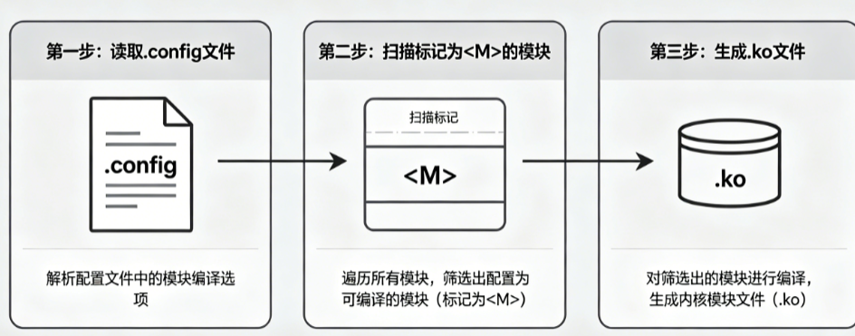

# 4.4.6 编译内核模块

> 所属章节：第4章 内核配置与编译 > 4.4 动手编译内核
> 
> 难度：[I] | 预计阅读时间：8分钟

## <span class="blue"> 本节导读

本节覆盖：模块编译与内核编译的关系、`make modules` 与 `make modules_install` 的区别、`INSTALL_MOD_PATH` 指定安装目录的方法、模块输出目录结构，以及 `modules.dep` 的生成机制。

## <span class="blue"> 模块编译 [I]

### 模块编译与内核编译的关系

内核中的驱动和功能组件可以编译为内置（`<Y>`）或模块（`<M>`）。<BR>在配置阶段选择 `<M>` 的组件，需要通过 `make modules` 单独编译。编译模块前，必须确保已经**完整编译过一次内核**（`make` 或 `make zImage`），因为模块编译依赖内核构建系统生成的 `.config`、`Module.symvers` 和 `include/generated` 等文件。

`make modules` 会扫描 `.config` 中所有标记为 `<M>` 的选项，遍历各目录的 Makefile，调用交叉编译器生成 `.ko` 文件。编译完成后，`.ko` 文件散布在源码树的各个子目录中。

```bash
make -j$(nproc) modules
```

编译完成后，可在源码目录中查找 `.ko` 文件：

```bash
find . -name "*.ko" | head -10
```



### 单独编译指定模块

如果只修改了一个驱动，不想重编全部模块，可用 `M=` 参数指定目录：

```bash
make -C ~/linux-5.15.0 M=drivers/net/usb modules
```

> ⚠️ `M=` 中的路径必须是内核源码根目录下的相对路径，除非同时指定了 `-C <内核源码根目录>`。

## <span class="blue"> 模块安装 [I]

### make modules_install 的作用

`make modules_install` 将源码树中散布的 `.ko` 文件按目录结构整理到安装路径。默认安装到本机的 `/lib/modules/$(KERNELRELEASE)/`，嵌入式开发中通常用 `INSTALL_MOD_PATH` 指定目标根文件系统的临时目录。

```bash
make INSTALL_MOD_PATH=/tmp/rootfs modules_install
```

> 🔴 忘记加 `INSTALL_MOD_PATH` 时，`make modules_install` 会覆盖本机的 `/lib/modules/`，可能导致本机无法启动。嵌入式开发时务必指定。

### 输出目录结构

安装后的标准目录结构如下：

```
/lib/modules/$(KERNELRELEASE)/
├── kernel/
│   ├── drivers/
│   │   ├── net/
│   │   ├── usb/
│   │   └── ...
│   ├── fs/
│   └── ...
├── modules.dep
├── modules.dep.bin
├── modules.alias
├── modules.symbols
└── modules.builtin
```

其中 `$(KERNELRELEASE)` 由内核版本和本地版本号组成，可通过 `make kernelrelease` 查看。

### modules.dep 的生成

`make modules_install` 会自动调用 `depmod` 生成 `modules.dep` 和 `modules.dep.bin`，记录所有模块的符号导出与依赖关系。这一步骤由 Makefile 中的 `_modinst_post` 目标完成，无需手动执行 `depmod`。

如果在安装后手动复制了 `.ko` 文件，则需要手动更新依赖数据库：

```bash
depmod -b /tmp/rootfs $(KERNELRELEASE)
```

> 💡 模块的加载、卸载与依赖解析（`insmod`、`modprobe`、`rmmod`、`lsmod`）属于运行时操作，在 4.5 节中详细讲解。

## <span class="blue"> 完整命令序列

从编译到安装模块的典型命令序列：

```bash
# 1. 编译所有模块
make -j$(nproc) modules

# 2. 安装到指定目录（嵌入式常用）
make INSTALL_MOD_PATH=/tmp/rootfs modules_install

# 3. 确认内核版本号
make kernelrelease

# 4. 检查产物
ls -la /tmp/rootfs/lib/modules/$(make kernelrelease)/kernel/drivers/net/usb/
```

> ⚠️ 目标目录 `/tmp/rootfs/lib/` 不存在时，`make modules_install` 会自动创建，但 `INSTALL_MOD_PATH` 指定的父目录必须存在。

## <span class="blue"> 本节总结

| 概念 | 操作 | 说明 |
|------|------|------|
| 编译全部模块 | `make -j$(nproc) modules` | 编译 `.config` 中所有 `<M>` 项 |
| 编译指定模块 | `make M=drivers/xxx modules` | 只编译某个子目录的模块 |
| 安装模块 | `make INSTALL_MOD_PATH=xxx modules_install` | 整理 `.ko` 到标准目录结构 |
| 依赖文件生成 | `modules.dep` | 由 `make modules_install` 自动调用 `depmod` 生成 |

## <span class="blue"> 下一步

模块编译与安装完成后，编译过程中难免遇到报错。下一节（4.4.7）汇总最常见的编译错误与排查方法，提供从报错文本到解决操作的完整路径。

---
