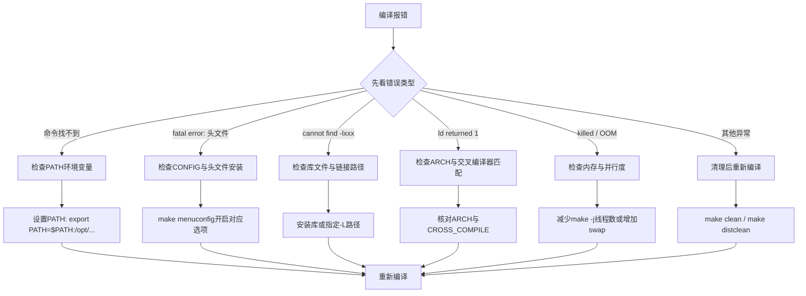

# 4.4.7 常见编译错误与排查方法

> 所属章节：第4章 嵌入式Linux开发环境搭建 > 4.4 交叉编译器与内核编译
> 难度：[B→I] | 预计阅读时间：15分钟

## 本节导读

编译内核是嵌入式Linux开发的第一道门槛。新手常因一个编译错误卡住数小时，其实大多数错误都有固定的排查模式。本节汇总了10个最常见的编译错误，每个都给出"看到什么报错→为什么会这样→如何解决"的完整路径。学完本节，你将拥有一张编译错误的"速查地图"。


[图1：内核编译错误排查流程图]

---

## 知识点1：gcc 命令找不到（PATH 未设置） [B] ~150字

这是交叉编译新手最常踩的坑。明明下载了编译器，终端却提示 `gcc: command not found` 或 `arm-linux-gnueabihf-gcc: command not found`。

**根本原因**：交叉编译器安装在 `/opt/gcc-arm-xxx/bin` 等目录下，但系统不知道去哪里找它。

### 操作步骤
1. 找到编译器安装路径：`ls /opt/*/bin/*gcc`
2. 临时添加到当前终端：`export PATH=$PATH:/opt/gcc-arm-10.3/bin`
3. 永久生效：将上述命令写入 `~/.bashrc`，然后执行 `source ~/.bashrc`
4. 验证：`arm-linux-gnueabihf-gcc --version`

### 代码示例
```bash
# 查看当前 PATH
echo $PATH

# 将交叉编译器加入 PATH（根据你的实际路径修改）
export PATH=$PATH:/opt/gcc-arm-10.3-2021.10-x86_64-arm-linux-gnueabihf/bin

# 验证是否生效
which arm-linux-gnueabihf-gcc
arm-linux-gnueabihf-gcc --version
```

⚠️ **陷阱**：`export` 只对当前终端窗口生效，新开的终端又找不到命令。忘记写入 `~/.bashrc` 是新手常见错误。

💡 **提示**：可以用 `echo 'export PATH=$PATH:/opt/...' >> ~/.bashrc && source ~/.bashrc` 一步到位。

---

## 知识点2：编译器版本太旧 [B] ~150字

内核源码（尤其是 Linux 5.x 及以上）对 GCC 版本有最低要求。用 Ubuntu 18.04 自带的 GCC 7.5 去编译 Linux 6.x，通常会报 `Your compiler is too old`。

**排查方法**：查看内核源码根目录下的 `Makefile`，搜索 `GCC_VERSION` 相关的注释或检查脚本。

### 代码示例
```bash
# 查看当前 gcc 版本
gcc --version

# 查看内核要求的最低版本
grep -r "compiler.*too old\|GCC_VERSION" scripts/ Makefile

# 快速检查内核编译器要求
make CC=gcc 2>&1 | head -n 20
```

🔴 **危险**：不要强行跳过版本检查去编译，即使通过修改脚本绕过了检查，生成的内核也可能存在隐蔽的 ABI 不兼容问题，导致启动时崩溃。

💡 **提示**：推荐使用编译器版本等于或略高于内核推荐的版本，例如编译 Linux 5.15 建议用 GCC 10 以上。

---

## 知识点3：缺少头文件（CONFIG 未启用或头文件未安装） [B] ~150字

报错形如 `fatal error: linux/xxx.h: No such file or directory`。内核编译依赖大量自带头文件，但也可能依赖主机系统的头文件（编译用户空间工具时）。

**两种场景**：
- 编译内核模块时缺少内核自身头文件 → 通常是 `.config` 中未开启对应功能
- 编译用户程序时缺少标准头文件 → 主机系统缺少 `libc-dev` 或 `linux-headers`

### 代码示例
```bash
# 场景1：内核模块缺少 CONFIG 相关头文件
# 报错示例：fatal error: linux/can.h: No such file or directory
# 解决：在 make menuconfig 中开启对应选项
make menuconfig  # 搜索 CAN（按 / 键）

# 场景2：主机缺少标准头文件
# Ubuntu/Debian
sudo apt-get install build-essential linux-headers-$(uname -r)

# CentOS/RHEL/Fedora
sudo yum install kernel-headers glibc-headers
```

⚠️ **陷阱**：不要在主机上交叉编译时去安装目标架构的 `linux-headers`，应该使用内核源码树自带的头文件或 `make headers_install`。

---

## 知识点4：链接错误（缺少库） [B] ~150字

报错形如 `/usr/bin/ld: cannot find -lxxx` 或 `undefined reference to 'xxx'`。这表示链接阶段找不到需要的库文件。

**排查步骤**：
1. 确认库是否已安装：`find /usr -name "libxxx*"`
2. 确认库路径是否在链接器的搜索路径中
3. 交叉编译时，确认找的是目标架构的库，不是主机 x86 的库

### 代码示例
```bash
# 查找 libncurses 库（make menuconfig 依赖它）
find /usr -name "libncurses*" 2>/dev/null

# 如果找不到，安装它
sudo apt-get install libncurses5-dev libncursesw5-dev

# 指定额外的库路径编译
make LDFLAGS="-L/opt/mylib/lib"
```

💡 **提示**：交叉编译出现链接错误时，先用 `file` 命令检查 `.a` 或 `.so` 文件的架构：`file libfoo.a`，确认它不是 x86_64 的库。

---

## 知识点5：内存不足编译失败 [I] ~150字

报错形如 `gcc: internal compiler error: Killed (program cc1)` 或系统直接卡死。这是因为 `make -jN` 并行编译太猛，把内存吃光了，系统 OOM Killer 介入杀掉了编译进程。

**排查方法**：编译时打开另一个终端观察内存：`watch -n 1 free -h`

### 操作步骤
1. 减少并行度：`make -j2`（原本用了 `-j8` 或 `-j$(nproc)`）
2. 增加 swap 空间作为缓冲
3. 关闭不必要的应用程序释放内存

### 代码示例
```bash
# 查看当前内存和 swap 使用情况
free -h

# 创建临时 swap 文件（2GB）
sudo dd if=/dev/zero of=/tmp/swapfile bs=1M count=2048
sudo mkswap /tmp/swapfile
sudo swapon /tmp/swapfile

# 用较低的并行度重新编译
make -j2

# 编译完成后清理临时 swap
sudo swapoff /tmp/swapfile
sudo rm /tmp/swapfile
```

💡 **提示**：物理内存 4GB 以下的机器，编译大型内核建议 `make -j1` 或 `-j2`，牺牲速度换取稳定性。

---

## 知识点6：ARCH 设置错误 [B] ~150字

在 x86_64 主机上编译 ARM 内核，却忘了设置 `ARCH=arm`，内核 Makefile 会默认按 x86 架构编译，导致大量与架构相关的代码编译失败。

**典型报错**：`unknown type name 'pgd_t'` 或 `implicit declaration of function 'cpu_relax'` 等与 CPU 架构强相关的符号错误。

### 代码示例
```bash
# 错误示范：没有指定 ARCH
make menuconfig   # 默认进入 x86 配置菜单！
make              # 用 x86 的 gcc 去编译 ARM 代码，报错一堆

# 正确做法：始终显式指定 ARCH 和 CROSS_COMPILE
export ARCH=arm
export CROSS_COMPILE=arm-linux-gnueabihf-
make menuconfig
make -j$(nproc)
```

⚠️ **陷阱**：`ARCH` 的值必须完全匹配内核 `arch/` 目录下的子目录名。ARM64 是 `arm64`，不是 `aarch64`；32位 ARM 是 `arm`，不是 `arm32`。

💡 **提示**：把 `export ARCH=...` 和 `export CROSS_COMPILE=...` 写进一个 `env.sh` 脚本，每次编译前 `source env.sh`，避免手误。

---

## 知识点7：交叉编译器不匹配 [I] ~150字

报错可能非常隐晦，例如 `incompatible types` 或链接阶段出现 `undefined reference to '__aeabi_idiv'`。根源是交叉编译器的 ABI（应用程序二进制接口）与内核期望的不一致。

**典型场景**：
- 用 `arm-linux-gnueabi`（软浮点）去编译需要硬浮点的内核
- 用 `arm-linux-gnueabihf`（硬浮点）但内核配置成了软浮点
- 编译器的 endian 配置与目标板不一致

### 代码示例
```bash
# 查看编译器默认的浮点 ABI
echo 'int main(){}' | arm-linux-gnueabihf-gcc -x c - -v 2>&1 | grep -i "float"

# 查看内核当前的浮点配置（在 .config 中）
grep CONFIG_VFP .config
grep CONFIG_ARM_THUMB .config

# 如果不匹配，更换编译器或修改内核配置
# 例如从 gnueabi 换成 gnueabihf：
export CROSS_COMPILE=arm-linux-gnueabihf-
make clean && make menuconfig  # 重新配置 VFP 支持
```

🔴 **危险**：ABI 不匹配编译出来的内核可能"安静"地生成，但启动后用户空间程序一运行就崩溃。交叉编译器与根文件系统的 ABI 必须完全一致。

---

## 知识点8：.config 不存在 [B] ~150字

直接在新下载的内核源码目录执行 `make`，报错：`*** No configuration file found. ...` 或编译直接失败。

**根本原因**：内核编译必须有一个 `.config` 文件来决定编译哪些模块、哪些驱动。新下载的源码里只有默认配置模板，没有针对具体板卡的 `.config`。

### 操作步骤
1. 查看 `arch/$ARCH/configs/` 目录下有没有你的开发板的默认配置
2. 使用 `make xxx_defconfig` 生成 `.config`
3. 再用 `make menuconfig` 微调

### 代码示例
```bash
# 查看 ARM 架构有哪些默认配置
ls arch/arm/configs/

# 以 imx6ul 为例，使用官方默认配置
make ARCH=arm imx_v6_v7_defconfig

# 查看是否生成了 .config
ls -la .config

# 进入图形界面微调
make ARCH=arm menuconfig
```

⚠️ **陷阱**：不要直接复制别的项目的 `.config` 文件到新版本的内核源码中。不同内核版本的配置项差异很大，旧 `.config` 可能导致隐藏的兼容性问题。应该基于 `make oldconfig` 迁移。

---

## 知识点9：编译中断后重新编译出错 [B] ~150字

编译到一半按了 Ctrl+C，或者 SSH 连接断开，再次执行 `make` 时报各种奇怪的错误，例如 `*.o.cmd: No such file` 或 `mixed implicit and normal rules`。

**根本原因**：编译过程中生成了部分目标文件和依赖记录，但中断导致这些文件处于不一致状态。Makefile 的增量编译机制基于文件时间戳，中断可能破坏依赖关系。

### 操作步骤
1. 先执行 `make clean` 清理编译产物（保留 `.config`）
2. 如果 `make clean` 后仍报错，执行 `make distclean`（更彻底，会删除 `.config`，注意备份）
3. 重新生成 `.config` 后再次编译

### 代码示例
```bash
# 备份当前的配置
cp .config .config.bak

# 常规清理：删除编译产物但保留 .config
make clean

# 深度清理：恢复源码到刚下载时的状态（会删除 .config！）
make distclean

# 如果执行了 distclean，需要重新配置
make ARCH=arm imx_v6_v7_defconfig
# 或恢复之前的配置
cp .config.bak .config
make oldconfig
```

💡 **提示**：`make clean` 和 `make distclean` 的区别——前者只删编译产物（*.o, *.ko, vmlinux），后者连 `.config`、自动生成的头文件、编辑器备份都清理。中断后先用 `make clean`，不要一上来就 `distclean`。

---

## 知识点10：模块编译成功但加载失败 [I] ~150字

`make modules` 通过了，`make modules_install` 也完成了，但把 `.ko` 文件放到目标板上用 `insmod` 加载时，报错：`Invalid module format` 或 `unknown symbol in module`。

**根本原因**：模块的版本魔法字（vermagic）必须与运行中的内核严格匹配。内核配置、编译器版本、本地版本号（`CONFIG_LOCALVERSION`）任何一个不同，都会导致加载失败。

### 操作步骤
1. 在目标板上查看当前运行内核的版本魔法字：`modinfo your_module.ko | grep vermagic`
2. 对比 `uname -r` 和模块的 vermagic
3. 如果内核源码树与目标板运行的内核不是同一套源码编译的，需要用目标板的内核源码和 `.config` 重新编译模块

### 代码示例
```bash
# 在目标板上查看正在运行的内核版本
uname -r
uname -a

# 查看模块的 vermagic 信息
modinfo hello.ko | grep vermagic

# 如果 vermagic 不匹配，需要用相同的源码树和 .config 重新编译
# 最好直接把目标板的 /lib/modules/$(uname -r)/build 链接到正确的源码树
```

🔴 **危险**：不要试图用 `modprobe --force` 或修改 vermagic 来强制加载不匹配模块。这会导致内核恐慌（Kernel Panic）或内存损坏，生产环境中绝对禁止。

💡 **提示**：最佳实践是在目标板上也保留内核源码树，或者确保编译机和目标板使用完全一致的源码、`.config` 和交叉编译器。

---

## 本节总结

| 序号 | 错误现象 | 根因 | 解决操作 | 难度 |
|:----:|---------|------|---------|:----:|
| 1 | `command not found` | PATH 未包含编译器 | `export PATH=$PATH:/opt/.../bin` | [B] |
| 2 | `compiler is too old` | GCC 版本低于内核要求 | 升级 GCC 到推荐版本 | [B] |
| 3 | `fatal error: xxx.h` | 头文件缺失或 CONFIG 未开 | 安装 `*-dev` 包或 `make menuconfig` 开启 | [B] |
| 4 | `cannot find -lxxx` | 缺少库文件 | `apt install libxxx-dev` 或指定 `-L` 路径 | [B] |
| 5 | `Killed (program cc1)` | 内存不足 OOM | 减少 `make -j` 线程数或增加 swap | [I] |
| 6 | 架构相关符号错误 | `ARCH` 未设置或设置错 | 显式 `export ARCH=arm` | [B] |
| 7 | ABI 不匹配报错 | 编译器与内核浮点/Endian 不一致 | 更换匹配 ABI 的交叉编译器 | [I] |
| 8 | `No configuration file` | `.config` 不存在 | `make xxx_defconfig` 生成 | [B] |
| 9 | 中断后重新编译失败 | 编译产物不一致 | `make clean` 或 `make distclean` | [B] |
| 10 | `Invalid module format` | 模块 vermagic 与内核不匹配 | 用同一源码树和 `.config` 重新编译 | [I] |

[表1：10个常见编译错误排查速查表]

## 下一步

编译通过了只是第一步。下一节我们将学习如何验证编译产物的正确性——通过 `file` 命令确认架构、检查 `vmlinux` 符号表、以及将内核和设备树烧录到目标板上进行实际启动测试。理论知识只有在真机上跑起来才算真正掌握。

---

## 配套资源

### 表格清单
- 表1：10个常见编译错误排查速查表（含序号、错误现象、根因、解决操作、难度等级）

### 图示清单
- 图1：内核编译错误排查流程图 [mermaid图]
- 图2：内存不足时的 swap 扩展示意图 [配图说明：终端中执行 free -h 和 swapon 的截图]
- 图3：vermagic 不匹配的报错截图 [配图说明：目标板上执行 insmod 报错 Invalid module format 的终端截图]

### 代码清单
- 代码1：检查并设置 PATH 环境变量
- 代码2：检查编译器版本与内核要求
- 代码3：安装缺失的头文件和库
- 代码4：创建临时 swap 并降低编译并行度
- 代码5：正确设置 ARCH 和 CROSS_COMPILE
- 代码6：使用默认 defconfig 生成 .config
- 代码7：make clean 与 make distclean 的使用
- 代码8：查看模块 vermagic 与排查加载失败
