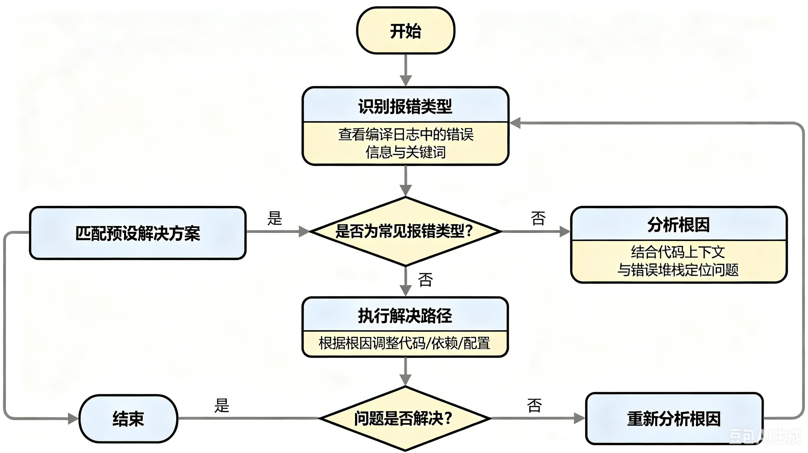

# 4.4.7 常见编译错误与排查方法

> 所属章节：第4章 内核配置与编译 > 4.4 动手编译内核
> 
> 难度：[I] | 预计阅读时间：15分钟

## <span class="blue"> 本节导读

本节覆盖：编译内核时最常见的 6 类错误，从报错文本到根因分析，再到解决操作与预防建议。



## <span class="blue"> mkimage command not found [B]

**症状**
编译 `uImage` 时输出：
```
"mkimage" command not found - U-Boot images will not be built
```

**根因**
生成 `uImage` 需要 U-Boot 的 `mkimage` 工具，系统未安装 `u-boot-tools`。

**解决操作**
```bash
sudo apt-get install u-boot-tools
```

**预防建议**
编译环境检查阶段确认 `which mkimage` 能返回路径；若交叉编译器不在 PATH，先 `export PATH` 并写入 `~/.bashrc`。

## <span class="blue"> ncurses 库缺失 [B]

**症状**
执行 `make menuconfig` 时输出：
```
*** Unable to find the ncurses libraries or the
*** required header files.
*** 'make menuconfig' requires the ncurses libraries.
*** Install ncurses (ncurses-devel or libncurses-dev
*** depending on your distribution) and try again.
*** scripts/kconfig/Makefile:XXX: recipe for target '...' failed
```

**根因**
`make menuconfig` 依赖 ncurses 终端库，系统缺少开发头文件。

**解决操作**
```bash
sudo apt-get install libncurses5-dev
```
CentOS/RHEL 用 `sudo yum install ncurses-devel`。

**预防建议**
编译前一并安装 `build-essential`、`libncurses-dev`、`bison`、`flex`、`libssl-dev`。

## <span class="blue"> 工具链版本不匹配 [B]

**症状**
编译早期报错：
```
*** Your compiler is too old.  Please upgrade it.
```
或链接阶段出现 `undefined reference`。

**根因**
Linux 5.x/6.x 内核对 GCC 有最低版本要求。Linux 5.15 建议 GCC 10 以上，Linux 6.x 建议 GCC 11 以上。

**解决操作**
1. 查看当前 GCC：`gcc --version`
2. 查看内核要求：`grep -r "compiler.*too old\|GCC_VERSION" scripts/ Makefile`
3. 升级或更换交叉编译器。

**预防建议**
查阅目标内核版本的 `Documentation/process/changes.rst` 中编译器要求；同时确认 `ARCH` 与 `CROSS_COMPILE` 正确设置（ARM64 是 `arm64`，32位 ARM 是 `arm`）。

## <span class="blue"> 缺少依赖项 [B]

**症状**
编译驱动时输出：
```
fatal error: linux/xxx.h: No such file or directory
```

**根因**
该驱动依赖的内核功能未启用，对应头文件在配置阶段被排除；或主机缺少标准头文件。

**解决操作**
- 内核模块缺少头文件：`make menuconfig` 按 `/` 搜索缺失关键字，开启对应 CONFIG 选项。
- 主机缺少标准头文件：`sudo apt-get install build-essential linux-headers-$(uname -r)`。

**预防建议**
配置阶段按依赖链启用选项。交叉编译时，不要安装目标架构的 `linux-headers`，使用内核源码树自带的头文件。

## <span class="blue"> 内存不足（OOM） [I]

**症状**
编译过程中输出：
```
gcc: internal compiler error: Killed (program cc1)
```
或 `dmesg` 中出现 `Out of memory: Killed process ...`。

**根因**
`make -j$(nproc)` 并行任务过多，内存耗尽，OOM Killer 介入。

**解决操作**
```bash
# 创建临时 swap（2GB）
sudo dd if=/dev/zero of=/tmp/swapfile bs=1M count=2048
sudo mkswap /tmp/swapfile
sudo swapon /tmp/swapfile

# 降低并行度重新编译
make -j2

# 编译完成后清理
sudo swapoff /tmp/swapfile
sudo rm /tmp/swapfile
```

**预防建议**
物理内存 4GB 以下的机器建议 `make -j1` 或 `-j2`；编译时另开终端观察内存：`watch -n 1 free -h`。

## <span class="blue"> 配置冲突 [I]

**症状**
编译时提示：
```
ERROR: Kernel configuration is invalid.
include/generated/autoconf.h or include/config/auto.conf are missing.
Run 'make oldconfig && make prepare' on kernel src to fix it.
```
或从旧版本迁移时 `make oldconfig` 反复出现：
```
* Restart config...
* xxx support (XXX) [N/m/y] (NEW) ?
```

**根因**
`.config` 中存在矛盾选项，或旧配置项在新版本内核中已变更/删除，导致依赖关系不满足。

**解决操作**
1. 运行 `make oldconfig`，逐条确认新选项，按 Enter 接受默认，或输入 Y/m/n 明确选择。
2. 非交互式自动接受默认值：`make olddefconfig`。
3. 若仍报错，先备份 `.config`，执行 `make clean && make oldconfig && make`。

> 💡 `make oldconfig` 交互式询问新选项，`make olddefconfig` 直接设置默认值。

**预防建议**
不要直接复制旧版本的 `.config` 到新版本源码。基于 `make xxx_defconfig` 生成基础配置，再通过 `make oldconfig` 迁移。将 `ARCH` 和 `CROSS_COMPILE` 写入 `env.sh`，每次编译前 `source env.sh`。

## <span class="blue"> 补充：编译中断后的通用处理

编译中断后再次 `make` 可能出现 `*.o.cmd: No such file` 等错误。

**解决操作**
1. 执行 `make clean` 清理编译产物（保留 `.config`）。
2. 若仍报错，执行 `make distclean`（会删除 `.config`，注意备份）。
3. 重新生成配置后再次编译。

> ⚠️ `make clean` 只删编译产物，`make distclean` 会连 `.config` 一起清理。中断后优先用 `make clean`。

## <span class="blue"> 错误速查表

| 序号 | 错误关键词 | 根因 | 解决操作 | 难度 |
|:----:|-----------|------|---------|:----:|
| 1 | `mkimage command not found` | 缺少 `u-boot-tools` | `sudo apt-get install u-boot-tools` | [B] |
| 2 | `Unable to find the ncurses` | 缺少 ncurses 开发库 | `sudo apt-get install libncurses5-dev` | [B] |
| 3 | `Your compiler is too old` | GCC 版本低于内核要求 | 升级 GCC 到推荐版本 | [B] |
| 4 | `fatal error: linux/xxx.h` | 头文件缺失或 CONFIG 未开 | `make menuconfig` 开启对应选项 | [B] |
| 5 | `Killed (program cc1)` | 内存不足 OOM | 减少 `make -j` 线程数或增加 swap | [I] |
| 6 | `Kernel configuration is invalid` | `.config` 存在矛盾或版本不匹配 | `make oldconfig` / `make olddefconfig` | [I] |

## <span class="blue"> 下一步

编译问题排查完毕后，下一节（4.5.1）将介绍设备驱动模块化的核心概念，包括模块与内置驱动的区别、何时应该选择编译为模块。

---
