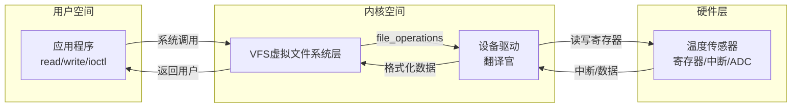

# 4.5.1 什么是设备驱动

> 所属章节：第4章 嵌入式Linux内核实战 > 4.5 设备驱动基础
> 难度：[B→B] | 预计阅读时间：25分钟

## 本节导读

本节用"翻译官"的比喻带你理解设备驱动的本质——它如何在内核和硬件之间牵线搭桥，为何存在"内置"和"模块"两种形态，以及驱动和设备树如何分工。学完本节，你能对驱动建立整体认知，不再把驱动和应用程序混为一谈。

---

## 知识点1：设备驱动的作用——内核与硬件的"翻译官" [B][M] ~700字

### 为什么不能直接操作硬件？

你写了一个C程序，想点亮开发板上的LED灯。手册说往地址`0x4804C194`写`1`就能点亮，你写了：

```c
// 错误的写法！用户程序不能直接访问硬件
*(unsigned int *)0x4804C194 = 0x1;
```

结果程序报`Segmentation fault`（段错误）。因为在Linux中，内存被划分为**用户空间**和**内核空间**。硬件寄存器映射在内核空间里，应用程序无权访问——这是操作系统为保护系统稳定设置的"防火墙"。

[图1：用户空间与内核空间的内存划分示意图]

### 驱动是"防火墙"上的翻译窗口

用户程序不能直接碰硬件，就需要一个**中间人**：它住在内核空间（有权限访问硬件），同时又给上层提供标准化接口。这个中间人就是**设备驱动**。

把驱动想象成翻译官：
- **上层**说"我要读取温度"（`read()`系统调用）
- **翻译官**配置ADC寄存器、启动转换、等待中断、读取原始值、换算成摄氏度
- **硬件**执行转换，返回结果
- **翻译官**把"25.3°C"返回给上层



[图2：驱动在内核中的位置——连接用户空间与硬件的桥梁]

### 驱动的四大职责

1. **初始化**：申请内存、中断、DMA、时钟等资源
2. **硬件操控**：通过`iowrite32()`/`ioread32()`等函数读写寄存器
3. **中断响应**：键盘按下、网卡收包、ADC完成时触发中断处理函数（ISR）
4. **数据转换**：把硬件原始数据（如ADC码值）转换成用户需要的格式（如浮点温度值）

### 代码示例：查看系统中的驱动

```bash
# 查看已加载的动态模块
lsmod

# 查看某个驱动的详细信息
modinfo usbcore

# 查看内核日志中的驱动加载信息
dmesg | grep -i driver | head -20
```

⚠️ **陷阱**：初学者常把"驱动"和"设备节点"搞混。`/dev/ttyS0`是**设备节点**（用户空间的访问入口），而串口驱动是躲在节点背后的内核代码。没有驱动，节点只是一个空壳。

💡 **提示**：`/sys/bus/`是观察驱动与设备关系的好地方。`/sys/bus/platform/devices/`列出所有platform设备，`/sys/bus/platform/drivers/`列出所有platform驱动。

---

## 知识点2：驱动的两种形态——内置与模块 [B] ~550字

Linux内核中的驱动有两种"活法"：从娘胎绑在内核里（built-in），或作为"外挂"按需加载（module）。对应Kconfig里的`Y`和`M`。

### Built-in（Y）：与内核生死与共

驱动编译进内核镜像，启动时自动初始化。

- ✅ 启动即可用，无需文件系统支持
- ✅ 适合启动必需的驱动（GPIO、串口、EMMC）
- ❌ 内核镜像变大，修改后须重编整个内核
- ❌ 无法运行时卸载

### Module（M）：灵活的外挂

驱动编译为独立的`.ko`文件，存放在`/lib/modules/`目录下，按需加载。

- ✅ 内核镜像精简，按需加载
- ✅ 修改后只编译该模块，秒级完成
- ✅ 可运行时卸载，方便调试
- ❌ 依赖文件系统和版本匹配
- ❌ 启动阶段可能尚未加载

### 对比表

| 对比项 | Built-in（内置） | Module（模块） |
|--------|-----------------|----------------|
| Kconfig选项 | `Y`（`*`） | `M`（`<M>`） |
| 产物形式 | 融入内核镜像 | 独立的`.ko`文件 |
| 启动时机 | 内核启动时自动初始化 | 手动`insmod`或`modprobe`加载 |
| 运行时卸载 | ❌ 不可卸载 | ✅ 可`rmmod`卸载 |
| 修改后重编 | 重新编译整个内核 | 只编译该模块 |
| 适用场景 | 启动必需的驱动 | 非必需、可插拔的外设 |
| 典型例子 | GPIO控制器、EMMC、串口 | USB网卡、WiFi模块、摄像头 |

### 代码示例：查看驱动的形态

```bash
# 查看内核配置中哪些是built-in（=y），哪些是模块（=m）
grep -E "=(y|m)$" /boot/config-$(uname -r) | grep DRIVER | head -20

# 查看某个具体驱动的配置状态
grep SERIAL_8250 /boot/config-$(uname -r)
# CONFIG_SERIAL_8250=y        ← 内置
# CONFIG_USB_SERIAL=m           ← 模块
```

💡 **提示**：启动阶段必须用到的驱动（如EMMC/SD卡驱动）建议设为`Y`。外接的可热插拔设备建议设为`M`。

⚠️ **陷阱**：把SD卡驱动编译成模块，但根文件系统就在SD卡上——内核需要读SD卡加载驱动，但加载驱动才能读SD卡，陷入死锁。解决：要么把SD/EMMC驱动设`Y`，要么使用initramfs。

---

## 知识点3：驱动与设备树的关系——"说明书"与"操作员" [B] ~450字

### 一个类比

把嵌入式系统比作餐厅：
- **设备树**是"厨房设备清单"——告诉经理店里有什么设备、在哪里、什么型号
- **驱动**是"厨师的操作手册"——告诉厨师烤箱怎么预热、燃气灶怎么调火力
- **内核**是"餐厅经理"——拿着设备清单找到对应的操作手册，安排厨师上岗

两者缺一不可。

### 内核中的配对过程

系统启动时，内核解析`.dtb`文件建立设备树。每个设备节点都有`compatible`属性（如`"ti,omap4-uart"`）。驱动代码里也注册自己的兼容字符串（通过`of_match_table`）。内核遍历设备节点，拿`compatible`去驱动数据库"相亲"，匹配成功就调用驱动的`probe()`函数：

```c
// 驱动代码片段：告诉内核"我能处理哪些设备"
static const struct of_device_id my_driver_ids[] = {
    { .compatible = "ti,omap4-uart" },
    { .compatible = "ti,am3352-uart" },
    { } /* 结束标记 */
};
```

```bash
# 查看设备树节点与驱动的匹配情况
cat /sys/kernel/debug/devices_deferred
ls /sys/bus/platform/devices/
```

[图3：设备树节点与驱动匹配过程示意图]

### 分工对照

| 维度 | 设备树 | 驱动 |
|------|--------|------|
| 回答的问题 | "这是什么硬件？在哪？" | "怎么操作这个硬件？" |
| 包含的信息 | 寄存器地址、中断号、时钟 | 寄存器操作、中断处理、数据转换 |
| 文件形式 | `.dts` → `.dtb` | `.c` → 内置或`.ko` |

💡 **提示**：设备树让**同一份驱动代码**支持不同板子。比如`omap-uart.c`通过设备树里的`compatible`匹配，既能服务BeagleBone Black也能服务TI工业板——驱动不改，换`.dtb`即可。

⚠️ **陷阱**：设备树里的`compatible`写错（如`"ti,omap3-uart"`而驱动注册的是`"ti,omap4-uart"`），内核找不到匹配的驱动，设备节点在`/sys/bus/platform/devices/`下"裸奔"——有设备节点但无`driver`子目录，设备无法工作。

---

## 本节总结

| 概念 | 核心要点 | 实践判断 |
|------|---------|---------|
| 驱动的作用 | 内核与硬件之间的翻译官 | `lsmod`、`/sys/bus/`查看 |
| 内置驱动（Y） | 编译进内核，启动即用，不可卸载 | `grep =y$ /boot/config` |
| 模块驱动（M） | 独立`.ko`，按需加载，可热插拔 | `lsmod`查看，`modprobe`加载 |
| 设备树 | 描述"有什么硬件、在哪" | 查看`.dts`中的`compatible` |
| 驱动匹配 | 内核通过`compatible`为设备找驱动 | `devices_deferred`看未匹配 |

## 下一步

本节建立了驱动的整体认知。下一节（4.5.2）我们将动手查看开发板上的驱动——通过`/proc/devices`、`/sys/class/`和`dmesg`日志，学会诊断驱动是否加载成功、设备节点是否正确创建。

---

## 配套资源

### 表格清单
- 表1：Built-in与Module驱动形态对比表（7个维度对比）
- 表2：设备树与驱动的分工对照表（3个维度对比）
- 表3：本节核心概念总结表

### 图示清单
- 图1：用户空间与内核空间的内存划分示意图 [配图说明：32位ARM系统内存空间划分图]
- 图2：驱动在内核中的位置——连接用户空间与硬件的桥梁 [mermaid架构图]
- 图3：设备树节点与驱动匹配过程示意图 [配图说明：设备树节点通过compatible匹配驱动的流程图]

### 代码清单
- 代码1：查看已加载模块和驱动信息（`lsmod`、`modinfo`、`dmesg`）
- 代码2：查看内核配置中驱动的形态（`grep -E "=(y|m)$"`）
- 代码3：查看设备树与驱动的匹配情况（`devices_deferred`、`/sys/bus/platform/devices/`）
- 代码4：驱动注册兼容字符串的C代码片段（`of_device_id`）
